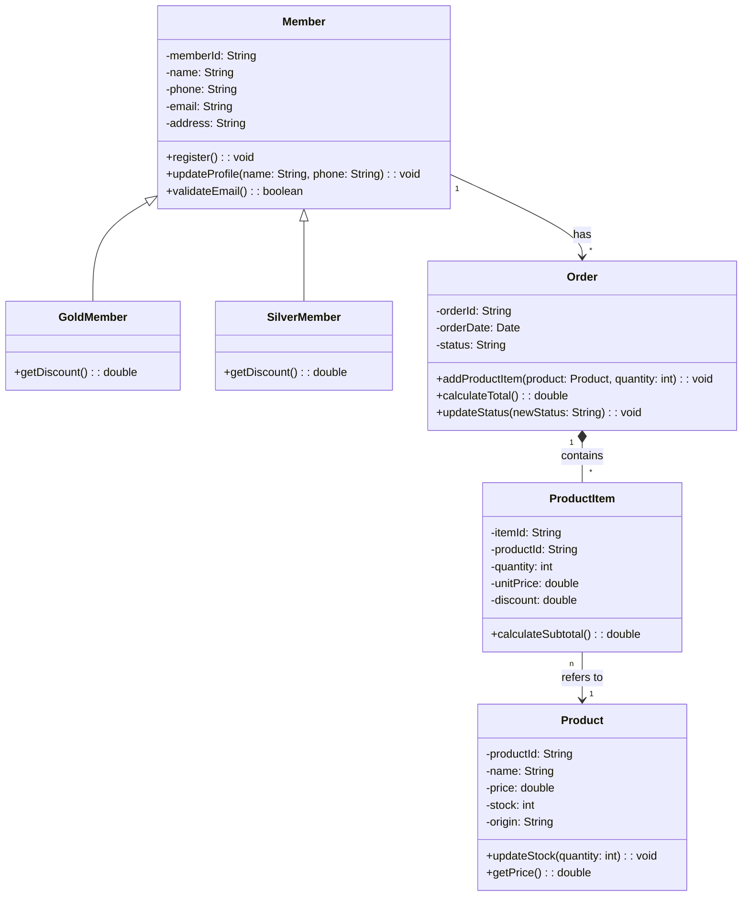
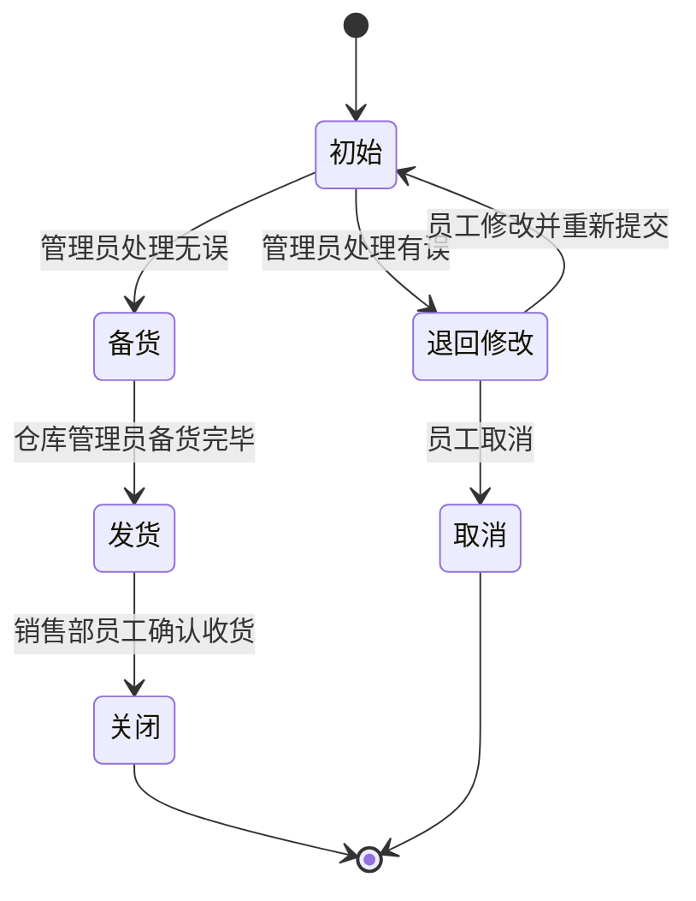

```mermaid
classDiagram
    class Member {
        -memberId: String
        -name: String
        -phone: String
        -email: String
        -address: String
        +register(): void
        +updateProfile(name: String, phone: String): void
        +validateEmail(): boolean
    }

    class GoldMember {
        +getDiscount(): double
    }

    class SilverMember {
        +getDiscount(): double
    }
    Member <|-- GoldMember
    Member <|-- SilverMember

    class Order {
        -orderId: String
        -orderDate: Date
        -status: String
        +addProductItem(product: Product, quantity: int): void
        +calculateTotal(): double
        +updateStatus(newStatus: String): void
    }
    Member "1" --> "*" Order : has

    class ProductItem {
        -itemId: String
        -productId: String
        -quantity: int
        -unitPrice: double
        -discount: double
        +calculateSubtotal(): double
    }
    Order "1" *-- "*" ProductItem : contains

    class Product {
        -productId: String
        -name: String
        -price: double
        -stock: int
        -origin: String
        +updateStock(quantity: int): void
        +getPrice(): double
    }
    ProductItem "n" --> "1" Product : refers to
```

```mermaid
stateDiagram-v2
    [*] --> 初始
    初始 --> 备货: 管理员处理无误
    初始 --> 退回修改: 管理员处理有误
    退回修改 --> 初始: 员工修改并重新提交
    退回修改 --> 取消: 员工取消
    备货 --> 发货: 仓库管理员备货完毕
    发货 --> 关闭: 销售部员工确认收货
    关闭 --> [*]
    取消 --> [*]
```

