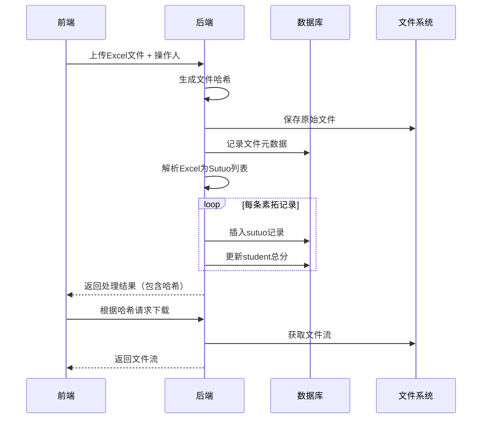

### 题目：在线外卖订餐系统

#### 系统描述：
设计一个在线外卖订餐系统，允许用户通过网站或移动应用浏览餐厅菜单、下单、支付并跟踪订单状态。系统还应支持餐厅管理员管理菜单、处理订单和查看销售记录。

#### 功能需求：
1. **用户功能**：
   - 用户注册与登录
   - 浏览餐厅及菜单
   - 添加菜品到购物车
   - 下单并选择支付方式（在线支付或货到付款）
   - 查看订单状态（待处理、配送中、已完成）
   - 取消未处理的订单
   - 查看订单历史

2. **餐厅管理员功能**：
   - 添加、删除、修改菜单信息
   - 接收并处理用户订单
   - 更新订单状态（如开始制作、配送中、已完成）
   - 查看销售记录和统计信息

#### 非功能需求：
- 系统应支持高并发访问，确保用户下单和支付的流畅性。
- 系统应保证用户支付信息的安全性。

#### 任务要求：
day1
1. **用例图**：绘制系统的用例图，展示用户和餐厅管理员的主要功能及其交互。
2. **顺序图**：绘制用户从浏览菜单到成功下单的顺序图，展示用户、系统、支付网关和数据库之间的交互过程。
3. **时序图**：绘制用户支付订单的时序图，展示用户、支付接口、系统之间的消息传递顺序。

day2
1.设计一个ER图，表示“在线外卖订餐系统”的数据库结构。包括“用户”、“订单”、“菜品”、“购物车”、“餐厅管理员”和“销售记录”等实体及它们之间的关系。
2.绘制“在线外卖订餐系统”的顶层数据流图（DFD）和一层数据流图。
3.设计一个状态图，表示“订单”的生命周期。展示从订单创建到订单完成或取消的状态变化，并描述每个状态之间的迁移条件和触发事件。
4.设计流程图，绘制用户从登录到成功下单的流程图，展示用户在整个流程中的操作步骤（如登录、浏览菜单、添加菜品、下单、支付等）以及系统的响应。

day3
1. **类图**： 绘制系统的类图，展示系统中主要的类及其关系（如用户类、订单类、菜品类、支付类等），并标注类的属性和方法。
2. **对象图**：基于类图，绘制一个具体的对象图，展示某一时刻系统中对象的状态（如一个用户对象、一个订单对象、一个菜品对象等）及其关系。
3. **构件图**： 绘制系统的构件图，展示系统的主要模块（如用户界面模块、订单处理模块、支付模块、数据库模块等）及其依赖关系。
4. **部署图**：绘制系统的部署图，展示系统的物理部署结构（如客户端、Web服务器、应用服务器、数据库服务器等）以及它们之间的连接关系。

