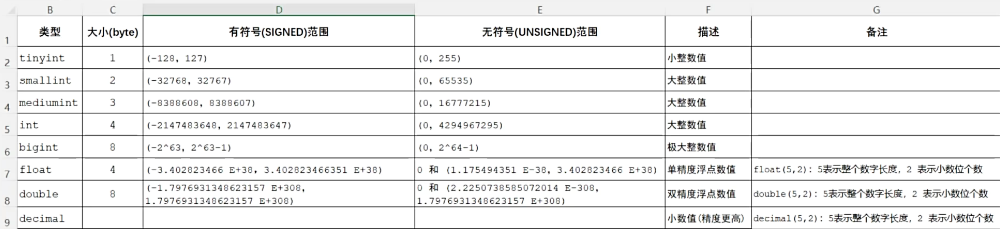
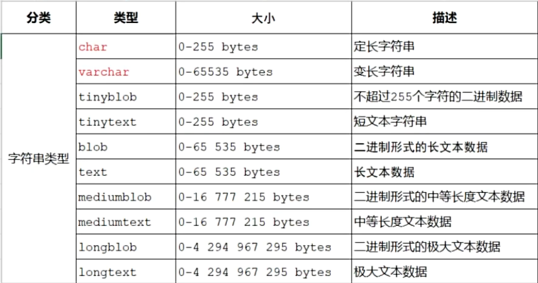
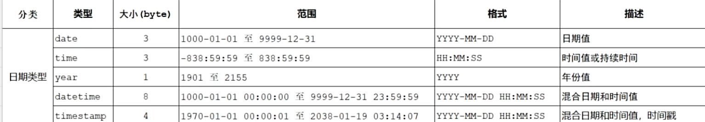
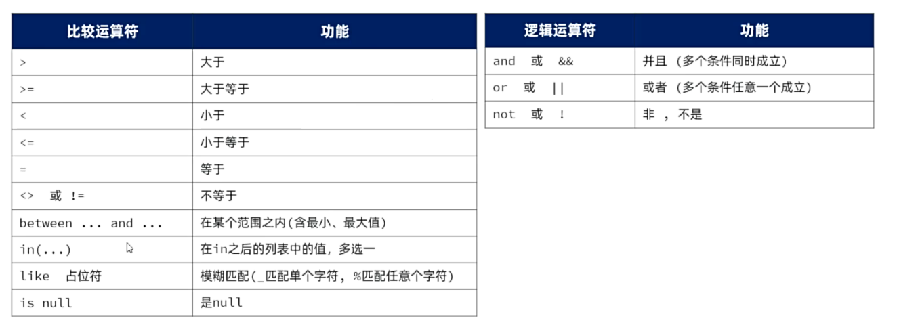

分类：

| 分类 | 用途         | 具体实现功能                           |
| ---- | ------------ | -------------------------------------- |
| DDL  | 数据定义语言 | 用于定义数据库对象（数据库，表，字段） |
| DML  | 数据操作语言 | 用于对数据库表数据进行增删查改         |
| DQL  | 数据查询语言 | 用于查询数据库中表的记录               |
| DCL  | 数据控制语言 | 用于创建数据库用户、控制数据库访问权限 |

**约束**:

| 约束     | 描述                                             | 关键字        |
| -------- | ------------------------------------------------ | ------------- |
| 非空约束 | 限制字段值不能为null                             | `not null`    |
| 唯一约束 | 保证字段的数据唯一                               | `unique`      |
| 主键约束 | 主键是一行数据的唯一标识，非空且唯一             | `primary key` |
| 默认约束 | 若未规定该字段值，采用默认值                     | `default`     |
| 外键约束 | 让两张表的数据建立连接，保证数据的一致性和完整性 | `foreign key` |
|          |                                                  | `check`       |

**数据类型**：
数值类型：


字符串类型：


日期时间类型：


## DDL（create,drop,alter...）

database等效于schema

### 库操作

- 查询所有数据库`show databases;`
- 查询当前数据库`select database();`
- 使用/切换数据库`use 数据库名;`
- 创建数据库`create database [if not exists] 数据库名 [default charset utf8mb4];`
- 删除数据库`drop database [if exists] 数据库名;`

### 表操作

创建表：

```sql
create table tablename(
 字段1 字段类型 [约束] [comment 字段1注释],
 字段2 字段类型 [约束] [comment 字段2注释]
)[comment 表注释];
```

> ```sql
> create table user(
>        id int primary key auto_increment comment '用户id(唯一自动增长)',
>        username varchar(20) not null unique comment '用户名（非空唯一）',
>        password varchar(20) not null comment '密码(非空)',
>        name varchar(20)  not null comment '姓名(非空)',
>        age int not null comment '年龄（非空）',
>        gender varchar(1) default '男' comment '性别(默认为男)'
> )comment '用户表';
> ```

查询：

- 查询当前数据库的所有表`show tables;`
- 查询表结构`desc 表名;`
- 查询建表语句`show create table 表名;`

修改：

- 添加字段`alter table 表名 add 字段名 类型(长度) [comment 注释] [约束];`
- 修改字段类型`alter table 表名 modify 字段名 新数据类型(长度);`
- 修改字段名与字段类型`alter table 表名 change 旧字段名 新字段名 类型(长度) [comment 注释] [约束]`
- 删除字段`alter table 表名 drop column 字段名;`
- 修改表名`alter table 表名 rename to 新表名;`

删除：删除表`drop table [if exists] 表名;`

## DML(insert,delete,update)

### 添加数据

- 指定字段添加数据`insert into 表名(字段名1,字段名2) values (值1,值2);`
- 全部字段添加数据`insert into 表名 values (值1,值2,...);`
- 批量添加数据（指定字段）`insert into 表名 (字段名1,字段名2) values (值1,值2),(值1,值2);`
- 批量添加数据（全部字段）`insert into 表名 values (值1,值2,...) (值1,值2,...);`

### 修改数据

`update 表名 set 字段名1 = 值1 , 字段名2 = 值2 , ... [where 条件];`

### 删除数据

`delete from 表名 [where 条件];`

## DQL 查询语言

### 基本查询

- 查询多个字段：`select 字段1,字段2,字段3 form 表名;`
- 查询所有字段：`select * from 表名;`
- 为查询字段设置别名：`select 字段1 [as 别名1],字段2 [as 别名2] from 表名;`
- 去除重复记录：`select distinct 字段列表 from 表名;`

`FROM 表名 别名` 或 `FROM 表名 AS 别名`（`AS` 是可选的）

#### `UNION`

`UNION` 用于将多个查询的结果合并成一个结果集。它会自动去除重复的行，返回唯一的结果。

```sql
SELECT column1, column2 FROM table1
UNION
SELECT column1, column2 FROM table2;
```

这条语句会将 `table1` 和 `table2` 中的 `column1` 和 `column2` 的结果合并在一起，同时去除重复的行。

`UNION` 和 `UNION ALL` 都可以用于合并查询结果，但它们的行为有所不同：

- **`UNION`**：会自动去除重复的行。
- **`UNION ALL`**：不会去除重复的行，会保留所有查询结果中的所有行，包括重复的行。

#### `join`

**员工表(employees)**

| emp_id | emp_name | dept_id | salary |
| ------ | -------- | ------- | ------ |
| 1      | 张三     | 101     | 5000   |
| 2      | 李四     | 102     | 6000   |
| 3      | 王五     | 101     | 4500   |
| 4      | 赵六     | 103     | 5500   |

**部门表(departments)**

| dept_id | dept_name | location |
| ------- | --------- | -------- |
| 101     | 技术部    | 3楼      |
| 102     | 市场部    | 5楼      |
| 104     | 人事部    | 2楼      |

##### INNER JOIN (内连接)

```sql
SELECT e.emp_name, d.dept_name, d.location
FROM employees e
INNER JOIN departments d ON e.dept_id = d.dept_id;
```

| emp_name | dept_name | location |
| -------- | --------- | -------- |
| 张三     | 技术部    | 3楼      |
| 李四     | 市场部    | 5楼      |
| 王五     | 技术部    | 3楼      |

只返回两个表中`dept_id`匹配的行。赵六(`dept_id=103`)和人事部(`dept_id=104`)没有出现在结果中。

##### LEFT JOIN (左连接)

```sql
SELECT e.emp_name, d.dept_name, d.location
FROM employees e
LEFT JOIN departments d ON e.dept_id = d.dept_id;
```

| emp_name | dept_name | location |
| -------- | --------- | -------- |
| 张三     | 技术部    | 3楼      |
| 李四     | 市场部    | 5楼      |
| 王五     | 技术部    | 3楼      |
| 赵六     | NULL      | NULL     |

返回左表(`employees`)所有行，右表无匹配时显示`NULL`。赵六的部门103在部门表中不存在。

##### RIGHT JOIN (右连接)

```sql
SELECT e.emp_name, d.dept_name, d.location
FROM employees e
RIGHT JOIN departments d ON e.dept_id = d.dept_id;
```

| emp_name | dept_name | location |
| -------- | --------- | -------- |
| 张三     | 技术部    | 3楼      |
| 李四     | 市场部    | 5楼      |
| 王五     | 技术部    | 3楼      |
| NULL     | 人事部    | 2楼      |

返回右表(`departments`)所有行，左表无匹配时显示`NULL`。人事部没有对应的员工。

##### FULL JOIN (全连接)

```sql
SELECT e.emp_name, d.dept_name, d.location
FROM employees e
FULL JOIN departments d ON e.dept_id = d.dept_id;
```

| emp_name | dept_name | location |
| -------- | --------- | -------- |
| 张三     | 技术部    | 3楼      |
| 李四     | 市场部    | 5楼      |
| 王五     | 技术部    | 3楼      |
| 赵六     | NULL      | NULL     |
| NULL     | 人事部    | 2楼      |

返回两个表的所有行，无匹配的部分显示`NULL`。

#### 子查询与多表查询

多表查询

```sql
-- 查询员工及其所属部门信息
SELECT e.emp_name, d.dept_name, d.location
FROM employees e
JOIN departments d ON e.dept_id = d.dept_id;
```

子查询

```sql
-- 查询工资高于平均工资的员工
SELECT emp_name, salary
FROM employees
WHERE salary > (SELECT AVG(salary) FROM employees);
```

### 条件查询

`select 字段列表 from 表名 where 条件列表;`

SQL 条件运算符：



例：`select * from user where job is not null`

`select * from user where name like '李_'`；姓名为李x的数据

`select * form user where name like '%二%'`姓名中包含二的数据

### 分组查询

`select 字段列表 from 表名 [where 条件列表] group by 分组字段名 [having 分组后过滤条件];`

> where是分组前进行过滤，不满足where条件不参与分组，不能使用聚合函数，而having是分组之后对结果进行过滤

#### 聚合函数

| 函数  | 功能     |
| ----- | -------- |
| count | 统计数量 |
| max   | 最大值   |
| min   | 最小值   |
| avg   | 平均值   |
| sum   | 求和     |

- 统计该表数据总数`select count(*) from emp;`如果统计具体的字段数，值为`null`不参与统计
- 求一个字段的平均值 `select avg(sorce) from emp;`
- 求一个字段的最小值`select min(sorce) from emp;`
- 求一个字段中的最大值`select max(sorce) from emp;`
- 求一个字段的总和`select sum(sorece) from emp;`

`select gender from emp group by gender`进行分组操作后不要使用`select *`使用分组字段+聚合函数

`select job.count(*) from emp where data <= '2015-01-01' group by job having count(*) >=2;`挑选入职日期小于等于2015-01-01,筛选职位人数>2的职位

### 排序查询

`select 字段列表 from 表名 [where 条件列表] [group by 分组字段名 having 分组后过滤条件] order by 排序字段 排序方式;`

升序(asc) ,降序(desc),默认升序

`select * from emp where data <= '2015-01-01' order by data desc`

`select * from emp where data <= '2015-01-01' order by data, update desc;`

### 分页查询

`select 字段 from 表名 [where 条件] [group by 分组字段 having 过滤条件] [order by 排序字段] limit 起始索引，查询纪录数;`

- 起始索引从0开始
- 分页查询是数据库的方言，不听数据库有不同的实现，MYSQL种是LIMIT
- 如果起始索引为0，每页展示10条数据`limit 0,10`起始索引可以省略，简写为`limit 10`

`select * from emp limit 0,5;`查询数据，每页展示五条数据

`select * from emp limit 5,10;`查询第二页数据，每页展示五条数据
$起始索引=（页码-1）*每页展示记录数$

## DCL数据控制语言

### `GRANT`

`GRANT 权限列表 ON 数据库对象 TO 用户 [WITH GRANT OPTION];`

```mysql
-- 授予用户对表的查询权限
GRANT SELECT ON sutuo TO 'webuser'@'localhost';

-- 授予用户对表的全部操作权限
GRANT ALL PRIVILEGES ON students TO 'admin'@'%';

-- 授予用户对整个数据库的权限
GRANT SELECT, INSERT, UPDATE ON *.* TO 'developer'@'192.168.1.%';

-- 授予WITH GRANT OPTION，使该用户可以将自己的权限授予其他用户
GRANT SELECT ON posts TO 'manager'@'localhost' WITH GRANT OPTION;
```

### `REVOKE`

`REVOKE 权限列表 ON 数据库对象 FROM 用户;`

```mysql
-- 撤销用户的查询权限
REVOKE SELECT ON sutuo FROM 'webuser'@'localhost';

-- 撤销用户对表的所有权限
REVOKE ALL PRIVILEGES ON students FROM 'user1'@'localhost';

-- 撤销授权选项
REVOKE GRANT OPTION ON posts FROM 'manager'@'localhost';
```


```mysql
-- 创建一个只读用户
CREATE USER 'report_user'@'%' IDENTIFIED BY 'readonly123';

-- 授予该用户对所有表的查询权限
GRANT SELECT ON *.* TO 'report_user'@'%';

-- 创建Web应用使用的数据库用户
CREATE USER 'web_app'@'%' IDENTIFIED BY 'secure_password';

-- 授予必要的操作权限，但不包括删除和修改表结构的权限
GRANT SELECT, INSERT, UPDATE ON posts TO 'web_app'@'%';
GRANT SELECT, INSERT, UPDATE ON comments TO 'web_app'@'%';
GRANT SELECT ON users TO 'web_app'@'%';

-- 查看当前用户的权限
SHOW GRANTS;

-- 查看特定用户的权限
SHOW GRANTS FOR 'sutuo_admin'@'localhost';
```

## 视图

用于有些数据需要频繁的查询

视图是一个虚拟表，基于 SQL 查询的结果集。它不存储实际数据，而是动态地从基表（物理表）中获取数据。

> 看起来是创建了一个新表，但本质上是记录了sql语句，当查询视图时，本质上执行了视图相关的sql语句

```sql
CREATE VIEW view_name AS
SELECT column1, column2, ...
FROM table_name
WHERE condition;
```

查询视图

```sql
SELECT * FROM orders_2023;
```

**视图的更新限制**

- **可更新视图**：满足以下条件时，可以通过视图修改基表数据：
    - 视图基于单表（无 `JOIN`）。
    - 不包含聚合函数、`DISTINCT`、`GROUP BY` 等操作。
- **不可更新视图**：涉及多表关联或聚合操作时，无法直接通过视图修改数据

## 索引

索引是数据库中加速数据检索的数据结构（如 B-tree、哈希表）。它类似于书籍的目录，通过预排序或哈希映射快速定位数据。

**常见索引类型**：

| 索引类型     | 适用场景                          | 特点                         |
| :----------- | :-------------------------------- | :--------------------------- |
| **B-tree**   | 范围查询（如 `WHERE age > 18`）   | 支持排序、范围查询，通用性强 |
| **哈希索引** | 精确查询（如 `WHERE id = 100`）   | 查询极快，不支持范围查询     |
| **全文索引** | 文本搜索（如 `LIKE '%keyword%'`） | 优化文本模糊匹配             |
| **复合索引** | 多列组合查询                      | 按列顺序匹配查询条件         |

**2. 索引的创建与使用**
**语法**：

```sql
CREATE INDEX index_name
ON table_name (column1, column2, ...);
```

**示例**：
在 `orders` 表的 `customer_id` 列上创建索引：

```sql
CREATE INDEX idx_customer
ON orders (customer_id);
```

**查询优化效果**：

```sql
SELECT * FROM orders
WHERE customer_id = 'A';  -- 使用索引加速
```

------

**3. 索引的优缺点**

- **优点**：
    - 显著提高查询速度（尤其是大数据表）。
    - 加速 `JOIN` 和 `ORDER BY` 操作。
- **缺点**：
    - 占用额外存储空间。
    - 增删改操作变慢（需维护索引）。

原理举例

**1. 无索引的查询（全表扫描）**

假设有一张 `users` 表（100 万行数据），执行以下查询：

```sql
SELECT * FROM users WHERE email = 'zhangsan@example.com';
```

- **操作流程**：
    数据库会逐行扫描所有 100 万条记录，检查每行的 `email` 是否符合条件。
- **时间复杂度**：O(N)（线性时间），数据量越大越慢。

**2. 有索引的查询（B-tree 索引）**

在 `email` 列上创建索引：

```sql
CREATE INDEX idx_email ON users(email);
```

再次执行相同查询：

- **操作流程**：
    1. 数据库使用 B-tree 索引（一种平衡树结构），快速定位到 `email = 'zhangsan@example.com'` 的存储位置。
    2. 直接读取对应的数据行（通常只需几次磁盘 I/O）。
- **时间复杂度**：O(log N)（对数时间），速度极快。

## 触发器

是一种特殊的数据库对象，它在指定的数据库事件（如 `INSERT`、`UPDATE`、`DELETE`）发生时自动执行预定义的操作。触发器常用于实现数据一致性约束、审计日志记录、级联更新/删除等业务逻辑。

| **特性**     | **说明**                                                     |
| :----------- | :----------------------------------------------------------- |
| **触发事件** | `INSERT`、`UPDATE`、`DELETE`（可单独或组合使用）。           |
| **触发时机** | `BEFORE`（操作前执行）或 `AFTER`（操作后执行）。             |
| **触发粒度** | **行级触发器**（每行操作触发一次）或 **语句级触发器**（整个语句触发一次）。 |
| **适用场景** | 数据校验、自动填充字段、维护业务规则、记录审计日志等。       |

```sql
CREATE TRIGGER trigger_name
{BEFORE | AFTER} {INSERT | UPDATE | DELETE}
ON table_name
FOR EACH ROW  -- 行级触发器（默认）
BEGIN
    -- 触发器逻辑（如 SQL 或存储过程代码）
END;
```

### **触发器的常见应用场景**

##### **示例 1：数据校验（BEFORE INSERT）**

确保插入的订单金额大于 0：

```sql
CREATE TRIGGER validate_order_amount
BEFORE INSERT ON orders
FOR EACH ROW
BEGIN
    IF NEW.amount <= 0 THEN
        SIGNAL SQLSTATE '45000' 
        SET MESSAGE_TEXT = '订单金额必须大于 0';
    END IF;
END;
```

- **效果**：插入金额 ≤ 0 的订单会抛出错误。

------

##### **示例 2：自动维护审计日志（AFTER UPDATE）**

记录用户信息的修改历史：

```sql
CREATE TRIGGER log_user_changes
AFTER UPDATE ON users
FOR EACH ROW
BEGIN
    INSERT INTO audit_log (user_id, action, old_email, new_email, change_time)
    VALUES (OLD.id, 'UPDATE', OLD.email, NEW.email, NOW());
END;
```

- **效果**：每次更新用户邮箱时，自动记录到 `audit_log` 表。

------

##### **示例 3：级联更新库存（AFTER INSERT）**

插入订单后自动减少库存：

```sql
CREATE TRIGGER update_inventory
AFTER INSERT ON orders
FOR EACH ROW
BEGIN
    UPDATE products
    SET stock = stock - NEW.quantity
    WHERE product_id = NEW.product_id;
END;
```

- **效果**：新订单插入后，对应产品的库存自动减少。

例子：

假设有一个 `orders` 订单表和一个 `audit_log` 审计日志表，需求是：**每次订单状态更新时，自动记录修改日志**。

```sql
-- 订单表
CREATE TABLE orders (
    order_id INT PRIMARY KEY,
    customer_id VARCHAR(50),
    status VARCHAR(20),  -- 状态字段（如 'pending', 'shipped'）
    amount DECIMAL(10,2)
);

-- 审计日志表
CREATE TABLE audit_log (
    log_id INT AUTO_INCREMENT PRIMARY KEY,
    order_id INT,
    old_status VARCHAR(20),
    new_status VARCHAR(20),
    change_time DATETIME
);
```

**触发器代码**

```sql
DELIMITER $$  -- 修改语句分隔符（仅MySQL需要）

CREATE TRIGGER after_order_status_update
AFTER UPDATE ON orders
FOR EACH ROW
BEGIN
    -- 仅当 status 字段实际发生变化时记录日志
    IF OLD.status <> NEW.status THEN
        INSERT INTO audit_log (order_id, old_status, new_status, change_time)
        VALUES (OLD.order_id, OLD.status, NEW.status, NOW());
    END IF;
END$$

DELIMITER ;  -- 恢复默认分隔符
```

### **DECLARE：声明变量**

```sql
DECLARE 变量名 数据类型 [DEFAULT 默认值];
```

- **作用**：声明一个变量，并指定其数据类型（如 `INT`、`VARCHAR`、`DECLIMAL` 等）。
- **适用场景**：存储过程、函数、触发器或批处理脚本中。

```sql
DECLARE user_count INT;          -- 声明一个整数变量
DECLARE user_name VARCHAR(50) DEFAULT '匿名用户';  -- 声明并设置默认值
```

**注意：**

- **作用域**：变量仅在声明它的代码块（如 `BEGIN...END`）内有效。
- **默认值**：若不指定 `DEFAULT`，变量初始值为 `NULL`。

### **SET：变量赋值**

```sql
SET 变量名 = 值;  -- 通用写法
或
SELECT 值 INTO 变量名;  -- 通过查询赋值（需确保查询返回单值）
```

- **作用**：为已声明的变量赋值。
- **区别**：
    - `SET` 直接赋值。
    - `SELECT INTO` 从查询结果中赋值（要求结果必须为单行单列）。

```sql
-- 示例1：直接赋值
SET user_count = 100;  
SET user_name = '张三';

-- 示例2：通过查询赋值
SELECT COUNT(*) INTO user_count FROM users WHERE age > 18;
```

```sql
SET user_count = 10, user_name = '李四';  -- 同时为多个变量赋值
```

### **DECLARE 和 SET 的完整流程**

```sql
-- 声明变量
DECLARE adult_count INT;
DECLARE result_text VARCHAR(100);

-- 赋值：查询成年用户数量
SELECT COUNT(*) INTO adult_count FROM users WHERE age >= 18;

-- 根据数量生成结果描述
IF adult_count > 0 THEN
    SET result_text = CONCAT('成年用户数量：', adult_count);
ELSE
    SET result_text = '没有符合条件的用户';
END IF;

-- 输出结果
SELECT result_text;
```

**执行结果**：

| result_text     |
| :-------------- |
| 成年用户数量：5 |
