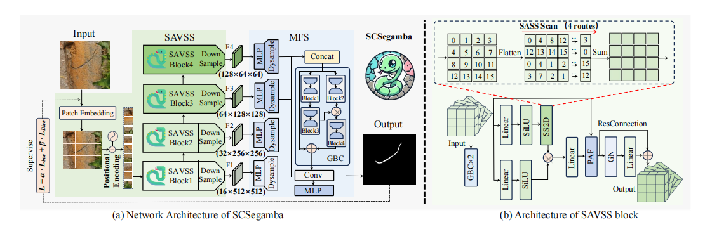
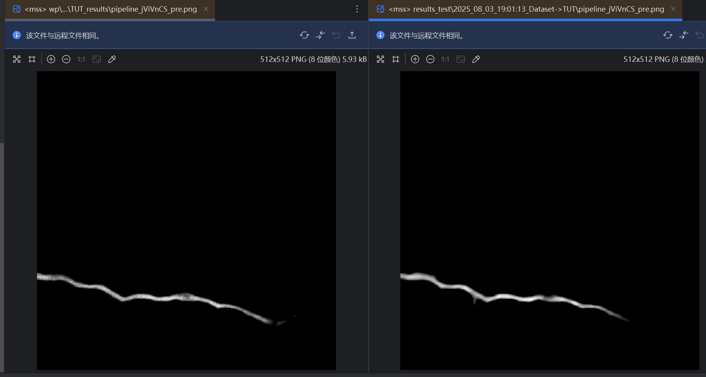
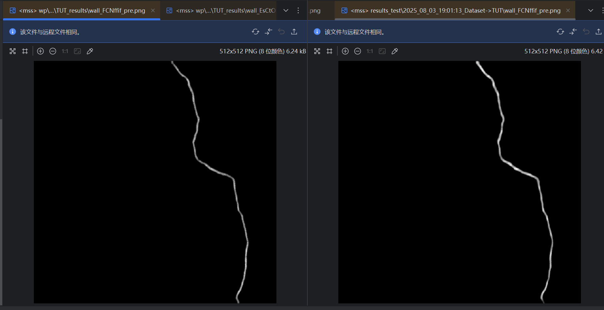

## Scsegamba

### 网络架构



1. **输入层**：
    - 输入图像经过监督学习，通过一个 `Patch Embedding` 层，将图像分割成小块并嵌入到一个特征空间中。
2. **SAVSS 编码器**：
    - 图中显示了四个 SAVSS 块（Block1 到 Block4），每个块负责处理不同分辨率的特征图。这些块通过下采样（Down Sample）逐步减少特征图的空间维度，同时增加通道数。
    - 每个 SAVSS 块的输出通过 `MLP`（多层感知机）和 `Dysample`（动态采样）处理后，传递到下一个块。
3. **MFS（多尺度特征融合）**：
    - 从 SAVSS 块输出的特征图通过 `Concat`（拼接）操作合并，然后通过 `GBC`（全局上下文块）进一步处理，最终输出裂缝分割的预测结果。

### EDFFN


EDFFN 是一种高效的频域前馈网络，旨在增强图像复原任务中的局部-频域信息。

1. **频域转换**：利用快速傅里叶变换（FFT）将输入特征图从空间域转换到频域。
2. **频域滤波**：在频域中应用可学习的滤波器，以增强或抑制特定频率成分。
3. **逆频域转换**：利用逆快速傅里叶变换（IFFT）将滤波后的特征图转换回空间域。
4. **残差连接**：通过残差连接将原始输入与滤波后的特征图相加，以保留原始信息并增强特定频率成分。

**两种插入方式**:

1. **MFS 之后**：在多尺度特征融合（MFS）之后插入 EDFFN，对融合后的特征图进行频域增强。这样可以在保持原有特征融合结构的基础上，进一步提升特征的表达能力。

```python

class Decoder(nn.Module):
    def __init__(self, backbone, args=None):
        super().__init__()
        self.args = args
        self.backbone = backbone
        
        # --- 将 MFS 的层移到这里 ---
        embedding_dim = 8 # 设定一个统一的 embedding_dim
        #分别将这四种不同通道数的特征图，统一映射到 embedding_dim=8 个通道。
        self.linear_c4 = MLP(input_dim=128, embed_dim=embedding_dim)
        self.linear_c3 = MLP(input_dim=64, embed_dim=embedding_dim)
        self.linear_c2 = MLP(input_dim=32, embed_dim=embedding_dim)
        self.linear_c1 = MLP(input_dim=16, embed_dim=embedding_dim)
        self.GBC_C = GBC(embedding_dim*4)
        self.linear_fuse = BottConv(embedding_dim*4, embedding_dim, embedding_dim//8, kernel_size=1, padding=0, stride=1)
        self.DySample_C_2 = DySample(embedding_dim, scale=2)
        self.DySample_C_4 = DySample(embedding_dim, scale=4)
        self.DySample_C_8 = DySample(embedding_dim, scale=8)
        self.embedding_dim = embedding_dim
        # --- MFS 层结束 ---

        # 初始化 EDFFN，输入维度与 MFS 的输出维度匹配
        self.deffn = EDFFN(dim=embedding_dim, ffn_expansion_factor=2.66, bias=False)

        # --- MFS 的最后几层 ---
        self.dropout = nn.Dropout(p=0.1)
        self.linear_pred = BottConv(embedding_dim, 1, 1, kernel_size=1)
        self.linear_pred_1 = nn.Conv2d(1, 1, kernel_size=1)


    def forward(self, samples):
        outs_SAVSS = self.backbone(samples)
        
        # --- MFS 的前向传播逻辑 ---
        c4, c3, c2, c1 = outs_SAVSS
        b, c, h, w = c4.shape
        out_c4 = self.linear_c4(c4.reshape(b, c, h*w).permute(0, 2, 1)).permute(0, 2, 1).reshape(b, self.embedding_dim, h, w)
        out_c4 = self.DySample_C_8(out_c4)

        b, c, h, w = c3.shape
        out_c3 = self.linear_c3(c3.reshape(b, c, h*w).permute(0, 2, 1)).permute(0, 2, 1).reshape(b, self.embedding_dim, h, w)
        out_c3 = self.DySample_C_4(out_c3)

        b, c, h, w = c2.shape
        out_c2 = self.linear_c2(c2.reshape(b, c, h*w).permute(0, 2, 1)).permute(0, 2, 1).reshape(b, self.embedding_dim, h, w)
        out_c2 = self.DySample_C_2(out_c2)

        b, c, h, w = c1.shape
        out_c1 = self.linear_c1(c1.reshape(b, c, h*w).permute(0, 2, 1)).permute(0, 2, 1).reshape(b, self.embedding_dim, h, w)

        out_c = self.GBC_C(torch.cat([out_c4, out_c3, out_c2, out_c1], dim=1))
        out_c = self.linear_fuse(out_c) # 此时 out_c 的通道数是 embedding_dim
        # --- MFS 逻辑结束 ---

        # 在这里插入 EDFFN
        out = self.deffn(out_c)

        # --- MFS 的最后几层 ---
        out = self.dropout(out)
        out = self.linear_pred_1(self.linear_pred(out))

        return out
```


1. **SAVSS 块内部**：在每个 SAVSS 块内部插入 EDFFN，对每个块的输出特征图进行频域增强。这样可以在每个尺度上都增强特征表示，从而提高整体分割性能。

### 效果对比





整体效果更清晰，边界效果好，会有一些多出来的情况