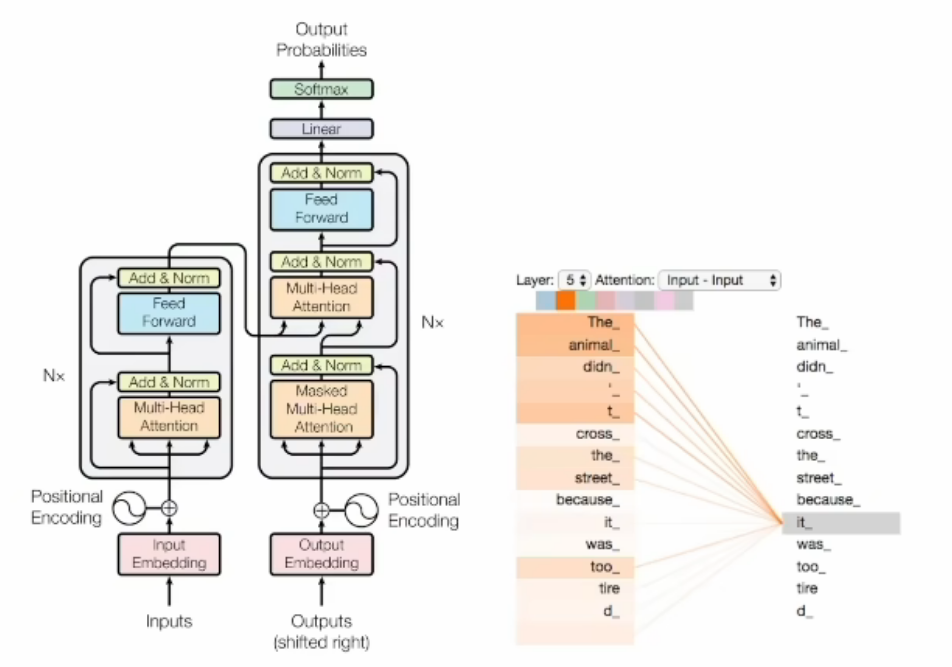
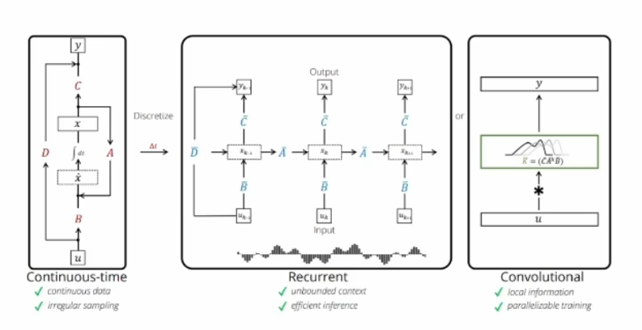
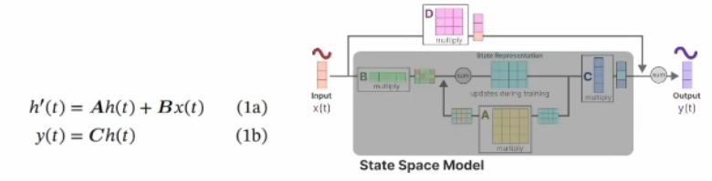
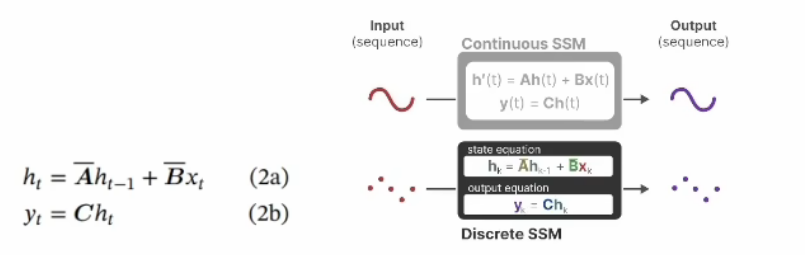
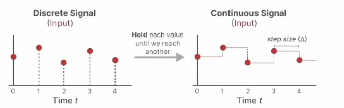
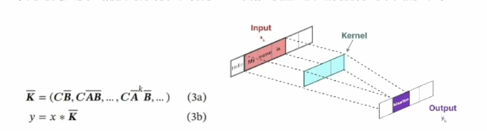
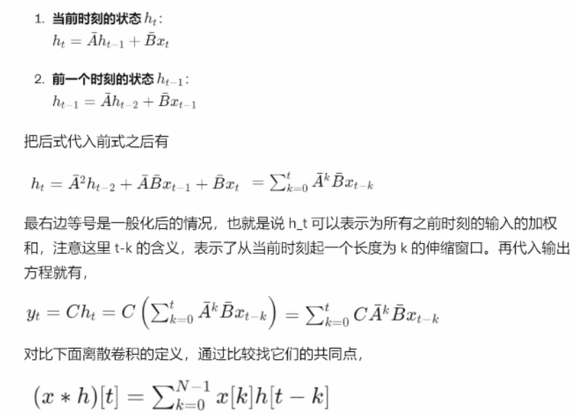
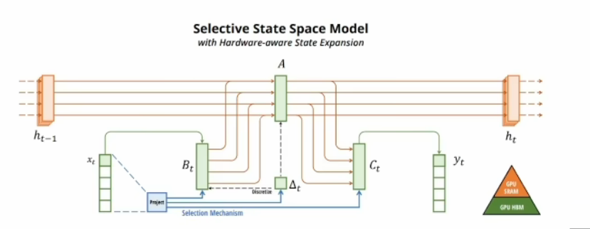

## transformer的缺陷

&nbsp;&nbsp;&nbsp;&nbsp;序列建模的核心是研究如何将长序列的上下文压缩到一个较小的状态中，无论是encoder还是decoder，核心是自注意力机制层，序列数据线经过位置编码后喂给这个模块,将时序的数据空间化。

&nbsp;&nbsp;&nbsp;&nbsp;自注意力的机制（求权重）的计算范围仅限于窗口内，无法直接处理窗口外的元素，如果增加窗口长度，那么计算的复杂度的增加呈平方增长，因为每个位置的即使算都需要与窗口内的所有其他位置进行比较。利用的是GPU的并行能力

> &nbsp;&nbsp;&nbsp;&nbsp;本质上说它这是通过位置编码将序列数据空间话，然后通过计算空间相关度反向建模时序相关度，在这个过程中忽视了数据内在结构的细腻关联关系，采取了一种一视同仁的暴力关联模式。直接简单，但参数效率低下，冗余度高，训练起来不易。

## 时序状态空间模型（SSM）

左LTI 中RNN 通过右CNN实现

### 连续空间的时序建模

&nbsp;&nbsp;&nbsp;&nbsp;很多实际问题都能用左图所示的连续空间模型的时序建模，尤其是控制理论、信号处理或者线性系统领域特别常见，我们称为LTI，线性时不变系统，用公式表示为：

&nbsp;&nbsp;&nbsp;&nbsp;1a为状态方程，1b为观测方程，ABCD是参数矩阵，可通过右图清楚的看到它矩阵的变化关系，输入x，通过$x\cdot B+隐状态h\cdot A$得到隐状态函数，$h\cdot C$得到输出

&nbsp;&nbsp;&nbsp;&nbsp;之所以为时不变，因为ABCD是固定的，这是一个强假设，D在上面 式子中没有写主要是因为在许多实际的系统中，它可以是零。而tansformer本身是没有这样的假设的，因此它可以用于时变系统和非线性系统。SSM则是牺牲通用性，换来特定场景下更高的性能。

### 时序离散化与RNN

&nbsp;&nbsp;&nbsp;&nbsp;连续系统不方便计算机处理，中间图是对它的离散化展开，沿时间拉长，模型和RNN长相上几乎一样。公式与上面类似，只是导数改为不同时刻角标，形成递归过程。

&nbsp;&nbsp;&nbsp;&nbsp;原文给出了一种从连续系统转换为离散系统的ABC参数对应关系，为一种方法的举例（零阶保持)，只需知道运用一个$\Delta$函数,将微分变成差分，经过计算按得到新的A和B。

$$
\bar{A}=exp(\Delta A) \ \ \  \bar{B}=( \Delta A )^{-1}(exp(\Delta A)-I)\cdot \Delta B
$$

### 并行化处理与CNN

&nbsp;&nbsp;&nbsp;&nbsp;SSM通过卷积实现计算上的并行化，将长链条弄成输入输出直接对应的样子，隐变量关联关系为中间的Kemel卷积核，核心思想是用CNN对时序建模，借助不同尺度的卷积核，从不同时间尺度上捕获时序特征，推导至如下

&nbsp;&nbsp;&nbsp;&nbsp;时序递归状态方程改用卷积操作实现，，ABC的参数举证变为K即为卷积核，借助不同卷积核捕捉局部时间序列特征，能同时对短期核长期依赖关系学习，并行计算提高了训练核推理效率

推导过程如下：

二者在结构上类似:

- 首先，最外面都是求和 Sigma，虽然上限不同，但都是在一个范围内进行求和，对不同时间步和相应权重的线性组合，因此类似。

- 其次，看输入信号，一个是$x_{t-k}$，一个是$x[k]$，无非是不同的时间步，都涉及时间偏移，因此也类似。

- 第三，看权重，一个是$C\bar{A}^kB$，一个是$h[t-k]$，都是随着时间k变化的量.

因此，时序的状态空间模型能改写成卷积的形式。

&nbsp;&nbsp;&nbsp;&nbsp;除此之外，上面式子需要注意，在实际问题中往往会对ABC矩阵进一步简化，假设成更简单的对角阵方便计算，即为结构化SSM，S4模型。

## Mamba：选择性SSM

&nbsp;&nbsp;&nbsp;&nbsp;让状态空间具备选择性，达到了Transformers的建模能力，同时在序列长度上实现了线性扩展，克服了Transformers的缺陷，可处理最长达百万长度的序列，效率极高，与GPU硬件适配。

&nbsp;&nbsp;&nbsp;&nbsp;蓝色部分为选择性机制，目的是根据输入的内容选择性地记忆和处理信息，BC都带了t变成了时变参数，A虽然没有直接含t，但也是时变的了。

> 简单理解：一个总开关$\Delta t$+若干个旋转按钮($B_t,C_t$)=非线性时变系统

### 如何进行选择（论证不严谨）

&nbsp;&nbsp;&nbsp;&nbsp;根据输入$x_t$和2它的压缩投影学习可变参数，加了LSTM的门。所谓的选择，就是“掺和”，异常不够，用三条线给$B_t$掺和了三次（$x_t直接到B_t,x_t通过选择到B_t,x_t通过选择经\Delta t到B_t$），给$C_t$掺和了两次（$x_t通过A到C_t,C_t通过选择经\Delta t到C_t$），给$A$掺和了两次（$x_t通过B_t到A,C_t通过选择经\Delta t到A$）,**因为$\tau $函数是非线性激活函数，所以$\Delta$是非线性的 ,所以ABC都是非线性的**

### 核心原理

#### 流体力学与李指数结构

&nbsp;&nbsp;&nbsp;&nbsp;李指数映射(Lie exponential map)是一种数学工具，用于描述和分析一个向量场如何沿着另一个向量场发生变化，比如流体力学、电磁场、广义相对论的时空结构等解决了动态系统中相互作用的描述。它是群论和微分几何中重要的概念，来源于李群和李代数的理论，是挪威数学家索菲斯 李引入的。

&nbsp;&nbsp;&nbsp;&nbsp;Transformer描述的是粒子运动，通过自注意力机制映射动态调整每个输入的权重，类似粒子间通过**牛顿力学相互作用力**来动态调整自己的轨迹。训练的过程，就是在用牛顿力学拟合粒子轨迹，每个输入(粒子)独立计算与其他输入的关系。

&nbsp;&nbsp;&nbsp;&nbsp;而 Mamba 描述的是流体运动，通过**李指数映射**来建模时空结构。流体运动描述的是连续介质中的分子集体行为，运动是整体的，内部各点之间有强烈的相互关系和依赖。流体的每个部分都受到整体流体运动的影响，通过内部压力、粘性等因素相互作用。这更符合记忆的本质，因为记忆系统具有连续性、动态变化性和整体关联性，这些特性与流体的性质非常相似。流体模型能够更好地描述记忆中的信息如何相互关联、如何随着时间和新信息的出现进行动态调整和整合。

#### Mamba—用李指数映射流体力学动态系统

&nbsp;&nbsp;&nbsp;&nbsp;找到主管道A，调整阀门和旋钮$B_t,C_t,\Delta t$获得模型咋爱高维特征空间中进行高效导航和决策

😵😵😵😵😵😵