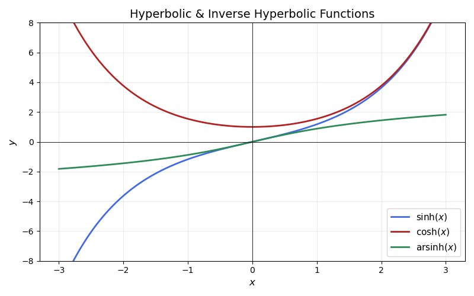
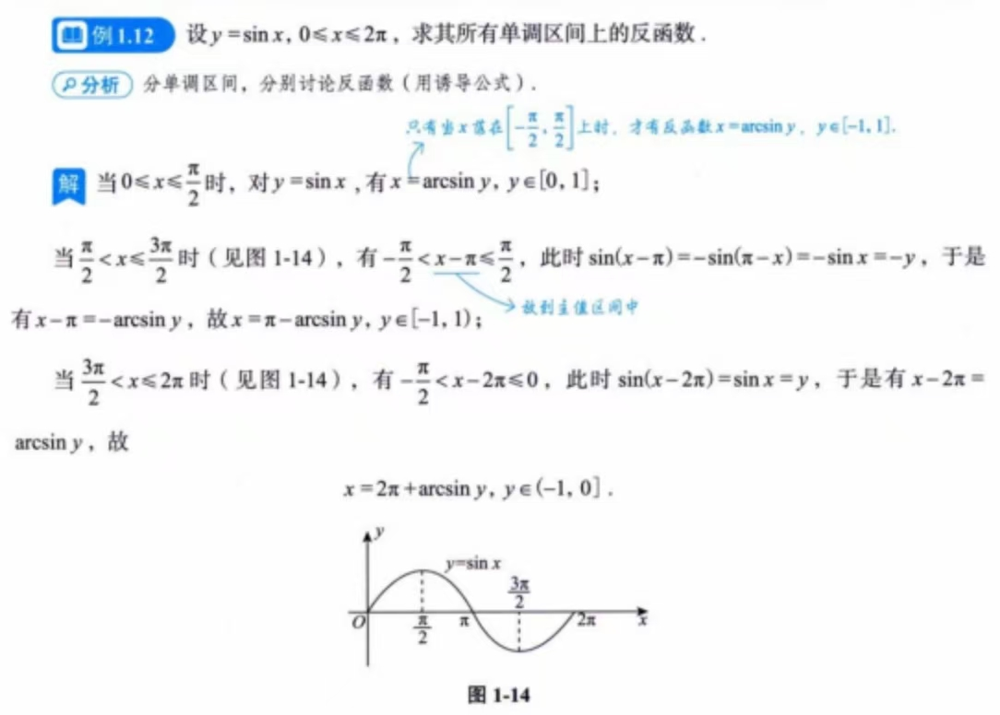
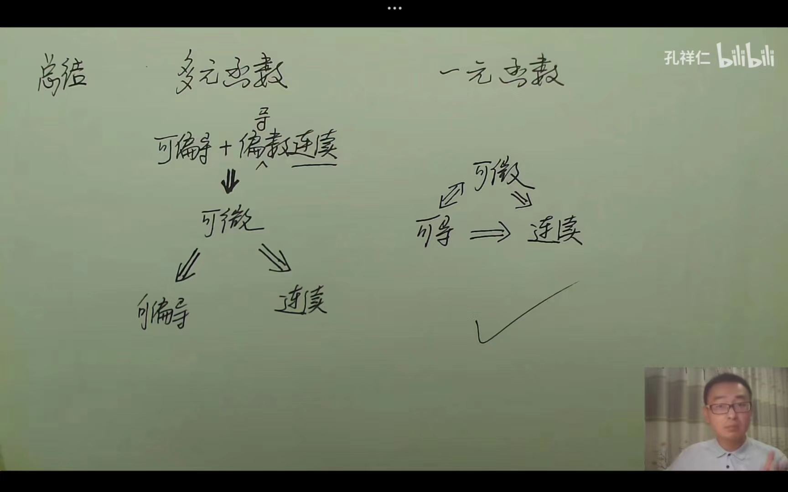

#### 三角函数

&nbsp;&nbsp;&nbsp;&nbsp;双曲正弦函数：
$$
sinh(x)=\frac{e^x-e^{-x}}{2}
$$
&nbsp;&nbsp;&nbsp;&nbsp;反双曲正弦函数：
$$
arsinh(x)=ln(x+\sqrt{x^2+1})
$$

- 是奇函数，$\int _{-a}^a[ln(x+\sqrt{x^2+1}+f(x))]dx=\int_{-a}^a f(x)dx$

- 当x->0时，$ln(x+\sqrt{x^2+1})\sim x$

- $[ln(x+\sqrt{x^2+1})]'=\frac{1}{\sqrt{x^2+1}}$,所以$\int\frac{1}{\sqrt{x^2+1}}dx=ln(x+\sqrt{x^2+1})+C$

&nbsp;&nbsp;&nbsp;&nbsp;双曲余弦函数:
$$
cosh(x)=\frac{e^x+e^{-x}}{2}
$$

&nbsp;&nbsp;&nbsp;&nbsp;双曲正切函数：
$$
tanh(x)=\frac {sinh(x)}{cosh(x)}
$$
&nbsp;&nbsp;&nbsp;&nbsp;$sin(arcsinx)=x,x\in [-1,1],sin(arccosx)=\sqrt{1-x^2},x\in [-1,1]$

&nbsp;&nbsp;&nbsp;&nbsp;$cos(arccosx)=x,x\in [-1,1],cos(arcsinx)=\sqrt{1-x^2},x\in [-1,1]$

&nbsp;&nbsp;&nbsp;&nbsp;三角函数求反函数先移到$[-\frac{\pi}{2},\frac{\pi}{2}]$，再求反函数

#### 等价无穷小

&nbsp;&nbsp;&nbsp;&nbsp;实质是将分式上下同乘1，进行相消操作，因此无法在加减的情况下运用

#### 函数奇偶性判定

- $f(x)+f(-x)$必定为偶函数，例：$\frac{e^2+e^{-x}}{2}$

- $f(x)-f(-x)$必定为奇函数，例：$\frac{e^2-e^{-x}}{2}$
- $f[\phi](x)$，若$\phi(x)$为偶函数，整个为偶函数，$\phi(x)$为奇函数则复合函数奇偶性与外层函数奇偶性一致
- 函数求导一次奇偶性互换
- 对任意的$x,y$,都有$f(x+y)=f(x)+f(y)$，则$f(x)$是奇函数

$$
[|f(x)|]' &= [\sqrt{f^2(x)}] \\
&= \frac{2f(x)f'(x)}{2\sqrt{f^2(x)}} \\
&= \frac{f(x)f'(x)}{|f(x)|}\\
$$

$$
ln(e+\frac{1}{x})-1 &= ln(e+\frac{1}{x}) - lne\\
&=ln(1+\frac{1}{ex})\\
$$

#### 二元函数求极值

#### 一阶微分方程

$$
\frac{dy}{dx}+p(x)y=Q(x)
$$

非齐通=齐通+非其特

齐次方程：$Q(x)=0$,解得
$$
y=ce^{\int -p(x)\,dx}
$$
非齐次方程：$Q(x)!=0$，解得
$$
y=e^{-\int p(x)\,dx}(c+{\int Q(x)e^{\int p(x)\,dx}\,dx})
$$

#### 高阶线性微分方程

##### 齐次线性微分方程

形式:

$$
y''+py'+qy=0
$$
设$$y=e^{rx}$$
系数方程：$$r^2+pr+q=0$$

1. $\Delta>0$,$r_1 \neq r_2$
则$$y=c_1e^{r_1x}+c_2e^{r_2x}$$
2. $\Delta=0$,$r_1 = r_2$
则$$y=(c_1x+c_2)e^{rx}$$
3. $\Delta<0$,$r_1=\alpha+\beta i$,$r_2=\alpha-\beta i$
则$$y=e^{\alpha x}(c_1 \cos \beta x+c_2\sin \beta x)$$

##### 常数非齐次线性微分方程

形式：$$y''+py'+qy=f(x)$$

1. $$f(x)=e^{\lambda x}p_m(x)$$

其中：$\lambda$为常数，$p_m(x)$为x的多项式

特解y*的形式：$$y_{特}=e^{\lambda x}f_m(x)x^k$$

其中$f_{m}(x)$为x的多项式，$\lambda$与齐通中k个解相同，再将特解带入原方程，解出$f_m(x)$的系数

∴$y=y_通+y*$

2. $\Delta<0$，$$f(x)=e^{\lambda x}[P_l(x)\cos{\omega x}+Q_n(x)\sin{\omega x}]$$

其中：$\lambda$，$\omega$为常数，$P_l(x)$,$Q_n(x)$为x的多项式

特解y*的形式：$$x^{k}e^{\lambda x}[R_m(x)\cos{\omega x}+O_m(x)\sin{\omega x}]$$

其中$R_m(x)$,$O_m(x)$为x的多项式,$m=l+n$,$\lambda+\omega i$与k个r相等,再将特解带入原方程，解出x多项式的系数

∴$y=y_通+y*$

####  变限积分求导

**一、基本形式**
&nbsp;&nbsp;&nbsp;&nbsp;若 `f(x)` 连续，$F(x) = ∫_a^x f(t) dt$，则：
$$
\frac{d}{dx}F(x) = f(x)
$$
&nbsp;&nbsp;&nbsp;&nbsp;**几何意义**：积分变限函数F*(*x*) 的导数等于被积函数 f(x)*在上限处的值。

**二、一般形式的变限积分求导**

&nbsp;&nbsp;&nbsp;&nbsp;若积分上下限均为函数 $u(x)$ 和 $v(x)$，且被积函数含参变量 $t$，即：

$$
F(x)=∫ _{v(x)}^{u(x)}​f(t,x)dt
$$

其导数为：

$$
\frac{d}{dx}F(x) = f(u(x),x)u'(x) - f(v(x),x)v'(x) + ∫_{v(x)}^{u(x)}\frac{\partial}{\partial x}f(t,x) dt
$$

**三、分类公式与示例**

**1.下限为函数，上限为常数**
$$
\frac{d}{dx} ∫^{u(x)}_a f(t) dt = f(u(x))·u'(x)
$$
**2.下限为函数，上限为常数**
$$
\frac{d}{dx} ∫_{v(x)}^b f(t) dt = -f(v(x))·v'(x)
$$
**3.上下限均为函数**
$$
\frac{d}{dx} ∫_{v(x)}^{u(x)} f(t) dt = f(u(x))u'(x) - f(v(x))v'(x)
$$

#### 二元函数极值

必要条件：设$z=f(x,y)$在点$(x_0,y_0)$处一阶偏导数存在且取极值，则$f'_x(x_0,y_0)=0,f'_y(x_0,y_0)=0$

#### 拉普拉斯定理

$\mu=\frac{1}{\sqrt{x^2+y^2+z^2}}$，则$\frac{\partial^2 \mu}{\partial x^2}+\frac{\partial^2 \mu}{\partial y^2}+\frac{\partial^2 \mu}{\partial z^2}=0$

#### 多元函数全微分

$z=f(x,y),dz=\frac{\partial z}{\partial x}dx+\frac{\partial z}{\partial y}dy$

#### 多元函数复合求导

$f(x) = 
\begin{cases}
u = \phi(t)\\
v = \psi(t)\\
\end{cases}$，$z=f(u,v)$,则$\frac{\partial z}{\partial t}=\frac{\partial z}{\partial u}\cdot \frac{\partial u}{\partial t}+\frac{\partial z}{\partial v}\cdot \frac{\partial v}{\partial t}$

