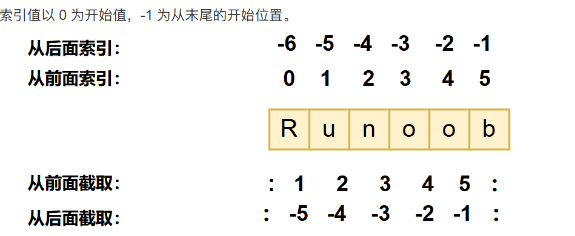

## 基础语法

### 基础

- 整除`//` 幂`**`

- `''`和`""`的使用完全相同，`"""`可以指定一个多行的字符串，不支持单字符类型，单个字符也视为字符串

- `\`转义符，使用`r`可以让反斜杠不发生转义

- 默认输出会自动换行，不需要换行在变量的末尾加上`end=""`,`print( x, end=" " )`

- `Nubmber`包含`int`、`float`、`complex`(复数)其中`int`包含`bool`（`True`、`False`）

- 删除`del`,`del var1[,var2[,var3[....,varN]]]`

- 切片时包含前索引不包含后索引
  

导入：
- 将整个模块(somemodle)导入，格式为： `import somemodule`
- 从某个模块中导入某个函数,格式为：`from somemodule import somefunction`
- 从某个模块中导入多个函数,格式为： `from somemodule import firstfunc, secondfunc, thirdfunc`
- 将某个模块中的全部函数导入，格式为：`from somemodule import *`

运算优先级：

| **                       | 幂                   |
| ------------------------ | -------------------- |
| ~ + -                    | 取反  一元加减号     |
| \* / % //                | 乘，除，取模和取整除 |
| \+ -                     | 加法减法             |
| \>> <<                   | 右移，左移运算符     |
| &                        | 位 运算符符          |
| ^ \|                     | 位运算符             |
| <=   <   >   >=          | 比较运算符           |
| == !=                    | 等于运算符           |
| = %= /= //= -= += *= **= | 赋值运算符           |

### 数据结构

#### list列表

列表内的元素可以修改

```python
list = []
list.append('Google')
list.append('Runoob')
del list[1]
list[0]='www'
len([1,2,3])#3
print([1,2,3]+[4,5,6])# [1, 2, 3, 4, 5, 6]
[1,2,3]*2 # [1, 2, 3, 1, 2, 3]
3 in [1,2,3] # True
print(list)
list.extend([1,2,3])#['www', 1, 2, 3]
list.count('Google') # 0
list.insert(2,'he')#['www', 1, 'he', 2, 3]
list.index('he')#2找出第一个匹配项
list.remove('he')#['www', 1, 2, 3]移除第一个匹配项
list.pop(1)#['www', 2, 3]移除指定位置的元素，默认为最后一个
list.sort()#['www', 2, 3]排序,默认升序,降序list.sort(reverse=True)
list.reverse()#[3, 2, 'www']反转
```

#### tuple元组

&nbsp;&nbsp;&nbsp;&nbsp;定义时使用小括号且元组内的元素不可修改，访问元组内的元素与列表相同,删除只能删除整个元组

> 如果你想创建只有一个元素的元组，需要注意在元素后面添加一个逗号，以区分它是一个元组而不是一个普通的值，这是因为在没有逗号的情况下，Python会将括号解释为数学运算中的括号，而不是元组的表示。

```python
tup1 = ('Google', 'Runoob', 1997, 2000)
type(tup1)# <class 'tuple'>
tup2 = (1, 2, 3, 4, 5 )
tup3 = tup1+tup2
list = list(tup3)# ['Google', 'Runoob', 1997, 2000, 1, 2, 3, 4, 5]
```

#### dictionary字典（map）

&nbsp;&nbsp;&nbsp;&nbsp;表示映射关系的键（`key`）值（`value`）对，`key`必须唯一，键不可变，因此可以使用数字，字符串，元组而不能使用列表

```python
tinydict = {'name': 'runoob', 'likes': 123, 'url': 'www.runoob.com'}
len(tinydict)#3
type(tinydict)#<class 'dict'>
tinydict['name']#runoob
tinydict['age']=7# 添加一个新的键值对
str(tinydict)#"{'name': 'runoob', 'likes': 123, 'url': 'www.runoob.com', 'age': 7}"
del tinydict['name']# 删除键是'name'的条目
del tinydict# 删除字典
tinydict.clear()# 清空字典
```

#### set集合

&nbsp;&nbsp;&nbsp;&nbsp;是一种无需、可变的数据类型，用于存储唯一的元素，创建格式`parame = {value01,value02,...}`或者`set(value)`

```python
set1 = {1, 2, 3, 4}            # 直接使用大括号创建集合
set2 = set([3, 4, 5, 6])      # 使用 set() 函数从列表创建集合
3 in set1 # True
set3 = set1 & set2 # 交集
set4 = set1 | set2 # 并集
set5 = set1 - set2 # 差集
set6 = set1 ^ set2 # 对称差集,,即只在一个集合中,不同时在两个集合中
set1.add(5) # 添加元素
tuple=(6, 7)
set1.add(tuple) # 添加元素
set1.update([6, 7]) # 添加多个元素
print(set1)
set1.remove(7) # 删除元素,不存在会报错
set1.discard(8) # 删除元素,不存在不会报错
set1.pop() # 随机删除一个元素
```

### 函数

#### 动态参数

使用关键词 `*args` 接收任意数量的位置参数，存储为元组（tuple）。

```python
def func(*args):
    print(args) # 元组类型 (22,)   (22,33,99,) ()

# 只能按照位置传参
func(22)
func(22,33)
func(22,33,99)
func()
```

使用关键词 `**kwargs` 接收任意数量的关键字参数，存储为字典（dict）

```python
def func(**kwargs):
    print(kwargs) # 字典类型 {"n1":"猪悟能"}    {"n1":"猪悟能","age":"18","email":"xxxx"}  {}
    
# 只能按关键字传参
func(n1="猪悟能")
func(n1="猪悟能",age=18)
func(n1="猪悟能",age=18,email="xx@live.com")
```

**tips:**

```python
# 1. ** 必须放在 * 的后面
def func1(*args, **kwargs):
    print(args, **kwargs)


# 2. 参数和动态参数混合时，动态参数只能放在最后。
def func2(a1, a2, a3, *args, **kwargs):
    print(a1, a2, a3, args, **kwargs)


# 3. 默认值参数和动态参数可以同时存在
def func3(a1, a2, a3, a4=10, *args, a5=20, **kwargs):
    print(a1, a2, a3, a4, a5, args, kwargs)


func3(11, 22, 33, 44, 55, 66, 77, a5=10, a10=123)
```

#### return

当在函数中`未写返回值` 或 `return` 或 `return None` ，执行函数获取的返回值都是`None`

`return`后面的值如果有逗号，则默认会将返回值转换成元组再返回。

```python
def func():
    return 1,2,3

value = func()
print(value) # (1,2,3)
```

#### 传参
在 Python 中，函数参数的传递方式本质上是 **传递对象的引用（内存地址）**

1. **不可变对象**（int, str, tuple 等）：
    - 函数内修改参数 **不会影响外部变量**
    - 因为修改时会创建新对象
2. **可变对象**（list, dict, set 等）：
    - 函数内 **原地修改**（如 `append`/`update`）会影响外部变量
    - 函数内 **重新赋值**（如 `= []`）不会影响外部变量
3. **本质**：参数传递的是内存地址的副本，但操作方式决定了是否共享内存

### 函数式编程

#### map函数

```python
>>> def f(x):
...     return x * x
...
>>> r = map(f, [1, 2, 3, 4, 5, 6, 7, 8, 9])
>>> list(r)
[1, 4, 9, 16, 25, 36, 49, 64, 81]
```

#### reduce函数

```python
>>> from functools import reduce
>>> def add(x, y):
...     return x + y
...
>>> reduce(add, [1, 3, 5, 7, 9])
25
```

#### 过滤序列filter

```python
def is_odd(n):
    return n % 2 == 1

list(filter(is_odd, [1, 2, 4, 5, 6, 9, 10, 15]))
#删除偶数
```

#### 列表生成式

```python
>>> list(range(1, 11))
[1, 2, 3, 4, 5, 6, 7, 8, 9, 10]
```

### 海象运算符

`py==3.8`后引入的新的赋值表达式运算符，可以在表达式中进行赋值操作，符号为`:=`

```python
# 传统写法
line = input("Enter a line: ")
while line != "quit":
    print(f"You entered: {line}")
    line = input("Enter a line: ")
    
# 使用海象运算符
while (line := input("Enter a line: ")) != "quit":
    print(f"You entered: {line}")
    
# 传统写法
results = []
for x in range(10):
    y = x * x
    if y > 10:
        results.append(y)
        
# 使用海象运算符
results = [y for x in range(10) if (y := x * x) > 10]
```


## 面向对象

```python
class Employee:
    '所有员工的基类'
    empCount = 0  # 成员变量
    name = ""
    salary = 0

    def __init__(self, name, salary):  # 构造函数
        self.name = name#改变的是对象的值
        self.salary = salary
        Employee.empCount += 1#改变的是类的值

    def displayCount(self):  # self表示类的实例，当前实例的地址
        print("Total Employee %d" % Employee.empCount)

    def displayEmployee(self):
        print("Name : ", self.name, ", Salary: ", self.salary)

    def updateEmployee(self, name, salary):
        self.name = name
        self.salary = salary

    def __del__(self): # 在调用时、对象停止引用（程序停止）时调用
        class_name = self.__class__.__name__
        print(class_name, "销毁")
        self.displayEmployee()


john = Employee("John", 1000)
mike = Employee("Mike", 1500)
john.displayEmployee()
john.displayCount()
john.updateEmployee("Alex", 2000)
john.displayEmployee()
```

#### 继承

```py
class people:
    #定义基本属性
    name = ''
    age = 0
    #定义私有属性,私有属性在类外部无法直接进行访问
    __weight = 0
    #定义构造方法
    def __init__(self,n,a,w):
        self.name = n
        self.age = a
        self.__weight = w
    def speak(self):
        print("%s 说: 我 %d 岁。" %(self.name,self.age))
 
#单继承示例
class student(people):
    grade = ''
    def __init__(self,n,a,w,g):
        #调用父类的构函
        people.__init__(self,n,a,w)
        self.grade = g
    #覆写父类的方法
    def speak(self):
        print("%s 说: 我 %d 岁了，我在读 %d 年级"%(self.name,self.age,self.grade))
 
#另一个类，多继承之前的准备
class speaker():
    topic = ''
    name = ''
    def __init__(self,n,t):
        self.name = n
        self.topic = t
    def speak(self):
        print("我叫 %s，我是一个演说家，我演讲的主题是 %s"%(self.name,self.topic))
 
#多继承
class sample(speaker,student):
    a =''
    def __init__(self,n,a,w,g,t):
        student.__init__(self,n,a,w,g)
        speaker.__init__(self,n,t)

    def speak(self):
        print("%s 说: 我 %d 岁了，我在读 %d 年级，我演讲的主题是 %s"%(self.name,self.age,self.grade,self.topic))
test = sample("Tim",25,80,4,"Python")
test.speak()   #方法名同，默认调用的是在括号中参数位置排前父类的方法
super(sample,test).speak()  #用子类对象调用父类已被覆盖的方法
#因为这里是多继承，调用的是speaker因为speaker 类在继承列表中排在student 类之前。你可以通过查看 sample 类的 MRO（方法解析顺序）来验证这一点
print(sample.__mro__)
```

## 类

### 特殊方法/魔法方法

定义了类要如何对待运算符的python内置函数的方法，往往前后有两个下划线，叫作`dunder method`->`double underscore`

### import

导入文件时的查找是根据执行目录`sys.path`来的

> 假设我们A导入B，在B导入C，BC在同目录下，运行A，当前目录是A所在的目录，虽然BC是同级，但无法直接导入

导入时的`*`可用`__all__`来定义

```python
from packageA import *

#packageA/__init__.py
__all__=['X','moduleA']
```


### 相对导入

1. **单个点 (`.`)**：表示当前包。
2. **两个点 (`..`)**：表示当前包的父包。
3. **三个点 (`...`)**：表示当前包的父包的父包，以此类推。

例如，假设有以下目录结构：

```markdown
my_package/
    __init__.py
    test1.py
    sub_package/
        __init__.py
        test2.py
```

在 `test2.py` 中，你可以使用相对导入来导入 `test1.py` 中的函数：

```python
from ..test1 import devide
```

为了使相对导入正常工作，请确保：

1. 你的代码在包的上下文中运行。
2. 使用 `-m` 选项从包的根目录运行 Python 解释器。

### `__init__.py`

- 包的初始化

- 管理包的接口

    ```python
    from packageA import *
    
    #packageA/__init__.py
    __all__=['X','moduleA']
    ```

    

- 管理包的信息
    ```python
    __version__='1.0.0'
    __outhor__='cwdpsky'
    ```

    
