## CPU的功能和基本结构

### CPU的功能

&nbsp;&nbsp;&nbsp;&nbsp;由运算器和控制器组成，其中控制器的功能是负责协调并控制计算机各部件执行程序的指令序列；运算器的功能是对数据进行加工。

功能包括：

- 指令控制：完成取指令(也称取指)、分析指令和执行指令的操作，即程序的顺序控制。
- 操作控制：。产生完成一条指令所需的操作信号，把各种操作信号送到相应的部件，从而控制这些部件按指令的要求正确执行。
- 时间控制：严格控制各种操作信号的出现时间、持续时间及出现的时间顺序。
- 数据加工：对数据进行算术和逻辑运算。
- 中断处理：对运行过程中出现的异常情况和中断请求进行处理。

### CPU的基本结构

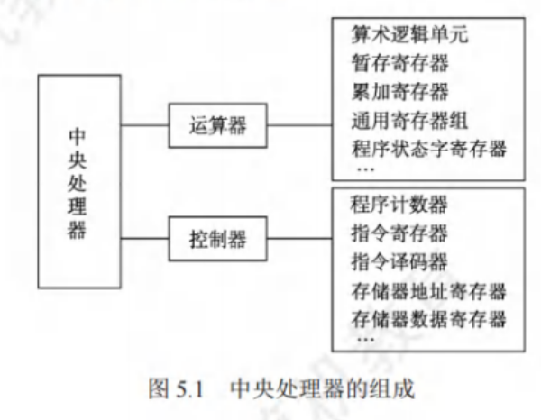

运算器：

&nbsp;&nbsp;&nbsp;&nbsp;运算器主要由算术逻辑单元(ALU)、暂存寄存器、累加寄存器(ACC)、通用寄存器组(GPRS)、程序状态字寄存器(PSW)、移位寄存器、计数器(CT)等组成。其主要功能是根据控制器送来的命令，对数据执行算术运算(加、减、乘、除)、逻辑运算(与、或、非、异或、移位、求补等)或条件测试(用于设置 ZF、SF、OF 和 CF 等标志位，作为条件转移的判断条件)。

控制器：

&nbsp;&nbsp;&nbsp;&nbsp;控制器主要由**程序计数器(PC)**、**指令寄存器(IR)**、指令译码器(ID)、存储器地址寄存器(MAR)、存储器数据寄存器(MDR)、时序电路和微操作信号发生器等组成。其主要功能是执行指令，每条指令的执行是由控制器发出的一组微操作实现的。

> &nbsp;&nbsp;&nbsp;&nbsp;工作原理：根据指令操作码、指令的执行步骤(微命令序列)和条件信号来形成当前计算机各部件要用到的控制信号。计算机整机各硬件系统在这些控制信号的控制下协同运行，产生预期的执行结果。控制器是整个系统的指挥中枢，在控制器的控制下，运算器、存储器和输入/输出设备等功能部件构成一个有机的整体，根据指令的要求指挥全机协调工作。

### CPU的寄存器

按汇编语言（或机器语言）程序是否可以访问可分为

- 用户可见寄存器：可对这类寄存器编程，以通过使用这类寄存器减少对主存储器的访问次数，如通用寄存器组(含基址/变址寄存器)、程序状态字寄存器、程序计数器、累加寄存器、移位寄存器。
- 用户不可见寄存器：对用户是透明的，不可对这类寄存器编程，它们被控制部件使用，以控制CPU的操作，如存储器地址寄存器、存储器数据寄存器、指令寄存器、暂存寄存器。

运算器中的寄存器：

1. 通用寄存器组(GPRS)。用于存放操作数(包括源操作数、目的操作数及中间结果)和各种地址信息等，如 AX、BX、CX、DX、SP 等。在指令中要指定寄存器的编号，才能明确是对哪个寄存器进行访问。SP是堆栈指针，用于指示栈顶的地址。
2. 累加寄存器(ACC)。它是一个通用寄存器，用于暂时存放 ALU 运算的结果。
3. 移位寄存器(SR)。不但可用来存放操作数，而且在控制信号的作用下，寄存器中的数据可根据需要向左或向右移位。
4. 暂存寄存器。用于暂存从数据总线或通用寄存器送来的操作数，以便在取出下一个操作数时将其同时送入 ALU。暂存寄存器对应用程序员是透明的(不可见)。
5. 程序状态字寄存器(PSW)。保留由算术/逻辑运算指令或测试指令的运行结果而建立的名种状态信息，如溢出标志(OF)、符号标志(SF)、零标志(ZF)、进位标志(CF)等。每个标志位通常由一位触发器来保存，这些标志位组合在一起称为程序状态字。

控制器中的寄存器：

1. 程序计数器(PC)。用于指出欲执行指令在主存储器中的存放地址。若 PC 和主存储器均按字节编址，则 **PC的位数等于主存储器地址位数**。CPU 根据 PC 的内容从主存储器中取指令，然后送入指令寄存器。指令通常是顺序执行的，因此PC具有自动加1的功能(这里的“1”是指一条指令的字节数):当遇到转移类指令时，PC的新值由指令计算得到。
2. 指令寄存器(IR)。用于保存当前正在执行的指令，IR的位数等于指令字长。
3. 存储器地址寄存器(MAR)。用于存放要访问的主存储器单元的地址，MAR 的位数等于主存储器地址线数，它反映了最多可寻址的存储单元的个数。
4. 存储器数据寄存器(MDR)。用于存放向主存储器写入的信息或从主存储器读出的信息,MDR 的位数等于存储字长。当 CPU 和主存储器交换信息时，都要用到MAR 和 MDR。

## 指令执行过程

### 指令周期

指令周期：CPU每取出并执行一条指令所需的全部时间，可用若干机器周期（单个操作需要是时间）来表示

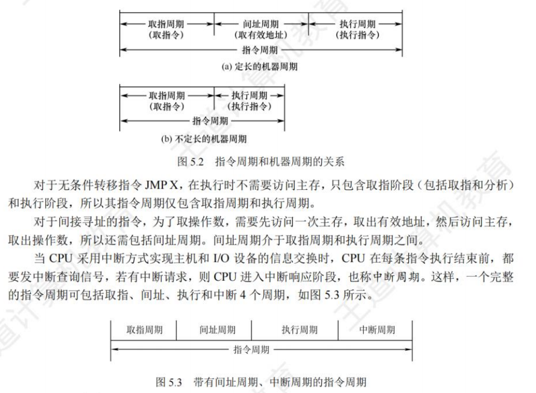

指令执行过程：

&nbsp;&nbsp;&nbsp;&nbsp;当 CPU 执行指令时，首先进入取指周期，从PC指出的主存单元中取出指令，送至指令寄存器，同时 PC加“1”以作为下一条指令的地址（**顺序寻址**）。当遇到转移指令等改变执行顺序的指令时，在 PC加“1”后会重新计算并更新 PC 值。然后判断是否有间接寻址，如果有，那么进入间址周期以获取操作数的有效地址。之后进入执行周期，完成取操作数、执行运算和存操作数的任务。执行周期结束后，如果 CPU检测到中断请求，则进入中断周期，此时需要关中断、保存断点、修改 PC 值为中断服务程序的入口地址，并转向中断服务程序。

### 指令周期的数据流

&nbsp;&nbsp;&nbsp;&nbsp;数据流是根据指令要求依次访问的数据序列。在指令执行的不同阶段，要求依次访问的数据序列是不同的。而且对于不同的指令，它们的数据流往往也是不同的。

**取指周期**：

&nbsp;&nbsp;&nbsp;&nbsp;任务：根据PC中的内容从主存中取出指令代码并存放在IR中

> &nbsp;&nbsp;&nbsp;&nbsp;PC中存放的是指令的地址，根据此地址从内存单元中取出的是指令，并放在IR中，取指令的同时，PC加1

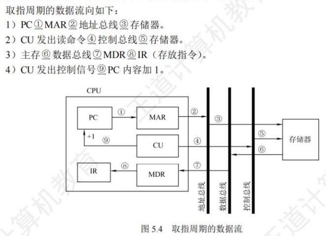

**间址周期**：

&nbsp;&nbsp;&nbsp;&nbsp;任务：取操作数有效地址。
&nbsp;&nbsp;&nbsp;以一次间址为例，将指令中的地址码送到MAR 并送至地址总线，此后CU向存储器发出读命令，以获取有效地址并存至MDR。

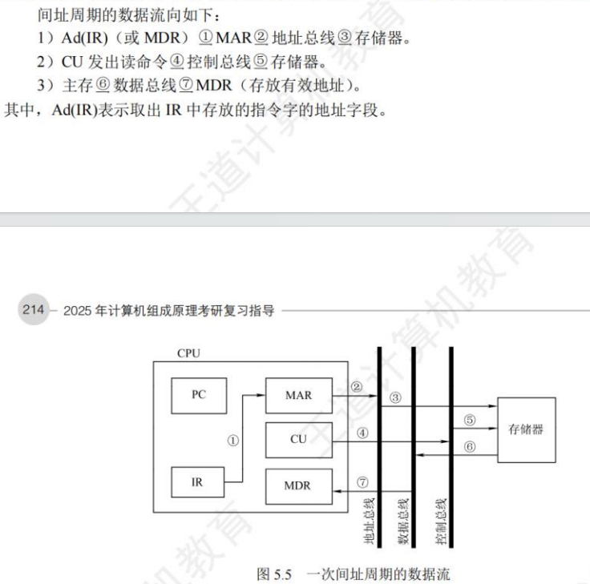

执行周期：
&nbsp;&nbsp;&nbsp;执行周期的任务是取操作数，并根据IR中的指令字的操作码通过 ALU 操作产生执行结果。不同指令的执行周期操作不同，因此没有统一的数据流向。

中断周期：

&nbsp;&nbsp;&nbsp;任务:处理中断请求.
&nbsp;&nbsp;&nbsp;假设程序断点存入堆栈中，并用SP指示栈顶地址，而且进栈操作是先修改栈顶指针，后存入数据。

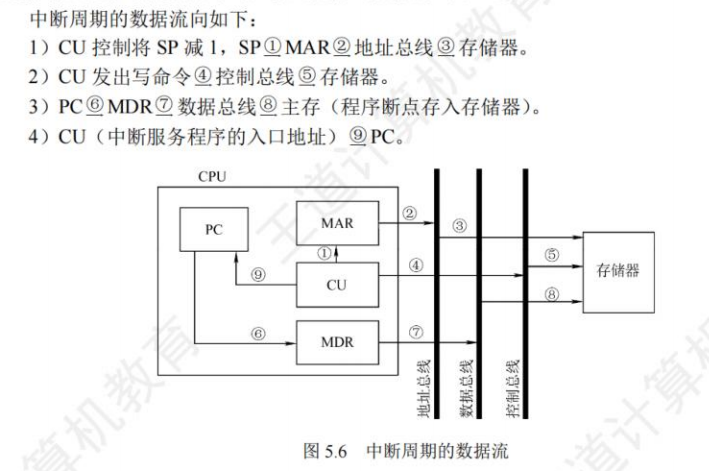

### 指令执行方案

&nbsp;&nbsp;&nbsp;如何安排指令的执行步骤称为指令执行方案

单指令周期：

&nbsp;&nbsp;&nbsp;特点：串行，相同执行时间

&nbsp;&nbsp;&nbsp;定义：每条指令都在固定的时钟周期内完成，指令之间串行执行，指令周期取决于执行时间最长的指令的执行时间。

多指令周期：

&nbsp;&nbsp;&nbsp;特点：串行，不同执行时间

&nbsp;&nbsp;&nbsp;定义：指令之间串行执行，可以选用不同个数的时钟周期来完成不同指令的执行过程，指令需要几个周期就为其分配几个周期。

流水线方案：

&nbsp;&nbsp;&nbsp;特点：并行

&nbsp;&nbsp;&nbsp;定义：力争在每个时间脉冲周期完成一条指令的执行过程(理想情况)，尽量让多条指令同时运行，但各自处在不同的执行步骤中。

## 数据通路的功能和基本结构

### 数据通路的功能

数据通路：数据在指令执行过程中所经过的路径，包括路径上的部件

> ALU、通用寄存器、状态寄存器、异常和中断处理逻辑等都是指令执行时数据流经的部件，都属于数据通路的一部分。数据通路描述了信息从哪里开始，中间经过哪些部件，最后被传送到哪里。数据通路由控制部件控制，控制部件根据每条指令功能的不同，生成对数据通路的控制信号。

### 数据通路的组成

&nbsp;&nbsp;&nbsp;组成数据通路的元件主要分为组合逻辑元件和时序逻辑元件。

**组合逻辑元件（操作元件）**：

&nbsp;&nbsp;&nbsp;任何时刻产生的输出仅取决于当前的输入。组合电路不含存储信号的记忆单元，也不受时钟信号的控制，输出与输入之间无反馈通路，信号是单向传输的。

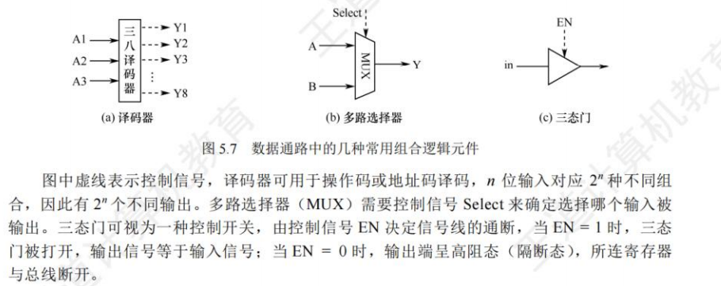

**时序逻辑元件（状态元件）**：

&nbsp;&nbsp;&nbsp;任何时刻的输出不仅与该时刻的输入有关，还与该时刻以前的输入有关，因而时序电路必然包含存储信号的记忆单元。此外，时序电路必须在时钟节拍下工作。各类寄存器和存储器，如通用寄存器组、程序计数器、状态/移位/暂存/锁存寄存器等，都属于时序逻辑元件。

### 数据通路的基本结构

内部总线：同一部件内相互链接的线

CPU内部单总线方式：

&nbsp;&nbsp;&nbsp;将 ALU 及所有寄存器都连接到一条内部公共总线上，称为单总线结构的数据通路。结构比较简单，数据传输存在较多的冲突现象，性能较低。

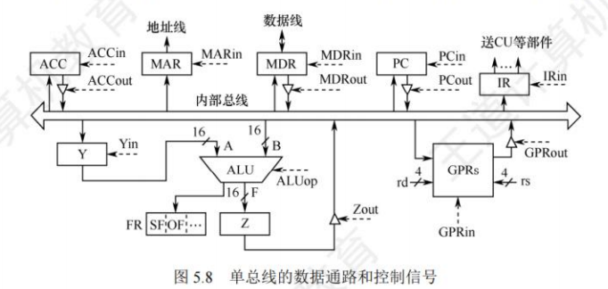

CPU内部多总线方式：

&nbsp;&nbsp;&nbsp;将所有寄存器的输⼊端与输出端都连接到多条公共通路上，相较单总线结构，效率提⾼

专用数据通路方式

&nbsp;&nbsp;&nbsp;根据指令执⾏过程中的数据和地址的流动⽅向安排连接线路，避免使⽤共享的总线，性能较好，但硬件总量⼤

### 数据通路的操作举例

&nbsp;&nbsp;&nbsp;总线是一组共享的传输信号线，它不能存储信息，任一时刻也只能有一个部件把信息送到总线上。

#### 通用寄存器之间传送数据：

&nbsp;&nbsp;&nbsp;在寄存器和总线之间有两个控制信号：Rin和Rout。当Rin 有效时，控制将总线上的信息存到寄存器 R中；当 Rout有效时，控制将寄存器R的内容送至总线。

#### 从主存读取数据：

&nbsp;&nbsp;&nbsp;从主存中读取的信息可能是数据或指令。

| 流程                   | 描述                                    | 时间         |
| ---------------------- | --------------------------------------- | ------------ |
| PC->MAR                | PCout和MARin有效，现行指令->MAR         | 一个时钟周期 |
| MEM(MAR)->MDR,PC+1->PC | MDRin有效，CU发出读命令，取出指令后PC+1 | 一个主存周期 |
| MDR->IR                | MDRout和IRin有效，现行指令->IR          | 一个时钟周期 |

#### 将数据写入主存：

| 流程          | 描述                     |
| ------------- | ------------------------ |
| R1->MDR       | R1out和MARin有效         |
| R2->MAR       | R2out和MARin有效         |
| MDR->MEM(MAR) | MDRout有效，CU发出写命令 |

#### 执行算术或逻辑运算：

| 流程     | 描述                                        |
| -------- | ------------------------------------------- |
| R1->Y    | R1out和Yin有效，操作数->Y                   |
| ACC+Y->Z | ACCout和ALUin有效,CU向ALU发出加命令,结构->Z |
| Z->ACC   | Zout和ACCin有效，结果->ACC                  |

#### 修改程序计数器的值：

&nbsp;&nbsp;&nbsp;当IRout和PCin有效是，AD(IR)->PC

## 控制器的功能和工作原理

### 控制器的结构和功能

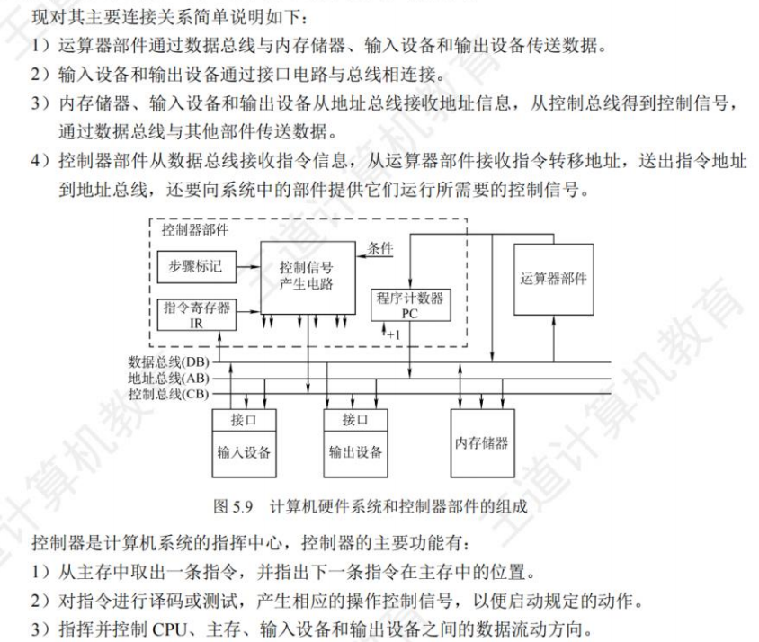

&nbsp;&nbsp;&nbsp;根据控制器产生的微操作控制信号的方式不同，可以分为硬布线控制器和微程序控制器。两类控制器中的PC和IR是相同的，但确定和表示指令执行步骤的方法及给出控制各部件运行所需要的控制信号的方案是不同的。

### 硬布线控制器

&nbsp;&nbsp;&nbsp;有复杂的组合逻辑门电路和触发器构成，也称组合逻辑控制器，根据指令的要求、当前的时序状态及内外部状态，按时间的顺序发送一系列微操作的控制信号。

&nbsp;&nbsp;&nbsp;指令的操作码是决定控制单元CU发出不同信号的关键
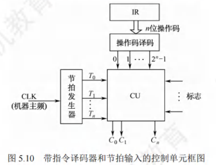

信号来源：

- 经指令编译器译码产生
- 时序系统产生的机器周期信号和节拍信号
- 来自执行单元的反馈信号，即标志

### 微程序控制器

&nbsp;&nbsp;&nbsp;采用存储逻辑实现，将微操作信号代码化

#### 微程序控制的基本概念

- 微操作：计算机中最基本，不可再分解的操作，微命令执行的操作
- 微命令：将控制部件向执行部件发出各种控制命令，是构成控制序列的最小单位

	> 微命令有相容性和相斥性之分，相容性是指可以同时出现，共同完成某些微操作的微命令，反之为相斥性

- 微指令：若干微命令的集合，分为微操作码字段和微地址码字段
- 微地址：存放微指令的控制存储器的单元地址
- 微周期：从控制存储器中读取一条微指令并执行相应的微操作所需的时间，通常为一个时钟周期
- 微程序：微指令的有序集合，一条指令的功能由一段微程序实现

> 主存用于存放程序和数据，再CPU外部没用RAM实现
> CM用于存放微程序，在CPU内部，用ROM实现
> 一般来说，一条机器指令对应一个微程序

寄存器区分：

| 寄存器                      | 功能                                         |
| --------------------------- | -------------------------------------------- |
| 地址寄存器(MAR)             | 用于存放主存的读/写地址                      |
| 微指令地址寄存器(uPC或CMAR) | 用于存放待执行的微指令在控制存储器中的微地址 |
| 指令寄存器(IR)              | 用于存放从主存中读出的指令                   |
| 微指令寄存器(uIR或CMDR)     | 用于存放从控制存储器中读出的微指令           |

#### 微程序控制器的组成和工作过程

基本组成:

1. 起始和转移地址形成部件(或简称微地址形成部件)。用于产生初始和后继微地址，以保证微指令的连续执行。
2. 微指令地址寄存器。接收微地址形成部件送来的微地址，为读取微指令做准备。
3. 控制存储器。它是微程序控制器的核心部件，用于存放各指令对应的微程序。
4. 微指令寄存器。其位数等于微指令字长。

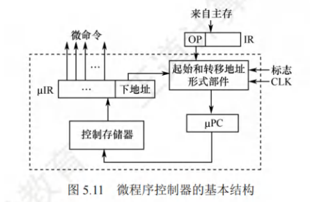

工作过程：

1. 执行取微指令的公共操作
2. 由机器指令的操作码字段通过微地址形成部件产生改机器指令所对应的微程序的入口地址，并送入CMAR[微程序的入口地址是机器指令的操作码字段]
3. 从CM中组逐条取出对应的微指令并执行
4. 执行完对应一条机器指令的微程序后，又回到微程序的入口地址，继续第一步

#### 微指令的编码方式

&nbsp;&nbsp;&nbsp;也称为微指令的控制方式，是指如何对微指令的控制字段进行编码，以形成控制信号，目标：在保证熟读的情况下，尽量缩短指令的字长。

##### 直接编码

- 无需进行译码，微指令的微命令字段中的每一位都代表了一共微命令（选用"1",不选用"0"）
- 优先：简单，直观，执行速度快，操作并行性好
- 缺点：微指令字长过长，ng微指令要求微指令的操作字段有n位，造成控制存储器容量极大

##### 字段直接编码法

- 将微命令字段分成若干小字段，将互斥性微命令组合在同一字段中

- 把相容性微命令组合在不同字段中，每个字段独立编码

- 每种编码都代表一个微命令且各字段编码含义单独定义，与其他字段无关。

- 优点:可以缩短微指令字长

- 缺点:要通过译码电路之后再发出微命令，速度慢

    > 分段原则：
    > 互斥性微命令组合在同一字段中，把相容性微命令组合在不同字段中
    > 每个小段中包含的信息位不能太多，否则将增加译码电路的复杂性和译码时间
    > 一般每个小段还要留出一个状态，表示本字段不发出任何微命令

##### 字段间接编码法

- 一个字段的某些微命令需由另一字段中的某些微命令解释
- 由于不是靠字段直接译码发出的微命令，因此称为字段间接编码
- 优点:可进一步缩短微指令字长
- 缺点:削弱了微指令的并行能力

#### 微指令的地址形成方式

1. 直接由微指令的下地址字段指出。格式中设置一个下地址(断定方式)
2. 根据机器指令的操作码形成。机器指令取至IR后，微指令的地址由操作码经微地址形成部件形成。
3. 增量计数器法(微地址连续)。根据各种标志决定微指令分支转移的地址
4. 通过测试网络形成。由硬件直接产生微程序入口地址

#### 微指令的格式

##### 水平型微指令

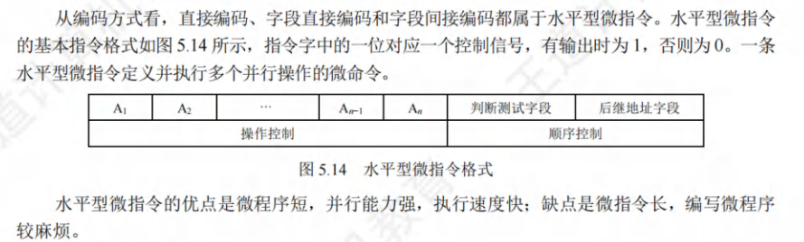

##### 垂直型微指令

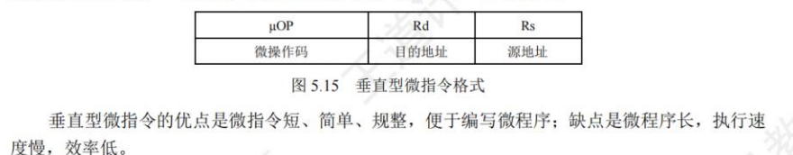

对比：

| 水平型                           | 垂直型                 |
| -------------------------------- | ---------------------- |
| 并行操作能力强、效率高、灵活性强 | 相反                   |
| 执行一条指令的时间短             | 相反                   |
| 微指令字位数较多、微程序较短     | 相反                   |
| 用户难以掌握                     | 与指令相似、用户好掌握 |

#### 硬布线和微指令控制器的特点

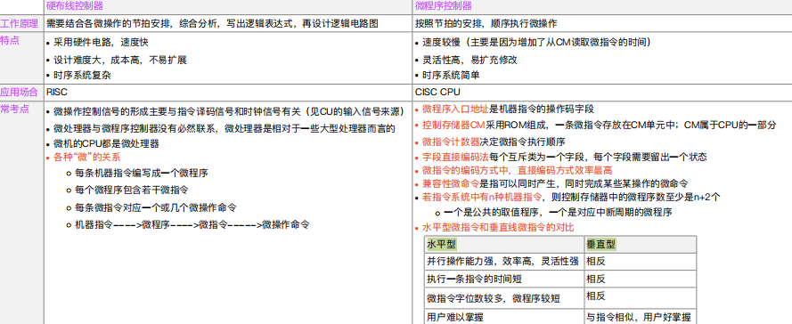