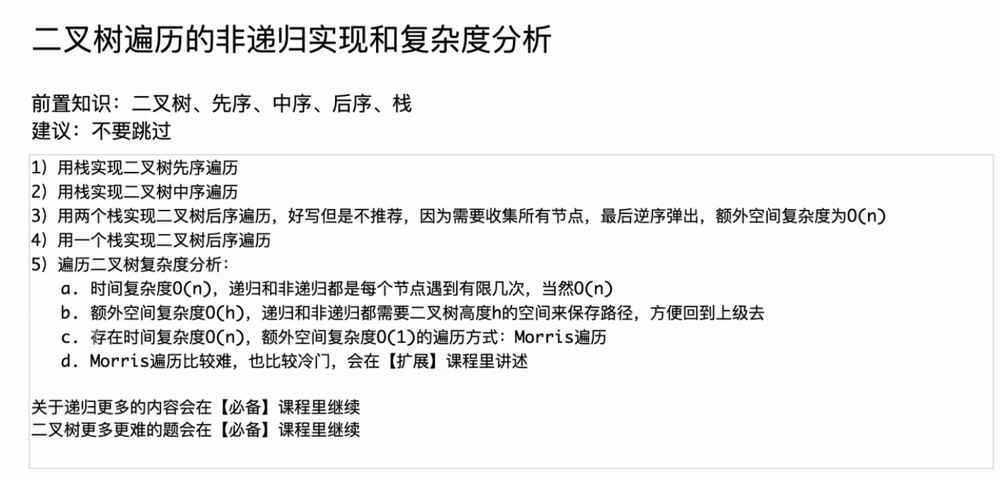

## 二叉树分析



## 二叉树的递归遍历

基础遍历：

```java
public static void f(TreeNode head) {
    if (head == null) {
        return;
    }
    //1
    f(head.left);
    //2
    f(head.right);
    //3
}
```


### 三种排序

1.前/先序排列 ***二叉树内元素第一次时出现记录***
中->左->右

```java
public static  void preOrder(TreeNode head) {
    if (head == null) {
        return;
    }
    System.out.print(head.data + " ");
    preOrder(head.left);
    preOrder(head.right);
}
```

2.中序排列 ***二叉树内元素第二次时出现记录***
左->中->右

```java
public static void inOrder(TreeNode head) {
    if (head == null) {
        return;
    }
    inOrder(head.left);
    System.out.print(head.data + " ");
    inOrder(head.right);
}
```

3.后序排列 ***二叉树内元素第三次时出现记录***
左->右->中

```java
public static void postOrder(TreeNode head) {
    if (head == null) {
        return;
    }
    postOrder(head.left);
    postOrder(head.right);
    System.out.print(head.data + " ");
}
```

## 二叉树的非递归遍历_迭代_用栈实现

1.先序遍历：  ***先压头，弹出的变头，先压右再压左，弹出时就是先弹左节点先处理左子树，先左再右***

```java
public static void preOder(TreeNode head){
    if(head !=null){
        Stack<TreeNode> stack = new Stack<>();
        stack.push(head);
        while(!stack.isEmpty()){
            head = stack.pop();
            System.out.println(head.val);
            if(head.right != null){
                stack.push(head.right);
            }
            if(head.left != null){
                stack.push(head.left);
            }
        }
        System.out.println();
    }
}
```

2.中序遍历： ***头不为空，先压头，再以左节点为头，压入整棵树的左节点；头为空，弹出父节点并打印，以父节点的右节点为头，再处理右子树的全部左节点***

```java
public static void inOrder(TreeNode head){
    if(head !=null){
        Stack<TreeNode> stack = new Stack<>();
        while(!stack.isEmpty() || head != null){
            if(head != null){
                stack.push(head);
                head = head.left;
            }else{
                head = stack.pop();
                System.out.println(head.val);
                head = head.right;
            }
        }
        System.out.println();
    }
}
```

3.后序排列：
①两个栈实现：***先通过类前序变为中->右—>左，在通过压栈出栈变为左->右->中***

```java
public static void posOrderTwoStacks(TreeNode head) {
    if (head != null) {
        Stack<TreeNode> stack = new Stack<>();
        Stack<TreeNode> collect = new Stack<>();
        stack.push(head);
        while (!stack.isEmpty()) {
            head = stack.pop();
            collect.push(head);
            if (head.left != null) {
                stack.push(head.left);
            }
            if (head.right != null) {
                stack.push(head.right);
            }
        }
        while (!collect.isEmpty()) {
            System.out.print(collect.pop().val + " ");
        }
        System.out.println();
    }
}
```

②一个栈实现：

```java
public static void posOrderOneStack(TreeNode head) {
    if (head!=null){
        Stack<TreeNode> stack = new Stack<>();
        stack.push(head);
        while (!stack.isEmpty()){
            TreeNode cur = stack.peek();
            //有左子树且左子树未处理
            if (cur.left!=null&&head!=cur.left&&head!=cur.right){
                stack.push(cur.left);
            }
            else if (cur.right!=null&&head!=cur.right){
            //有右子树且右子树未处理
                stack.push(cur.right);
            }
            else {
                //为叶子节点或者左右子树都处理过了
                System.out.print(cur.val);
                head = stack.pop();
            }
            System.out.println();
        }
    }
}
```
