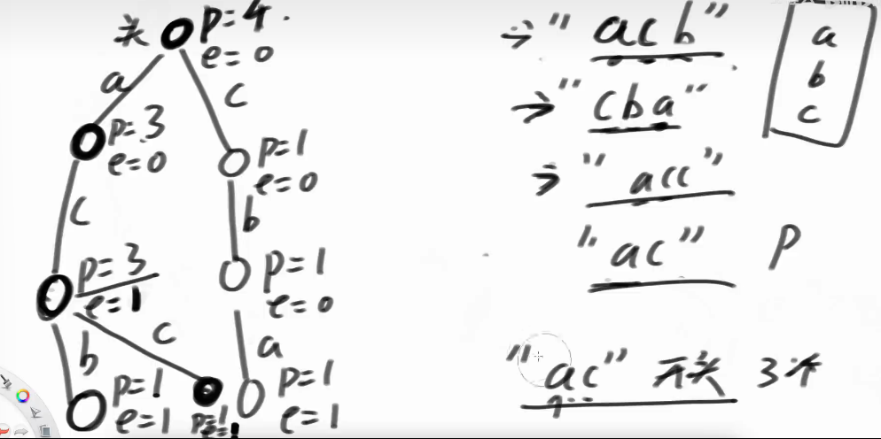

## 前缀树基本知识


前缀树又叫字典树(trie)，每个样本从头结点开始，根据前缀数据构建一个大树，没有路则新建结点，已经有路则复用结点，字符放在边上

使用场景： 需要根据前缀信息来查询
优点：根据前缀信息选择书上的分支，节省大量的时间
缺点：比较浪费空间，与总字符数量和字符种类（一个结点的路有很多条）有关

### 类描述实现前缀树


```java
class TrieNode{
    public int pass;
    public int end;
    public TrieNode[] nexts;
    public TrieNode(){
        pass = 0;
        end = 0;
        nexts = new TrieNode[26];
    }
}

private TrieNode root;//头结点
public Trie(){//前缀树初始化
    root = new TrieNode()
}

public void insert(String word){
    TrieNode node = root;
    node.pass++;
    for(int i = 0, path; i < word.length(); i++){
        path = word.charAt(i) - 'a';
        if(node.nexts[path] == null){
            node.nexts[path] = new TrieNode;
        }
        node = node.nexts[path];
        node.pass++;
    }
    node.end++;
}
//若之前word插入过前缀树，则删掉一次，反之什么都不做
public void erase(String word){
    if(countWordEqualTo(word) > 0){
        TrieNode node = root;
        node.pass--;
        for(int i = 0, path; i < word.length(); i++){
            path = word.charAt(i) - 'i';
            //这个分支只有这一个word，直接删去整个分支，cpp中要手动释放
            if(--node.nexts[path].pass == 0){
                node.nexts[path] = null;
                return;
            }
            node = node.nexts[path];
        }
        node.end--;
    }
}
//查询前缀树里word单词出现的次数
public int countWordEqualTo(String word){
    TrieNode node = root;
    for(int i = 0, path;i < word.length(); i++){
        path = word.charAt(i) - 'a';
        if(node.nexts[path] = null){
            return 0;
        }
        node = node.nexts[path];
    }
    return node.end;
}
//查询前缀树里有多少单词以pre作前缀
public int countWordStartingWith(String pre){
    TrieNode node = root;
    for(int i = 0, path; i <pre.length(); i++){
        path = pre.charAt(i) - 'a';
        if(node.nexts[path] == null){
            return 0;
        }
    }
    return node.pass;
}
```

也可以采用哈希表的方式来代替数组

### 静态数组实现前缀树
