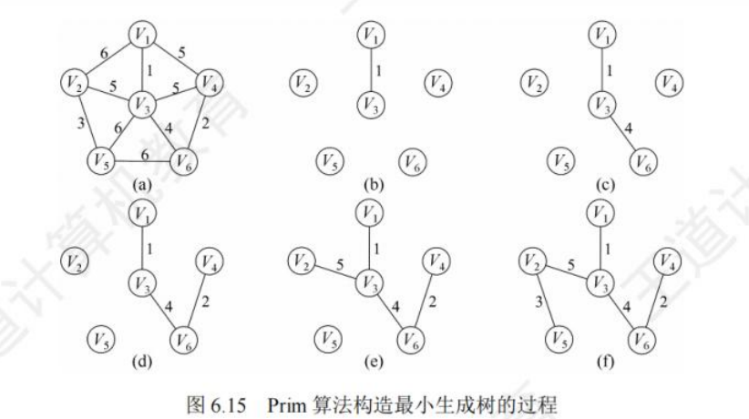
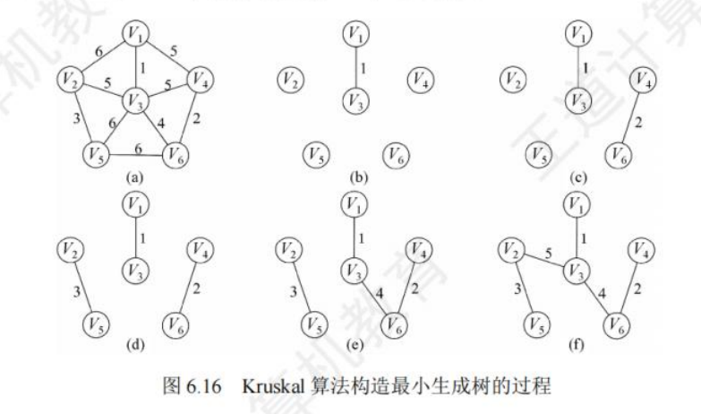
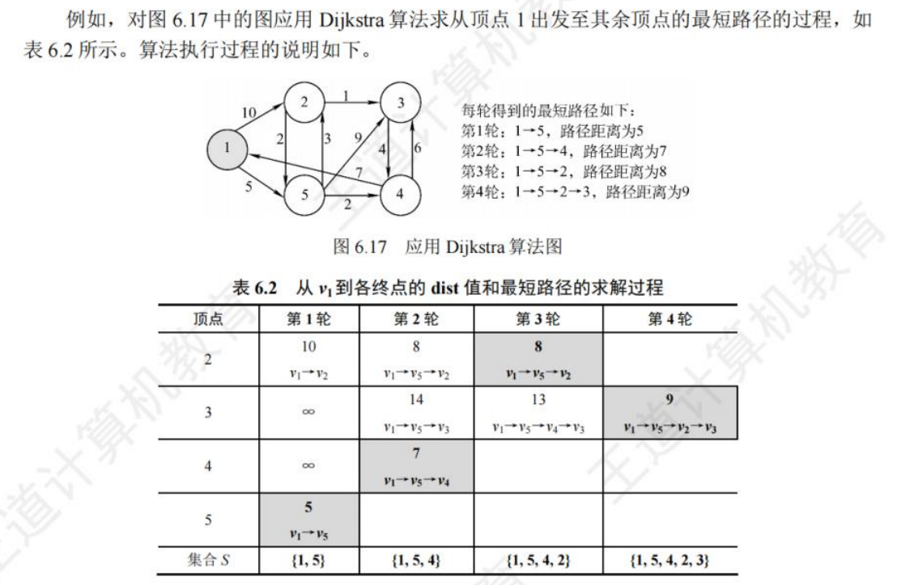
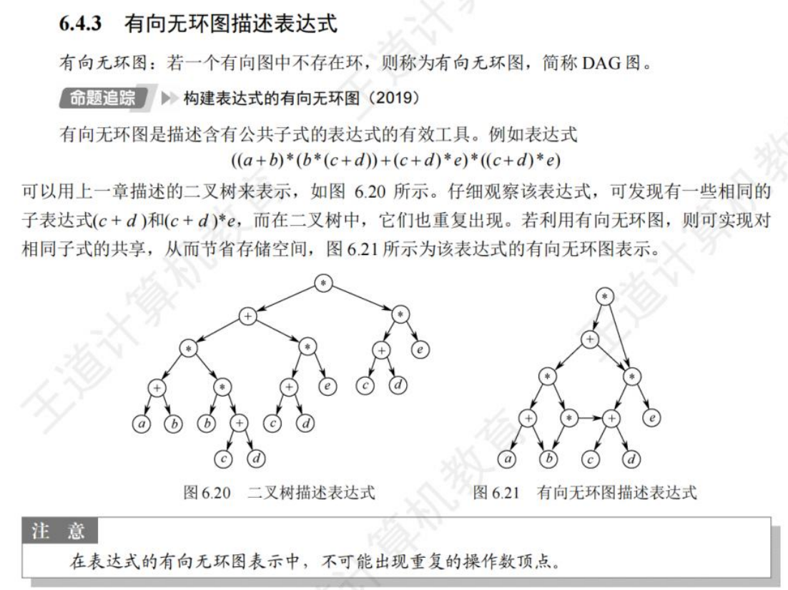
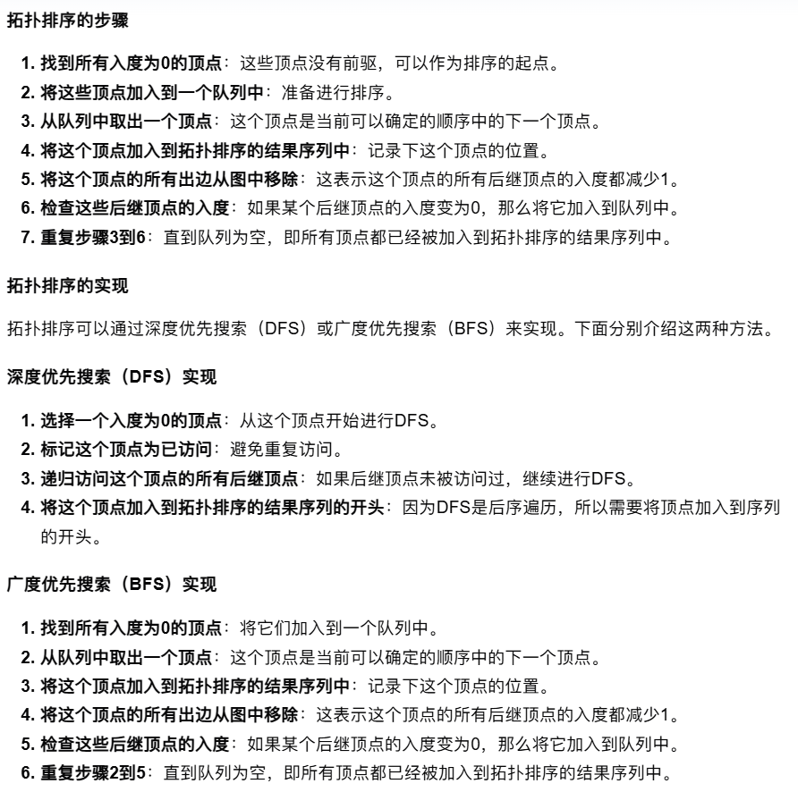
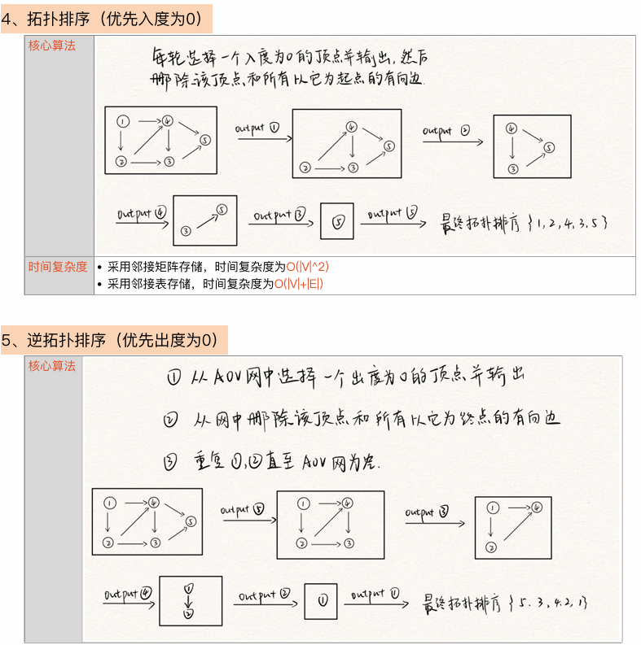
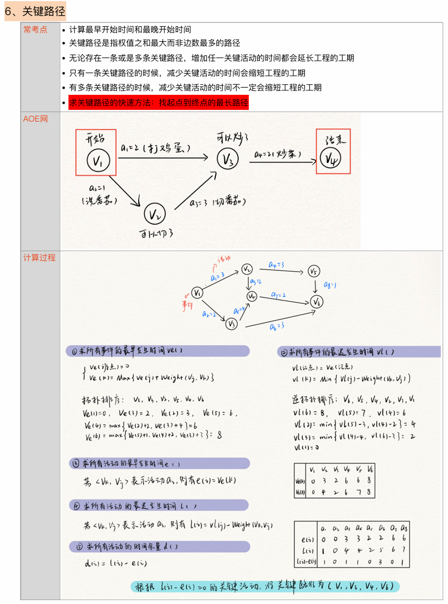

## 图的基本概念

### 图的定义

&nbsp;&nbsp;&nbsp;&nbsp;由顶点集$V$和边集$E$组成，记为$G=(V,E)$，$V(G)$表示图G中顶点的有限非空集合；$E(G)$表示图G中顶点之间的关系（边）集合，$|V|$表示顶点个数，$|G|$表示边的条数。

- 有向图：$E$为有向边的有限集合，$E_1=(<1,2>,<2,1>,<2,3>)$

- 无向图：$E$为无向边的有限集合,$E_2=((1,2),(1,3),(2,3))$

- 简单图：不存在重复边

- 完全图（简单完全图）：无向图中任意两个顶点之间存在边，有向图中任意两个顶点之间都存在方向相反的两条弧

- 子图：两个图G=(V,E)和G'=(V',E'),V'是V的子集，E'是E的子集，则称G'是G的组图。若有满足V(G')=V(G)的子图G',则称其为G的生成子图。

- 连通：无向图中，若从顶点v到顶点w有路径存在，则称v和w是连通的

- 连通图：若图G中任意两个顶点都是连通的，则称图G为连通图，否则称为非连通图。

- 连通分量：无向图中的极大连通子图称为**连通分量**

- 强连通图：在有向图中，若有一对顶点v和"，从v到w和从w到v之间都有路径，则称这两个顶点是强连通的。若图中任意一对顶点都是强连通的，则称此图为强连通图。

- 强连通分量：有向图中的极大强连通子图称为有向图的强连通分量。

- 生成树：生成树是包含图中全部顶点的一个极小连通子图，若图中顶点数n，则它的生成树含有n-1条边。
	> 对生成树而言，若砍去它的一条边，则会变成非连通图，若加上一条边则会形成一个回路。
	>
	> 在非连通图中，连通分量的生成树构成了非连通图的生成森林。
	
- 度：顶点的度是指依附于顶点的边的条数，记为TD(v),无向图的全部顶点的度之和等于边数的两倍。

- 出度，入度：入度是以顶点v为终点的有向边的数目，记为ID(v)；出度是以顶点v为起点的有向边数目，记为OD(v)

- 边的权和网：在一个图中，每条边都可以标上具有某种含义的数值，该数值称为该边的权值。这种边上带有权值的图称为带权图，也称网。

- 稀疏，稠密：边数很少的图称为稀疏图，反之称为稠密图。
    > 一般当图 G满足|E|<|V|log|V|时，可以将 G视为稀疏图。
    
- 路径：指的是从一个顶点到另一个顶点的指顶点序列，路径上的边的数目称为**路径长度**，起点终点相同的路径称为回路或环。

    > 若一个图有n个顶点，且有大于n-1条边，则此图一定有环。

- 简单路径/回路：在路径序列中，顶点不重复出现的路径称为简单路径。除第一个顶点和最后一个顶点外，其余顶点不重复出现的回路称为简单回路。
- 距离：从顶点u出发到顶点v的最短路径若存在，则此路径的长度称为从u到v的距离。，若不存在路径，则记该距离为无穷。
- 有向树：一个顶点的入度为0、其余顶点的入度均为1的有向图

## 图的存储及基本操作

### 邻接矩阵法

&nbsp;&nbsp;&nbsp;&nbsp;用一个一维数组存储图中顶点的信息，用一个二维数组存储图中边的信息(即各顶点之间的邻接关系)，存储顶点之间邻接关系的二维数组称为邻接矩阵。


邻接矩阵存储结构定义：

```cpp
#define MaxVertexNum 100
typedef char VertexType;
typedef int EdgeType;
typedef struct 
{
    VertexType vex[MaxVertexNum];
    EdgeType edge[MaxVertexNum][MaxVertexNum];
    int vexnum, arcnum;
} MGraph;
```

邻接矩阵特点：

- 无向图的邻接矩阵必是一个对称矩阵（并且唯一），因此可以直接存上三角或下三角矩阵。
- 对于无向图，邻接矩阵第i行/列的非零元素个数为顶点i的度TD(vi)
- 对于有向图，邻接矩阵第i行的非零元素个数为顶点i的出度OD(vi)；邻接矩阵第i列的非零元素个数为顶点i的入度ID(vi)

### 邻接表法

&nbsp;&nbsp;&nbsp;&nbsp;对图G的每个顶点$v_i$建立一个单链表，第i个单链表的结点表示依附于顶点$v_i$边（对于有向图则是以顶点$v_i$为尾的弧)），该单链表就称为顶点$v_i$的边表(对于有向图则称为出边表)。边表的头指针和顶点的数据信息采用顺序存储，称为顶点表

&nbsp;&nbsp;&nbsp;&nbsp;data存储顶点$v_i$的相关信息，边表头指针域指向第一条边的边表结点；边表的邻接点域存储与头结点顶点$v_i$邻接的顶点编号,指针域指向下一条边的边表结点。


邻接表存储结构定义：

&nbsp;&nbsp;&nbsp;&nbsp;一个数组存着该图的所有结点，每一个元素都为一个数组，存着以该结点为头的顶点表于边表结点

```cpp
#define MaxvertexNum 100
typedef char VertexType;
//边表结点
typedef struct ArcNode
{
    int adjvex;
    int info;//网的边权值
    struct ArcNode *nextarc;
} ArcNode;
//顶点表结点
typedef struct VNode
{
    int data;
    ArcNode *firstarc;
} VNode,AdjList[MaxvertexNum];
//图
typedef struct
{
    AdjList vertices;//邻接表
    int vexnum, arcnum;//图的顶点数和弧度
} ALGraph;
```

邻接表的特点：

- 若G为无向图，则所需的存储空间为$O(|V|+2|E|)$,每条边在邻接表中出现了两次；
- 若G为有向图，则所需的存储空间为$O(|V|+|E|)$；

### 十字链表

&nbsp;&nbsp;&nbsp;&nbsp;是有向图的一种链式存储结构

### 邻接多重表

### 图的基本操作

## 图的遍历

### 广度优先搜索

基本思想：

&nbsp;&nbsp;&nbsp;&nbsp;按数组顺序先遍历第一个元素，遍历其顶点表与边表，若没遍历过加入队列，若该元素完全遍历后，弹出队首元素遍历与其对应的顶点表与边表

代码实现：

```cpp
#include <bits/stdc++.h>
using namespace std;
#define M 100		    	/*图的最大顶点数*/
typedef char VertexType;    /*顶点信息数据类型*/
typedef struct ArcNode{     /*边表结点*/
	int adjvex;  // 邻接顶点在顶点数组中的索引
	int info;    // 边的权值或其他信息
	struct ArcNode *nextarc;//指向下一个边表结点的指针
}ArcNode;

typedef struct Vnode{       /*头结点类型*/
	VertexType data;        /*顶点信息*/
	ArcNode *firstarc;      /*邻接链表头指针*/
}Vnode;

typedef struct{           /*邻接表类型*/
	Vnode Vertex[M];      /*存放头结点的顺序表*/
	int numV,numE;        /*图的顶点数与边数*/
}AdjList;
/* 函数功能：广度优先搜索（BFS） */
void bfs(AdjList G, int start)
{
    bool visited[M] = {false}; // 访问标记数组
    queue<int> q; // 队列

    // 初始化
    visited[start] = true;
    q.push(start);

    while (!q.empty())
    {
        int v = q.front();
        q.pop();
        printf("%c ", G.Vertex[v].data);

        // 遍历邻接链表
        ArcNode* p = G.Vertex[v].firstarc;
        while (p != nullptr)
        {
            if (!visited[p->adjvex])
            {
                visited[p->adjvex] = true;
                q.push(p->adjvex);
            }
            p = p->nextarc;
        }
    }
}
```

性能分析：

- 空间复杂度分析：需借助一个辅助队列，最坏情况为O(|V|)

    > 采用邻接表存储时，每个顶点均需搜索(或入队)一次，时间复杂度为O(|V|)，在搜索每个顶点的邻接点时，每条边至少访问一次，时间复杂度为 O(|E|)，总的时间复杂度为 O(|V|+|E|)
    >
    > 采用邻接矩阵存储时，查找每个顶点的邻接点所需的时间为 O(|V|)，总时间复杂度为 O(|V|²)。

BFS求解单源最短路径问题：

&nbsp;&nbsp;&nbsp;&nbsp;在原有bfs的基础上，新增一个数组记录权值，当第一次遍历到或者权值小于原记录的权值时，将新权值与旧权值进行比较取min，新全值为当前顶点表+连到这一结点边的权值

```cpp
/* 函数功能：广度优先搜索（BFS）求带权值的单源最短路径 */
void bfs_shortest_path(AdjList G, int start)
{
    vector<bool> visited(G.numV, false); // 访问标记数组
    vector<int> distance(G.numV, INT_MAX); // 距离数组，初始化为无穷大
    queue<int> q; // 队列

    // 初始化
    visited[start] = true;
    distance[start] = 0;
    q.push(start);

    while (!q.empty())
    {
        int v = q.front();
        q.pop();

        // 遍历邻接链表
        ArcNode* p = G.Vertex[v].firstarc;
        while (p != nullptr)
        {
            if (!visited[p->adjvex] || distance[v] + p->info < distance[p->adjvex])
            {
                visited[p->adjvex] = true;
                distance[p->adjvex] = min(distance[p->adjvex], distance[v] + p->info);
                q.push(p->adjvex);
            }
            p = p->nextarc;
        }
    }

    // 输出从起始顶点到每个顶点的最短路径长度
    cout << "从起始顶点 " << G.Vertex[start].data << " 到各顶点的最短路径长度：" << endl;
    for (int i = 0; i < G.numV; i++)
    {
        cout << "到顶点 " << G.Vertex[i].data << " 的最短路径长度为：" << distance[i] << endl;
    }
}
```

广度优先生成树：

&nbsp;&nbsp;&nbsp;&nbsp;通过广度优先遍历，我们可以得到一棵遍历树，称为广度优先生成树。

> 基于邻接表存储生成的树是不唯一的


### 深度优先搜索

&nbsp;&nbsp;&nbsp;&nbsp;类似于树的先序遍历，尽可能的深。

基本思想：
&nbsp;&nbsp;&nbsp;&nbsp;从第一个头结点开始，寻找其边表结点，在找到以该边表结点为头结点的邻接表，依次向下递归，直到遍历完全部元素。

代码实现：

**递归实现**：

```cpp
#include <bits/stdc++.h>
using namespace std;
#define M 100		    	/*图的最大顶点数*/
typedef char VertexType;    /*顶点信息数据类型*/
typedef struct ArcNode{     /*边表结点*/
	int adjvex;  // 邻接顶点在顶点数组中的索引
	int info;    // 边的权值或其他信息
	struct ArcNode *nextarc;//指向下一个边表结点的指针
}ArcNode;

typedef struct Vnode{       /*头结点类型*/
	VertexType data;        /*顶点信息*/
	ArcNode *firstarc;      /*邻接链表头指针*/
}Vnode;

typedef struct{           /*邻接表类型*/
	Vnode Vertex[M];      /*存放头结点的顺序表*/
	int numV,numE;        /*图的顶点数与边数*/
}AdjList;
/* 函数功能：递归实现深度优先搜索（DFS） */
void dfs_recursive(const AdjList &G, int v, vector<bool> &visited)
{
    visited[v] = true;
    cout << G.Vertex[v].data << " ";

    ArcNode* p = G.Vertex[v].firstarc;
    while (p != nullptr)
    {
        if (!visited[p->adjvex])
        {
            dfs_recursive(G, p->adjvex, visited);
        }
        p = p->nextarc;
    }
}

/* 函数功能：深度优先搜索（DFS）入口函数 */
void dfs(const AdjList &G, int start)
{
    vector<bool> visited(G.numV, false); // 访问标记数组
    dfs_recursive(G, start, visited);
}
```

**非递归实现**：

```cpp
/* 函数功能：深度优先搜索（DFS） */
void dfs(const AdjList &G, int start)
{
    vector<bool> visited(G.numV, false); // 访问标记数组
    stack<int> s; // 栈

    // 初始化
    s.push(start);

    while (!s.empty())
    {
        int v = s.top();
        s.pop();

        if (!visited[v])
        {
            visited[v] = true;
            cout << G.Vertex[v].data << " ";

            // 遍历邻接链表
            ArcNode* p = G.Vertex[v].firstarc;
            while (p != nullptr)
            {
                if (!visited[p->adjvex])
                {
                    s.push(p->adjvex);
                }
                p = p->nextarc;
            }
        }
    }
}
```

&nbsp;&nbsp;&nbsp;&nbsp;其空间复杂度为O(|V|)，采用邻接矩阵存储时，时间复杂度为O(|V|²)，采用邻接表存储时，时间复杂度为O(|V|+|E|)

深度优先生成树：

&nbsp;&nbsp;&nbsp;&nbsp;对连通图调用DFS才能产生深度优先生成树，否则产生的时深度优先森林。

> 基于邻接表存储生成的树是不唯一的


### 图的遍历与连通性


## 图的应用

### 最小生成树

&nbsp;&nbsp;&nbsp;&nbsp;生成树：包含所有的顶点，只含尽可能少的边，生成树少一条边为非连通图，多一条边形成回路。

&nbsp;&nbsp;&nbsp;&nbsp;对于一个带权的无向连通图，权值和最小的生成树位最小生成树

性质：

- 若存在权值相同的边，则最小生成树可能不唯一，权值都不相同 ，则最小生成树是唯一的
- 当最小生成树不唯一时，其对应的边的权值之和是唯一的
- 最小生成树的变数为顶点数-1

#### prim算法（不常用，常用k）：

算法过程：

1. 解锁点的集合为set，解锁边的集合为heap（小根堆），初始都为空
2. 从给定点开始，开始点加入到set，开始点的所有边加入到heap
3. 从heap中弹出权值最小的边e，查看该边的另一结点x
4. 若x已在set内，舍弃e，重复步骤三
5. 若x不在set内，把x加入set，x的所有边加入heap重复步骤三
6. 当heap为空停止，得到最小生成树


代码实现：

```cpp
#include <bits/stdc++.h>
using namespace std;
#define M 100		    	/*图的最大顶点数*/
typedef char VertexType;    /*顶点信息数据类型*/
typedef struct ArcNode{     /*边表结点*/
	int adjvex;  // 邻接顶点在顶点数组中的索引
	int info;    // 边的权值或其他信息
	struct ArcNode *nextarc;//指向下一个边表结点的指针
}ArcNode;

typedef struct Vnode{       /*头结点类型*/
	VertexType data;        /*顶点信息*/
	ArcNode *firstarc;      /*邻接链表头指针*/
}Vnode;

typedef struct{           /*邻接表类型*/
	Vnode Vertex[M];      /*存放头结点的顺序表*/
	int numV,numE;        /*图的顶点数与边数*/
}AdjList;

/* 函数功能：Prim 算法求最小生成树 */
void prim(const AdjList &G, int start)
{
    vector<int> lowcost(G.numV, INT_MAX); // 记录每个顶点到生成树的最小边权值
    vector<int> mst(G.numV, -1); // 记录最小生成树
    vector<bool> inMST(G.numV, false); // 记录顶点是否在生成树中

    lowcost[start] = 0;

    for (int i = 0; i < G.numV; ++i)
    {
        int u = -1;
        int minCost = INT_MAX;

        // 找到不在生成树中且具有最小边权值的顶点
        for (int j = 0; j < G.numV; ++j)
        {
            if (!inMST[j] && lowcost[j] < minCost)
            {
                u = j;
                minCost = lowcost[j];
            }
        }

        if (u == -1)
            break;

        inMST[u] = true;

        // 更新相邻顶点的最小边权值
        ArcNode* p = G.Vertex[u].firstarc;
        while (p != nullptr)
        {
            int v = p->adjvex;
            if (!inMST[v] && p->info < lowcost[v])
            {
                lowcost[v] = p->info;
                mst[v] = u;
            }
            p = p->nextarc;
        }
    }

    // 输出最小生成树
    cout << "最小生成树的边：" << endl;
    for (int i = 0; i < G.numV; ++i)
    {
        if (mst[i] != -1)
        {
            cout << G.Vertex[mst[i]].data << " - " << G.Vertex[i].data << " 权值：" << lowcost[i] << endl;
        }
    }
}
```

#### Kruskal算法：

算法过程：

- 把所有边根据权值大小进行排序，从权值小的边开始考虑
- 如果连接当前的边不会形成环，就选当前的边。否则就不选择 
- 当边数为`n-1`时，便可得到最小生成树。

代码实现：

并查集实现

```cpp
#include <bits/stdc++.h>
using namespace std;
#define M 100		    	/*图的最大顶点数*/
typedef char VertexType;    /*顶点信息数据类型*/
typedef struct ArcNode{     /*边表结点*/
	int adjvex;  // 邻接顶点在顶点数组中的索引
	int info;    // 边的权值或其他信息
	struct ArcNode *nextarc;//指向下一个边表结点的指针
}ArcNode;

typedef struct Vnode{       /*头结点类型*/
	VertexType data;        /*顶点信息*/
	ArcNode *firstarc;      /*邻接链表头指针*/
}Vnode;

typedef struct{           /*邻接表类型*/
	Vnode Vertex[M];      /*存放头结点的顺序表*/
	int numV,numE;        /*图的顶点数与边数*/
}AdjList;
/* 并查集（Union-Find）数据结构 */
class UnionFind {
public:
    UnionFind(int n) : parent(n), rank(n, 0) {
        for (int i = 0; i < n; ++i) {
            parent[i] = i;
        }
    }

    int find(int x) {
        if (parent[x] != x) {
            parent[x] = find(parent[x]);
        }
        return parent[x];
    }

    void unite(int x, int y) {
        int rootX = find(x);
        int rootY = find(y);
        if (rootX != rootY) {
            if (rank[rootX] > rank[rootY]) {
                parent[rootY] = rootX;
            } else if (rank[rootX] < rank[rootY]) {
                parent[rootX] = rootY;
            } else {
                parent[rootY] = rootX;
                ++rank[rootX];
            }
        }
    }

private:
    vector<int> parent;
    vector<int> rank;
};
/* 函数功能：Kruskal 算法求最小生成树 */
void kruskal(const AdjList &G, const vector<Edge>& edges)
{
    sort(edges.begin(), edges.end());
    UnionFind uf(G.numV);
    vector<Edge> mst;
    int mst_weight = 0;

    for (const auto& edge : edges)
    {
        if (uf.find(edge.u) != uf.find(edge.v))
        {
            uf.unite(edge.u, edge.v);
            mst.push_back(edge);
            mst_weight += edge.weight;
        }
    }

    // 输出最小生成树
    cout << "最小生成树的边：" << endl;
    for (const auto& edge : mst)
    {
        cout << G.Vertex[edge.u].data << " - " << G.Vertex[edge.v].data << " 权值：" << edge.weight << endl;
    }
    cout << "最小生成树的总权值：" << mst_weight << endl;
}
```

### 最短路径

#### Dijkstra算法：

&nbsp;&nbsp;&nbsp;&nbsp;给定一个源点，求解 从源点到每个点的最短路径长度的单源最短路径算法。（边权值不为负数）

算法思想：

1. `distance[i]`表示从源点到i点的最短距离，`visited[i]`表示`i`结点是否从小根堆弹出过；
2. 准备小根堆，存放（x点，源点到x距离）
3. 令`distance[源点]=0`，(源点，0)进入小根堆
4. 从小根堆弹出(u点，源点到u的距离)
5. 若`visited[u]==true`,不做任何处理，重复步骤4
6. 若`visited[u]==false`，令`visited[u]==true`,然后观察u的每一条边，设某边去往`v`,权值 为`w`
7. 若`distance[u]+w<distance[v]`，令`distance[v]=distance[u]+w`,把(v,distance[u]+w)加入小根堆
8. 处理完u的每一条 边后 ，重复步骤4
9. 当小根堆为空后结束,`distance`记录了源点到每一个结点 的最短距离



代码实现：

```cpp

```


#### Floyd算法：

- `distance[i][j]`存放`i`点到`j`点的最短距离
- 通过枚举每个跳板三重for循环寻找`i`到`j`的的最短距离，**跳板要优先枚举**

代码实现：

````cpp
for(int bridge = 0; bridge < n;bridge++){
    for(int i = 0; i < n; i++){
        for(int j = 0; j < n; j++){
            if(distance[i][bridge] != Max_VALUE && distance[briidge][j] != MAX_VALUE && distance[i][j] > distance[i][bridge] + distance[bridge][j]){
                distance[i][j] = distance[i][bridge] + distance[bridge][j];
            }
        }
    }
}
````


### 有向无环图描述表达式



### 拓扑排序（AOV网）

步骤：

1. 从AOV网中选择一个没有前驱（入度为0）的顶点并输出
2. 从网中删除该顶点和所有以它为起点的有向边
3. 重复1和2直到当前的AOV网为空或当前网中不存在无前驱的顶点位置，后一种情况说明有向图的中必然存在环。





### 关键路径（AOE网）

&nbsp;&nbsp;&nbsp;&nbsp;在带权有向图中，以顶点表示时间，以有向边表示活动，以边上的权值表示完成该活动的开销（如完成活动所需的时间），称为用边表示活动的网络，简称AOE网

性质：

- 只要在某顶点所代表的事件发生后，从该顶点出发的各有向边所代表的活动才能开始；
- 只要在进入某顶点的各有向边所代表的活动都已结束时，该顶点所代表的事件才能发生

&nbsp;&nbsp;&nbsp;&nbsp;在AOE网中仅有一个入读为0的顶点，为开始顶点（源点），也仅有一个出度为0的顶点，为结束顶点（汇点）。从源点到汇点的所有路径中，具有最大路径长度的路径称为关键路径，关键路径上的活动称为关键活动。

求解过程：

1. 从源点出发，令$v_e(源点)=0$,按拓扑有序求其余顶点的最早发生事件$v_e()$。
2. 从汇点出发，令$v_l(汇点)=v_e(汇点)$,按逆拓扑有序求其余顶点的最迟发生时间$v_l()$。
3. 根据各顶点的$v_e()$值求所有弧的最早开始时间$e()$。
4. 根据各顶点的$v_l()$值求所有弧的最迟开始时间$l()$。
5. 求AOE网中所有活动的差额$d()$,找出所有$d()=0$的活动过程关键路径


