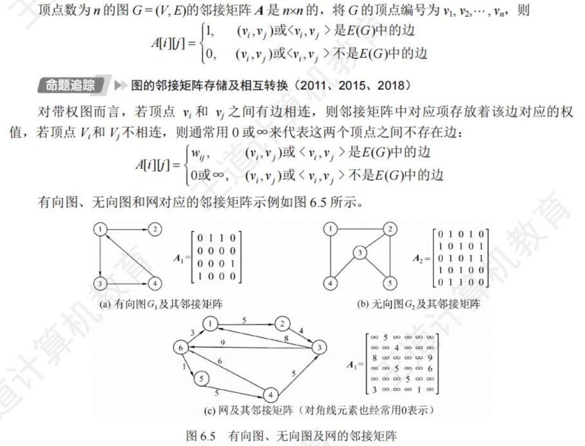
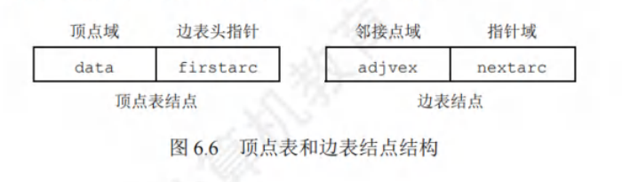
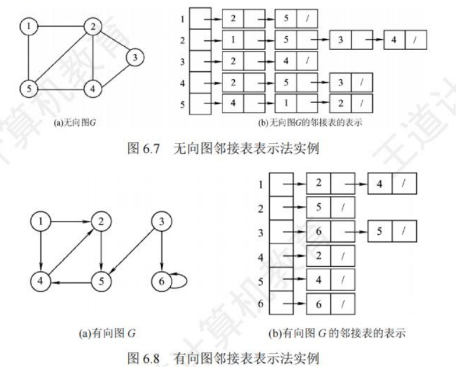
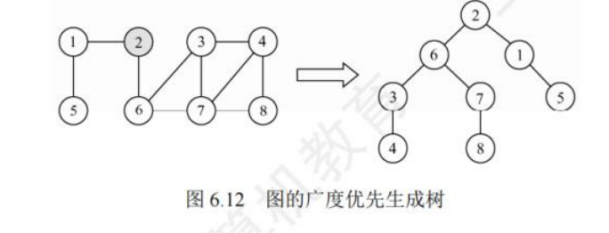
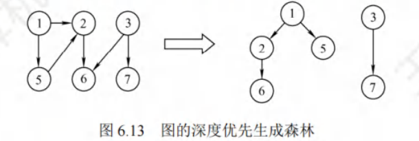
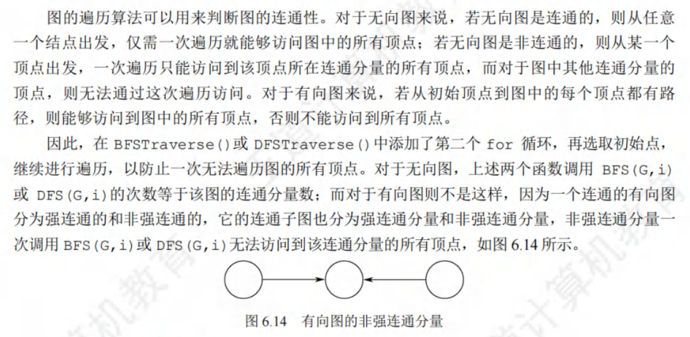

## 图的基本概念

### 图的定义

&nbsp;&nbsp;&nbsp;&nbsp;由顶点集$V$和边集$E$组成，记为$G=(V,E)$，$V(G)$表示图G中顶点的有限非空集合；$E(G)$表示图G中顶点之间的关系（边）集合，$|V|$表示顶点个数，$|G|$表示边的条数。

- 有向图：$E$为有向边的有限集合，$E_1=(<1,2>,<2,1>,<2,3>)$

- 无向图：$E$为无向边的有限集合,$E_2=((1,2),(1,3),(2,3))$

- 简单图：不存在重复边

- 完全图（简单完全图）：无向图中任意两个顶点之间存在边，有向图中任意两个顶点之间都存在方向相反的两条弧

- 子图：两个图G=(V,E)和G'=(V',E'),V'是V的子集，E'是E的子集，则称G'是G的组图。若有满足V(G')=V(G)的子图G',则称其为G的生成子图。

- 连通：无向图中，若从顶点v到顶点w有路径存在，则称v和w是连通的

- 连通图：若图G中任意两个顶点都是连通的，则称图G为连通图，否则称为非连通图。

- 连通分量：无向图中的极大连通子图称为**连通分量**

- 强连通图：在有向图中，若有一对顶点v和"，从v到w和从w到v之间都有路径，则称这两个顶点是强连通的。若图中任意一对顶点都是强连通的，则称此图为强连通图。

- 强连通分量：有向图中的极大强连通子图称为有向图的强连通分量。

- 生成树：生成树是包含图中全部顶点的一个极小连通子图，若图中顶点数n，则它的生成树含有n-1条边。
	> 对生成树而言，若砍去它的一条边，则会变成非连通图，若加上一条边则会形成一个回路。
	>
	> 在非连通图中，连通分量的生成树构成了非连通图的生成森林。
	
- 度：顶点的度是指依附于顶点的边的条数，记为TD(v),无向图的全部顶点的度之和等于边数的两倍。

- 出度，入度：入度是以顶点v为终点的有向边的数目，记为ID(v)；出度是以顶点v为起点的有向边数目，记为OD(v)

- 边的权和网：在一个图中，每条边都可以标上具有某种含义的数值，该数值称为该边的权值。这种边上带有权值的图称为带权图，也称网。

- 稀疏，稠密：边数很少的图称为稀疏图，反之称为稠密图。
    > 一般当图 G满足|E|<|V|log|V|时，可以将 G视为稀疏图。
    
- 路径：指的是从一个顶点到另一个顶点的指顶点序列，路径上的边的数目称为**路径长度**，起点终点相同的路径称为回路或环。

    > 若一个图有n个顶点，且有大于n-1条边，则此图一定有环。

- 简单路径/回路：在路径序列中，顶点不重复出现的路径称为简单路径。除第一个顶点和最后一个顶点外，其余顶点不重复出现的回路称为简单回路。
- 距离：从顶点u出发到顶点v的最短路径若存在，则此路径的长度称为从u到v的距离。，若不存在路径，则记该距离为无穷。
- 有向树：一个顶点的入度为0、其余顶点的入度均为1的有向图

## 图的存储及基本操作

### 邻接矩阵法

&nbsp;&nbsp;&nbsp;&nbsp;用一个一维数组存储图中顶点的信息，用一个二维数组存储图中边的信息(即各顶点之间的邻接关系)，存储顶点之间邻接关系的二维数组称为邻接矩阵。


邻接矩阵存储结构定义：

```cpp
#define MaxVertexNum 100
typedef char VertexType;
typedef int EdgeType;
typedef struct 
{
    VertexType vex[MaxVertexNum];
    EdgeType edge[MaxVertexNum][MaxVertexNum];
    int vexnum, arcnum;
} MGraph;
```

邻接矩阵特点：

- 无向图的邻接矩阵必是一个对称矩阵（并且唯一），因此可以直接存上三角或下三角矩阵。
- 对于无向图，邻接矩阵第i行/列的非零元素个数为顶点i的度TD(vi)
- 对于有向图，邻接矩阵第i行的非零元素个数为顶点i的出度OD(vi)；邻接矩阵第i列的非零元素个数为顶点i的入度ID(vi)

### 邻接表法

&nbsp;&nbsp;&nbsp;&nbsp;对图G的每个顶点$v_i$建立一个单链表，第i个单链表的结点表示依附于顶点$v_i$边（对于有向图则是以顶点$v_i$为尾的弧)），该单链表就称为顶点$v_i$的边表(对于有向图则称为出边表)。边表的头指针和顶点的数据信息采用顺序存储，称为顶点表

&nbsp;&nbsp;&nbsp;&nbsp;data存储顶点$v_i$的相关信息，边表头指针域指向第一条边的边表结点；边表的邻接点域存储与头结点顶点$v_i$邻接的顶点编号,指针域指向下一条边的边表结点。


邻接表存储结构定义：

&nbsp;&nbsp;&nbsp;&nbsp;一个数组存着该图的所有结点，每一个元素都为一个数组，存着以该结点为头的顶点表于边表结点

```cpp
#define MaxvertexNum 100
typedef char VertexType;
//边表结点
typedef struct ArcNode
{
    int adjvex;
    int info;//网的边权值
    struct ArcNode *nextarc;
} ArcNode;
//顶点表结点
typedef struct VNode
{
    int data;
    ArcNode *firstarc;
} VNode,AdjList[MaxvertexNum];
//图
typedef struct
{
    AdjList vertices;//邻接表
    int vexnum, arcnum;//图的顶点数和弧度
} ALGraph;
```

邻接表的特点：

- 若G为无向图，则所需的存储空间为$O(|V|+2|E|)$,每条边在邻接表中出现了两次；
- 若G为有向图，则所需的存储空间为$O(|V|+|E|)$；

### 十字链表

&nbsp;&nbsp;&nbsp;&nbsp;是有向图的一种链式存储结构

### 邻接多重表

### 图的基本操作

## 图的遍历

### 广度优先搜索

基本思想：

&nbsp;&nbsp;&nbsp;&nbsp;按数组顺序先遍历第一个元素，遍历其顶点表与边表，若没遍历过加入队列，若该元素完全遍历后，弹出队首元素遍历与其对应的顶点表与边表

代码实现：

```cpp
#include <bits/stdc++.h>
using namespace std;
#define M 100		    	/*图的最大顶点数*/
typedef char VertexType;    /*顶点信息数据类型*/
typedef struct ArcNode{     /*边表结点*/
	int adjvex;  // 邻接顶点在顶点数组中的索引
	int info;    // 边的权值或其他信息
	struct ArcNode *nextarc;//指向下一个边表结点的指针
}ArcNode;

typedef struct Vnode{       /*头结点类型*/
	VertexType data;        /*顶点信息*/
	ArcNode *firstarc;      /*邻接链表头指针*/
}Vnode;

typedef struct{           /*邻接表类型*/
	Vnode Vertex[M];      /*存放头结点的顺序表*/
	int numV,numE;        /*图的顶点数与边数*/
}AdjList;
/* 函数功能：广度优先搜索（BFS） */
void bfs(AdjList G, int start)
{
    bool visited[M] = {false}; // 访问标记数组
    queue<int> q; // 队列

    // 初始化
    visited[start] = true;
    q.push(start);

    while (!q.empty())
    {
        int v = q.front();
        q.pop();
        printf("%c ", G.Vertex[v].data);

        // 遍历邻接链表
        ArcNode* p = G.Vertex[v].firstarc;
        while (p != nullptr)
        {
            if (!visited[p->adjvex])
            {
                visited[p->adjvex] = true;
                q.push(p->adjvex);
            }
            p = p->nextarc;
        }
    }
}
```

性能分析：

- 空间复杂度分析：需借助一个辅助队列，最坏情况为O(|V|)

    > 采用邻接表存储时，每个顶点均需搜索(或入队)一次，时间复杂度为O(|V|)，在搜索每个顶点的邻接点时，每条边至少访问一次，时间复杂度为 O(|E|)，总的时间复杂度为 O(|V|+|E|)
    >
    > 采用邻接矩阵存储时，查找每个顶点的邻接点所需的时间为 O(|V|)，总时间复杂度为 O(|V|²)。

BFS求解单源最短路径问题：

&nbsp;&nbsp;&nbsp;&nbsp;在原有bfs的基础上，新增一个数组记录权值，当第一次遍历到或者权值小于原记录的权值时，将新权值与旧权值进行比较取min，新全值为当前顶点表+连到这一结点边的权值

```cpp
/* 函数功能：广度优先搜索（BFS）求带权值的单源最短路径 */
void bfs_shortest_path(AdjList G, int start)
{
    vector<bool> visited(G.numV, false); // 访问标记数组
    vector<int> distance(G.numV, INT_MAX); // 距离数组，初始化为无穷大
    queue<int> q; // 队列

    // 初始化
    visited[start] = true;
    distance[start] = 0;
    q.push(start);

    while (!q.empty())
    {
        int v = q.front();
        q.pop();

        // 遍历邻接链表
        ArcNode* p = G.Vertex[v].firstarc;
        while (p != nullptr)
        {
            if (!visited[p->adjvex] || distance[v] + p->info < distance[p->adjvex])
            {
                visited[p->adjvex] = true;
                distance[p->adjvex] = min(distance[p->adjvex], distance[v] + p->info);
                q.push(p->adjvex);
            }
            p = p->nextarc;
        }
    }

    // 输出从起始顶点到每个顶点的最短路径长度
    cout << "从起始顶点 " << G.Vertex[start].data << " 到各顶点的最短路径长度：" << endl;
    for (int i = 0; i < G.numV; i++)
    {
        cout << "到顶点 " << G.Vertex[i].data << " 的最短路径长度为：" << distance[i] << endl;
    }
}
```

广度优先生成树：

&nbsp;&nbsp;&nbsp;&nbsp;通过广度优先遍历，我们可以得到一棵遍历树，称为广度优先生成树。

> 基于邻接表存储生成的树是不唯一的



### 深度优先搜索

&nbsp;&nbsp;&nbsp;&nbsp;类似于树的先序遍历，尽可能的深。

基本思想：
&nbsp;&nbsp;&nbsp;&nbsp;从第一个头结点开始，寻找其边表结点，在找到以该边表结点为头结点的邻接表，依次向下递归，直到遍历完全部元素。

代码实现：

**递归实现**：

```cpp
#include <bits/stdc++.h>
using namespace std;
#define M 100		    	/*图的最大顶点数*/
typedef char VertexType;    /*顶点信息数据类型*/
typedef struct ArcNode{     /*边表结点*/
	int adjvex;  // 邻接顶点在顶点数组中的索引
	int info;    // 边的权值或其他信息
	struct ArcNode *nextarc;//指向下一个边表结点的指针
}ArcNode;

typedef struct Vnode{       /*头结点类型*/
	VertexType data;        /*顶点信息*/
	ArcNode *firstarc;      /*邻接链表头指针*/
}Vnode;

typedef struct{           /*邻接表类型*/
	Vnode Vertex[M];      /*存放头结点的顺序表*/
	int numV,numE;        /*图的顶点数与边数*/
}AdjList;
/* 函数功能：递归实现深度优先搜索（DFS） */
void dfs_recursive(const AdjList &G, int v, vector<bool> &visited)
{
    visited[v] = true;
    cout << G.Vertex[v].data << " ";

    ArcNode* p = G.Vertex[v].firstarc;
    while (p != nullptr)
    {
        if (!visited[p->adjvex])
        {
            dfs_recursive(G, p->adjvex, visited);
        }
        p = p->nextarc;
    }
}

/* 函数功能：深度优先搜索（DFS）入口函数 */
void dfs(const AdjList &G, int start)
{
    vector<bool> visited(G.numV, false); // 访问标记数组
    dfs_recursive(G, start, visited);
}
```

**非递归实现**：

```cpp
/* 函数功能：深度优先搜索（DFS） */
void dfs(const AdjList &G, int start)
{
    vector<bool> visited(G.numV, false); // 访问标记数组
    stack<int> s; // 栈

    // 初始化
    s.push(start);

    while (!s.empty())
    {
        int v = s.top();
        s.pop();

        if (!visited[v])
        {
            visited[v] = true;
            cout << G.Vertex[v].data << " ";

            // 遍历邻接链表
            ArcNode* p = G.Vertex[v].firstarc;
            while (p != nullptr)
            {
                if (!visited[p->adjvex])
                {
                    s.push(p->adjvex);
                }
                p = p->nextarc;
            }
        }
    }
}
```

&nbsp;&nbsp;&nbsp;&nbsp;其空间复杂度为O(|V|)，采用邻接矩阵存储时，时间复杂度为O(|V|²)，采用邻接表存储时，时间复杂度为O(|V|+|E|)

深度优先生成树：

&nbsp;&nbsp;&nbsp;&nbsp;对连通图调用DFS才能产生深度优先生成树，否则产生的时深度优先森林。

> 基于邻接表存储生成的树是不唯一的




### 图的遍历与连通性



## 图的应用

### 最小生成树

### 最短路径

### 有向无环图描述表达式

### 拓扑排序

### 关键路径