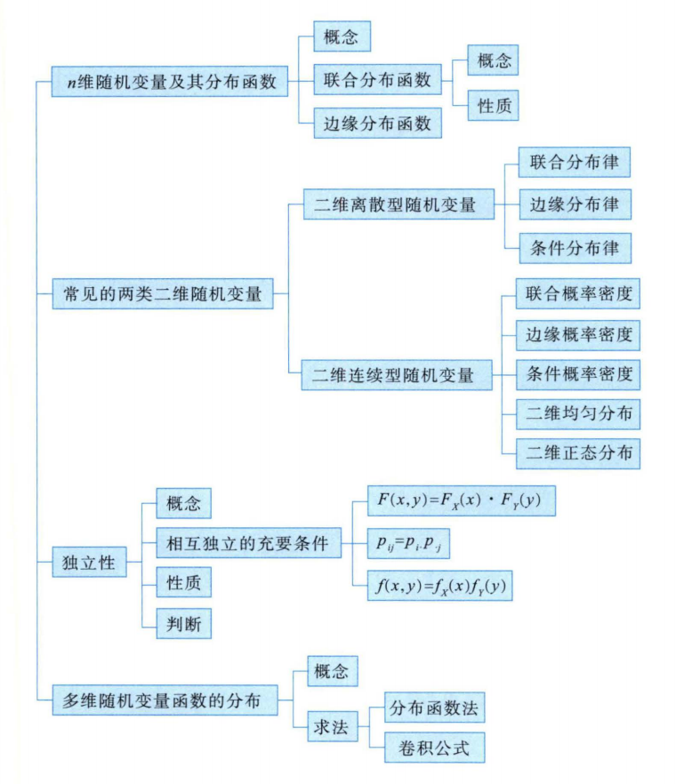

## 知识框架

## n维随机变量及其分布函数

### 概念

&nbsp;&nbsp;&nbsp;&nbsp;将X变为$X_1,X_2,\dots,X_n$，$X_i(i=1,2,\dots,n)$称为第$i$个分量,当$n=2$时，称(X,Y)为二维随机变量或二维随机向量。

&nbsp;&nbsp;&nbsp;&nbsp;对任意的$n$​个实数$x_1,x_2,...,x_n$，称$n$元函数
$$
F(x_1,x_2,\dots,x_n)=P(X_1\leq x_1,X_2\leq x_2,\dots,X_n\leq x_n)
$$
&nbsp;&nbsp;&nbsp;&nbsp;为$n$维随机变量$(X_1,X_2,\dots,X_n)$的分布函数或随机变量$(X_1,X_2,\dots,X_n)$的联合分布函数。

&nbsp;&nbsp;&nbsp;&nbsp;当$n=2$时，对任意的实数$x,y$，称二元函数
$$
F(x,y)=P(X\leq x, Y\leq y)
$$
&nbsp;&nbsp;&nbsp;&nbsp;为二维随机变量$(x,y)$的分布函数或随机变量$X$和$Y$的联合分布函数，记为$(X,Y)\sim F(x,y)$。

### 分布函数性质

**单调性**：$F(x,y)$是$x,y$的单调不减函数：

- 对任意固定的$y$,当$x_1<x_2$时，$F(x_1,y)\leq F(x_2,y)$;
- 对任意固定的$x$,当$y_1<y_2$时，$F(x,y_1)\leq F(x,y_2)$;

**右连续性**：$F(x,y)$是$x,y$的右连续函数：

- $\lim_{x \to x_{0}^{+}} F(x,y) = F(x_0+0,y)=F(x_0,y)$
- $\lim_{y \to y_{0}^{+}} F(x,y) = F(x,y_0+0)=F(x,y_0)$

**有界性**：

- $F(-\infty,y)=F(x,-\infty)=F(-\infty,-\infty)=0$
- $F(+\infty,+\infty)=1$

**非负性**：对于任意的$x_1< x_2,y_1< y_2$,有
$$
P(x_1<X\leq x_2,y_1< Y\leq Y_2)=F(x_2,y_2)-F(x_2,y_1)-F(x_1,y_2)+F(x_1,y_1)\geq 0
$$
边缘分布函数：

&nbsp;&nbsp;&nbsp;&nbsp;设二维随机变量$(X,Y)$的分布函数为$F(x,y)$，随机变量$X$与$Y$的分布函数$F_X(x)$与$F_Y(y)$分别称为$(X,Y)$关于$Y$和$Y$关于的边缘分布函数,由概率性质得
$$
F_X(x)=P(X\leq x)=P(X\leq x,Y<+\infty)=\lim_{y \to+\infty}P(X\leq x,Y\leq y)=\lim_{y \to+\infty}F(x,y)=F(x,+\infty)
$$
&nbsp;&nbsp;&nbsp;&nbsp;同理，有$F_Y(y)=F(+\infty,y)$

### 离散型随机变量

### 连续性随机变量
