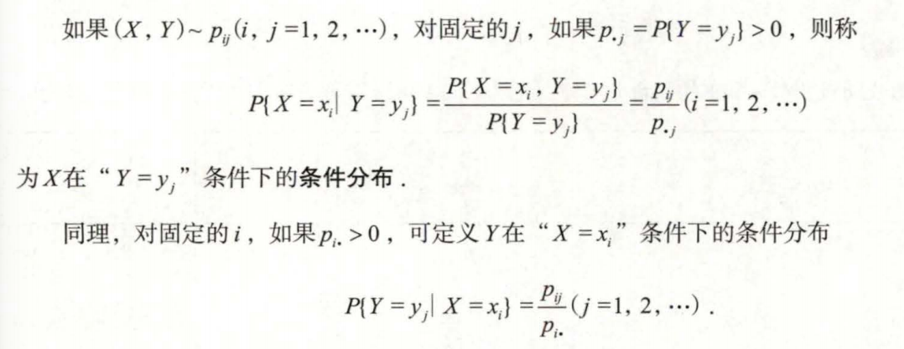

## 知识框架

## n维随机变量及其分布函数

### 概念

&nbsp;&nbsp;&nbsp;&nbsp;将X变为$X_1,X_2,\dots,X_n$，$X_i(i=1,2,\dots,n)$称为第$i$个分量,当$n=2$时，称(X,Y)为二维随机变量或二维随机向量。

&nbsp;&nbsp;&nbsp;&nbsp;对任意的$n$​个实数$x_1,x_2,...,x_n$，称$n$元函数
$$
F(x_1,x_2,\dots,x_n)=P(X_1\leq x_1,X_2\leq x_2,\dots,X_n\leq x_n)
$$
&nbsp;&nbsp;&nbsp;&nbsp;为$n$维随机变量$(X_1,X_2,\dots,X_n)$的分布函数或随机变量$(X_1,X_2,\dots,X_n)$的联合分布函数。

&nbsp;&nbsp;&nbsp;&nbsp;当$n=2$时，对任意的实数$x,y$，称二元函数
$$
F(x,y)=P(X\leq x, Y\leq y)
$$
&nbsp;&nbsp;&nbsp;&nbsp;为二维随机变量$(x,y)$的分布函数或随机变量$X$和$Y$的联合分布函数，记为$(X,Y)\sim F(x,y)$。

### 分布函数性质

**单调性**：$F(x,y)$是$x,y$的单调不减函数：

- 对任意固定的$y$,当$x_1<x_2$时，$F(x_1,y)\leq F(x_2,y)$;
- 对任意固定的$x$,当$y_1<y_2$时，$F(x,y_1)\leq F(x,y_2)$;

**右连续性**：$F(x,y)$是$x,y$的右连续函数：

- $\lim_{x \to x_{0}^{+}} F(x,y) = F(x_0+0,y)=F(x_0,y)$
- $\lim_{y \to y_{0}^{+}} F(x,y) = F(x,y_0+0)=F(x,y_0)$

**有界性**：

- $F(-\infty,y)=F(x,-\infty)=F(-\infty,-\infty)=0$
- $F(+\infty,+\infty)=1$

**非负性**：对于任意的$x_1< x_2,y_1< y_2$,有
$$
P(x_1<X\leq x_2,y_1< Y\leq y_2)=F(x_2,y_2)-F(x_2,y_1)-F(x_1,y_2)+F(x_1,y_1)\geq 0
$$
边缘分布函数：

&nbsp;&nbsp;&nbsp;&nbsp;设二维随机变量$(X,Y)$的分布函数为$F(x,y)$，随机变量$X$与$Y$的分布函数$F_X(x)$与$F_Y(y)$分别称为$(X,Y)$关于$Y$和$Y$关于的边缘分布函数,由概率性质得
$$
F_X(x)=P(X\leq x)=P(X\leq x,Y<+\infty)=\lim_{y \to+\infty}P(X\leq x,Y\leq y)=\lim_{y \to+\infty}F(x,y)=F(x,+\infty)
$$
&nbsp;&nbsp;&nbsp;&nbsp;同理，有$F_Y(y)=F(+\infty,y)$

### 离散型随机变量

&nbsp;&nbsp;&nbsp;&nbsp;二维随机变量$(X,Y)$的可能取值是有限对值或可列无限对值，称$p_{ij}=P(X=x_i,Y=y_i)(i,j=1,2,...)$为$(X,Y)$的分布律或随机变量$X$和$Y$的联合分布律，记为$(X,Y)\sim p_{ij}$,其充分必要条件为:
$$
p_{ij}\geq 0,\sum_{i=1}^{\infty} \sum_{j=1}^{\infty}p_{ij}=1
$$
联合分布函数：

&nbsp;&nbsp;&nbsp;&nbsp;设$(X,Y)$的概率分布为$p_{ij},i,j=1,2,...$,则$(X,Y)$的分布函数函数或$X$和$Y$的联合分布函数为
$$
F(x,y)=P(X\leq x,Y\leq y)=\sum_{x_i\leq x}\sum_{y_i\leq y}p_{ij}
$$
&nbsp;&nbsp;&nbsp;&nbsp;设G是平面上的某个区域，则：
$$
P((X,Y)\in G)=\sum_{(x_i,y_i)\in G}p_{ij}
$$
**边缘分布**：
$$
p_{i*}=p(X=x_i)=\sum_{j=1}^{\infty}P(X=x_i,Y=y_j)=\sum_{j=1}^{\infty}p_{ij}(i=1,2,...)
$$

$$
p_{*j}=p(Y=y_j)=\sum_{i=1}^{\infty}P(X=x_i,Y=y_i)=\sum_{i=1}^{\infty}p_{ij}(j=1,2,...)
$$
**条件分布律**：

### 连续型随机变量

&nbsp;&nbsp;&nbsp;&nbsp;二维随机变量(X,Y)的分布函数可表示为
$$
F(x,y)=\int_{-\infty}^ydv\int_{-\infty}^xf(u,v)du,(x,y)\in R^2
$$
&nbsp;&nbsp;&nbsp;&nbsp;其中f(x,y)为非负可积函数，（X,Y）二维连续性随机变量，f(x,y)为(X,Y)的概率密度，记为$(X,Y)\sim f(x,y)$

&nbsp;&nbsp;&nbsp;&nbsp;f(x,y)为概率密度的充要条件：
$$
f(x,y)\geq 0,\int_{-\infty}^{+\infty}dy\int_{-\infty}^{+\infty}f(x,y)dx=1
$$

性质：

- $F(x,y)=P(X\leq x,Y\leq y)=\int_{-\infty}^ydv\int_{-\infty}^xf(u,v)du$
- 设G为平面上某个区域，则$P((X,Y)\in G)=\int\int_Gf(x,y)dxdy$
- 若f(x,y)在点(x,y)连续，则$\frac{\partial^2 F(x,y)}{\partial x \partial y}=f(x,y)$
- 若F(x,y)连续且可导，则(X,Y)是连续型随机变量，且$\frac{\partial^2 F(x,y)}{\partial x \partial y}$是它的概率密度

边缘分布函数：
$$
F_X(x)=F(x,+\infty)=\int_{-\infty}^x[\int_{-\infty}^{+\infty}f(u,v)dv]du
$$
边缘概率密度：
$$
f_X(x)=\int_{-\infty}^{+\infty}f(x,y)dy
$$
条件概率密度:X在Y=y的条件下的条件分布函数
$$
f_{X|Y}(x|y)=\frac{f(x,y)}{f_X(x)}(f_Y(y)>0)
$$
**二维均匀分布**：
$$
f(x，y) = \begin{cases} 
\frac{1}{S_D} &  (x,y)\in D \\
0 & 其他
\end{cases}
$$
&nbsp;&nbsp;&nbsp;&nbsp;其中$S_D$为区域D的面积，称(X,Y)在平面有界区域D上服从均匀分布

**二维正态分布**：
$$
f(x, y) = \frac{1}{2 \pi \sigma_1 \sigma_2 \sqrt{1 - \rho^2}} \exp \left\{ -\frac{1}{2(1 - \rho^2)} \left[ \left( \frac{x - \mu_1}{\sigma_1} \right)^2 - 2 \rho \left( \frac{x - \mu_1}{\sigma_1} \right) \left( \frac{y - \mu_2}{\sigma_2} \right) + \left( \frac{y - \mu_2}{\sigma_2} \right)^2 \right] \right\}
$$
&nbsp;&nbsp;&nbsp;&nbsp;其中$u_1\in R,u_2\in R,\sigma_1>0,\sigma_2>0,-1<\rho<1$,则称$(X,Y)$服从参数为$u_1,u_2,\sigma_1^2,\sigma_2^2,\rho$的二维正态分布，记为$(X,Y)\sim N(u_1,u_2,\sigma_1^2,\sigma_2^2,\rho)$

若(x,y)相互独立，则$\rho$=0（充要条件）

### 随机变量的相互独立性

&nbsp;&nbsp;&nbsp;&nbsp;设二维随机变量(X,Y)的分布函数为F(x,y)，边缘分布函数分别为$F_X(x),F_Y(y)$，如果对任意的实数x,y都有$F(x,y)=F_X(x)\cdot F_Y(y)$则称X与Y相互独立，否则则称X与Y不相互独立。

相互独立的充要条件：

- 离散型随机变量：联合分布等于边缘分布相乘,适用于某点或某区间。
- 连续型随机变量：概率密度等于边缘概率密度相乘，$f(x,y)=f_X(x)\cdot f_y(Y)$

