## 指令系统

### 指令集体系结构

&nbsp;&nbsp;&nbsp;&nbsp;机器指令是指示计算机执行某种操作的命令。一台计算机的所有指令的集合构成该机的指令系统（指令集）指令系统是指令集体系结构(ISA)中最核心的部分。

&nbsp;&nbsp;&nbsp;&nbsp;ISA规定的内容主要包括：

- 指令格式，指令寻址方式，操作类型，以及每种操作对应的操作数的相应规定。
- 操作数的类型，操作数寻址方式，以及是按大端方式还是按小端方式存放。
- 程序可访问的寄存器编号、个数和位数，存储空间的大小和编址方式。
- 指令执行过程的控制方式等，包括程序计数器、条件码定义等。

### 指令的基本结构

&nbsp;&nbsp;&nbsp;&nbsp;一条指令通常包括操作码字段和地址码字段两部分

| 操作码字段                 | 地址码字段                         |
| -------------------------- | ---------------------------------- |
| 执行什么操作，具有何种功能 | 给出被操作的信息(指令或数据)的地址 |

&nbsp;&nbsp;&nbsp;&nbsp;指令字长：一条指令所包含的二进制代码的位数，取决于操作码、地址码的长度和地址码的个数。

> 与机器字长没有固定关系。
> 单字长指令：指令长度等于机器字长，只需访存一次就能将指令完整取出
> 半字长指令：指令长度等于半个机器字长
> 双字长指令：指令长度等于两个机器字长，需要访存两次才能完整取出，耗费两个存取周期

&nbsp;&nbsp;&nbsp;&nbsp;定长指令字结构：所有指令的长度都是相等的，执行速度快，控制简单

&nbsp;&nbsp;&nbsp;&nbsp;变长指令字结构：各种指令的长度随指令功能而异

> 由于主存一般是按字节编址的，因此指令字长通常为字节的整数倍

根据指令中操作数地址码数目的不同可分为：

1. 零地址指令
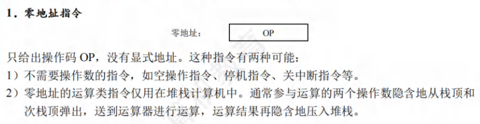
2. 一地址指令
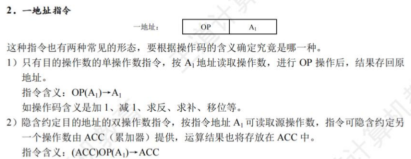
3. 二地址指令
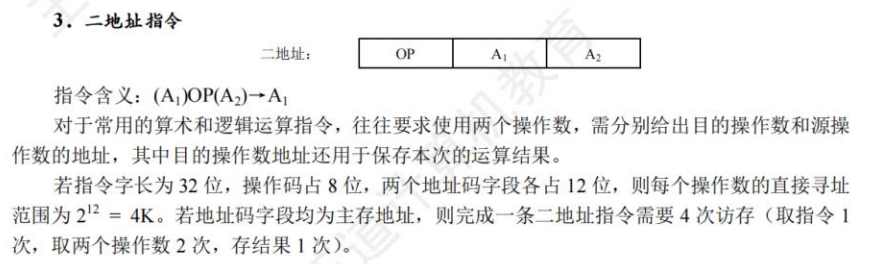
4. 三地址指令
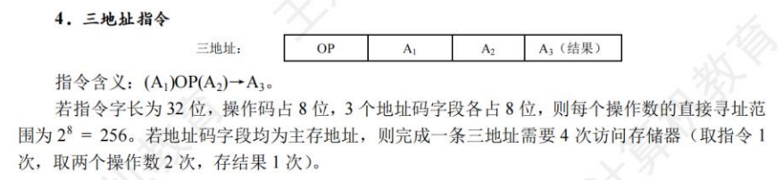
5. 四地址指令
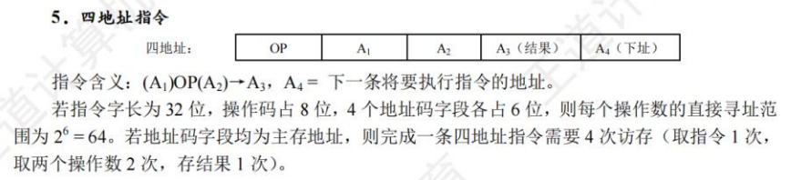

地址位数与寻址关系：
&nbsp;&nbsp;&nbsp;&nbsp;若指令字长为 32位，操作码占8位，1个地址码字段占 24位，则指令操作数的直接寻址范围为 $2^{24}$=16M。若地址码字段均为主存地址，则完成一条一地址指令需要3次访存(取指令1次，取操作数1次，存结果1次)。

### 定长操作码指令格式

&nbsp;&nbsp;&nbsp;&nbsp;定长操作码指令在指令字的最高位部分分配固定的若干位(定长)表示操作码。一般n位操作码字段的指令系统最大能够表示 $2^n$条指令。定长操作码对于简化计算机硬件设计，提高指令译码和识别速度很有利。当计算机字长为32位或更长时，这是常规用法。

### 扩展操作码指令格式

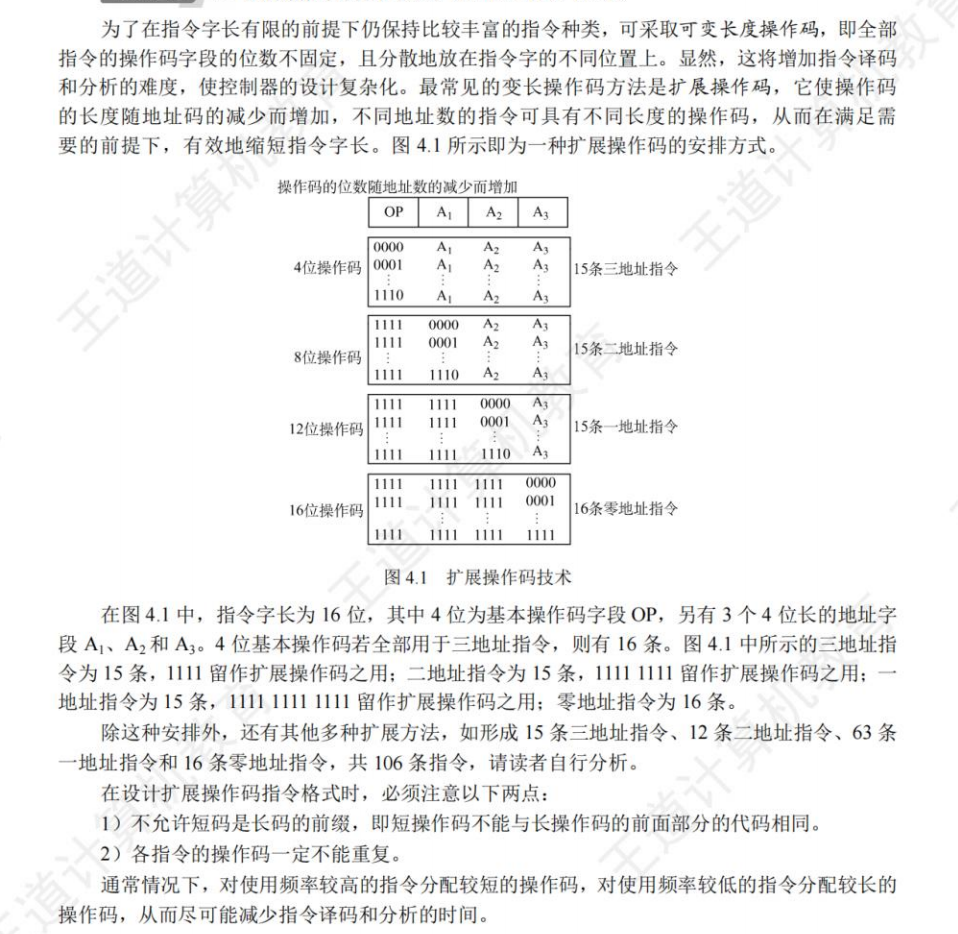

### 指令的操作类型

1. 数据传送：传送指令通常有寄存器之间的传送(MOV)、从内存单元读取数据到CPU寄存器从 CPU 寄存器写数据到内存单元(STORE)、进栈操作(PUSH)、出栈操作(POP)等。

2. 算术和逻辑运算：
3. 移位操作：算术移位、逻辑移位、循环移位等
4. 转移操作：无条件转移(JMP)、条件转移(BRANCH)、调用(CALL)、返回(RET)、陷阱(TRAP)等。
5. 输入输出操作

## 指令的寻址方式

### 指令寻址和数据寻址

&nbsp;&nbsp;&nbsp;&nbsp;寻找下一条将要执行的指令地址称为指令寻址；寻找本条指令的数据地址称为数据寻址

指令寻址：

- 顺序寻址：通过程序计数器PC加1（一条指令长度），自动形成下一条指令的地址。

	> PC自增的大小与编址方式、指令字长有关，现代计算机通常是按字节编址的，若指令字长为 16 位，则 PC自增为(PC)+2（增加两个字节）;若指令字长为 32 位，则PC自增为(PC)+4（增加四个字节）

- 跳跃寻址：通过转移类指令实现。跳跃是指由本条指令给出下条指令地址的计算方式，而是否跳跃可能受到状态寄存器的控制。

    > 跳跃的方式分为绝对转移(地址码直接指出转移目标地址)和相对转移(地址码指出转移目的地址相对于当前 PC值的偏移量)，由于 CPU 总是根据 PC的内容去主存取指令的，因此转移指令执行的结果是修改PC值，下一条指令仍然通过 PC给出。

数据寻址:
&nbsp;&nbsp;&nbsp;&nbsp;如何在指令中表示一个操作数的地址，或怎样计算出操作数的地址。为区别各种方式，通常在指令字中设置一个寻址特征字段，用来指明属于哪种寻址方式(其位数决定了寻址方式的种类)

| 操作码 | 寻址特征 | 形式地址A |
| ------ | -------- | --------- |

&nbsp;&nbsp;&nbsp;&nbsp;指令中的地址码字段并不代表操作数的真实地址，这种地址称为形式地址(A)。形式地址结合寻址方式，可以计算出操作数在存储器中的真实地址，这种地址称为有效地址(EA)。

> A表示A这个地址,(A)表示地址为A里面的内容
>
> EA=A表示形式地址A就是真实地址EA
>
> EA=(A)表示形式地址A的内容是真实地址EA

- 若为立即寻址，则形式地址的位数决定了操作数的范围。
- 若为直接寻址，则形式地址的位数决定了可寻址的范围。
- 若为寄存器寻址，则形式地址的位数决定了通用寄存器的最大数量。
- 若为寄存器间接寻址，则寄存器的位数决定了可寻址的范围。

### 常见数据寻址方式

1. **隐含寻址**
   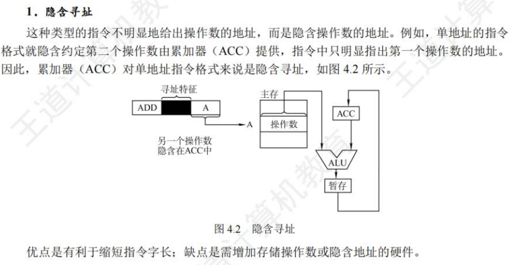
2. **立即(数)寻址**
   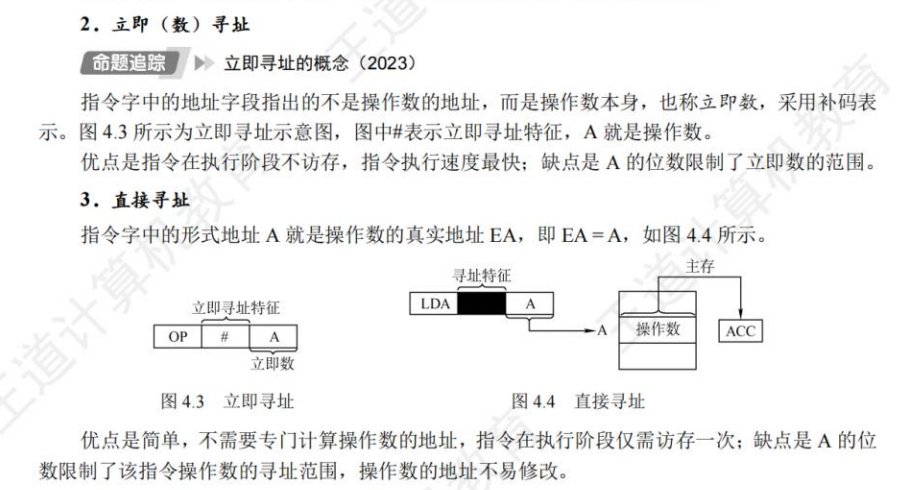
3. **直接寻址**
4. **间接寻址**
   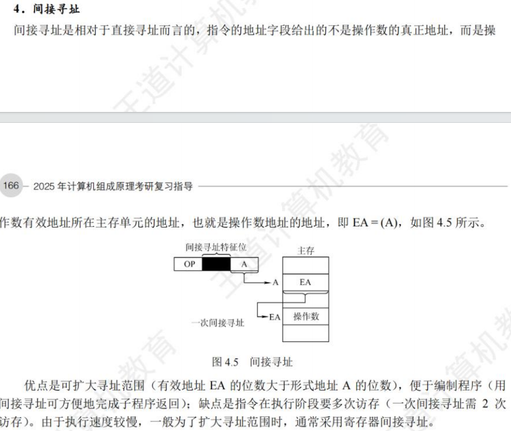
5. **寄存器寻址**
   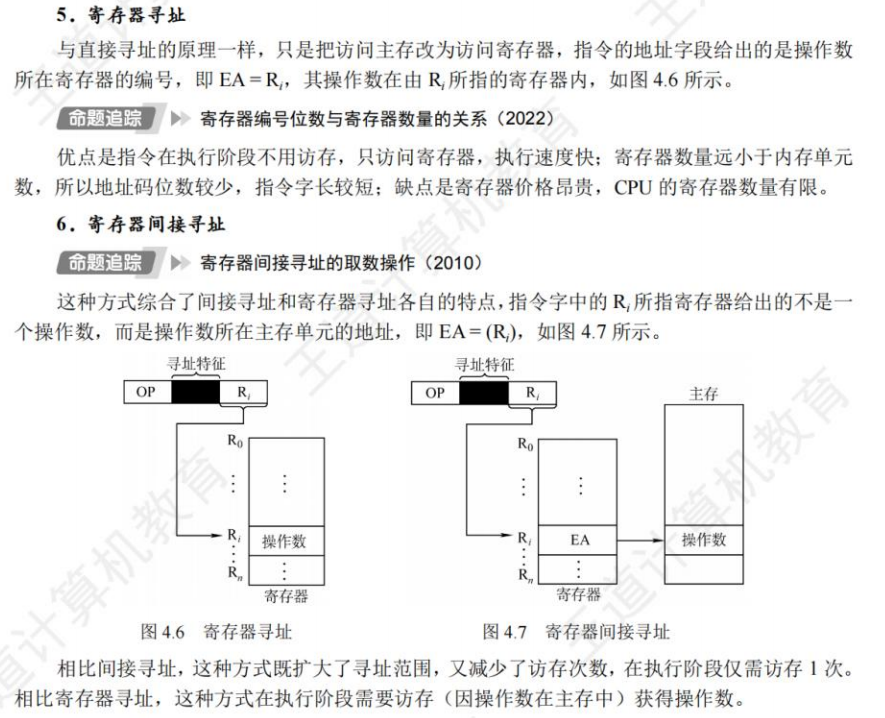
6. **寄存器间接寻址**
7. **相对寻址**
   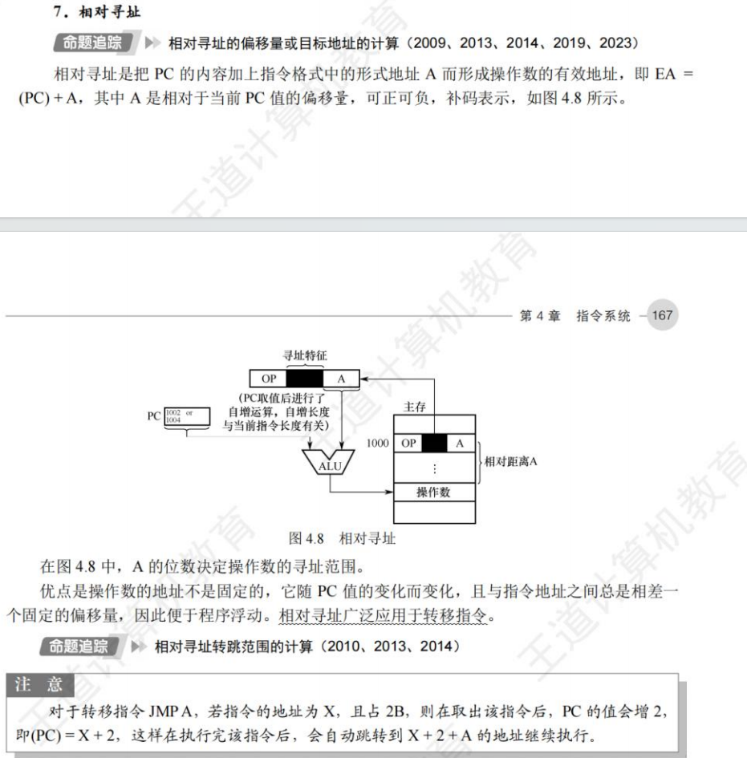
8. **基址寻址**
   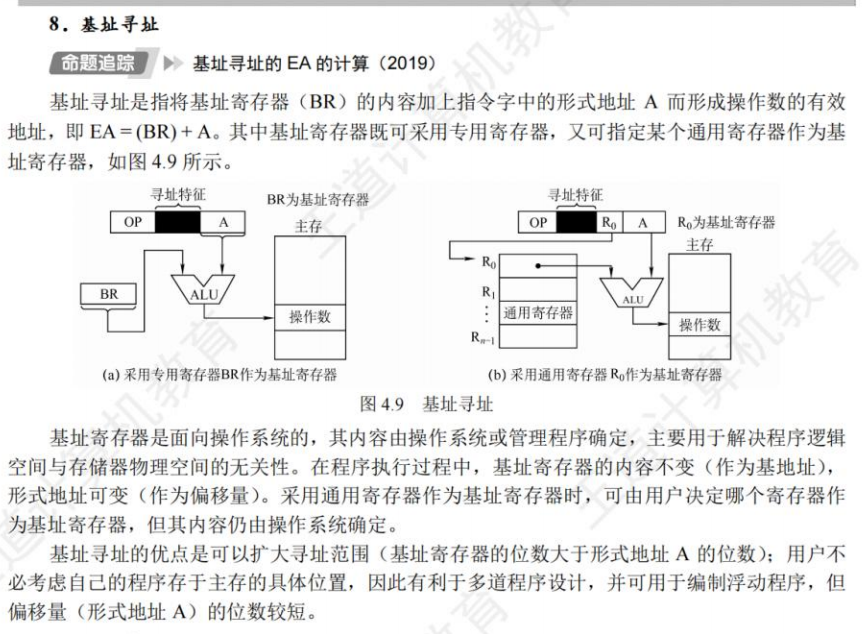
9.  **变址寻址**
    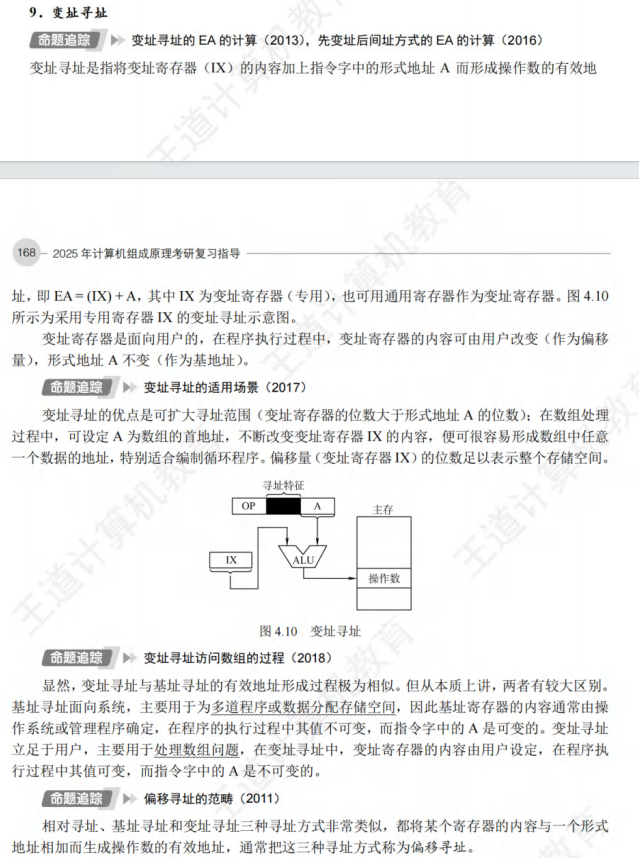
10. **堆栈寻址**
    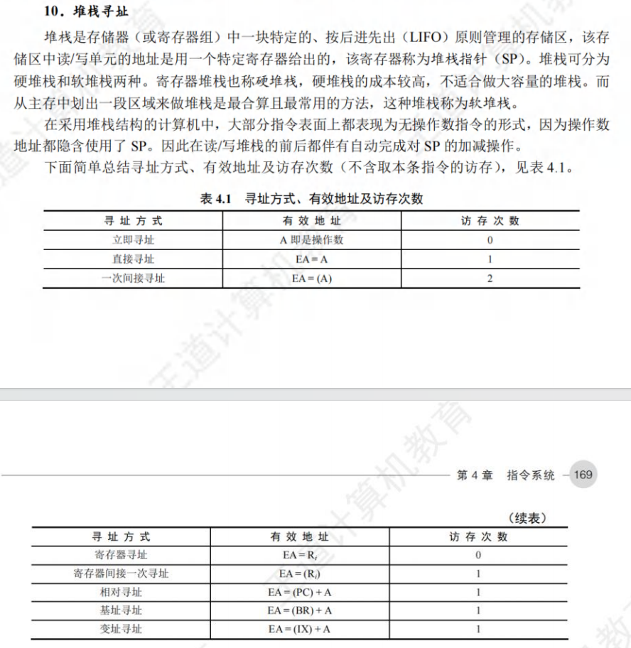

## 程序的机器级代码表示（主要介绍x86汇编指令）

### 常用汇编指令介绍

相关寄存器：

&nbsp;&nbsp;&nbsp;&nbsp;x86处理器中有8个32位的通用寄存器
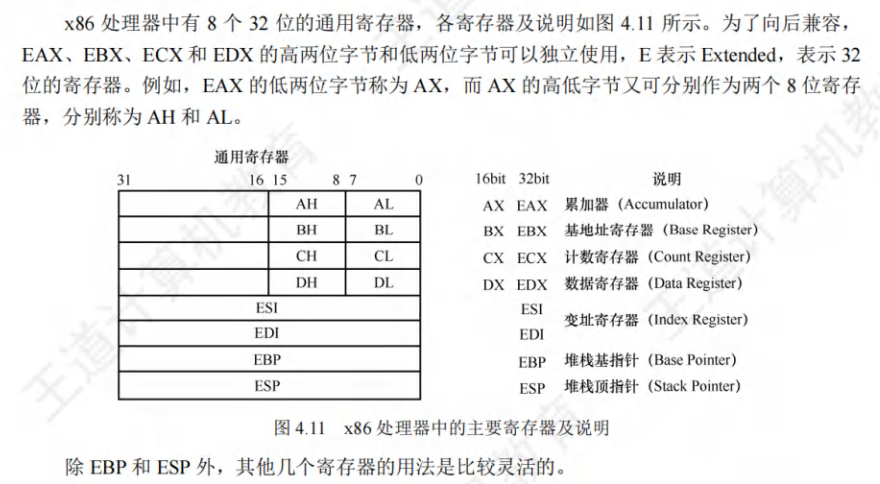

汇编指令格式：

&nbsp;&nbsp;&nbsp;&nbsp;分为AT&T格式和Intel格式

常用指令：
