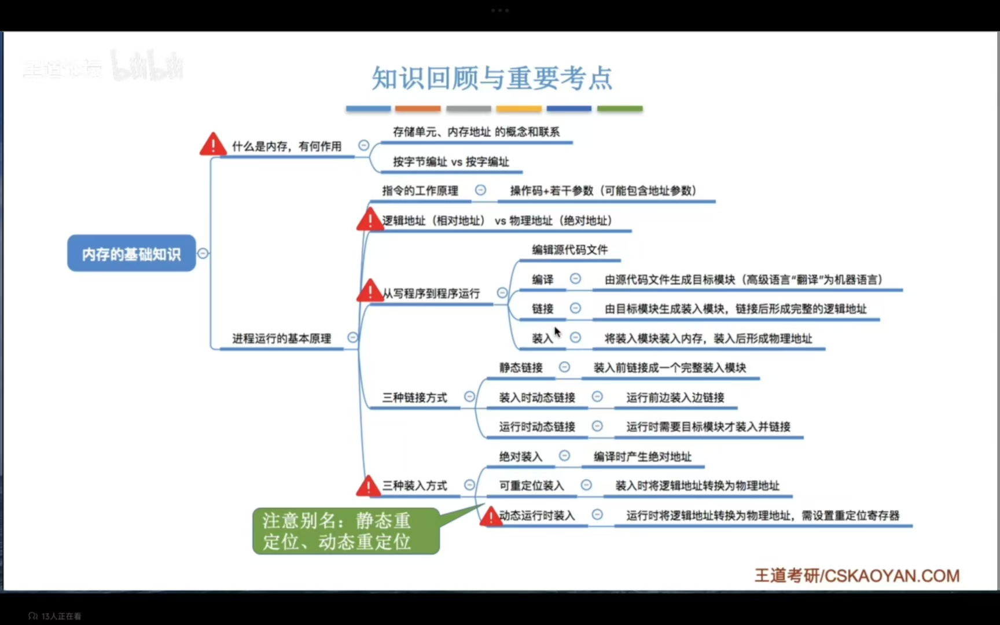
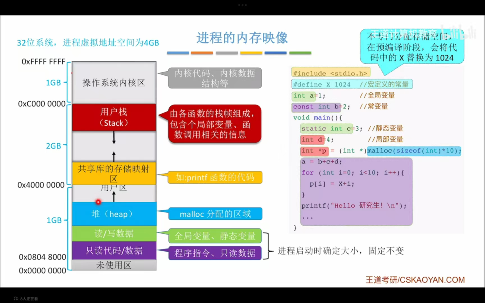
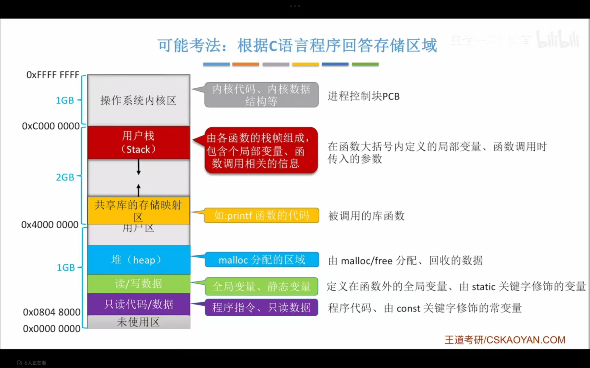
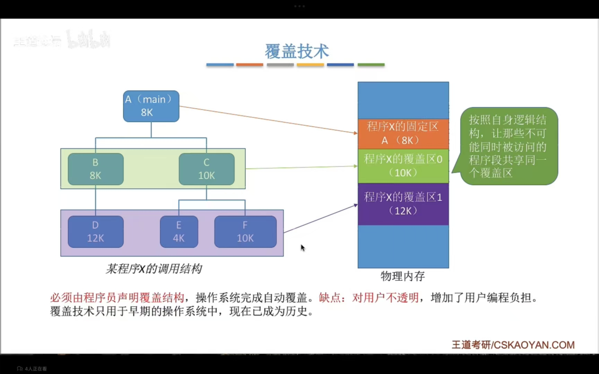
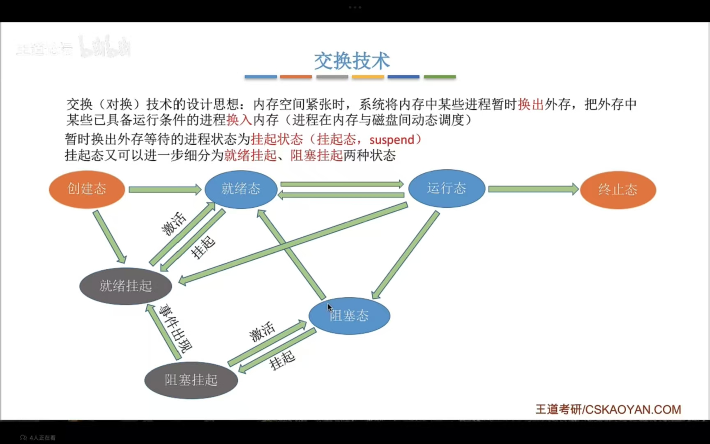
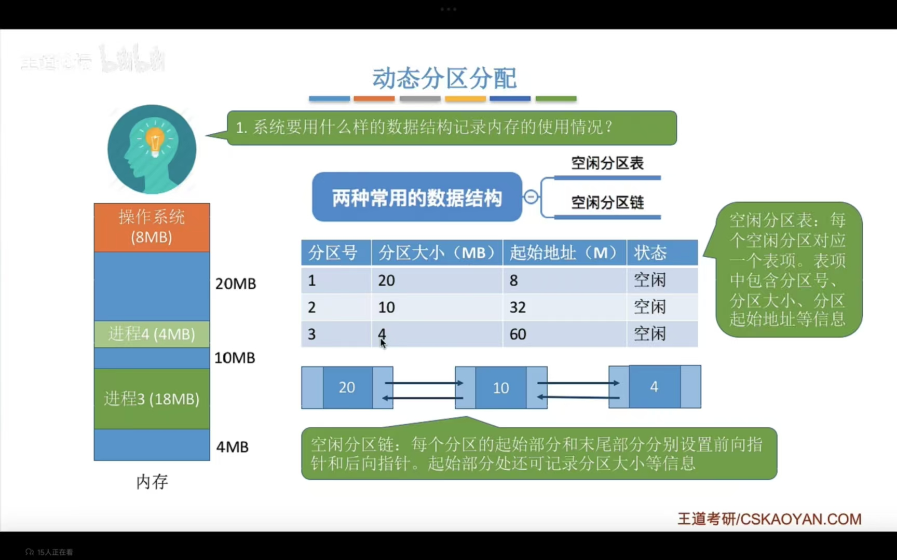
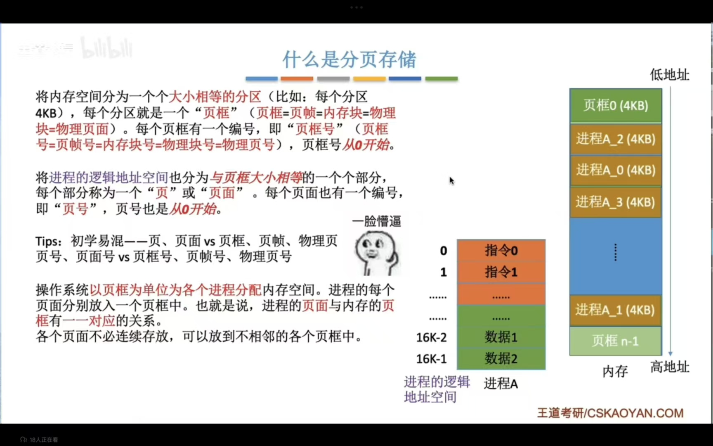
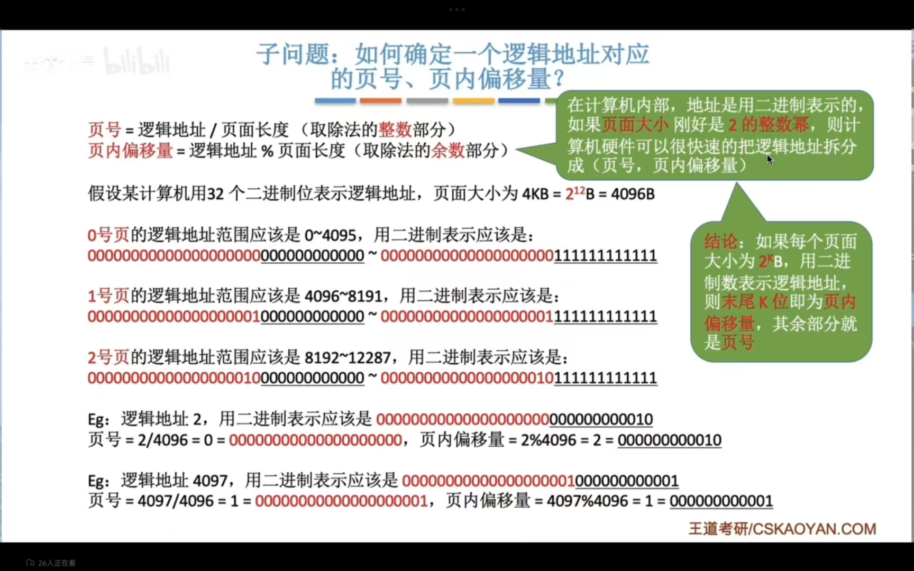

## 内存

### 内存基础知识

### 内存管理实现

- 内存空间的分配与回收
- 内存空间的扩充（实现虚拟性）
- 地址转换
- 存储保护

#### 进程的内存映像

#### 覆盖技术

分为固定区和若干的覆盖区

#### 交换技术

### 内存分配方式

内部碎片：分配给进程的内存区域并没有被完全使用

外部碎片：内存中某些空闲分区由于太小难以利用

#### 连续分配管理方式

##### 单一连续分配

内存分为系统区和用户区，内存中只能有一道用户程序，用户程序独占整个用户区空间

##### 固定分区分配

将用户空间划分为若干个固定大小的分区，每个分区中只装入一道作业，可分为大小相等或大小不等的分区

分区说明表：

| 分区号 | 大小 | 起始地址 | 状态   |
| ------ | ---- | -------- | ------ |
| 1      | 2    | 8        | 未分配 |
| 2      | 2    | 10       | 未分配 |
| 3      | 4    | 12       | 已分配 |
| ...    | ...  | ...      | ...    |
##### 动态内存分配

又称可变分区分配，不会预先划分内存分区，而是再进程装入内存时，根据进程大小动态地建立分区

> 随之而来待解决的问题：
>
> - 用什么结构来记录内存使用情况
> - 当多个分区满足需求，选择哪个分区来进行分配
> - 如何进行分区的分配与回收

动态可以通过紧凑来解决外部碎片，通过中级调度将进程调到外存然后在调进来

###### 数据结构

###### 分配算法

- 首次适应算法：选择能够满足需求的地址最低的空闲分区
- 最佳适应算法：选择能够满足需求的空间最小的空闲分区
- 最坏适应算法：选择能够满足需求的空间最大的空闲分区
- 临近适应算法：在首次适应算法的基础上，从上次寻找到的地址位置继续往下进行寻找

### 非连续分配管理方式

#### 分页存储

通过页表来进行存储

标识物理地址：页号+业内偏移量

