## 内存基础知识

## 内存管理实现

- 内存空间的分配与回收
- 内存空间的扩充（实现虚拟性）
- 地址转换
- 存储保护

### 进程的内存映像

### 覆盖技术

分为固定区和若干的覆盖区

### 交换技术

## 内存分配方式

内部碎片：分配给进程的内存区域并没有被完全使用

外部碎片：内存中某些空闲分区由于太小难以利用

### 连续分配管理方式

#### 单一连续分配

内存分为系统区和用户区，内存中只能有一道用户程序，用户程序独占整个用户区空间

#### 固定分区分配

将用户空间划分为若干个固定大小的分区，每个分区中只装入一道作业，可分为大小相等或大小不等的分区

分区说明表：

| 分区号 | 大小 | 起始地址 | 状态   |
| ------ | ---- | -------- | ------ |
| 1      | 2    | 8        | 未分配 |
| 2      | 2    | 10       | 未分配 |
| 3      | 4    | 12       | 已分配 |
| ...    | ...  | ...      | ...    |
#### 动态内存分配

又称可变分区分配，不会预先划分内存分区，而是再进程装入内存时，根据进程大小动态地建立分区

> 随之而来待解决的问题：
>
> - 用什么结构来记录内存使用情况
> - 当多个分区满足需求，选择哪个分区来进行分配
> - 如何进行分区的分配与回收

动态可以通过紧凑来解决外部碎片，通过中级调度将进程调到外存然后在调进来

##### 数据结构

##### 分配算法

- 首次适应算法：选择能够满足需求的地址最低的空闲分区
- 最佳适应算法：选择能够满足需求的空间最小的空闲分区
- 最坏适应算法：选择能够满足需求的空间最大的空闲分区
- 临近适应算法：在首次适应算法的基础上，从上次寻找到的地址位置继续往下进行寻找

## 非连续分配管理方式

### 分页存储

通过页表来进行存储

标识物理地址：页号+业内偏移量

#### 逻辑地址转为物理地址

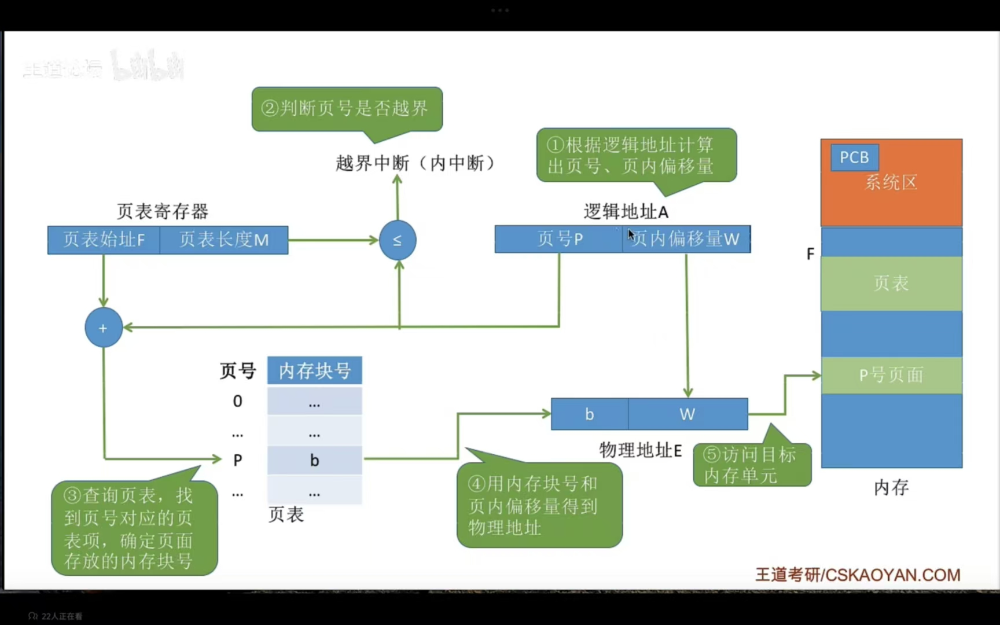

页表项相关计算注意

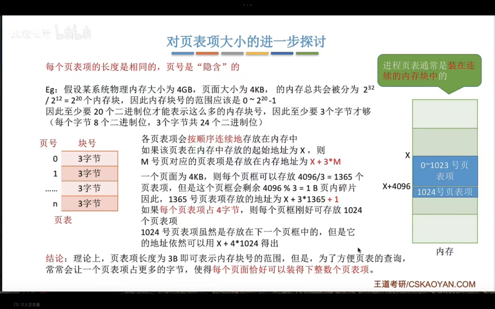

快表：类比于redits，存储常用的一些页表项

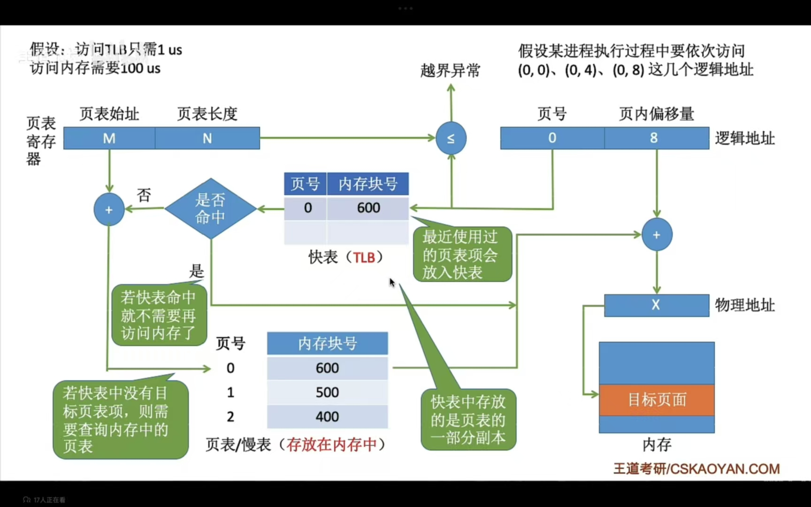

#### 多级页表

由于页表项可能会很大，占据多个连续的页框，因此推出多级页表

> 一级页表内的内存块号应为对应二级页表起始地址

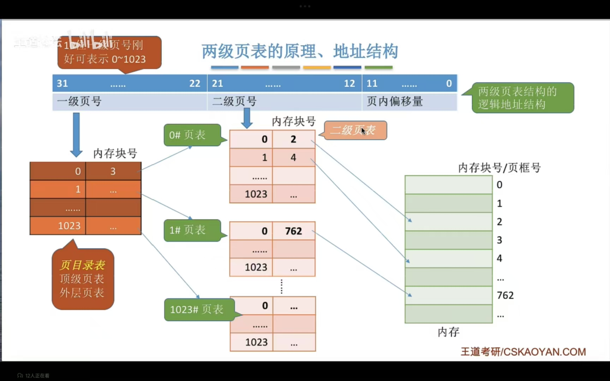

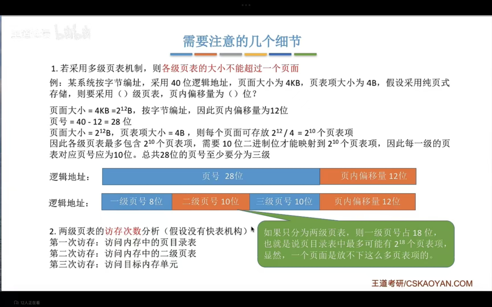

### 分段存储

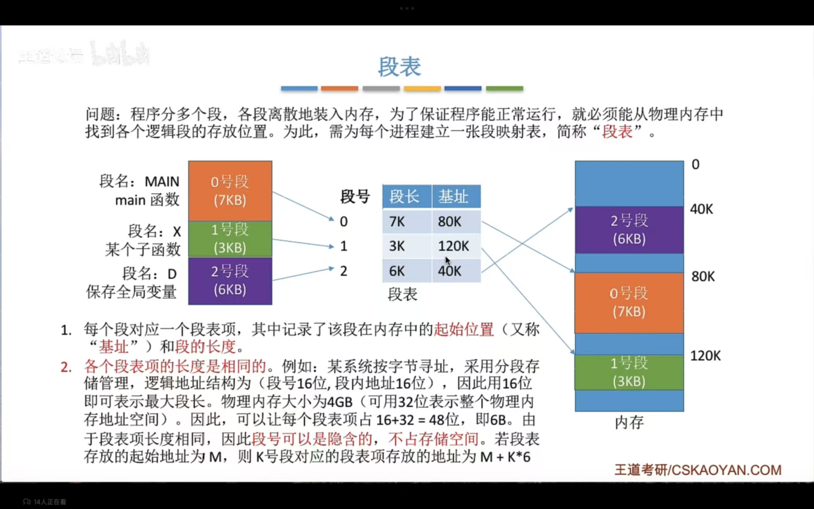

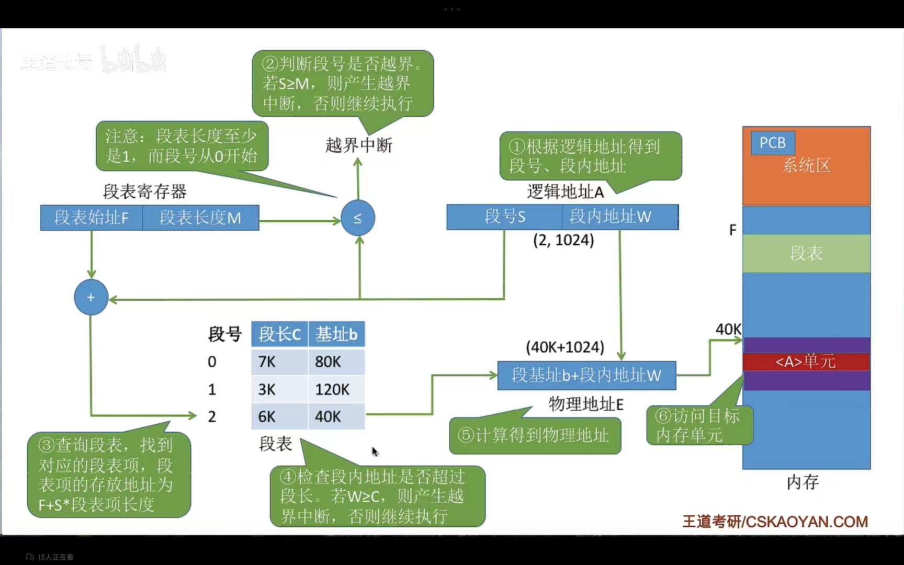

### 段页式存储

对一个程序分段之后，在段内再进行分页存储

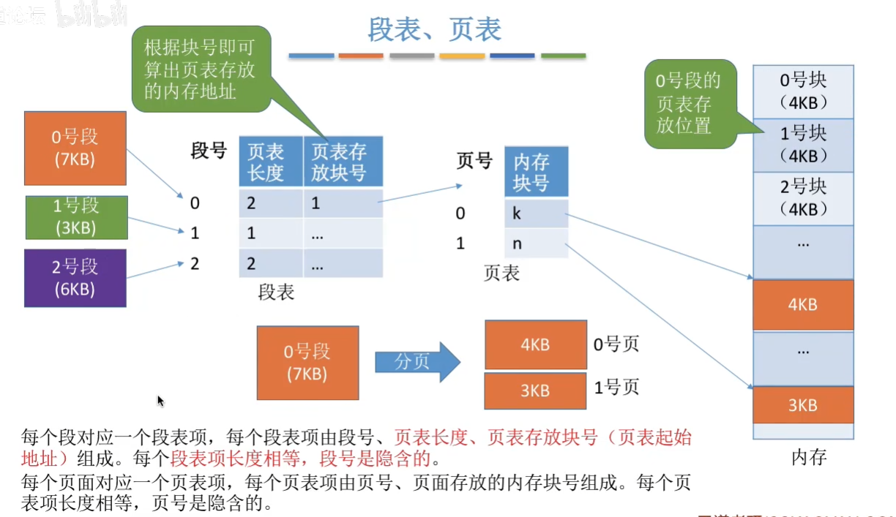

> 段表最后一列应为页表起始地址

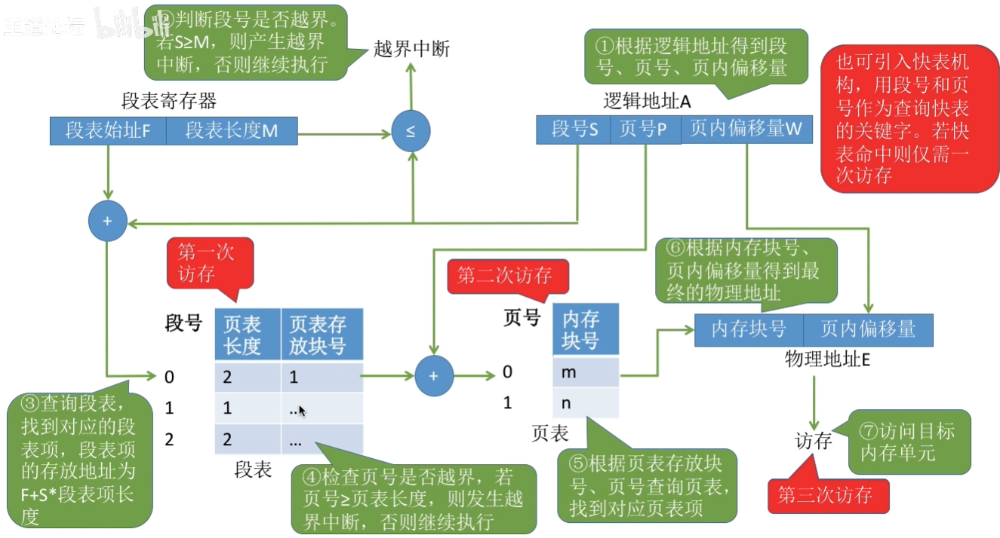

## 虚拟内存

传统存储方式存在缺点:

1. 一次性缺点:作业必须一次性全部装入内存后才能开始运行。

- 作业很大时，不能全部装入内存，导致大作业无法运行;
- 当大量作业要求运行时，由于内存无法容纳所有作业，因此只有少量作业能运行，导致多道程序并发度下降。

2. 驻留性：一旦作业被装入内存，就会一直驻留在内存中，真至作业运行结束。

    > 事实上，在一个时门段内，只需要访问作业的一小部分数据即可正常运行，这就导致了内存中会驻留大量的、暂时用不到的数据，浪费了宝贵的内存资源

### 局部性原理

时间局部性:如果执行了程序中的某条指令，那么不久后这条指令很有可能再次执行;如果某个数据被访问过，不久之后该数据很可能再次被访问。

空间局部性:一旦程序访问了某个存储单元，在不久之后，其附近的存储单元也很有可能被访问。

### 实现方式：请求分页管理方式

在基本分页存储管理的基础上添加：

当所访问的信息不在内存时，由操作系统负责将所需信息从外存调入内存，若内存空间不够，由操作系统负责将内存中暂时用不到的信息换出到外存。

#### 页表机制

#### 缺页中断机构

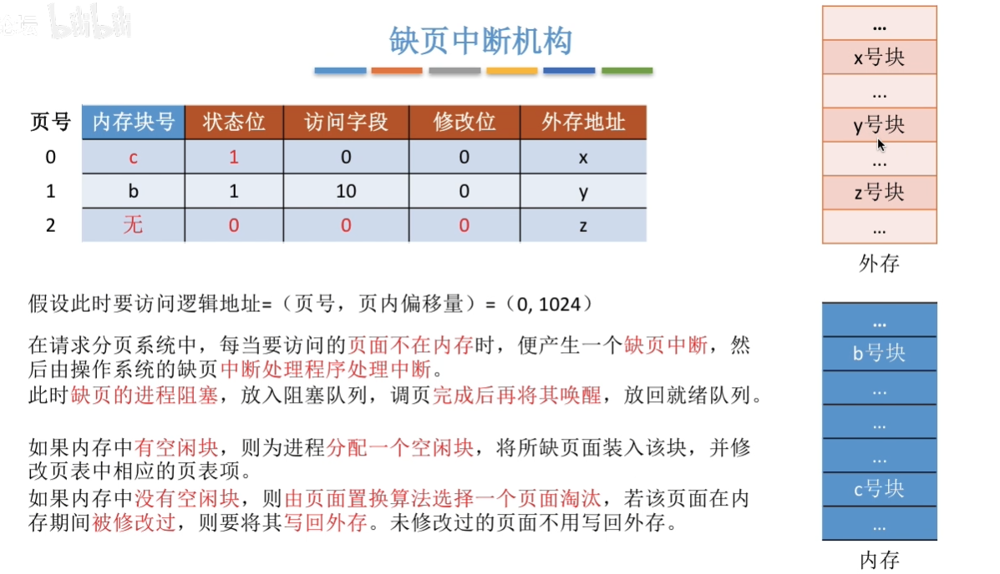

#### 地址变换机构

- 判断查找到页表是否在内存当中
- 页面置换的时候选择哪些页面
- 对应页表项数据修改

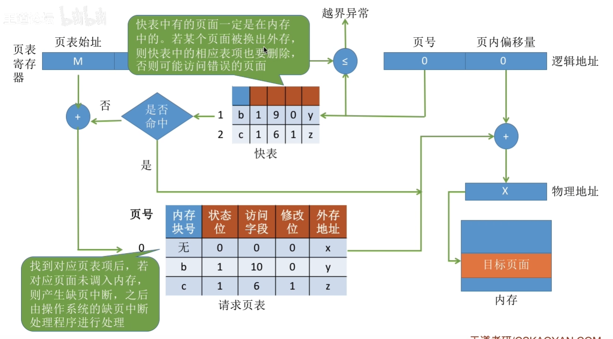

> 要修改内容可以在快表中进行修改，当要删除快表中的数据时再将快表的内容复制到内存当中，内存到外存也是同理

#### 页面置换算法

追求更少的缺页率，即换入换出尽可能少

##### 最佳置换算法（OPT,optimal）

每次选择未来最长时间不再被访问的页面

##### 先进先出置换算法（FIFO）

每次选择的是最早进入内存的页面，算缺页期望会很大，Belady异常：为进程分配的物理块数增大，缺页次数不减反增

##### 最近最久未使用置换算法（LRU）

每次选择现在最长时间未使用的算法

##### 时钟置换算法（CLOCK,NRU）

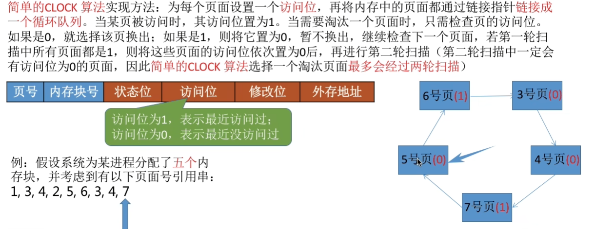

改进型CLOCK：再考虑优先淘汰掉没有修改过的页面

1. **初始化**
    - 内存中的页面组成环形链表，指针指向链表中的某一个页面（初始位置可随机）。
    - 每个页面的`use`和`dirty`位已根据访问 / 修改情况标记。
2. **第一轮遍历：寻找 `(use=0, dirty=0)` 的页面**
    - 指针从当前位置开始，顺时针遍历环形链表。
    - 检查当前页面的两个标记位：
        - 若找到 `use=0 且 dirty=0` → **直接置换该页面**，流程结束。
        - 若未找到 → 进入第二轮遍历。
3. **第二轮遍历：寻找 `(use=0, dirty=1)` 的页面**
    - 指针继续遍历链表，寻找 `use=0 且 dirty=1` 的页面。
    - 同时，**将遍历过程中遇到的所有页面的`use`位重置为 0**（给这些页面 “二次机会”）。
    - 若找到 `use=0 且 dirty=1` → **置换该页面**（置换时需写回磁盘），流程结束。
    - 若未找到 → 进入第三轮遍历。
4. **第三轮遍历：再次寻找 `(use=0, dirty=0)` 的页面**
    - 经过第二轮遍历，所有页面的`use`位都已被置为 0，此时页面的状态只有两种：`(0,0)` 和 `(0,1)`。
    - 指针再次遍历，**必然能找到 `use=0` 的页面**（因为内存已满，必须置换一个）。
    - 优先选择 `(0,0)` 的页面置换；若没有，则选择 `(0,1)` 的页面。
5. **页面置换与指针更新**
    - 置换选中的页面，将新页面调入该位置。
    - 将新页面的`use`位设为`1`，`dirty`位设为`0`。
    - 指针移动到**被置换页面的下一个位置**，等待下一次置换请求。

### 页面分配策略

驻留集：请求分页存储管理中给进程分配的物理块的集合，

工作集：在某段时间间隔里，进程实际访问的页面的集合

驻留集的大小分为可变和不可变

置换范围分为

- 局部置换：发生缺页时只能选进程自己的物理块进行置换
- 全局置换：可以将操作系统保留的空闲物理块分配给该进程，也可以将别的进程的物理块置换到外存，再将该空间分配给缺页进程

|          | 局部置换 | 全局置换 |
| -------- | -------- | -------- |
| 固定分配 | √        |          |
| 可变分配 | √        | √        |

调入页面的时机分为预调页（进程运行前调入）和请求调页（进程运行时请求）

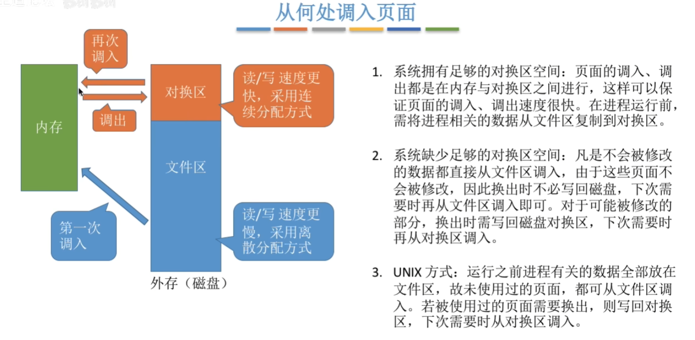

频繁的页面调度称为抖动或颠簸

### 内存映射文件

将文件映射到进程的虚拟地址空间，只是在进程里面做了映射，并没有将文件放入进程

当进程想要调用这一部分数据的时候，会自动将其从外存调入内存，进程关闭文件，操作系统会自动将文件被修改的数据写回磁盘

多个进程可以映射同一个文件，实现共享
