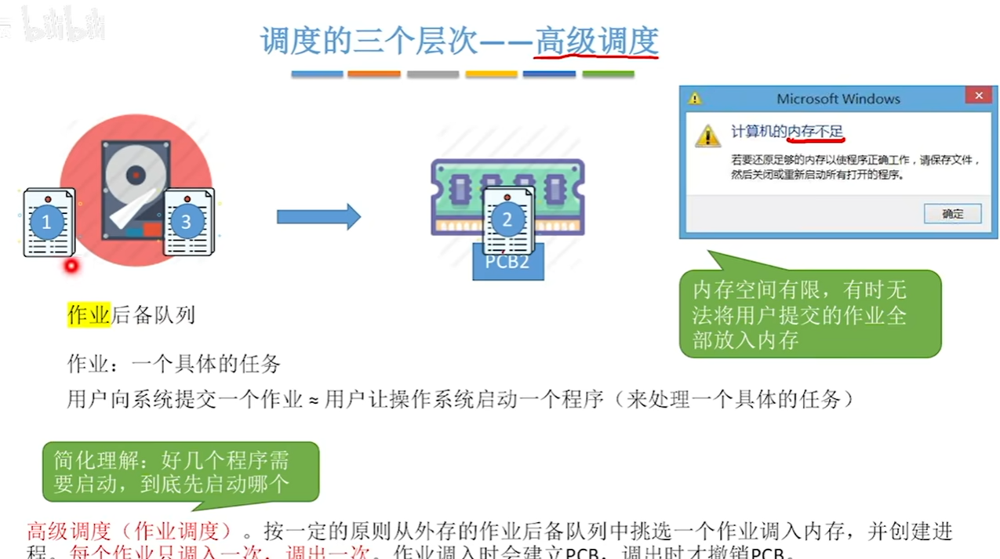

## 进程

包含PCB，程序段，内存

包含五个状态：

- 创建态
- 就绪态：等待CPU
- 运行态
- 阻塞态：等待其他资源
- 结束态

### 进程控制

原语是特殊的程序，执行必须一气呵成，不可中断，通过原语实现进程控制

具有关中断和开中断指令，在这个范围内不会去看是否有中断指令

#### 进程创建

原语内容：

- 申请空白PCB
- 为新进程分配所需资源
- 初始化PCB
- 将PCB插入就绪队列

#### 进程撤销

原语内容：

- 从PCB集合中找到终止进程的PCB
- 若进程正在运行，立刻剥夺CPU，将CPU分配给其他进程
- 终止其所有子进程
- 将该进程拥有的所有资源归还给父进程或操作系统
- 删除PCB

#### 进程的阻塞和唤醒

阻塞：

- 找到要阻塞进程的PCB
- 保护进程运行现场，将PCB状态信息设置为阻塞态，暂时停止进程运行
- 将PCB插入相应事件的等待队列

唤醒：

- 在事件等待队列种找到PCB
- 将PCB从等待队列移除，设置进程为就绪态
- 将PCB插入就绪队列，等待被调度

#### 进程的切换

- 将运行环境信息存入PCB
- PCB移入相应队列
- 选择另一个进程执行，并更新其PCB
- 根据PCB恢复新进程所需的运行环境

### 进程通信

#### 共享存储

&nbsp;&nbsp;&nbsp;&nbsp;申请共享存储区/数据结构，可以被其他进程所共享，但各个进程对共享空间的访问是互斥的，由进程本身的PV操作来实现。

&nbsp;&nbsp;&nbsp;&nbsp;分为基于存储区的共享和基于数据结构的共享

#### 消息传递

&nbsp;&nbsp;&nbsp;&nbsp;进程间的数据交换以格式化的消息为单位，进程通过操作系统提供的“发送消息/接收消息”两个原语进行数据交换。

&nbsp;&nbsp;&nbsp;&nbsp;消息由消息头和消息体构成，消息头包括发送进程ID、接受进程的ID、消息长度等格式化信息

&nbsp;&nbsp;&nbsp;&nbsp;分为直接通信方式和间接通信方式，间接通信方式即通过信箱进行传递

#### 管道通信

&nbsp;&nbsp;&nbsp;&nbsp;管道是一个特殊的共享文件（pipe）,再内存中开辟了一个大小固定的内存缓冲区，是一个循环队列

&nbsp;&nbsp;&nbsp;&nbsp;单个管道只能单向传输，称为半双工通信，两个管道可实现双向通信，称为全双工通信

&nbsp;&nbsp;&nbsp;&nbsp;互斥由操作系统来进行，只要管道没写满就可以往里面写，只要没读完就可以继续读取，读取看作出队

### 信号

&nbsp;&nbsp;&nbsp;&nbsp;用于通知进程某个特定事件已经发生，进程收到一个新号后，对该信号进行处理

#### 信号的发送与保存

&nbsp;&nbsp;&nbsp;&nbsp;信号处理时机

## 线程

&nbsp;&nbsp;&nbsp;&nbsp;是基本的CPU的执行单元，是程序执行流的最小单位

&nbsp;&nbsp;&nbsp;&nbsp;进程是资源分配的基本单位，线程是调度的基本单位

线程控制块TCB

### 线程的实现方式

只有内核级线程才是处理机的分配单位

#### 用户级线程

&nbsp;&nbsp;&nbsp;&nbsp;应用程序创建线程库来管理各个线程，切换在用户态当中进行即可，不需要切换到内核态，不需要CPU变态，但是一个进程阻塞，其他线程也会被阻塞

#### 内核级线程

一个被阻塞，其他的还能正常运行，多核的情况下可以将不同进程分派到不同核心进运行

线程切换需要操作系统来实现，先要用户->内核，再切换内核级线程，再从内核->用户，运行用户级线程切换成本高

#### 多线程模型

- 一对一：一个用户级线程对应一个内核级线程，开销大，不会阻塞
- 多对一：多个用户级线程对应一个内核级线程，就相当于一个内核级线程管理线程库
- 多对多：将n个用户级线程映射到m个内核级线程，每个内核级线程有n个用户级线程，就是多对一的批量版，不会阻塞

### 线程状态转化

分为：就绪，阻塞，运行

线程控制块（TCB）

## 调度

### 三层调度

高级/作业调度：

中级/内存调度：

挂起可分为就绪挂起、阻塞挂起

低级/进程/处理机调度

