## I/O设备

包含硬件部分和软件部分

按使用特性分：

- 人机交互类外部设备
- 存储设备
- 网络通信设备

按传输速率分：

- 低速设备
- 中速设备
- 高速设备

按信息交换单位分：

- 块设备
- 字符设备

### I/O控制器

 I/O设备的电子部件，用于实现CPU和I/O设备的控制

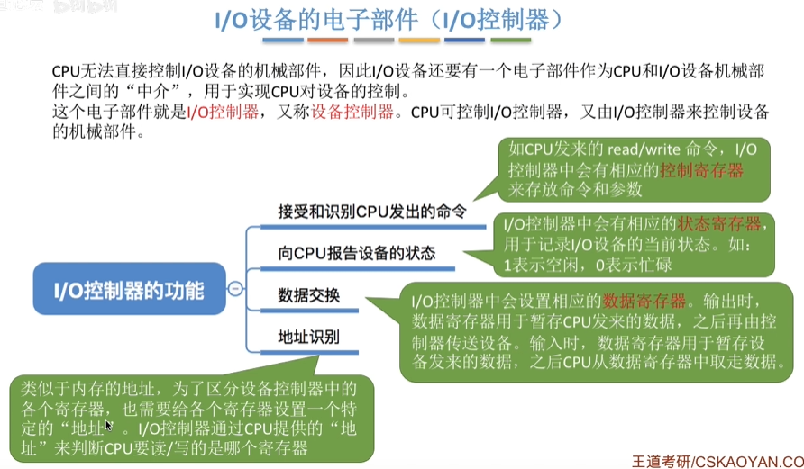

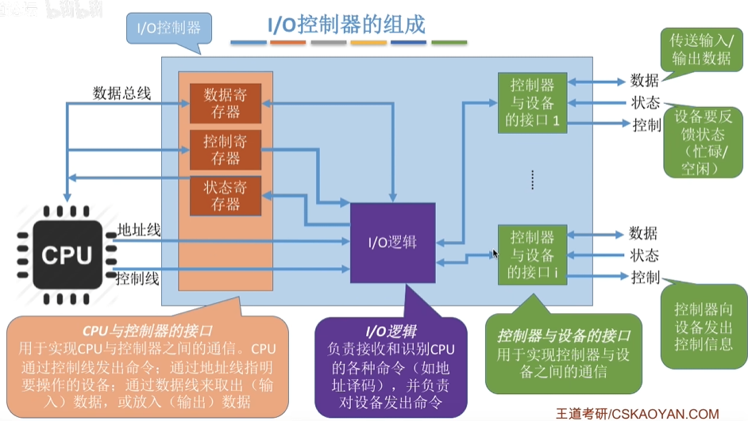

有些计算机会让寄存器占用内存的地址的一部分，称为内存映像I/O；另一些计算机则采用I/O专用地址（寄存器的独立地址），即寄存器独立编址

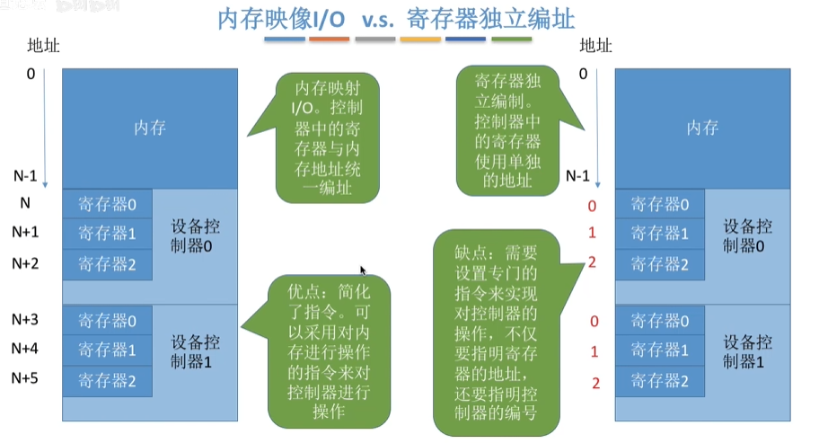

### I/O的控制方式

> 1. 完成一次读/写操作的流程
> 2. CPU干预的频率
> 3. 数据传送的单位
> 4. 数据的流向
> 5. 各个控制方式的优缺点

####   程序直接控制方式

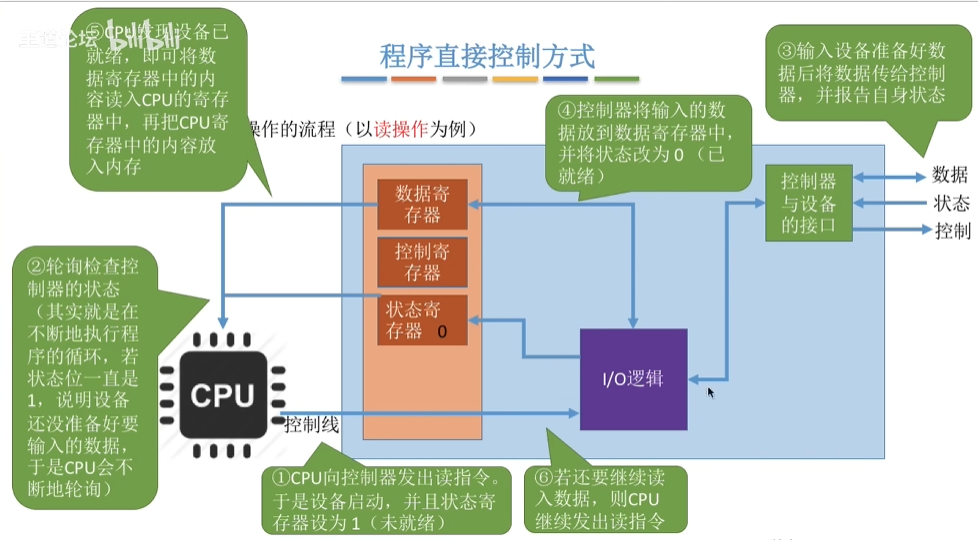
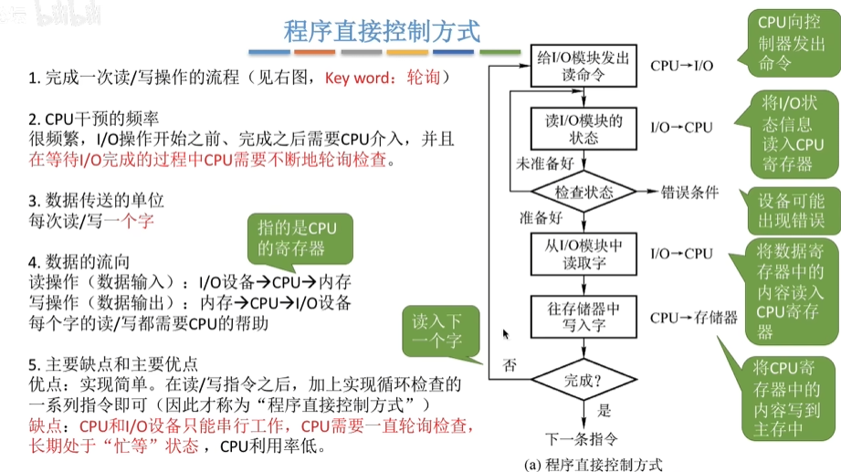

CPU干预很频繁，I/O操作开始、完成后都需要CPU介入，并且在等待I/O完成的过程中CPU需要不断地轮询检查

每次读写一个字
读操作（数据输入）：I/O设备->CPU寄存器->内存
写操作（数据输出）：内存->CPU->I/O设备

优点：实现简单

缺点：CPU和I/O设备只能串行工作，CPU需要一直轮询检查，利用率低

#### 中断驱动方式

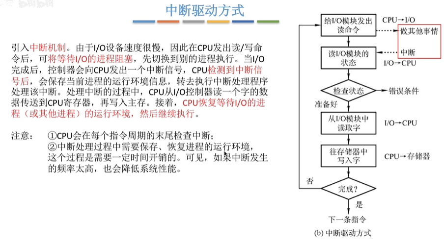

相较于程序直接控制方式，在等待I/O完成的过程中CPU不用一直轮询，可以切换到别的进程执行

每次读写一个字
读操作（数据输入）：I/O设备->CPU寄存器->内存
写操作（数据输出）：内存->CPU->I/O设备

优点：CPU不需要一直轮询，CPU和I/O设备可并行工作，CPU利用率得到明显提升

缺点：每个字在I/O设备与内存之间的传输都需要经过CPU，频繁的中断处理会消耗较多的CPU时间

#### DMA方式

直接存储器存取，主要用于块设备的I/O控制

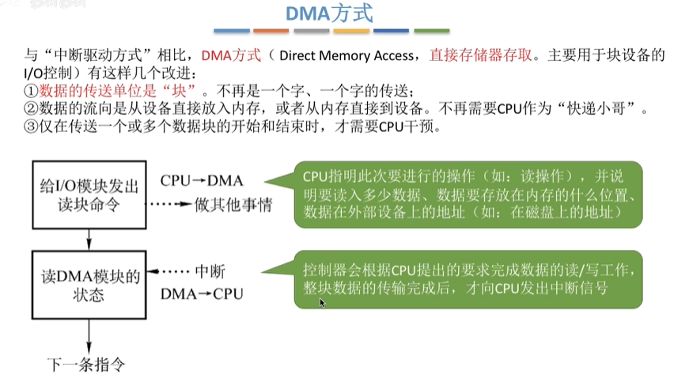
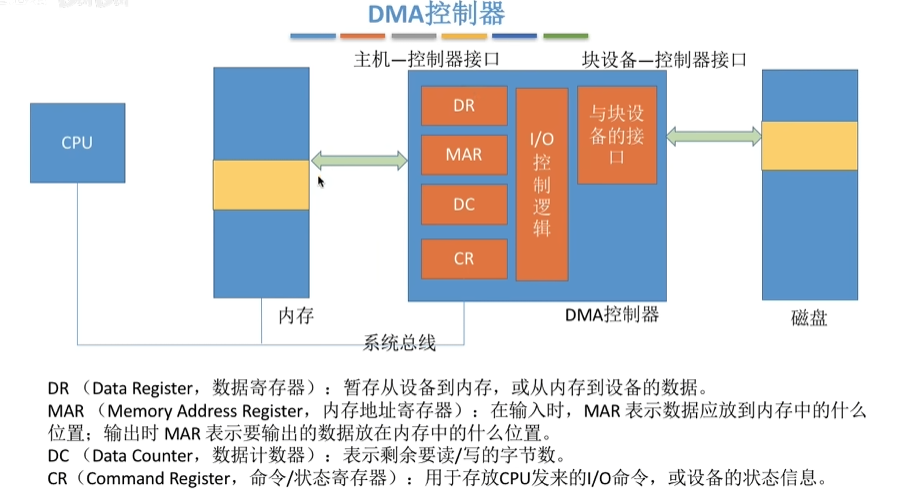

仅在传送一个或多个数据块的开始和结束时才需要CPU的干预

每次读写一个或多个块
> 每次读写的只能是连续的多个块，且这些块读入内存后在内存中也必须是连续的
读操作(数据输入):I/O设备->内存
写操作(数据输出):内存->I/O设备

优点：数据传输以"块"为单位，CPU介入频率进一步降低。数据的传输不再需要先经过CPU再写入内存，数据传输效率进一步增加。CPU和I/O设备的并行性得到提升。

缺点:CPU每发出一条I/O指令，只能读/写一个或多个连续的数据块。如果要读/写多个离散存储的数据块，或者要将数据分别写到不同的内存区域时，CPU要分别发出多条I/O指令，进行多次中断处理才能完成。

#### 通道控制方式

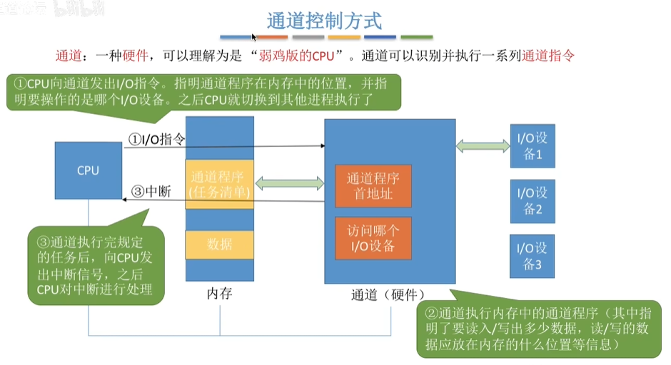
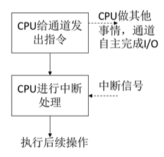

通道会根据CPU的指示执行相应的通道程序，只有完成一组数据块的读/写后才需要发出中断信号，请求CPU干预。

每次读/写一组数据块
读操作(数据输入):I/O设备->内存
写操作(数据输出):内存->I/O设备

缺点:实现复杂，需要专门的通道硬件支持优点:CPU、通道、1/O设备可并行工作，资源利用率很高。

### I/O软件层次结构

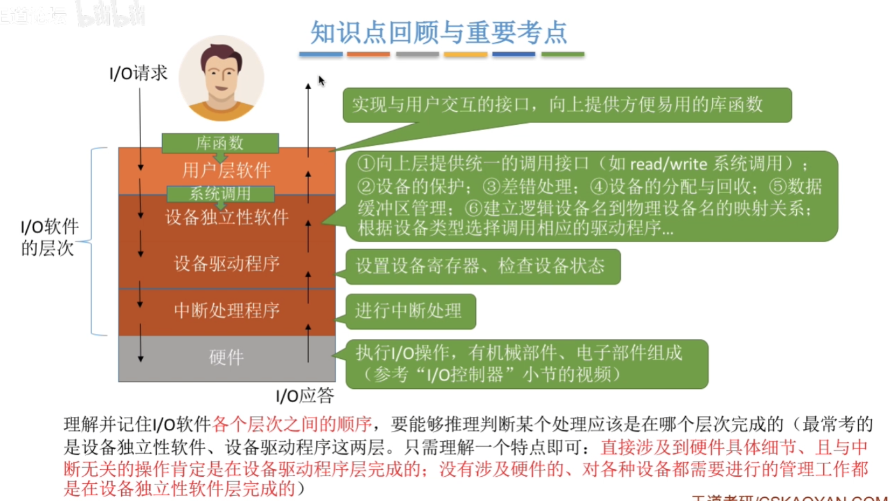

#### 用户层软件

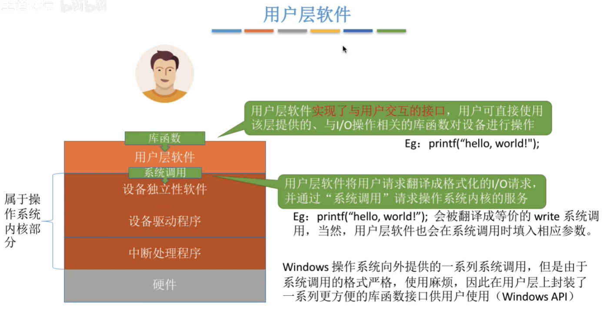

#### 设备独立性软件

1. 向上层提供统一调用的接口（如read/write系统调用）；
2. 设备的保护，即对文件的保护；
3. 差错处理（对设备的错误进行处理）；
4. 设备的分配与回收；
5. 数据缓冲区管理；
6. 简历逻辑设备名道物理设备名的映射关系；根据设备类型选择调用相应的驱动程序（逻辑设备表LUT）；

#### 设备驱动程序

主要负责对硬件设备的具体控制，将上层发出的一系列命令(如read/write)转化成特定设备"能听得懂"的一系列操作。包括设置设备寄存器;检查设备状态等。

驱动程序一般会以一个独立进程的方式存在。

#### 中断处理程序

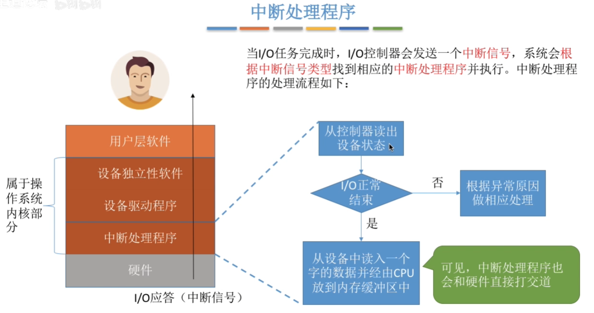

### 程序接口

#### 输入/输出应用程序接口

设备独立性软件需要向上层提供若干个类型的应用程序接口

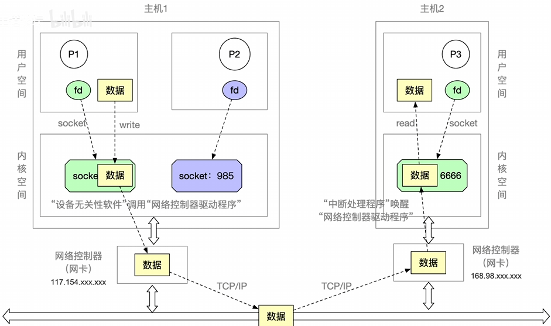

阻塞I/O：应用程序发出I/O系统调用，进程需转为阻塞态等待。

> 字符设备接口一一从键盘读一个字符get

非阻塞1/O:应用程序发出I/O系统调用，系统调用可迅速返回，进程无需阻塞等待。

> 块设备接口--往磁盘写数据write,磁盘繁忙时可以将其先复制到内存进行编写，再逐步复制到磁盘当中

#### 设备驱动程序接口

设备独立软件需要根据要求不同调用不同的驱动程序

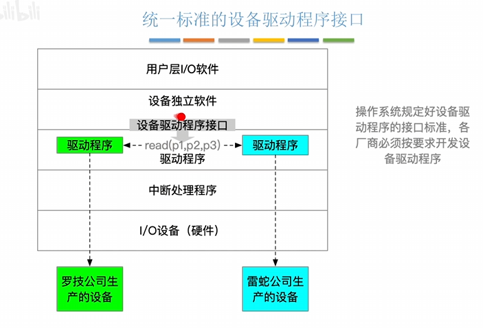

## I/O系统

也叫做I/O核心子系统，包括中断处理程序，设备驱动程序，设备独立性软件

实现的功能包含I/O调度，设备保护，假脱机技术（SPOOLing），设备分配与回收，缓冲区管理（缓冲与高速缓存）

- 用户层软件（假脱机技术）
- 设备独立性软件（I/O调度、设备保护、设备分配与回收、缓冲区管理）

I/O调度：用某种算法确定一个好的顺序来处理各个I/O请求

> 如磁盘调度算法，打印机进程调度

设备保护：实现不同的用户对各个文件有不同的访问权限

> 在UNIX系统中，设备被看做是一种特殊的文件，每个设备也会有对应的FCB。当用户请求访问某个设备时，系统根据FCB中记录的信息来判断该用户是否有相应的访问权限，以此实现"设备保护"的功能。

### 假脱机技术

## 磁盘

具体存储见计算机组成原理中磁盘部分

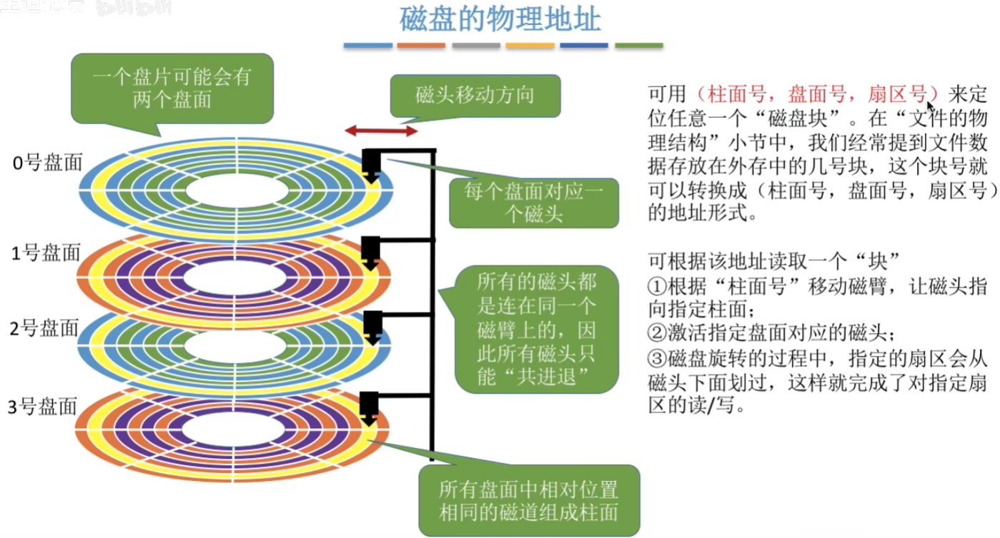

按磁头是否可以移动，可分为活动头磁盘和固定头磁盘

按盘片能不能更换分为可换盘磁盘和固定盘磁盘

### 磁盘调度

一次磁盘读/写操作所需时间包括

- 寻找（道）时间：启动磁臂、移动磁头所花的时间
- 延迟时间：将目标扇区转到磁头下面所花的时间
- 传输时间：读写数据所花的时间

> 启动磁头臂的时间+移动磁头的时间   +旋转磁盘的时间    +磁盘读取和写入所花费时间
>
> 延迟时间和传输时间由磁盘的转速所决定

#### 先来先服务（FCFS）

进程请求访问磁盘的先后顺序进行调度；

#### 最短寻找时间优先（SSTF）

优先处理与当前磁头位置最接近的磁道；

可能会产生饥饿

#### 扫描算法（SCAN）

也叫电梯算法，在最短寻找时间优先的条件下，规定只有磁头移动到最外侧磁道的时候才能往内移动，移动到最内侧磁道的时候才能往外移动

#### LOOK调度算法

在扫描算法的基础上，如果磁头移动方向上已经没有别的请求，就可以理解改变磁头移动方向。

#### 循环扫描算法（C-SCAN）

规定只有磁头朝某个特定方向移动时才处理磁道访问请求额，而返回时直接快速移动至起始端（0号磁道）而不处理任何请求

### 优化读取的延迟时间

采用交替编号的策略，让逻辑上相邻的删去在物理上有一定的间隔，可以使读取连续的逻辑扇区所需要的延迟时间更小
