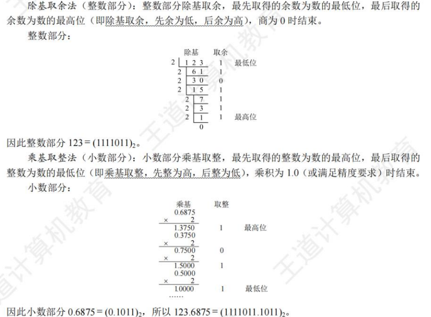
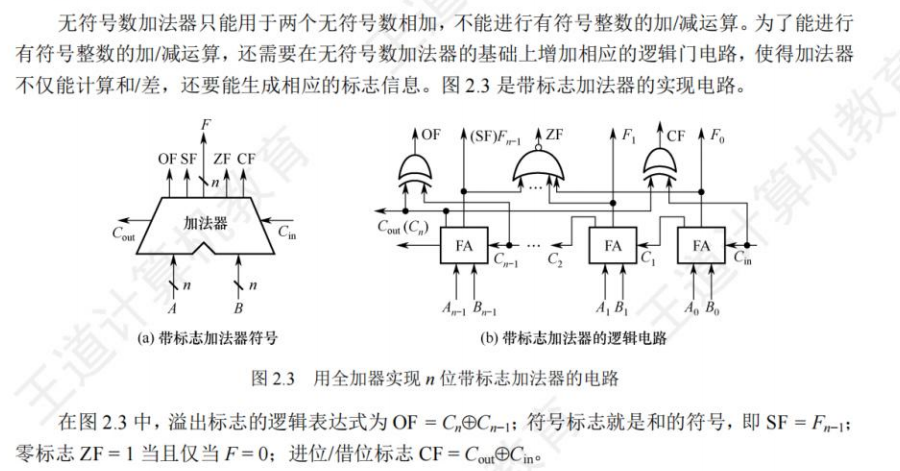
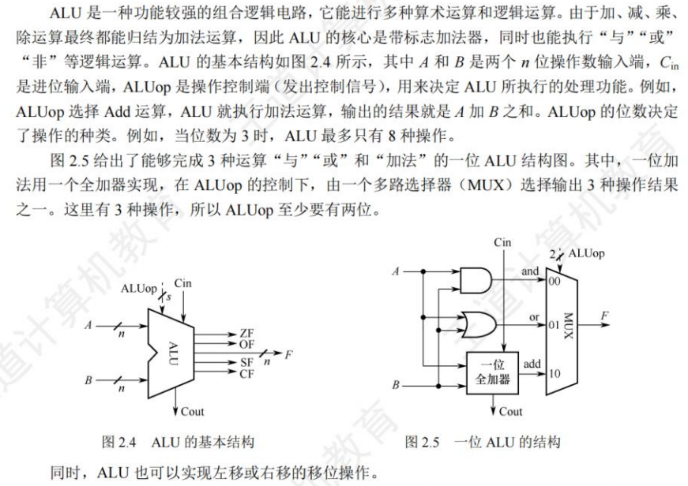
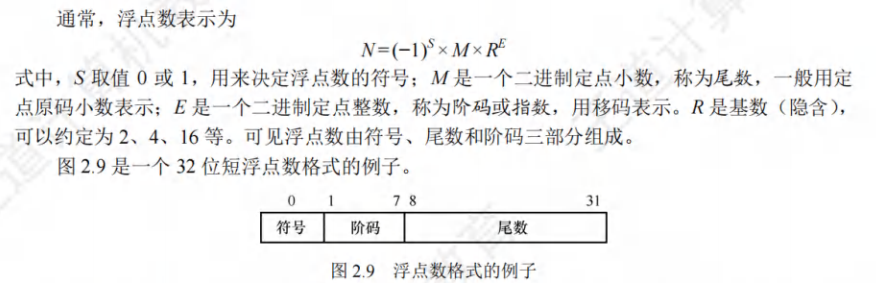

## 数制与编码

|      | 原码                                | 补码                                |
| ---- | ----------------------------------- | ----------------------------------- |
| 正数 | 本身                                | 本身                                |
| 负数 | 正数原码修改符号位                  | 负数原码除符号位取反 + 1            |
| 8    | 00000000 00000000 00000000 00001000 | 00000000 00000000 00000000 00001000 |
| -8   | 10000000 00000000 00000000 00001000 | 11111111 11111111 11111111 11111000 |

得到一个相反数，除全部取反再+1

### 进位计数制及其相互转换

进制类型:

- 二进制(B):逢二进一
- 八进制(O):逢八进一
- 十进制(D)
- 十六进制(H):逢十六进一

进制转换:

1. 二转八:三位二进制为一位八进制
2. 二转十六:四维二进制转一位十六进制
3. 八转十六:八转二再二转十六

4. 十进制转二进制:整数部分(除基取余):先余放低数位;小数部分(乘积取整)

### 定点数的编码表示

&nbsp;&nbsp;&nbsp;&nbsp;带正负号的数称为真值,即为实际值,将符号与数值一起编码后的数称为机器数。

机器数表示(补码整数表示整数,原码小数表示浮点数的尾数部分,移码表示浮点数的阶码部分):

- 定点表示,表示定点小数/整数,小数点位置确定
- 浮点表示:表示浮点小数,小数点位置不固定

#### 原码

&nbsp;&nbsp;&nbsp;&nbsp;机器数最高位表示数的符号,其余各位表示数的绝对值

#### 补码

&nbsp;&nbsp;&nbsp;&nbsp;正数的补码和原码相同,负数的补码为除符号位以外取反+1

#### 反码

&nbsp;&nbsp;&nbsp;&nbsp;各位相反,不修改符号位

#### 移码

&nbsp;&nbsp;&nbsp;&nbsp;表示浮点数的阶码,只能表示整数,再真值X上加上一个常数(偏置值),通常取$2^n$相当于X在数轴上像正方向便宜了若干单位(把小数点移到最后一个数的后面,使其变成一个整数)

### 整数表示

&nbsp;&nbsp;&nbsp;&nbsp;在运算过程中采用补码进行运算,范围为$-2^{n-1}\sim 2^{n-1}-1$

## 运算方法和运算电路

### 基本运算部件

#### 带标志加法器

#### 算术逻辑单元

### 定点数的移位运算

&nbsp;&nbsp;&nbsp;&nbsp;右往左移,低位补零;左往右移,高位补零

#### 逻辑移位

&nbsp;&nbsp;&nbsp;&nbsp;将操作数视为无符号整数,右往左移,低位补零;左往右移,高位补零.

### 算术移位

&nbsp;&nbsp;&nbsp;&nbsp;需要考虑符号位的问题,

### 定点数的加减运算

- 按二进制运算规则运算，逢二进一。
- 若做加法，两个数的补码直接相加;若做减法，则将被减数与减数的负数补码相加。
- 符号位与数值位一起参与运算，加、减运算结果的符号位也在运算中直接得出。
- 最终运算结果的高位丢弃，保留n+1位，运算结果亦为补码。

### 定点数的乘除运算

 定点数乘法:

&nbsp;&nbsp;&nbsp;&nbsp;数值直接相乘,符号位异或运算

定点数除法:

## 浮点数的表示与运算

### 浮点数的表示

&nbsp;&nbsp;&nbsp;&nbsp;小数点的位置不固定。
