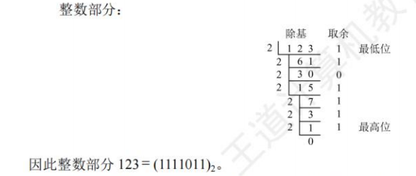
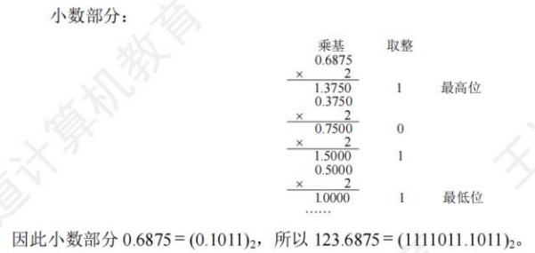
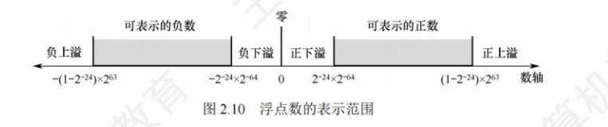

## 数制与编码

|      | 原码                                | 补码                                |
| ---- | ----------------------------------- | ----------------------------------- |
| 正数 | 本身                                | 本身                                |
| 负数 | 正数原码修改符号位                  | 负数原码除符号位取反 + 1            |
| 8    | 00000000 00000000 00000000 00001000 | 00000000 00000000 00000000 00001000 |
| -8   | 10000000 00000000 00000000 00001000 | 11111111 11111111 11111111 11111000 |

得到一个相反数，除全部取反再+1

### 进位计数制及其相互转换

进制类型:

- 二进制(B):逢二进一，小数部分转化为二进制：乘二法：

> 

- 八进制(O):逢八进一
- 十进制(D)
- 十六进制(H):逢十六进一

进制转换:

1. 二转八:三位二进制为一位八进制

2. 二转十六:四维二进制转一位十六进制

3. 八转十六:八转二再二转十六

4. 十进制转二进制:

  整数部分:除2所余下来的数可看作原数减去一个$2^n$所剩下来的数，自然便放在低位。

  

  小数部分：在小数部分，每个数位的权值为$2^{-n}$形式，以`0.5`,`0.25`,`0.125`递减，一开始小数部分乘2如果大于1，那么意味着原小数大于0.5，再对剩余的小数部分乘2，实际就是对原来该部分乘4，并以此类推

  
### 定点数的编码表示

&nbsp;&nbsp;&nbsp;&nbsp;带正负号的数称为真值,即为实际值,将符号与数值一起编码后的数称为机器数。

机器数表示(**补码整数表示整数,原码小数表示浮点数的尾数部分,移码表示浮点数的阶码部分**):

- 定点表示,表示定点小数/整数,小数点位置确定
- 浮点表示:表示浮点小数,小数点位置不固定

#### 原码

&nbsp;&nbsp;&nbsp;&nbsp;机器数最高位表示数的符号,其余各位表示数的绝对值

#### 补码

&nbsp;&nbsp;&nbsp;&nbsp;正数的补码和原码相同,负数的补码为除符号位以外取反+1

#### 反码

&nbsp;&nbsp;&nbsp;&nbsp;各位相反,不修改符号位

#### 移码

&nbsp;&nbsp;&nbsp;&nbsp;在阶码的实际值X上加上一个常数(偏置值),通常取$2^n$

> 阶码：浮点数整数部分中最大2的整数倍所对应的指数，具体见浮点数部分，同理于十进制的科学计数法。

&nbsp;&nbsp;&nbsp;&nbsp;相当于X在数轴上像正方向平移了若干单位，其中机器字长为$n+1$,未到八位把八位（此时偏置值为$2^7$）

> 阶码在浮点数的整数部分为0时，可能为负数

### 整数表示

&nbsp;&nbsp;&nbsp;&nbsp;在运算过程中采用补码进行运算,范围为$-2^{n-1}\sim 2^{n-1}-1$

## 运算方法和运算电路

### 基本运算部件

#### 带标志加法器

#### 算术逻辑单元

### 定点数的移位运算

&nbsp;&nbsp;&nbsp;&nbsp;右往左移,低位补零;左往右移,高位补零

#### 逻辑移位

&nbsp;&nbsp;&nbsp;&nbsp;将操作数视为无符号整数,右往左移,低位补零;左往右移,高位补零.

### 算术移位

&nbsp;&nbsp;&nbsp;&nbsp;需要考虑符号位的问题,

### 定点数补码的加减运算

- 按二进制运算规则运算，逢二进一。
- 若做加法，两个数的补码直接相加;若做减法，则将被减数与减数的负数补码相加。
- 符号位与数值位一起参与运算，加、减运算结果的符号位也在运算中直接得出。
- 最终运算结果的高位丢弃，保留n+1位，运算结果亦为补码。

### 定点数的乘除运算

 定点数乘法:

&nbsp;&nbsp;&nbsp;&nbsp;数值直接相乘,符号位异或运算

定点数除法:

## 浮点数的表示与运算

### 浮点数的表示

#### 浮点数结构(IEEE 754 单精度浮点数)

&nbsp;&nbsp;&nbsp;&nbsp;小数点的位置不固定。

&nbsp;&nbsp;&nbsp;&nbsp;设我们用浮点数表示`8.0`,它的二进制表示为`1000.0`,可以表示为$8.0=1.0×2^3$，尾数为`1.0`，阶码/指数为`3`，基数通常为`2`。

&nbsp;&nbsp;&nbsp;&nbsp;设我们用浮点数表示`0.875`,它的二进制表示为`0.111`,可以表示为$0.875=1.11×2^{-1}$，尾数为`1.11`，阶码/指数为`-1`但实际存储的是移码`-1+127=126`，二进制表示为`01111110`

> 在IEEE 754 单精度浮点数中，尾数会去掉整数部分和小数点，从第二位开始,不足二十三位自动填充至二十三位。

#### 浮点数的表示范围：

- 运算结果大于最大正数时称为正上溢，小于最小负数时称为负上溢，产生上溢必须进行溢出处理
- 运算结果大于最大负数小于0为负下溢，，小于最小正数大于0为正下溢。，夏一时，浮点数趋于零，计算机将其当作机器0处理

> 下溢因为指数即移码的精度不够（特指整数部分位0的情况，因为此时移码为负数。小数越小，负数越大），当小数很小的时候就无法进行表示，因此会把小数当为0
>
> 上溢则是整数部分的绝对值过大，超出了移码所能表示的范围

区别于溢出，尾数精度不足则是指整数部分不为0，单纯浮点的数位超出了尾数所能记录的范围。

#### 浮点数规格化

&nbsp;&nbsp;&nbsp;&nbsp;指通过调整一个非规格化的浮点数的尾数和阶码的大小，使非零浮点数在尾数的最高数位上保证是一个有效值，其实就是**浮点数转二进制后的移位操作**。

左规：尾数最高位为零，小数点前的数都为0

右规：小数点前不止一位有效位

#### IEEE 754标准

