## 顺序查找和折半查找

### 顺序查找

也称线性查找，按顺序遍历各个元素

一般线性表的顺序查找：

1. 从线性表的一端开始，逐个检查关键字是否满足给定的条件;
2. 若查找到某个元素的关键字满足给定条件，则查找成功，返回该元素在线性表中的位置:
3. 若已经查找到表的另一端，但还没有查找到符合给定条件的元素，则返回查找失败的信息。

有序线性表的顺序查找：

因为是有序的，因此不需要遍历全部元素，当比前一个元素大，比后一个元素小即为查询失败。

### 折半查找

二分查找，适用于有序的顺序表

划为树后，要么左子树节点个数=右子树节点个数，要么左子树节点个数+1=右子树节点个数

### 分块查找

索引顺序查找，将查找的内容分为若干子块，块内元素可以无序，但块间的元素是有序的，前一块内的所有元素都小于下一块中的最小元素，先讯在所查内容所在的块，再在块内进行寻找

## 树形查找

### 二叉排序树（BST）

特点（左中右的中序遍历的结果为升序序列）：

- **左大根堆**：若左子树非空，则左子树上所有结点的值均小于根结点的值。
- **右小根堆**：若右子树非空，则右子树上所有结点的值均大于根结点的值。
- 左、右子树也分别是一棵二叉排序树。

查找：小于根结点往左，大于根结点往右

插入：左右往下遍历，到结点为空的地方加入

构造：类似于插入，树结点从零开始，一个数一个数的插入

删除：叶子结点直接删，不是的话，只有左子树，拿左结点补，只有右子树拿右结点补，左右子树都有的话，拿这个棵书上中序遍历前一个或后一个节点补

#### 二叉排序树效率分析

最坏情况下为O(n)，全部在一边子树一直往下，平均为O($\log_{2}n$)，其实就是二分查找

### 平衡二叉树（AVL）

为解决二叉排序树的性能问题，避免一端的子树高度增长过快

在二叉排序树的基础上保证任意结点的左右子树高度差的绝对值不超过1，左右子树的高度差称为该结点的平衡因子

> 对于任意子树，如果一边的子树没有的话，另一边有但不能往下一层

插入：先按照二叉排序树插入，如果导致了不平衡，调整不平衡的最小部分，即最小不平衡子树（LL平衡旋转，RR平衡旋转，LR平衡旋转，RL平衡旋转）

LL平衡旋转:在结点A的左孩子(L)的左子树(L)上插入了新结点
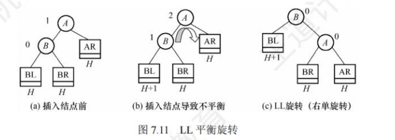
RR平衡旋转:在结点A的右孩子(R)的右子树(R)上插入了新结点
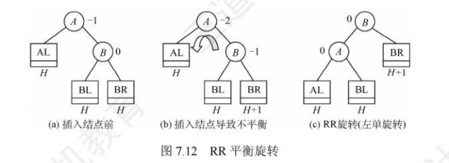
LR平衡旋转:在结点A的左孩子(L)的右子树(R)上插入了新结点，C先左旋替代B的位置，再右旋替代A的位置
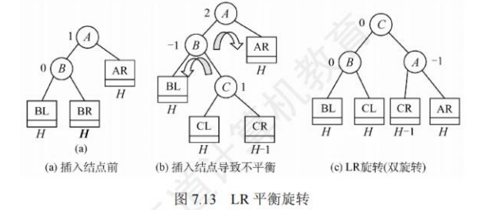
RL平衡旋转:在结点A的右孩子(R)的左子树(L)上插入了新结点
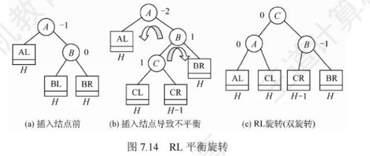

构造：类似于插入，树结点从零开始，一个数一个数的插入

删除：先删除，导致了不平衡再调整,除了要调整最小子树，还需往上一直回溯到根节点，删除可能导致上方的节点不平衡

查找：与二叉排序树相同

设$n_{h}$表示深度为$h$的平衡二叉树中含有的最少节点，易得到
$$
n_{h}=n_{h-1}+m_{h-2}+1
$$
因此根据总节点数是在那两个最少节点之间就可以判断一共有几层，要查找几次
含有$n$个节点的平衡二叉树的最大深度为$O(\log_{2}n)$，因此平均查找时间复杂度为$O(\log_{2}n)$

### 红黑树（RBT）

平衡二叉树的插入/删除很容易破坏树的平衡，调整又会导致额外的时间花销，为了解决这一问题，引入红黑树，在插入/删除时不怎么会破坏红黑特性，无需频繁调整树的状态，即便需要调整，一般常数级操作即可

```cpp
struct RBnode{
	int key;       //关键字的值
	RBnode* parent;//父节点指针
	RBnode* lChild;//左孩子指针
	RBnode* rChild;//右孩子指针
	int color;     //节点颜色
}
```

红黑树特性 ：
1. 每个结点或是红色，或是黑色的。
2. 是一种特殊的二叉排序树
3. 根结点是黑色的。
4. 叶结点(指的是虚构的外部结点、NUILL结点、失败节点)都是黑色的。
5. 不存在两个相邻的红结点(即红结点的父结点和孩子结点均是黑色的)。
6. 对每个结点，从该结点到任意一个叶结点的简单路径上，所含黑结点的数量相同。

黑高：从某节点出发（不含该结点）到达任一空叶结点的路径上黑节点的总数 
红黑树的黑高：根结点的黑高

性质

1. 从根到叶结点的最长路径不大于最短路径的两倍
>黑结点数量相同，最长路径只能是每隔一个加一个红结点
2. 有n个内部结点/关键字 的红黑树的高度$h\leq 2log_2(n+1)$
> 总高度为$h$，那么根节点的黑高肯定要$\geq \frac{h}{2}$，因此内部节点数$n\geq 2^{\frac{h}{2}}-1$,因此$h\leq 2\log_{2}(n+1)$
3. 新插入的红黑树的结点（除了根结点）初始着为红色
4. 根节点黑高为$h$的红黑树，内部结点数（关键字）至少有$2^{h}-1$个

>最少结点的情况是全部为黑结点的满二叉树，路径上的黑结点的数量要相同，必须是满二叉树


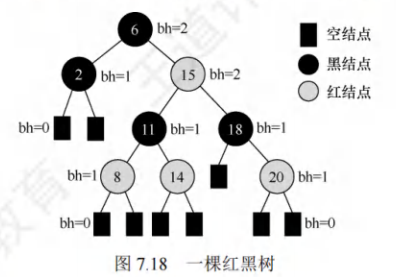
#### 红黑树插入

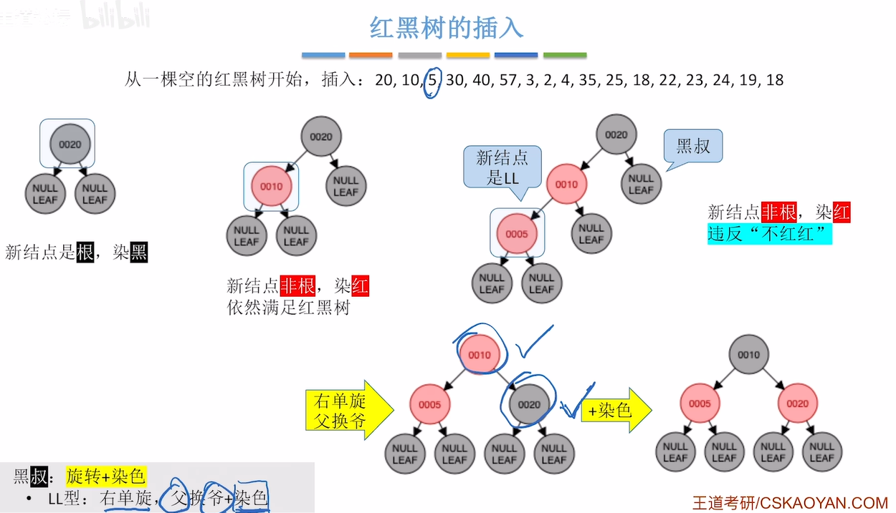
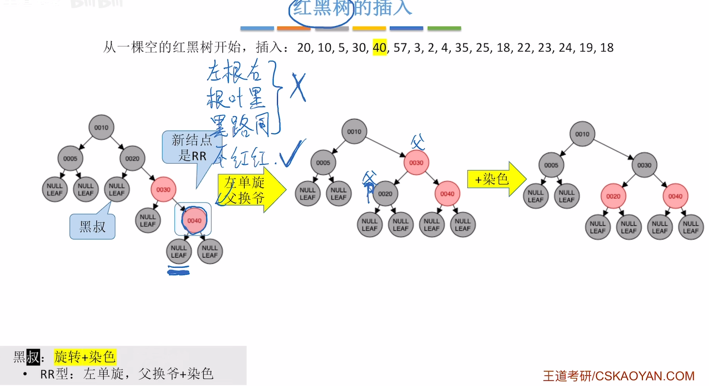

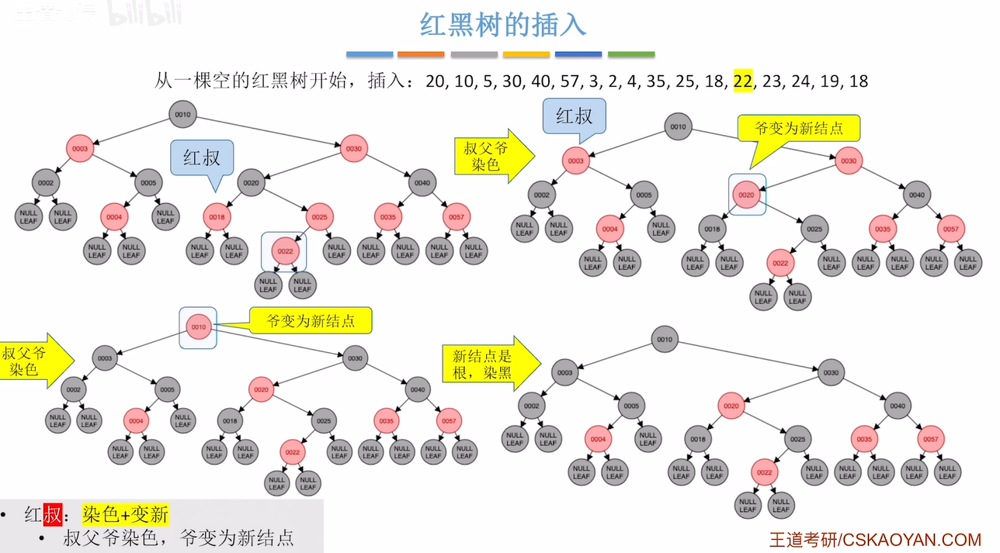

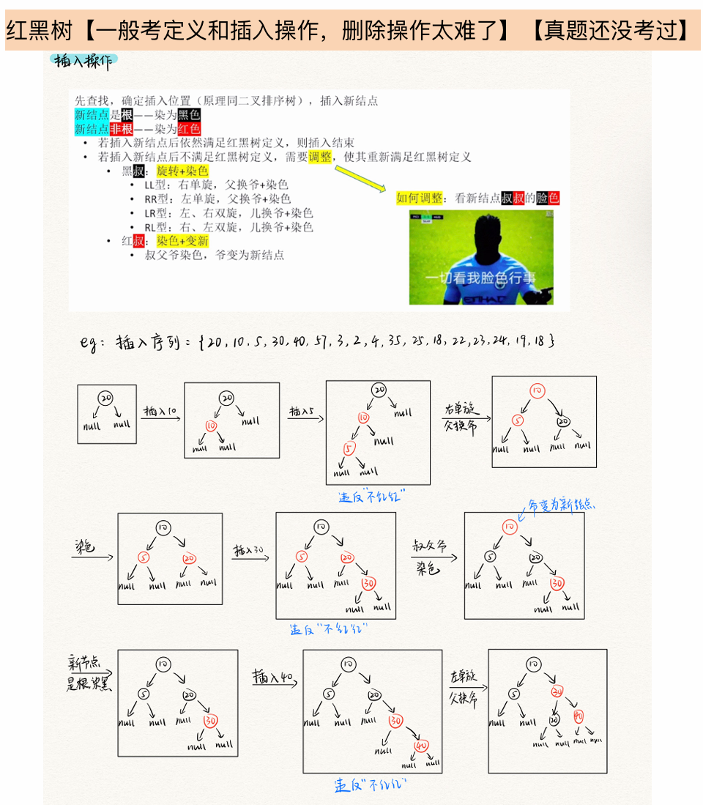

#### 红黑树删除

删除时间复杂度为$O(\log_{2}n)$，删除结点与二叉排序树的删除类似，但可能会破坏红黑树的特性，需要重新调整结点的颜色与位置

## B树和B+树

### B树及其基本操作

**多路性**：B树是一个多叉树（不是二叉树），每个节点可以有多个子节点。

**平衡性**：B树是一种平衡树，所有叶子节点位于同一层级。树的高度尽可能小，避免了链表式的长路径，对于任意结点，所有子树高度相同。

**有序性**：每个节点包含若干个关键字，并且节点内的关键字是有序的（即从左到右递增）。

**节点结构**：

- 每个节点包含若干个**键**和**指针**。
- 内部节点包含的键用于引导查找。
- 每个节点中有 `t-1` 个键和最多 `t` 个子节点，其中 `t` 称为树的**阶**（阶数）。

所有结点的平衡因子均等于0的m路平衡查找树，就是左右子树的高度相同，实际是二叉搜索树的一般化，即多叉搜索树。

|              | 根结点 | 非根结点        |
| ------------ | ------ | --------------- |
| 关键字至少有 | 1      | $\frac{m}{2}-1$ |
| 关键字至多有 | m-1    | m-1             |
>$\frac{m}{2}-1$向上取整

一棵`m`阶`B`树或为空树，或为满足如下特性的`m`叉树：

- 树中每个结点至多有`m`棵子树，即至多有`m-1`个关键字
- 除根结点外的所有非叶结点至少有`m/2`棵子树，即至少有`m/2-1`个关键字
- 若根结点不是叶结点，则至少有2棵子树，即至少有1个关键字
- 所有非叶结点的结构如下：
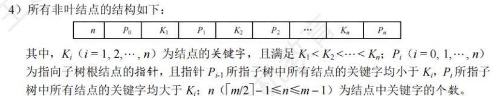
- 所有叶子结点都出现在同一层次上，且不带信息。

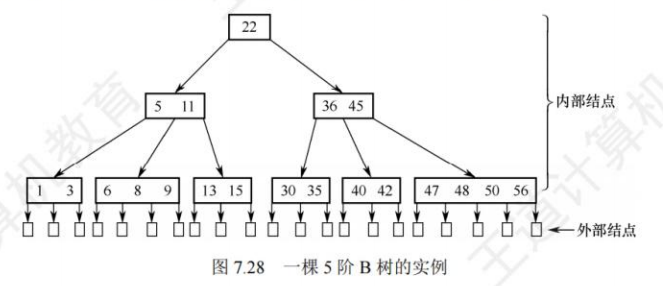

在B树中，叶子结点即为外部结点，不包含任何信息。
n个关键字的B树必有n+1个叶子结点，n个关键字将范围划分为n+1个区间

含$n$个关键字的$m$阶$B$树，最小高度为$h\geq \log_{m}(n=1)$，最大高度为$h\leq \log_{\frac{m}{2}}\left( \frac{n+1}{2}+1 \right)$
> 可以用结点算，也可以用关键字数来进行计算
> 要树尽可能满，因此$n\leq(m-1)(1+m+m^{2}+\dots+m^{h-1})$，因此$h\geq \log_{m}(n=1)$
> 要让树尽可能的高，设树高为$h$，每一层的**结点**个数分别为$1,2,2* \frac{m}{2},2*\left( \frac{m}{2} \right)^{2}\dots_{2}*\left( \frac{m}{2} \right)^{h-2}$，因此$n+1\geq 2*\left( \frac{m}{2} \right)^{(h-1)}$,所以$h\leq \log_{\frac{m}{2}}\left( \frac{n+1}{2}+1 \right)$
#### 插入

每次插入是插入树最底层的结点

当未超过当前结点关键字的最大容量的话直接插入，超过的话将$\frac{m}{2}$分别向上向下取整，两边部分作为子树，中间的关键字上传到父节点，如果传上去导致父结点超了，再同类上传

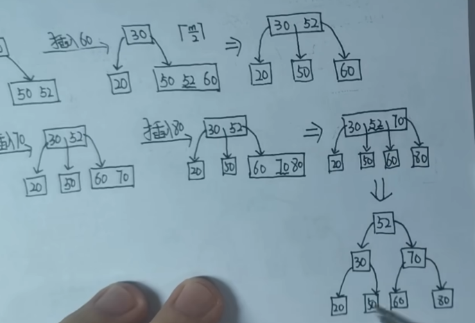

#### 删除

删除非终端结点
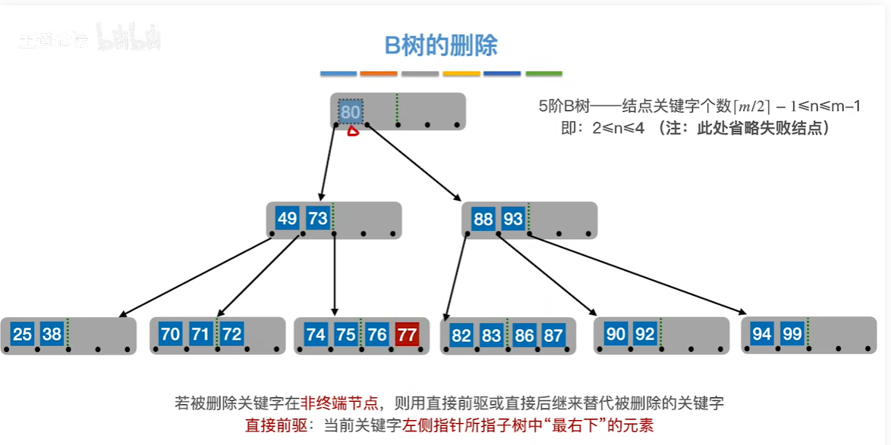

要删除终端节点，当关键字个数大于$\frac{m}{2}-1$可直接删除

当不满足该条件时，若右兄弟宽裕，将该节点的后继关键字放入该节点当中，后继关键字的后继关键字顶替原来后继关键字的位置
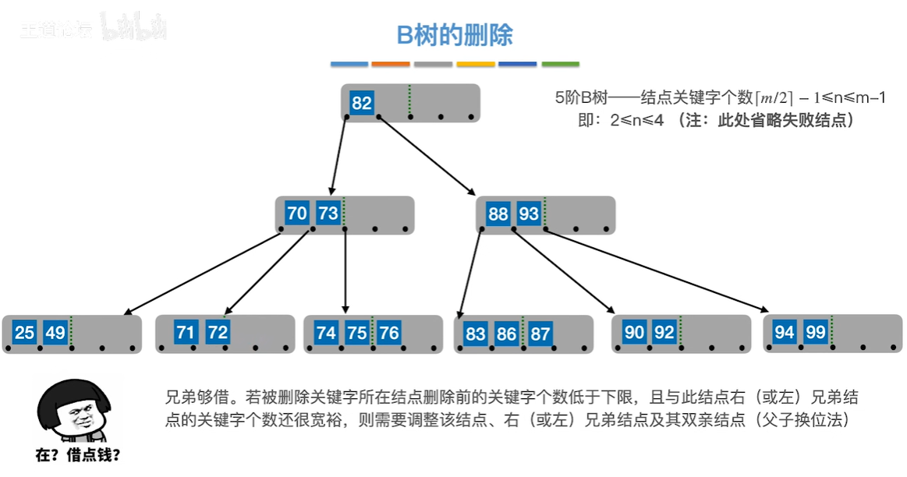

借左兄弟也同理，如下图中删除60结点的情况
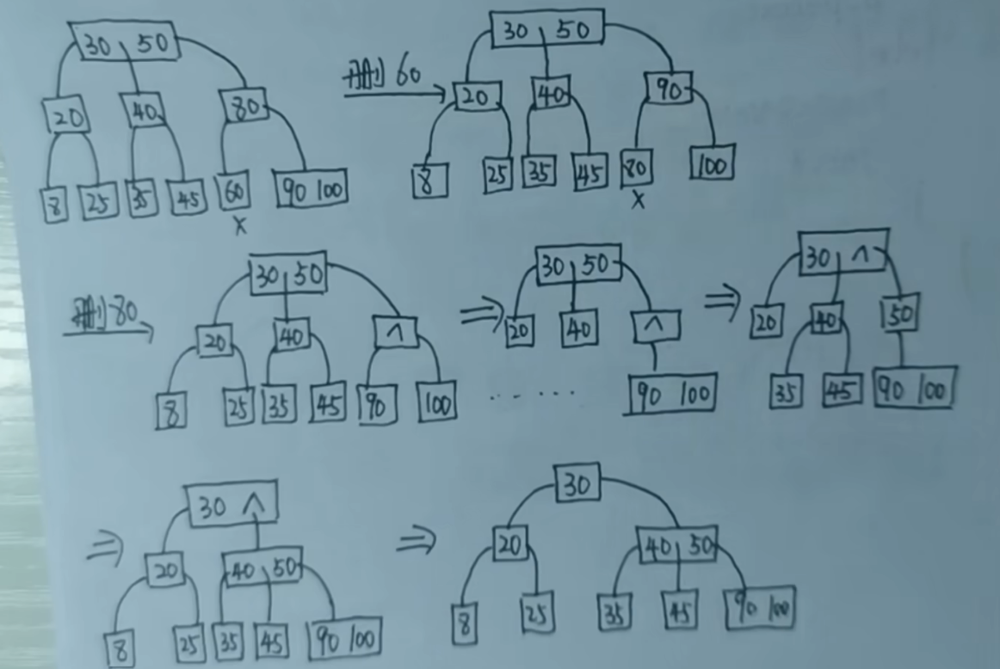

若左右结点都不够，将本结点，兄弟结点，对应父节点的关键字合并，如上图删除80结点的例子


### B+树的基本概念

有点类似于分块查找，通过一些标志，找到对应的块

在B+树中叶子结点并不指的是空结点

一棵m阶的B+树应该满足：
1. 每个分支结点最多有m棵子树
2. 当根节点不是叶子结点的时候，至少有2棵子树，其余每个分支结点至少有$\frac{m}{2}$棵子树，向上取整
3. 结点子树的个数等于当前结点的关键字个数
4. 所有叶结点包含全部关键字及指向相应记录的指针，叶节点中将关键字按大小顺序排列，且相邻叶节点按大小顺序相互链接起来
5. 所有分支结点中，仅包含它的各个子结点中关键字的最大值以及指向该子结点的指针


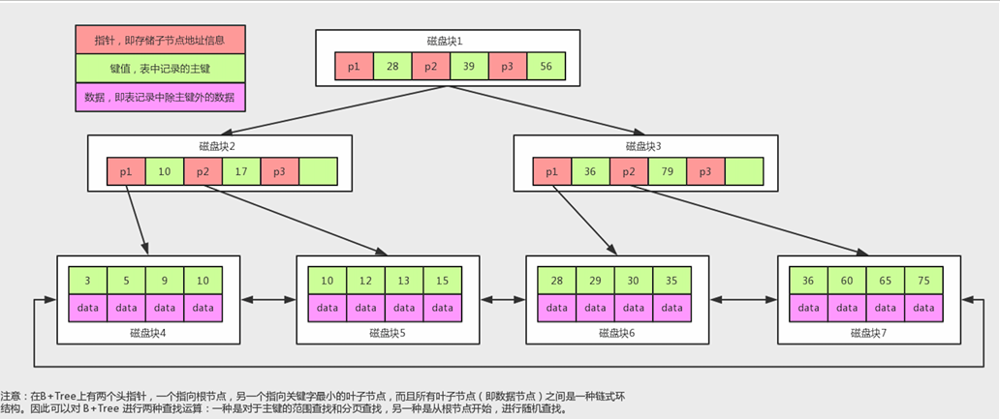
同时也支持顺序查找，直接按顺序查找叶子结点，B+内的非叶子结点不是实际的关键字，至少作为标志，指向对应的叶子结点或关键字的方向
### B树与B+树的对比

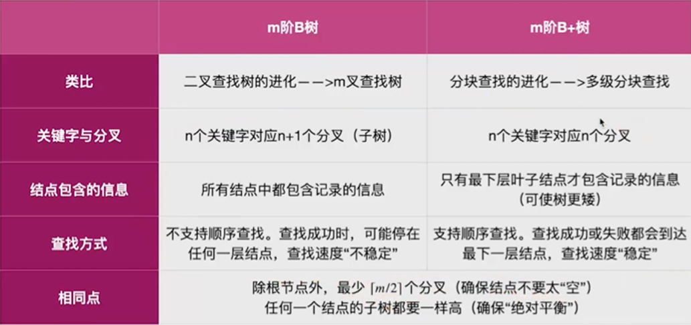

## 散列表（Hash）

### 散列表的基本概念

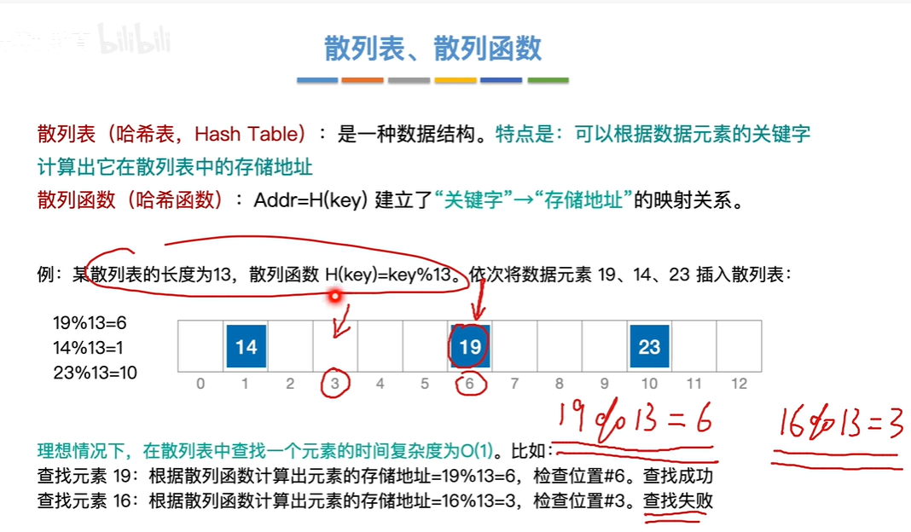

- 散列函数：一个把查找表中的关键字映射成该关键字对应地址（数组下标，索引，内存地址）的函数
- 散列表/哈希表：一种根据关键字直接进行访问的数据结构。它建立了关键字到存储地址的直接映射。
- 冲突：散列函数会把两个或两个以上的不同关键字映射到同一地址
- 同义词：发生冲突的不同关键字

> 1. 散列函数设计要尽量减少冲突
> 2. 冲突不可避免，还需要设计好处理冲突的方法


### 散列函数构造方法

注意点：

1. 散列函数的定义域必须包含全部关键字，而值域的范围依赖于散列表的大小
2. 散列函数计算出的地址应尽可能均匀分布在整个地址空间，尽可能地减少冲突
3. 散列函数应当尽量简单，能在较短时间内计算出任意一个关键字对应的散列地址 

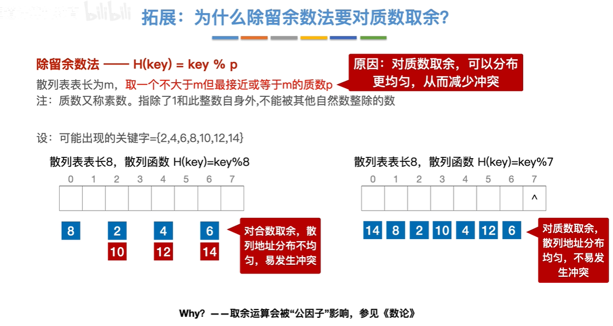

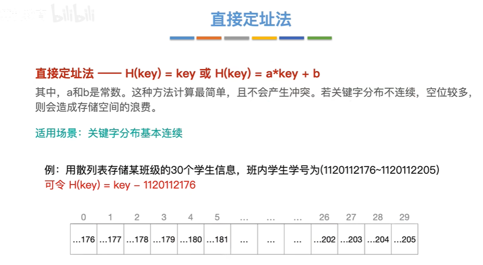
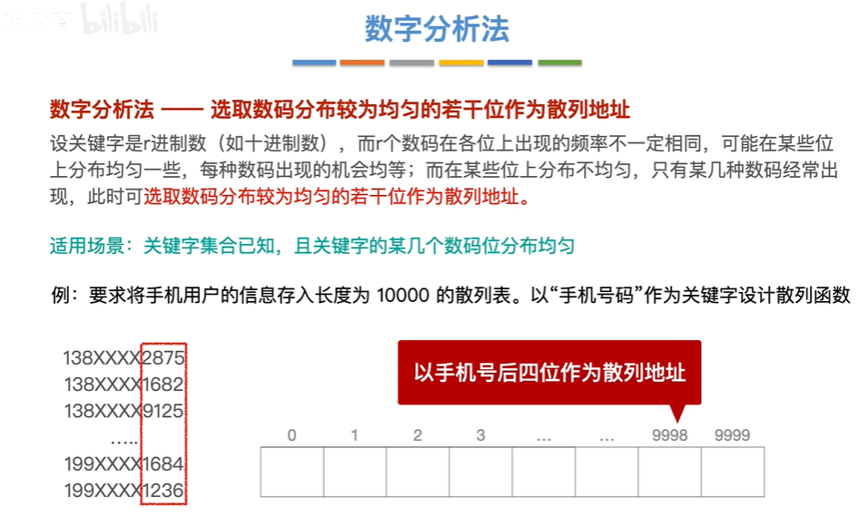

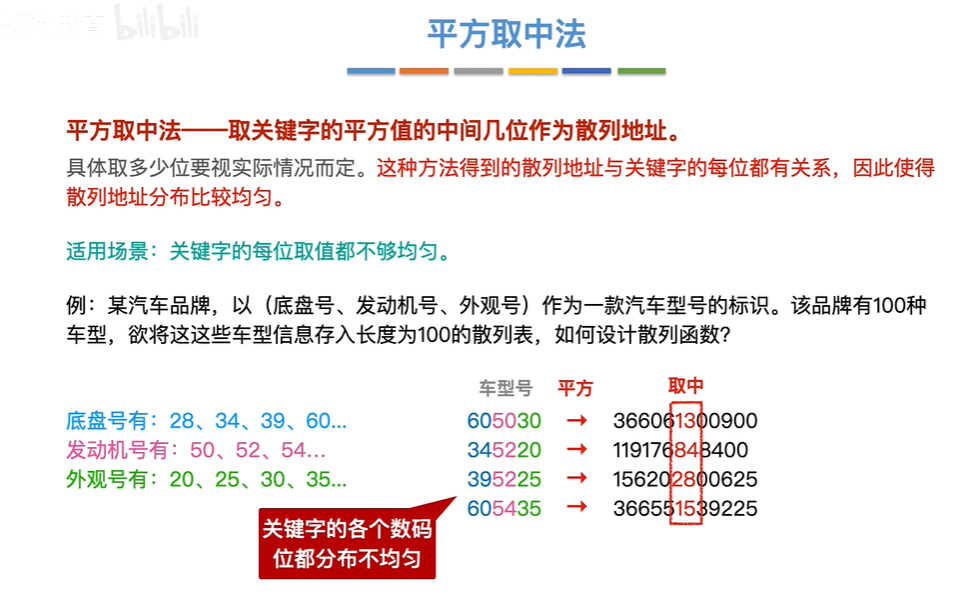


### 处理冲突的方法

#### 开放地址法

发生冲突给新元素找另一个空闲的位置

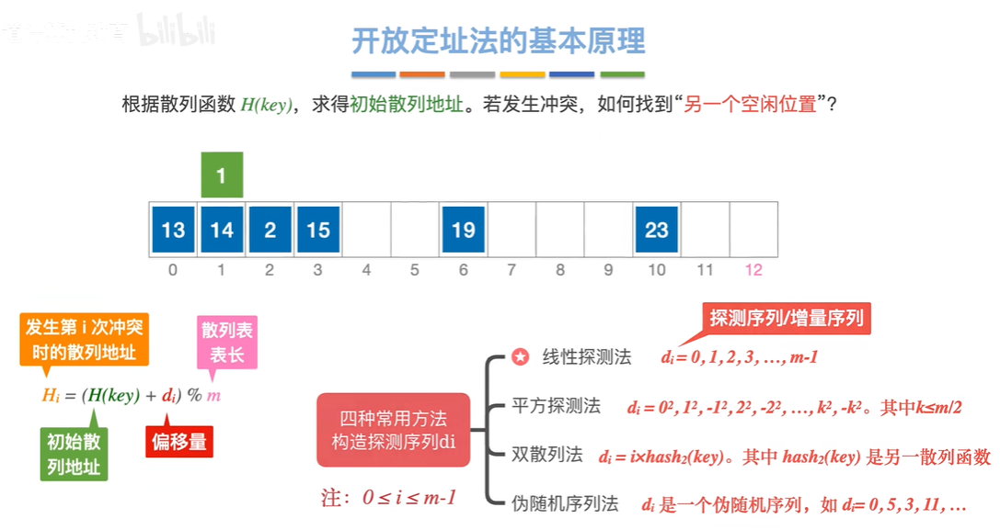


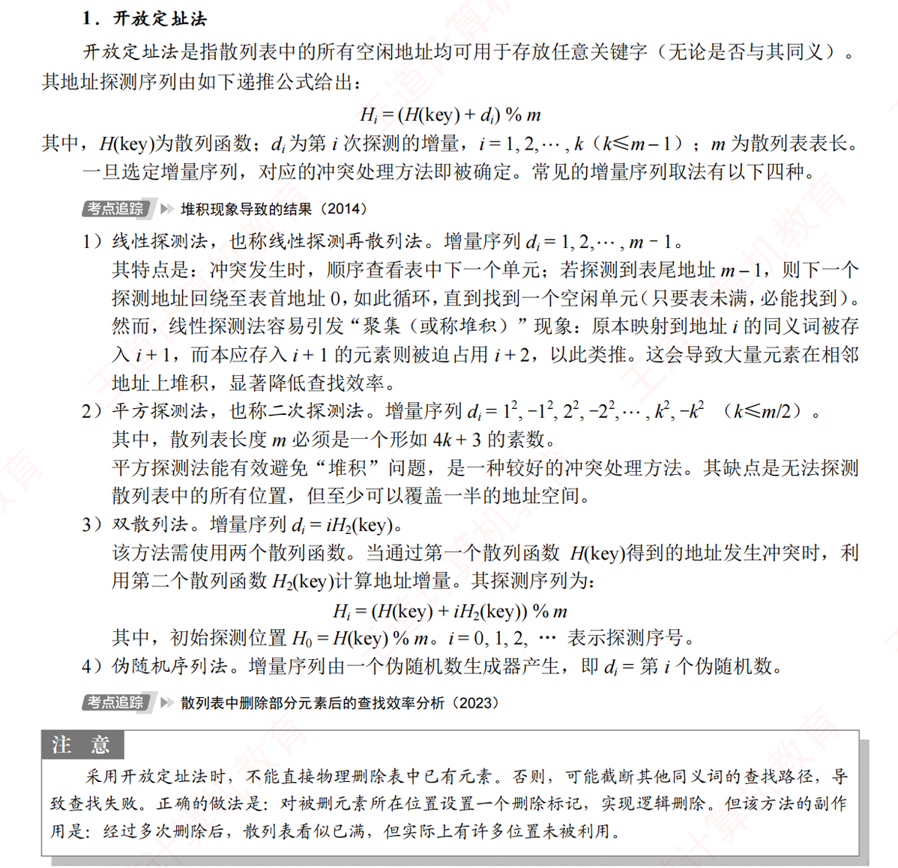
删除数据的时候只进行逻辑删除，不进行物理删除，不然当前位置为空不能往下找到对应的关键字
>可以不定期的整理散列表的内容，将关键字挪回原位置，插入的时候可以直接插入删除的位置

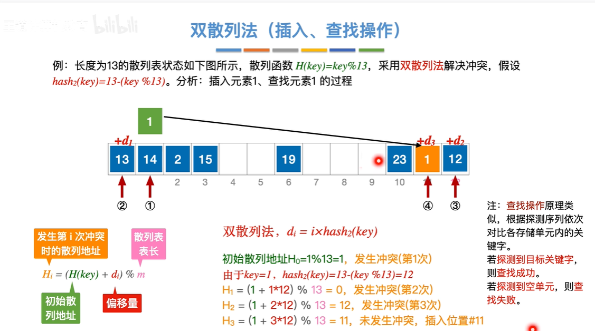
#### 拉链法

把同义词通过一个链表存储在同一位置，可分为头插法和尾插法，即插到链表的头或者插到链表的尾

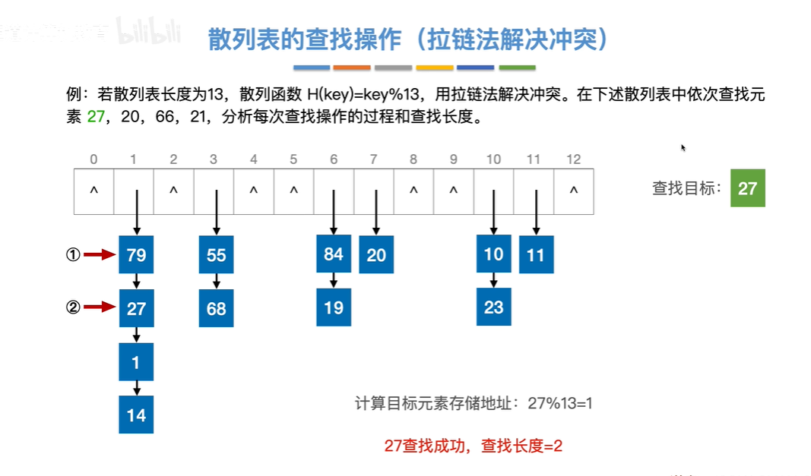

### 散列查找及其性能分析

分析散列查找的平均查找长度
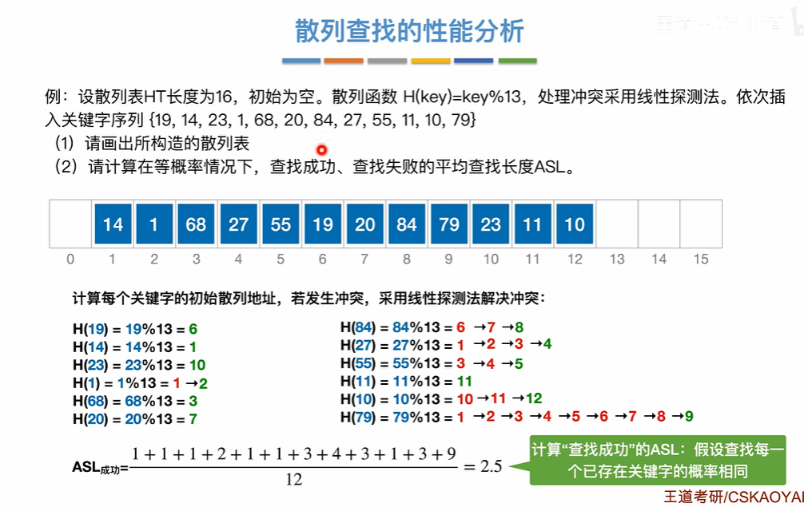
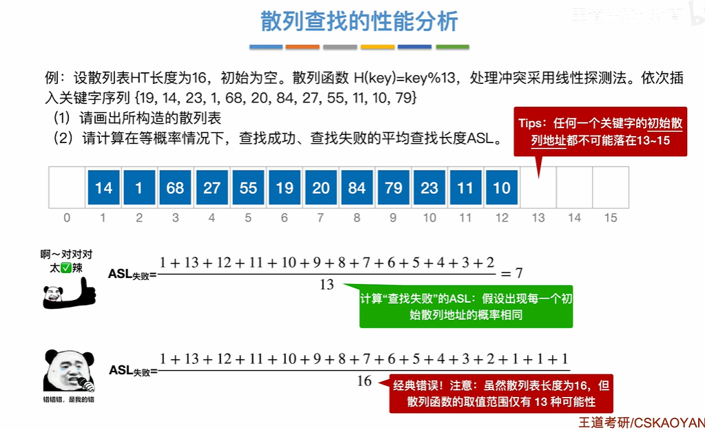
查找失败：每个位置确定一个对应在这个位置，但不在该散列表的数据需要比较的次数
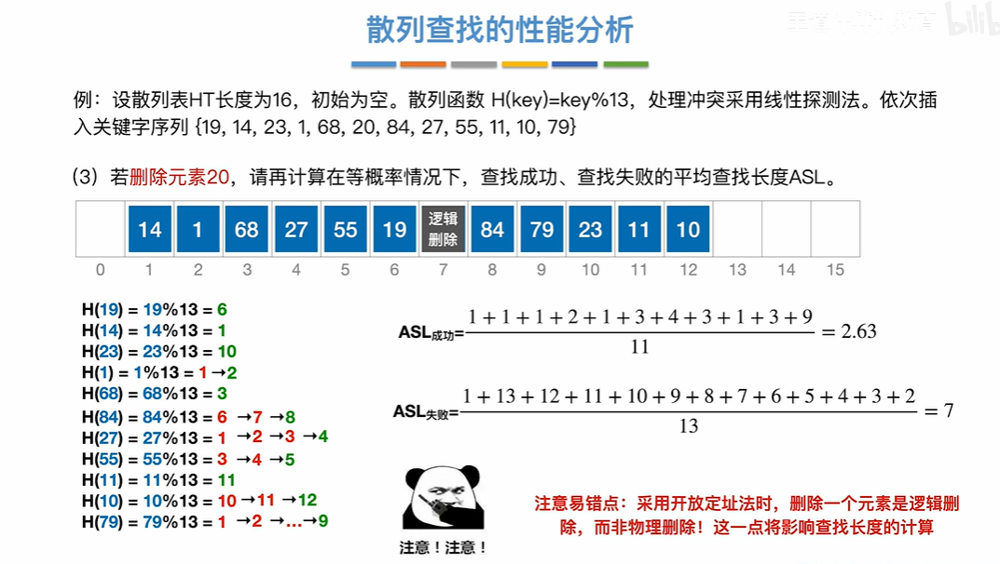

 散列表的装填因子$\alpha = \frac{表中记录数n}{散列表长度m}$
 装填因子越大，越容易发生冲突，从而导致插入、查找操作效率降低，ASL（平均查找长度）增大
 
聚集/堆积现象：在处理冲突的过程中，几个初始散列地址不同的元素争夺同一个后继散列地址