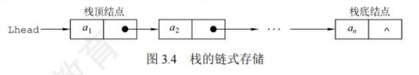
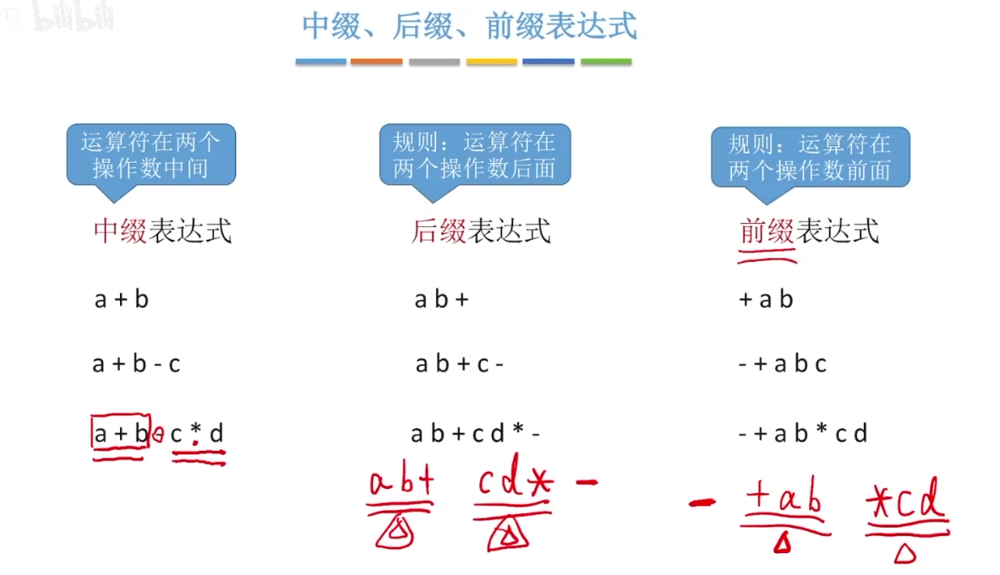
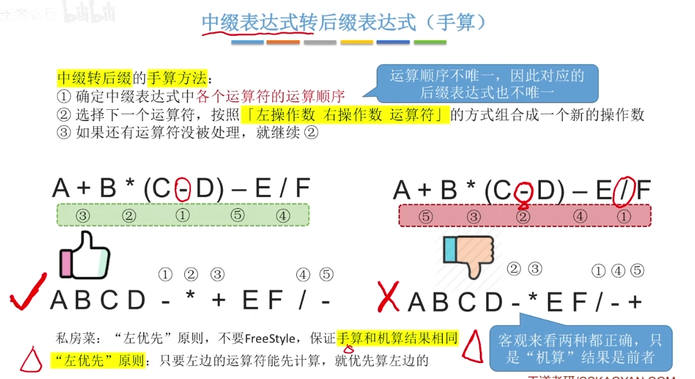
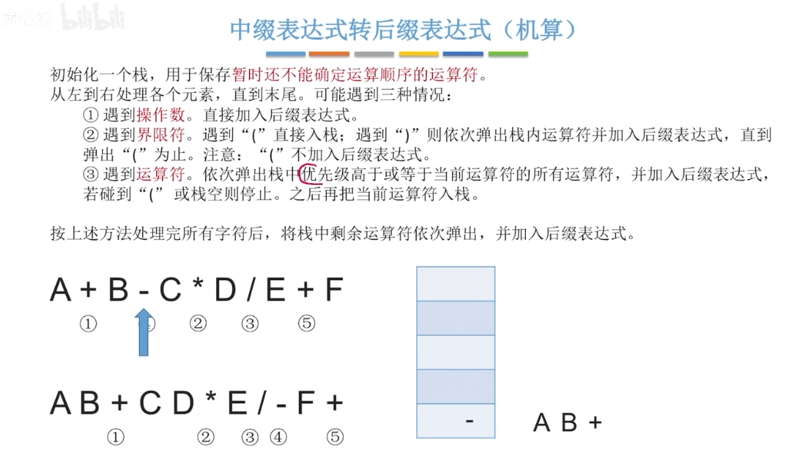
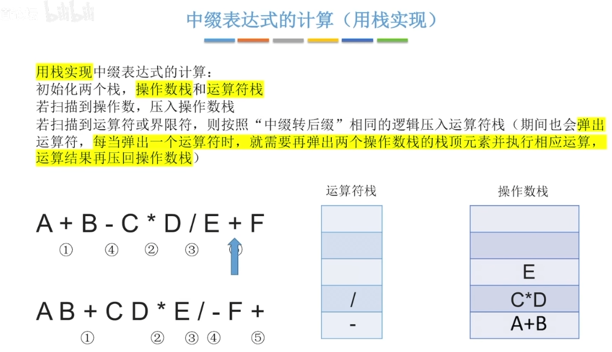
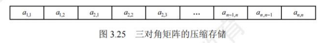
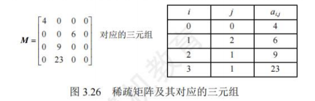

## 栈

### 栈的基本概念

栈(Stack)是仅允许在一端进行插入和删除操作的线性表。作为一种特殊的线性表，栈的插入(入栈)和删除(出栈)操作被限制在表的一端进行

栈顶(Top):允许进行插入和删除操作的一端。
栈底(Bottom):固定不变、不允许进行插入和删除操作的另一端。
空栈:不含任何元素的栈。

卡特兰数公式：当n个不同元素进栈时，出栈元素不同排列的个数为$\frac{1}{n+1}C_{2n}^n$
>转化为路径问题，向右代表进栈，向上代表出栈，从$(0,0)$走到$(n,n)$
### 栈的顺序存储结构

**顺序栈实现**

```cpp
#include <iostream>
using namespace std;

#define MAXSIZE 100
typedef int datatype;

typedef struct seqstack {
    datatype elem[MAXSIZE];
    int top;
} seqstack;

void init(seqstack *s) {
    s->top = -1;
}

int empty(seqstack s) {
    return (s.top == -1 ? 1 : 0);
}

void push(seqstack *s, datatype x) {
    if (s->top == MAXSIZE - 1) {
        cout << "栈满" << endl;
        exit(1);
    }
    s->top++;
    s->elem[s->top] = x;
}

datatype pop(seqstack *s) {
    datatype x;
    if (s->top == -1) {
        cout << "栈空" << endl;
        exit(1);
    }
    x = s->elem[s->top];
    s->top--;
    return x;
}
```

**共享栈**
两个栈的栈底分别设置在共享空间的两端，两个栈的栈顶向共享空间的中间延伸

上溢是指存储器满，还往里写;
下溢是指存储器空，还往外读。
### 栈的链式存储结构

采用链式存储的栈称为链栈，链栈的优点是便于多个栈共享存储空间和提高其效率，且不存在栈满上溢的情况。通常采用单链表实现，并规定所有操作都是在单链表的表头进行的。这里规定链栈没有头结点，Lhead指向栈顶元素



采用链式存储，便于结点的插入与删除。链栈的操作与链表类似，入栈和出栈的操作都在链表的表头进行。需要注意的是，对于带头结点和不带头结点的链栈，具体的实现会有所不同。

```cpp
typedef struct Linknode{
  ElemType data;
  struct Linknode *next;
}LiStack
```

`top`指向栈顶元素节点，`top->next`指向第二个元素的节点
## 队列

### 队列的基本概念

向队列中插入元素称为入队，删除元素称为出队
- 队头`front`：允许删除的一端，也称为队首
- 队尾`rear`：允许插入的一端

指针指向当前元素还是下一个位置看具体题目，不同教材约定形式不同

一端进一端出，也是一种受限的线性表，头尾指针只能++
### 队列的顺序存储结构

顺序存储

代码实现

```cpp
typedef struct
{
    datatype elem[MAXSIZE];
    int front;
    int rear;
} sequeue;
void initq(sequeue *q)
{
    q->front = q->rear = -1;
}

void printq(sequeue *q)
{
    int i;
    if (q->front == q->rear)
        printf("循环队列是空的");
    else
        for (i = q->front + 1; i <= q->rear; i++)
        {
            printf("%5d", q->elem[i]);
            if ((i + 1) % 10 == 0)
                printf("\n");
        }
    printf("\n\n");
}
void add(sequeue *q, datatype x)
{
    if ((q->rear + 1) % MAXSIZE == q->front)
    {
        cout << "队满" << endl;
        exit(1);
    }
    q->rear = (q->rear + 1) % MAXSIZE;
    q->elem[q->rear] = x;
}
```

假溢出问题：队头到达最大空间，队尾后面仍有空闲的存储空间

循环队列：充分利用闲置的存储空间
- 队首指针：`front=(front+1)%MaxSize`
- 队尾指针：`rear=(rear+1)%MaxSize`
- 队列长度：`(MaxSize+rear-front)%MaxSize`

`Q.front==Q.rear`可能表示队空也可能表示队满，这里`rear`指向的是队尾的下一个位置

如何判断队满还是队空：
1. 牺牲一个存储单元，这个存储单元不放入数据，这样队尾下一个位是对首则表示队满，两指针值相等为对空，即`队尾+1=队首`
2. 增设计数位，入队成功加，出队成功减，记录队内元素的个数
3. 增设标志位，来确定是哪个操作导致两个指针相等，入队导致，表示队满，出队导致，表示队空
没说默认第一种方案
### 队列的链式存储结构

实际为一个有队头与队尾指针的单链表，队首指针指向队头结点，队尾指针指向队尾结点

```cpp
typedef struct LinkNode{
	ElemType data;
	struct LinkNode *next;
}LinkNode
typedef struct{
	LinkNode *front, *rear*
}LinkQueue;
```

### 双端队列

输出受限的双端队列：允许在一段进行插入和删除，但在另一端只允许插入的双端队列
输入受限的双端队列：允许在一端进行插入和删除，但在另一端只允许删除的双端队列


## 栈和队列的应用

### 用栈实现括号匹配

当遇到左括号时压入栈中，当遇到右括号时弹出至左括号的位置

```cpp
bool bracketCheck(char str[], int length) {
    SqStack S;
    InitStack(S);  // 初始化一个栈
    for (int i = 0; i < length; i++) {
        // 扫描到左括号，入栈
        if (str[i] == '(' || str[i] == '[' || str[i] == '{') {
            Push(S, str[i]);
        } else {
            // 扫描到右括号，且当前栈空 → 匹配失败
            if (StackEmpty(S))
                return false;
            
            char topElem;
            Pop(S, topElem); // 栈顶元素出栈
            
            // 右括号和栈顶左括号不匹配
            if(str[i] == ')' && topElem != '(')
                return false;
            if(str[i] == ']' && topElem != '[')
                return false;
            if(str[i] == '}' && topElem != '{')
                return false;
        }
    }
    // 检索完全部括号后，栈空说明全部匹配成功
    return StackEmpty(S);
}
```

### 栈在表达式当中的应用

算数表达式由操作数、运算符、界限符（括号）组成

中缀表达式：运算符在两个操作数中间
后缀表达式（逆波兰表达式）：运算符在两个操作数的后面
前缀表达式（波兰表达式）：运算符在两个操作数的前面

>正常的中缀表达式只是适合人类阅读，不适合机器来阅读处理






每遇到一个运算符，就让运算符前面最近的两个操作数进行运算，并把整个整体看作一个操作数

栈实现后缀表达式的计算：将表达式的内容挨个压入栈中，目前为运算符则出栈栈顶两个元素，并将运算的结果压入栈中，最后栈里的元素就是最后的运算结果

前缀表达式同理，只不过是右优先原则，以及从右侧开始将元素压入栈中



### 递归也是用的栈空间

### 队列的应用

树的层次遍历与图的广度优先遍历
## 数组和特殊矩阵

### 数组

由n个相同数据元素构成的有限序列。每个元素称为数组元素，其在线性序列中的位置由下标标识，下标的取值范围称为维界。

与线性表的关系：
数组是线性表的推广。一维数组可视为一个线性表;二维数组可视为其元素是定长数组的线性表，以此类推。数组一旦被定义，其维数和维界就不再改变。

多维数组展开称一维的方式：

按行优先：第一行保留，第二行的元素接在第一行的后面
按列优先：按照列的顺序，将数组内的元素顺序存放到一行当中
### 矩阵

压缩矩阵：为多个值相同的元素只分配一个存储空间，对零元素不分配空间
特殊矩阵：指具有大量相同元素或零元素，且这些元素分布具有规律性的矩阵。常见的特殊矩阵有对称矩阵、上（下）三角矩阵、对角矩阵等。

特殊矩阵的压缩存储：通过分析矩阵中相同元素的分布规律，仅存储一份实际数据，其余的可通过下标映射访问，从而将原本冗余的数据压缩到一个共享的空间中，显著节省内存。

**现场根据题目推，不要记**，注意看行优先还是列优先

1. 对称矩阵$a_{ij}=a_{ji}$:
   将下三角存放在一维数组$\left[ \frac{n(n+1)}{2} \right]$中，$a_{ij}$下标$=1+2+...+(i-1)+j-1=\frac{i(i-1)}{2}+j-1$（从0开始）

2. 三角矩阵（另一三角区元素为同一常量）：
   类比对称矩阵，在数组最后添加一个常数项
3. 三对角矩阵(带状矩阵)：非零元素集中在以主对角线为中心的三条对角线的区域，其他区域的元素为零
   

稀疏矩阵：非零元素远少于矩阵元素，通常仅存储非零元素与它们所在的位置


此外还需要包含原数组的行数和列数
