## 内部排序

内部排序：排序期间元素全部存放再内存中的排序，主要是分为比较和移动两部分，基数排序是非比较排序
外部排序：排序期间元素无法全部同时存放在内存中，必须在排序的过程中根据要求不断地在内、外存之间移动的排序.

### 插入排序

#### 直接插入

```cpp
void insertionSort(vector<int>& arr) {
    int n = arr.size();
    for (int i = 1; i < n; ++i) {
        int key = arr[i];
        int j = i - 1;
        // 将 arr[i] 插入到已排序的 arr[0..i-1] 中
        while (j >= 0 && arr[j] > key) {
            arr[j + 1] = arr[j];
            j = j - 1;
        }
        arr[j + 1] = key;
    }
}

//往左进行比较排序，实现0~i位置上的有序
public static void insertionSort(int[] arr){
    if (arr == null || arr.length < 2){
        return;
    }
    for (int i = 1; i < arr.length; i++){
		for (int j = i - 1; j >= 0 && arr[j] > arr[j+1]; j--){
            //两个交换一直交换到小于的地方，等同于先记录数据再后移一位
            swap(arr, j, j + 1);
        }
    }
}
```

 **先找位置，后移，再插入**通常情况下会更好一点，因为`swap`相当于是三次赋值，不如边比的时候边将元素往后移
 ```cpp
 int key = arr[i];      // ①保存
int j = i - 1;
while (j >= 0 && arr[j] > key) {
    arr[j + 1] = arr[j]; // ②后移
    j--;
}
arr[j + 1] = key;      // ③插入

 ```
#### 折半插入

其实就是基于二分查找，找到要插入的位置，然后再把大的全部往后移。

#### 希尔排序
例子： **[8, 9, 1, 7, 2, 3, 5, 4, 6, 0]**，**步长序列：5 → 2 → 1**
第一轮
```
下标：0  1  2  3  4  5  6  7  8  9
数组：8  9  1  7  2  3  5  4  6  0

按gap=5分组：
组1: 位置0,5   → [8, 3]
组2: 位置1,6   → [9, 5]
组3: 位置2,7   → [1, 4]
组4: 位置3,8   → [7, 6]
组5: 位置4,9   → [2, 0]

对每组进行插入排序

组1: [8, 3] → [3, 8]
组2: [9, 5] → [5, 9]
组3: [1, 4] → [1, 4]
组4: [7, 6] → [6, 7]
组5: [2, 0] → [0, 2]

结果：3  5  1  6  0  8  9  4  7  2
```

第二轮

```
数组：3  5  1  6  0  8  9  4  7  2

按gap=2分组：
组1: 位置0,2,4,6,8 → [3, 1, 0, 9, 7]
组2: 位置1,3,5,7,9 → [5, 6, 8, 4, 2]

对里面每组进行插入排序

组1: [3, 1, 0, 9, 7] → [0, 1, 3, 7, 9]
组2: [5, 6, 8, 4, 2] → [2, 4, 5, 6, 8]

结果：0  2  1  4  3  5  7  6  9  8

```

第三轮

```
数组：0  2  1  4  3  5  7  6  9  8
已经接近有序！

进行标准插入排序：
结果：0  1  2  3  4  5  6  7  8  9
```


```cpp
void shellSort(vector<int>& arr) {
    int n = arr.size();   
    // 初始gap为n/2，每次减半,控制步长
    for (int gap = n / 2; gap > 0; gap /= 2) {
        
        // 对每个分组进行插入排序
        // i从gap开始，相当于每组的第2个元素开始，遍历所有元素
        for (int i = gap; i < n; i++) {
            int temp = arr[i];
            int j = i;
            
            // 在当前组内进行插入排序
            // j-=gap 实现组内的前一个元素，组内进行插入排序
            while (j >= gap && arr[j - gap] > temp) {
                arr[j] = arr[j - gap];
                j -= gap;
            }
            arr[j] = temp;
        }
    }
}
```

### 选择排序

```java
//每轮找到最小值与i位置交换
public static void selectionSort(int[] arr){
    if (arr == null || arr.length < 2){
        return;
    }
    for (int minIndex, i = 0; i < arr.length - 1; i++){
        minIdex = i;
        for (int j = i + 1; j < arr.length; j++){
            if (arr[j] < arr[minIndex]){
                minIndex = j;
            }
        }
        swap(arr, i, minIndex);
    }
}
```

### 冒泡排序

```java
//大数下沉
public static void bubbleSort(int[] arr){
    if (arr == null || arr.length < 2){
        return;
    }
    for (int end = arr.length - 1; end > 0; end--){
        for (int i = 0; i < end; i++){
            if (arr[i] > arr[i+1]){
                swap(arr, i, i+1);
            }
        }
    }
}
```

### 快速排序

见重要排序算法的[快排](https://cwdpsky.top/重要排序算法/#随机快速排序)
```cpp
#include <iostream>
#include <vector>
#include <cstdlib>
#include <ctime>
using namespace std;

vector<int> arr;
int a, b;//分别为左侧数组的右边界和右侧数组的左边界

void swap(int &a, int &b) {
    int temp = a;
    a = b;
    b = temp;
}

void partition(int l, int x, int r) {
    a = l, b = r;
    int i = l;
    while (i <= b) {
        if (arr[i] < arr[x]) {
            swap(arr[a], arr[i]);
            a++;
            i++;//这里i要+1，因为换的数必然是i的左侧或者本身，已经被处理过了，不用再继续处理
        } else if (arr[i] > arr[x]) {
            swap(arr[b], arr[i]);
            b--;//这里i换的是右侧的数，没有被处理过，需要重新对本位置进行判断
        } else {
            i++;
        }
    }
    return;
}

void quicksort(int l, int r) {
    if (l < r) {
        int x = l + rand() % (r - l + 1);
        partition(l, x, r);
        int left = a, right = b;
        quicksort(l, left - 1);
        quicksort(right + 1, r);
    }
}

int main() {
    srand(time(0)); // 初始化随机数生成器
    int n;
    cin >> n;
    arr.resize(n);
    for (int i = 0; i < n; i++) {
        cin >> arr[i];
    }
    quicksort(0, n - 1);
    for (int i = 0; i < n; i++) {
        cout << arr[i] << " ";
    }
    return 0;
}
```

###  堆排序

删除顶部元素后将最后一个元素换到堆顶

见[堆排序](https://cwdpsky.top/堆及堆排序/))

### 归并排序

见重要排序算法的[归并排序](https://cwdpsky.top/重要排序算法/#归并排序))

### 基数排序

见重要排序算法的堆[基数排序](https://cwdpsky.top/重要排序算法/#基数排序))

## 外部排序

对存在磁盘当中的数据进行排序

使用归并排序，最少只需在内存中分配三块大小的缓冲区即可对任意一个大文件进行排序

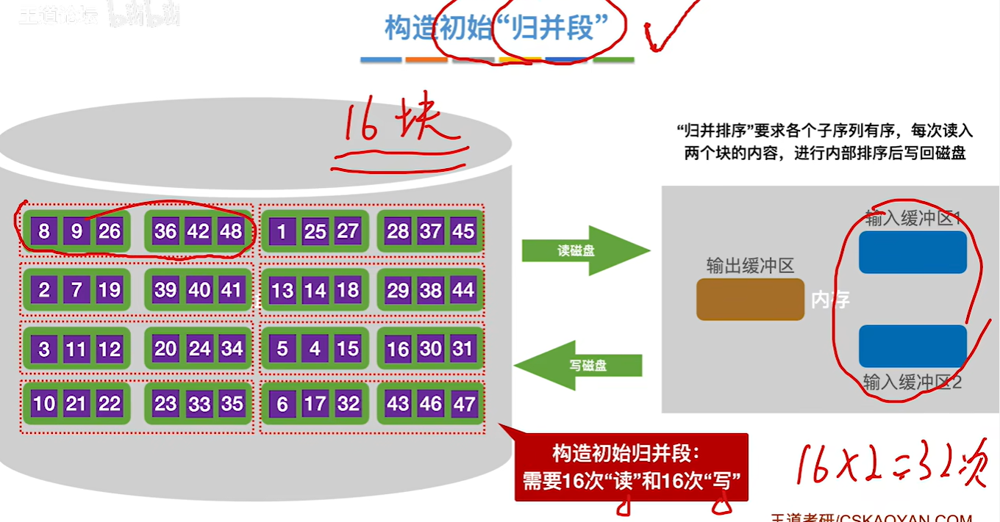

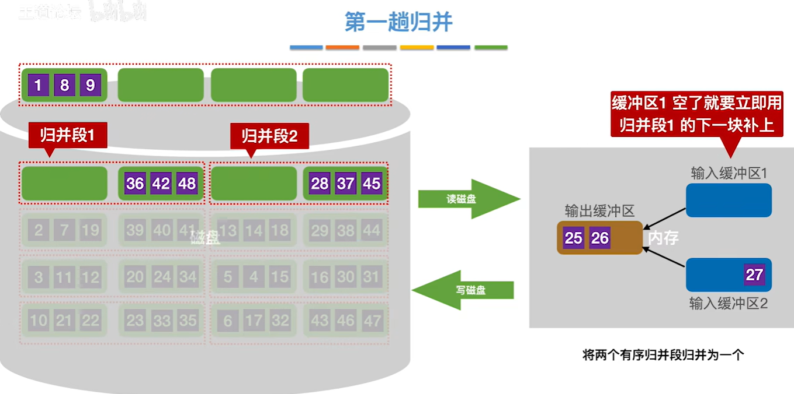

将两个归并段归并为一个更长的整体

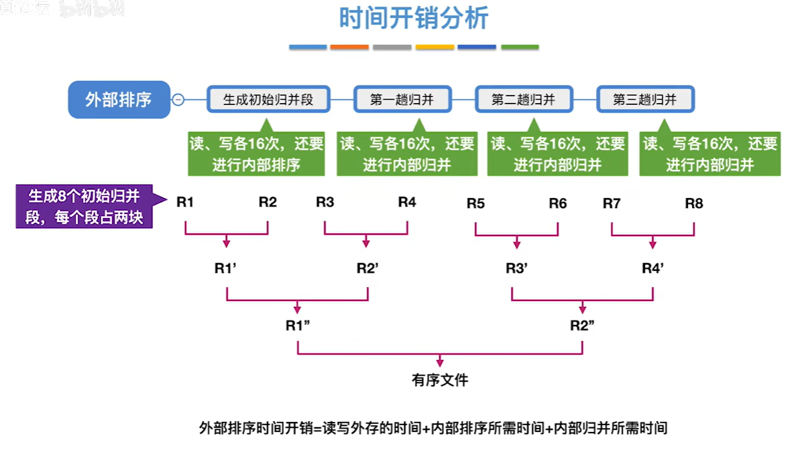

可以通过多路归并来减少归并的趟数

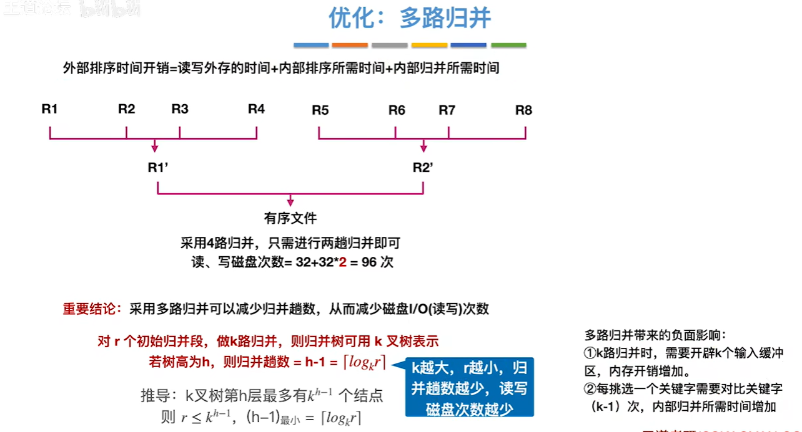

增加缓冲区的大小不仅能实现多路归并，同时也会使得一开始生产的初始归并段的数量减小

### 败者树

针对找出多路归并段内最小值这一过程进行优化，可以留存比较记录

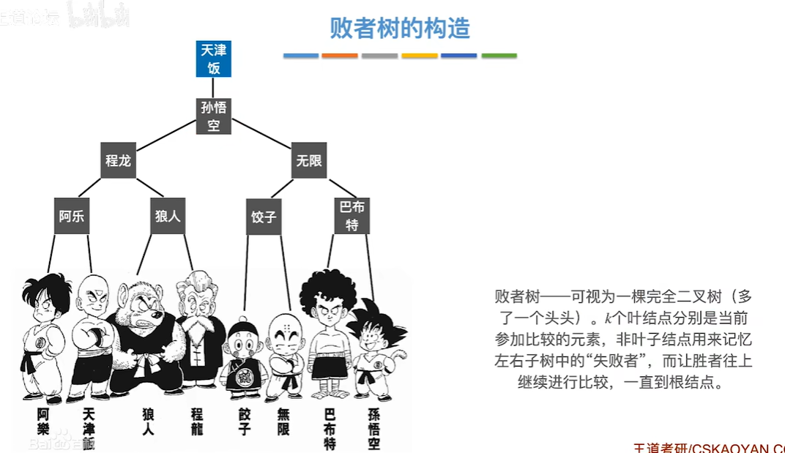

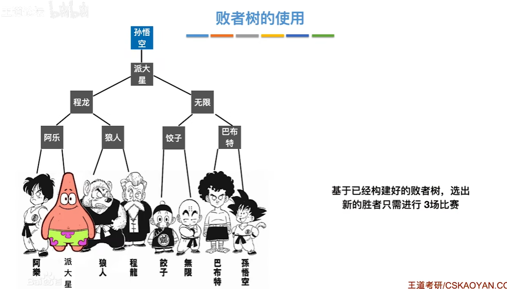
值出去后新值代替原来的位置

设最下一层为$h$，关键字为个数为$k$,则叶子结点树为$2^{h-1}$,因此$k\leq2^{h-1}$，所以最多只需要比较$\log_{2}(k)$次就能找到最大/最小值

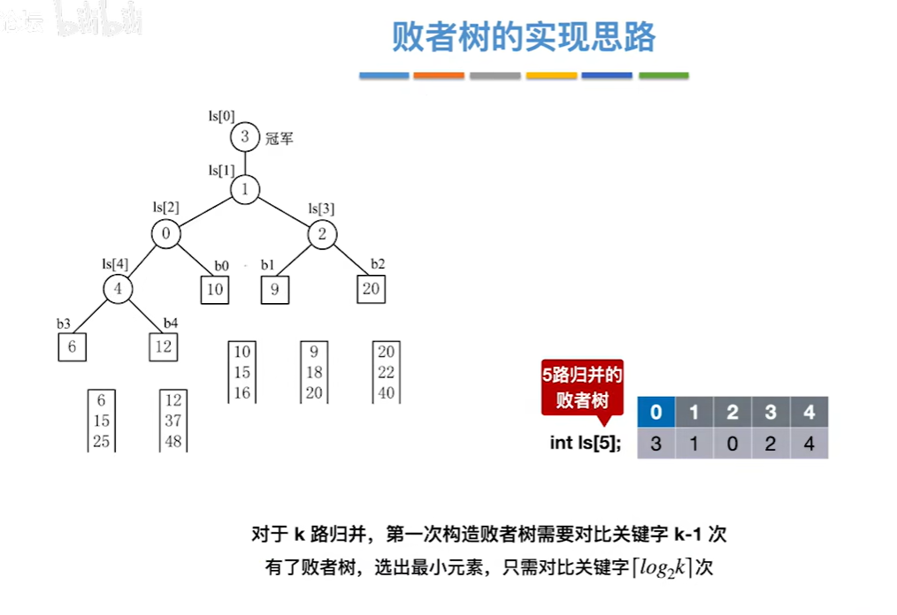
### 置换—选择排序

实现用小工作区来生成大归并段

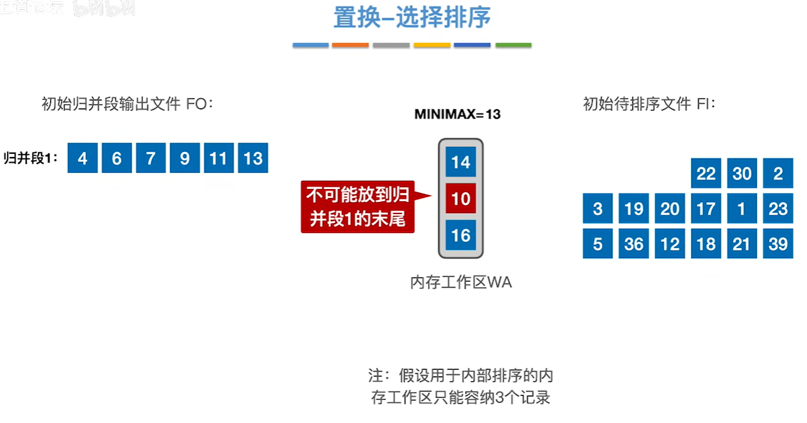

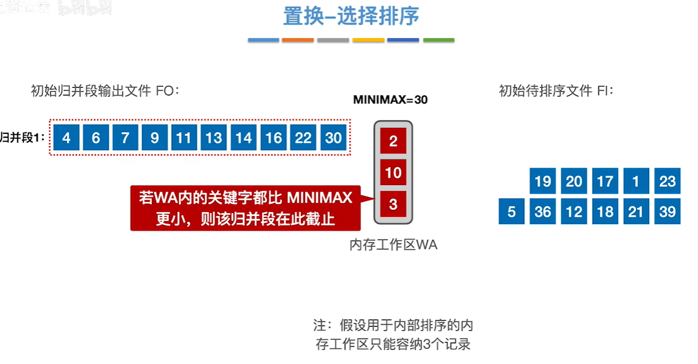

###  最佳归并树

用于处理归并段大小不同的时候，让尽可能小的两个段进行合并，这样读写操作最少，转为构造一个哈夫曼树


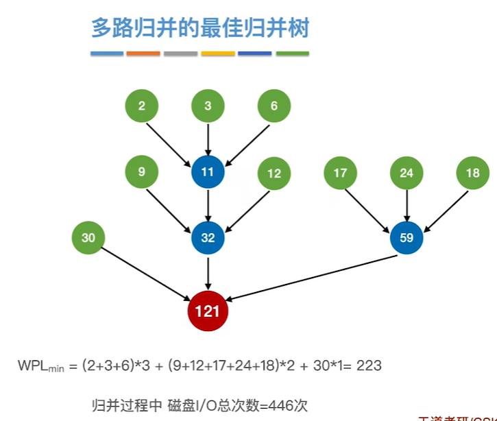

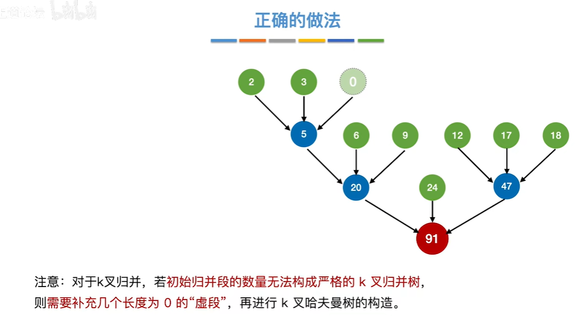

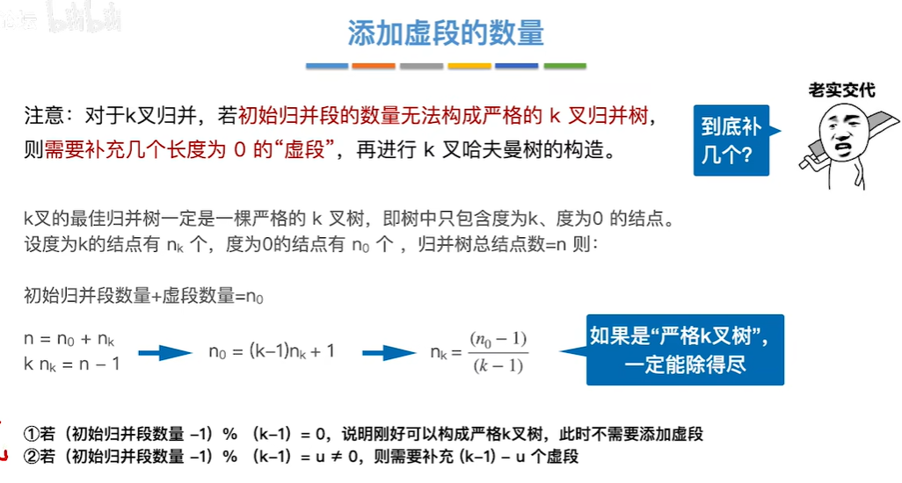