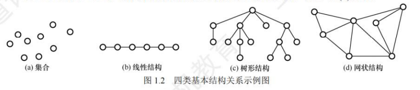

## 数据结构基本概念

### 基本概念与术语

1. 数据：
   数据是信息的载体，是描述客观事物属性的数、字符及所有能输入到计算机中并被计算机程序识别和处理的符号的集合。数据是计算机程序加工的原料。
2. 数据元素：
   数据元素是数据的基本单位，通常作为一个整体进行考虑和处理。一个数据元素可由若干数据项组成，数据项是构成数据元素的不可分割的最小单位。例如，学生记录就是一个数据元素，它由学号、姓名、性别等数据项组成。
3. 数据对象：
   数据对象是具有相同性质的数据元素的集合，是数据的一个子集。
4. 数据类型：
   数据类型是一个值的集合和定义在此集合上的一组操作的总称，可分为其值不可再分的原子类型，其值可以再分的结构类型以及和抽象数据类型（一个数学模型及定义在该数学模型上的一组操作。它通常是对数据的某种抽象，定义了数据的取值范围及其结构形式，以及对数据操作的集合。）
5. 数据结构：
   数据结构是相互之间存在一种或多种特定关系的数据元素的集合，这种数据元素相互之间的关系称为结构。数据结构包括三方面的内容:逻辑结构、存储结构和数据的运算。
   数据的逻辑结构和存储结构是密不可分的两个方面，一个算法的设计取决于所选定的逻辑结构，而算法的实现依赖于所采用的存储结构。

### 数据结构三要素

1. 数据逻辑结构
   逻辑结构是指数据元素之间的逻辑关系，即从逻辑关系上描述数据。
   数据的逻辑结构分为线性结构和非线性结构，线性表是典型的线性结构:集合、树和图是典型的非线性结构。
   
   集合,结构中的数据元素之间除“同属一个集合”外，别无其他关系。
   线性结构,结构中的数据元素之间只存在一对一的关系。
   树形结构,结构中的数据元素之间存在一对多的关系。
   图状结构或网状结构，结构中的数据元素之间存在多对多的关系。
   
2. 数据的存储结构
   - 顺序存储：把逻辑上相邻的元素存储在物理位置上也相邻的存储单元中，元素之间的关系由存储单元的邻接关系来体现。其优点是可以实现随机存取，每个元素占用最少的存储空间;缺点是只能使用相邻的一整块存储单元，因此可能产生较多的外部碎片。
   - 链式存储：不要求逻辑上相邻的元素在物理位置上也相邻，借助指示元素存储地址的指针来表示元素之间的逻辑关系。其优点是不会出现碎片现象，能充分利用所有存储单元;缺点是每个元素因存储指针而占用额外的存储空间，且只能实现顺序存取。
   - 索引存储：在存储元素信息的同时，还建立附加的索引表。索引表中的每项称为索引项,索引项的一般形式是(关键字，地址)。其优点是检索速度快:缺点是附加的索引表额外占用存储空间。另外，增加和删除数据时也要修改索引表，因而会花费较多的时间。
   - 散列存储：根据元素的关键字直接计算出该元素的存储地址，又称哈希(Hash)存储。其优点是检索、增加和删除结点的操作都很快:缺点是若散列函数不好，则可能出现元素存储单元的冲突，而解决冲突会增加时间和空间开销。
3. 数据的运算
   施加在数据上的运算包括运算的定义和实现。运算的定义是针对逻辑结构的，指出运算的功能;运算的实现是针对存储结构的，指出运算的具体操作步骤。

## 算法和算法评价

### 算法的基本概念

1. 有穷性：一个算法必须总在执行有穷步之后结束，且每一步都可在有穷时间内完成。
2. 确定性：算法中每条指令必须有确切的含义，对于相同的输入只能得出相同的输出。
3. 可行性：算法中描述的操作都可以通过已经实现的基本运算执行有限次来实现。
4. 输入：一个算法有零个或多个输入，这些输入取自于某个特定的对象的集合。
5. 输出：一个算法有一个或多个输出，这些输出是与输入有着某种特定关系的量。

### 算法效率的度量

1. 时间复杂度
  分析某一算法的时间复杂度时，会出现浮动的时间复杂度，例如随机快排，最好情况为O(logn*n),最坏情况为$O(n^2)$,我们在分析其时间复杂度时需要分析的是该算法的期望，即收敛于O(logn*n)

2. 空间复杂度
   指除输入和程序之外的额外空间
   例：空间复杂度O(1)表示执行该算法所需的辅助空间大小相比输入数据的规模来说是一个常量，而不表示该算法的执行时不需要任何的空间或辅助空间
