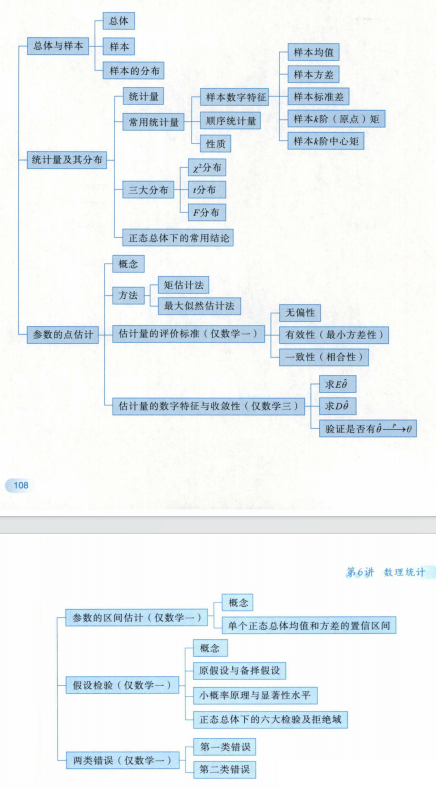
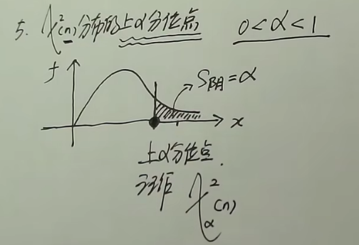
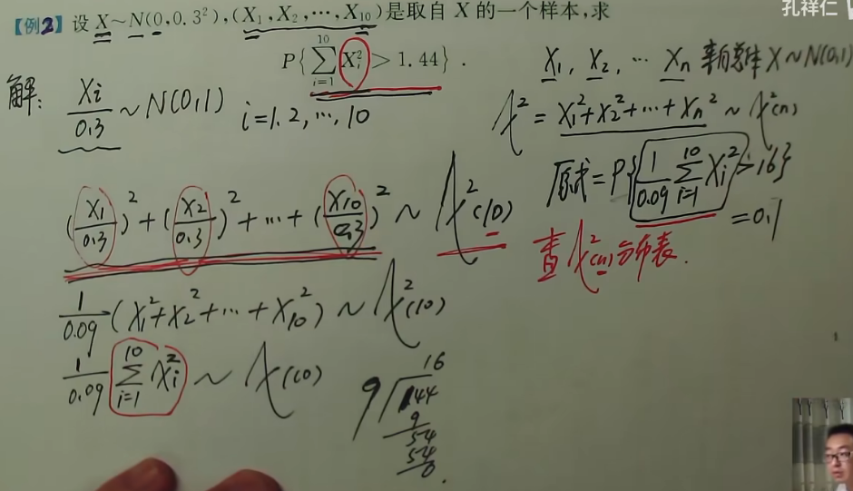
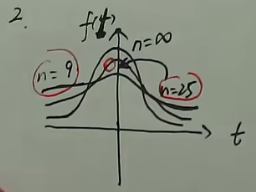
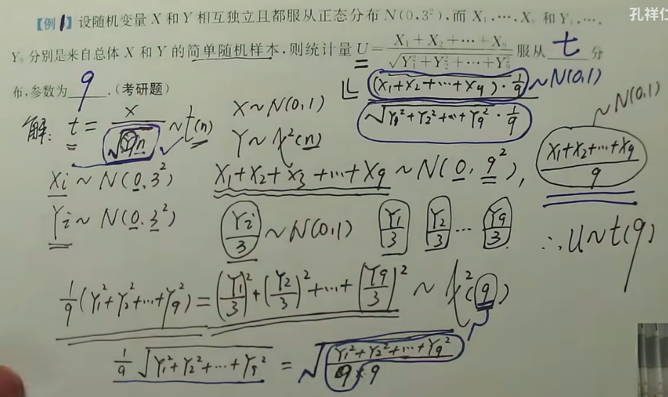
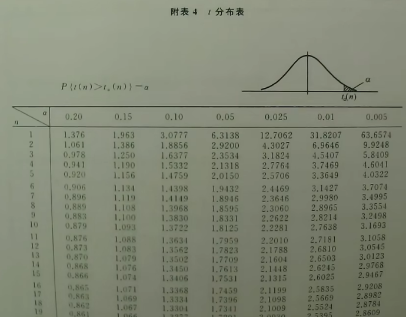
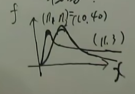
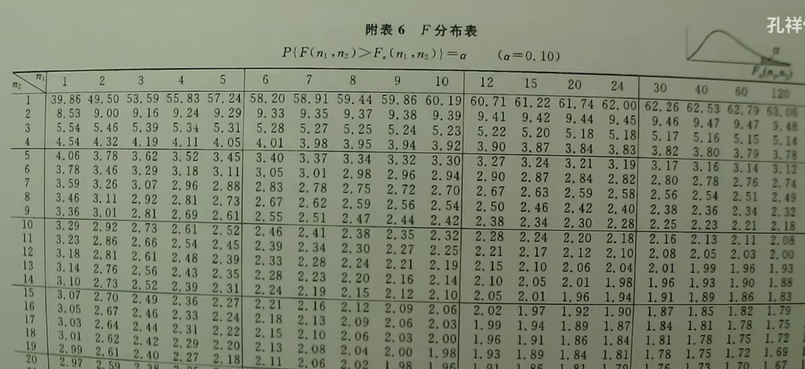

## 知识结构

## 总体与样本

总体：试验中全部的可能观测到的值

&nbsp;&nbsp;&nbsp;&nbsp;有限总体：总体中的个体为有限个（离散型） 放回抽样（总量>>样本数，可以不放回）

&nbsp;&nbsp;&nbsp;&nbsp;无限总体：总体中的个体为无限个（连续性） 不放回抽样

个体：每一个可能被观测到的值

通过抽取部分个体来判断总体：

&nbsp;&nbsp;&nbsp;&nbsp;总体X服从的分布不知道或知道服从分布的形式而不知道具体的参数

如何抽取：

&nbsp;&nbsp;&nbsp;&nbsp;在相同条件下，进行n次独立重复抽取，产生了$X_1,X_2,\dots ,X_n$，{$X_n$}叫做样本，且与X服从相同分布，$x_1,x_2,\dots ,x_n$叫做样本值/观测值。

## 统计量及其分布

统计量的定义:
&nbsp;&nbsp;&nbsp;&nbsp;设$X_1,X_2,\dots ,X_n$是来自总体的X的一个样本，$g(X_1,X_2,\dots ,X_n)$是$X_1,X_2,\dots ,X_n$的函数，若g中不包含未知参数，则称$g(X_1,X_2,\dots ,X_n)$为一个统计量，$g(x_1,x_2,\dots ,x_n)$统计量的观测值。

### 典型统计量

1. 样本平均值：$\bar{X}=\frac{1}{n}\sum^n_{i=1}X_i$
2. 观测值平均值：$\bar{x}=\frac{1}{n}\sum^n_{i=1}x_i$
3. 样本方差：$S^2=\frac{1}{n-1}(X_i-\bar{X})^2=\frac{1}{n-1}(\sum^n_{i=1}X_i^2-n\bar{X})$除n-1是考虑无偏性，为了样本方差的期望等于总体方差
4. 样本标准差：$S=\sqrt{S^2}$
5. 样本的k阶源点矩：$A_k=\frac{1}{n}\sum^n_{i=1}(X_i-0)^k$
6. 样本的k阶中心矩：$B_K=\frac{1}{n}\sum_{i=1}^n(X_i-\bar{X})^k$

### 经验分布函数（样本分布函数）

根据抽出的样本得到的函数

&nbsp;&nbsp;&nbsp;&nbsp;从总体x中抽取一个容量为n的样本，,观测值为$x_1,x_2,\dots ,x_n$,升序排序为$x_{(1)},x_{(2)},\dots ,x_{(n)}$,以下为经验分布函数：
$$
F_n(x) = \begin{cases}
0, &  x < x_{(1)} \\
\frac{k}{n}, &  x_{(k)} \leq x < x_{(k+1)},  k = 1, 2, 3, \ldots ,n-1\\
1, & x \geq x_{(n)}
\end{cases}
$$
格列汶科定理：n趋于无穷时，$F_n(x)$依概率收敛于$F(x)$

### 卡方分布$\chi ^2$

&nbsp;&nbsp;&nbsp;&nbsp;样本$X_1,X_2,\dots ,X_n$来自标准正态分布的总体$X\sim N(0,1)$,若统计量$\chi ^2=x_1^2+x_2^2+\dots +x_n^2$,则$\chi ^2$服从自由度为n的卡方分布，记作$\chi ^2 \sim \chi ^2(n)$(前一个为变量，后一个为卡方分布)

> 自由度：卡方统计量右边独立变量的个数。

为连续性随机变量，概率密度为

$$
f(x) = \begin{cases}
\frac{1}{2^{\frac{n}{2}} \cdot \Gamma\left(\frac{n}{2}\right)} \cdot x^{\frac{n}{2} - 1} \cdot e^{-\frac{x}{2}}, &  x > 0 \\
0, & \text{其他}
\end{cases}
$$

#### 性质

- $E[\chi ^2(n)]=n$
- $D[\chi ^2(n)]=2n$
- $X \sim \chi ^2(m)$,$Y \sim \chi ^2(n)$，X与Y相互独立，则$X+Y \sim \chi ^2(m+n)$
- $\chi ^2(n)$分布的上$\alpha$分位点,即存在一点使得$P(\chi ^2(n)\geq \alpha)=\alpha$成立，该点记作$\chi_{\alpha}^2(n)$

### T分布

&nbsp;&nbsp;&nbsp;&nbsp;$X\sim N(0,1),Y\sim \chi ^2(n)$，$X$与$Y$相互独立，$t=\frac{X}{\sqrt{\frac{Y}{n}}}$服从自由度为n的t分布，记作$t\sim t(n)$

#### 概率密度的函数图像

#### 性质

- $E[t(n)]=0$
- $D[t(n)]=\frac{n}{n-2}$
- n趋于无穷时，t分布近似等于标准正态分布$N(0,1)$
- t分布的上$\alpha$分位点，同理与卡方分布，存在一点$\alpha$使得$P(t(n)\geq \alpha)=\alpha$成立,该点记作$t_{\alpha}(n)$

> 由于分布函数关于y轴对称性，因此在负半轴还有一个点，$-t_{\alpha}(n)=t_{1-\alpha}(n)$

#### t分布表查找

&nbsp;&nbsp;&nbsp;&nbsp;纵轴为自由度，横轴为大于某点的概率，查到的点即为该点的坐标。

### F分布

&nbsp;&nbsp;&nbsp;&nbsp;$U\sim \chi ^2(n_1),V\sim \chi ^2(n_2)$,$U$和$V$相互独立，观测量$F=\frac{\frac{U}{n_1}}{\frac{V}{n_2}}$服从自由度为$(n_1,n_2)$的F分布，记为$F\sim F(n_1,n_2)$

#### 概率密度函数图像

#### 性质

- $E(F)=\frac{n_2}{n_2-2}$
- $D(F)=\frac{2n_2^2(n_1+n_2-2)}{n_1(n_2-2)^2(n_2-4)}$
- F分布的上$\alpha$分位点，同理与卡方分布，存在一点$\alpha$使得$P(x\geq \alpha)=\alpha$成立,该点记作$F_{\alpha}(n_1,n_2)$
- ==$F_{1-\alpha}(n_1,n_2)=\frac{1}{F_{\alpha}(n_2,n_1)}$==

#### F分布表查找

&nbsp;&nbsp;&nbsp;&nbsp;由于有三个变量，因此我们只能设定$\alpha$的值并根据$n_1,n_2$的值来进行查找

### 正态总体样本均值与样本方差的函数分布

#### 四个等式

- $E(\bar{X})=\mu$
- $D(\bar{X})=\frac{\sigma^2}{n}$
- $E(S^2)=\sigma^2$ 样本方差的期望等于总体方差，样本方差依概率收敛于总体方差。
- $D(S^2)=\frac{2\sigma ^4}{n-1}$

#### 四个定理

&nbsp;&nbsp;&nbsp;&nbsp;$X_1,X_2,\dots ,X_{n_1}$来自总体$X\sim N(\mu_1,\sigma_1^2)$,有$\bar{X}$和$S_1^2$，$Y_1,Y_2,\dots ,Y_{n_2}$来自总体$T\sim N(\mu_2,\sigma_2^2)$,有$\bar{Y}$和$S_2^2$

- $\bar{X}\sim N(\mu,\frac{\sigma_1^2}{n_1})$
- $\frac{\sum_{i=1}^n(X_i-\bar{X})^2}{\sigma_1^2}=\frac{(n_1-1)S_1^2}{\sigma_1^2}\sim \chi^2(n_1-1)$且样本的均值与样本方差相互独立
- $\frac{\bar{X}-\mu_1}{S_1/\sqrt{n_1}}\sim t(n_1-1)$
- $\frac{S_1^2/S_2^2}{\sigma_1^2/\sigma_2^2}\sim F(n_1-1,n_2-1)$,当$\sigma_1^2=\sigma_2^2=\sigma^2$时，$\frac{(\bar{X}-\bar{Y})-(\mu_1-\mu_2)}{S_w\sqrt{\frac{1}{n_1}+\frac{1}{n_2}}}\sim t(n_1+n_2-2)$,其中$S_w=\sqrt{\frac{(n_1-1)S_1^2+(n_2-1)S_2^2}{n_1+n_2-2}}$