## 顺序查找和折半查找

### 顺序查找

一般线性表的顺序查找：

1. 从线性表的一端开始，逐个检查关键字是否满足给定的条件;
2. 若查找到某个元素的关键字满足给定条件，则查找成功，返回该元素在线性表中的位置:
3. 若已经查找到表的另一端，但还没有查找到符合给定条件的元素，则返回查找失败的信息。

有序线性表的顺序查找：

&nbsp;&nbsp;&nbsp;&nbsp;因为是有序的，因此不需要遍历全部元素，当比前一个元素大，比后一个元素小即为查询失败。

### 折半查找

&nbsp;&nbsp;&nbsp;&nbsp;二分查找，适用于有序的顺序表

### 分块查找

&nbsp;&nbsp;&nbsp;&nbsp;索引顺序查找，将查找的内容分为若干子块，块内元素可以无序，但块间的元素是有序的，前一块内的所有元素都小于下一块中的最小元素，先讯在所查内容所在的块，再在块内进行寻找

## 树形查找

### 二叉排序树（BST）

特点（左中右的中序为升序序列）：

- **左大根堆**：若左子树非空，则左子树上所有结点的值均小于根结点的值。
- **右小根堆**：若右子树非空，则右子树上所有结点的值均大于根结点的值。
- 左、右子树也分别是一棵二叉排序树。

查找：小于根结点往左，大于根结点往右

插入：左右往下遍历，到结点为空的地方加入

构造：类似于插入，树结点从零开始，一个数一个数的插入

删除：叶子结点直接删，不是的话，只有左子树，拿左结点补，只有右子树拿右结点补，左右子树都有的话，拿在右子树上找中序第一个数补

#### 二叉排序树效率分析

&nbsp;&nbsp;&nbsp;&nbsp;最坏情况下为O(n)，全部在一边子树一直往下，平均为O(logn)，其实就是二分查找

### 平衡二叉树（AVL）

&nbsp;&nbsp;&nbsp;&nbsp;在二叉排序树的基础上保证任意结点的左右子树高度差的绝对值不超过1，左右子树的高度差称为该结点的平衡因子

> 对于任意子树，如果一边的子树没有的话，另一边有但不能忘下一层

插入：先按照二叉排序树插入，如果导致了不平衡，调整不平衡的部分（LL平衡旋转，RR平衡旋转，LR平衡旋转，RL平衡旋转）

&nbsp;&nbsp;&nbsp;&nbsp;LL平衡旋转:在结点A的左孩子(L)的左子树(L)上插入了新结点
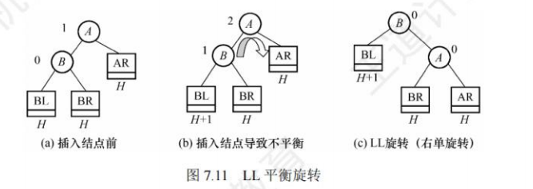
&nbsp;&nbsp;&nbsp;&nbsp;RR平衡旋转:在结点A的右孩子(R)的右子树(R)上插入了新结点

&nbsp;&nbsp;&nbsp;&nbsp;LR平衡旋转:在结点A的左孩子(L)的右子树(R)上插入了新结点
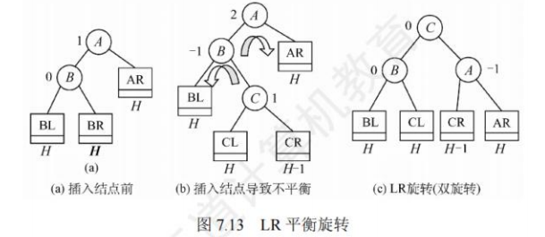
&nbsp;&nbsp;&nbsp;&nbsp;RL平衡旋转:在结点A的右孩子(R)的左子树(L)上插入了新结点
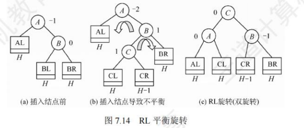
构造：类似于插入，树结点从零开始，一个数一个数的插入

删除：先删除，导致了不平衡再调整

查找：与二叉排序树相同

### 红黑树

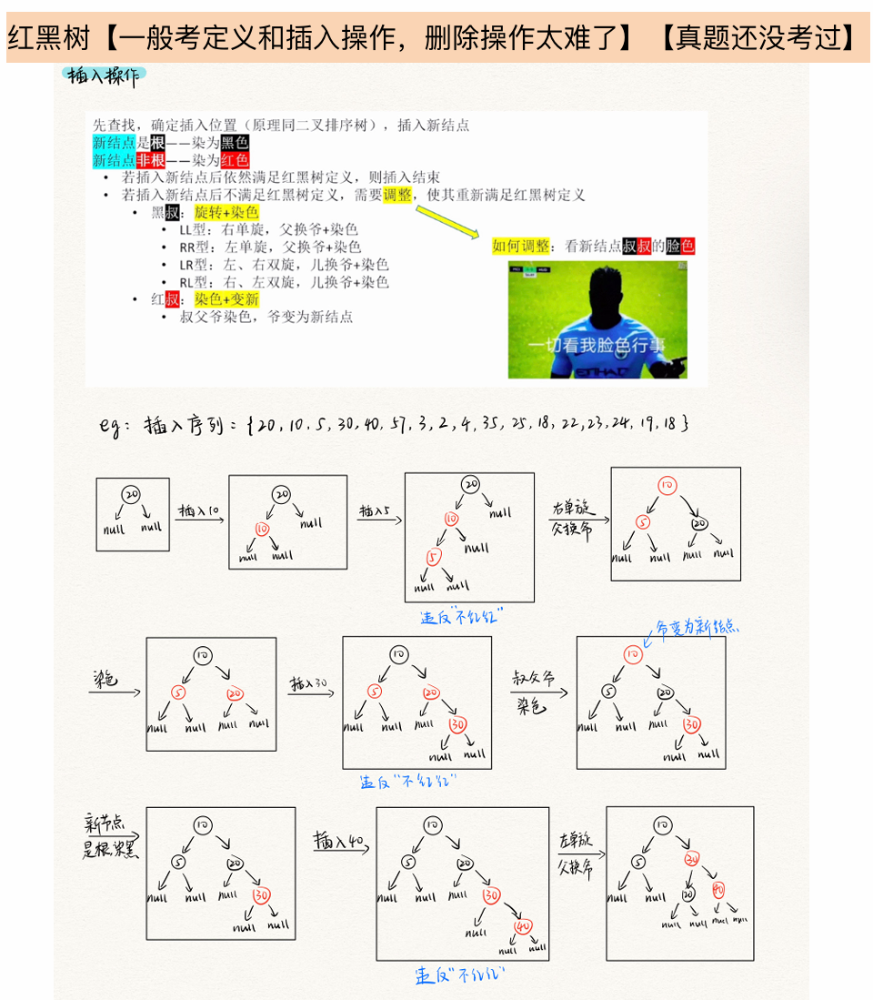

条件：

1. 每个结点或是红色，或是黑色的。
2. 根结点是黑色的。
3. 叶结点(虚构的外部结点、NUILL结点)都是黑色的。
4. 不存在两个相邻的红结点(即红结点的父结点和孩子结点均是黑色的)。
5. 对每个结点，从该结点到任意一个叶结点的简单路径上，所含黑结点的数量相同。

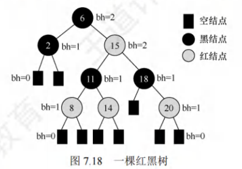

概念：

- 结点的黑高：从某结点（不含该结点）到达一个叶结点的任意一个简单路径上的黑结点总数。
- 红黑树的黑高：根结点的黑高

#### 从根到叶结点的最长路径不大于最短路径的两倍

#### 有n个内部结点的红黑树的高度$h\leq 2log_2(n+1)$

#### 新插入的红黑树的结点初始着为红色

## B树和B+树

### B树及其基本操作

**多路性**：B树是一个多叉树（不是二叉树），每个节点可以有多个子节点。

**平衡性**：B树是一种平衡树，所有叶子节点位于同一层级。树的高度尽可能小，避免了链表式的长路径。

**有序性**：每个节点包含若干个关键字，并且节点内的关键字是有序的（即从左到右递增）。

**节点结构**：

- 每个节点包含若干个**键**和**指针**。
- 内部节点包含的键用于引导查找。
- 每个节点中有 `t-1` 个键和最多 `t` 个子节点，其中 `t` 称为树的**阶**（阶数）。

所有结点的平衡因子均等于0的m路平衡查找树，就是左右子树的高度相同，实际是二叉搜索树的一般化。

|              | 根结点 | 非根结点        |
| ------------ | ------ | --------------- |
| 关键字至少有 | 1      | $\frac{m}{2}-1$ |
| 关键字至多有 | m-1    | m-1             |

一棵`m`阶`B`树或为空树，或为满足如下特性的`m`叉树：

- 树中每个结点至多有`m`棵子树，即至多有`m-1`个关键字
- 除根结点外的所有非叶结点至少有`m/2`棵子树，即至少有`m/2-1`个关键字
- 若根结点不是叶结点，则至少有2棵子树，即至少有1个关键字
- 所有非叶结点的结构如下：
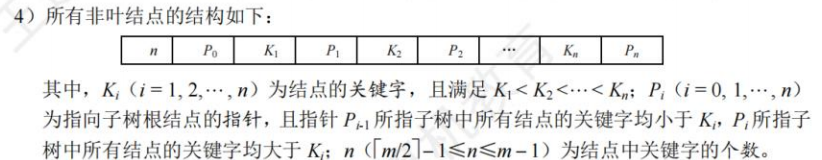
- 所有叶子结点都出现在同一层次上，且不带信息。

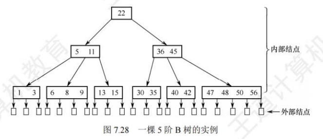

&nbsp;&nbsp;&nbsp;&nbsp;在B树中，叶子结点即为外部结点，不包含任何信息。

#### 插入

&nbsp;&nbsp;&nbsp;&nbsp;不超过最多关键字个数直接插，超过的话取$\frac{m}{2}$向上取整的数传给父结点，如果传上去导致父结点超了，再同类上传

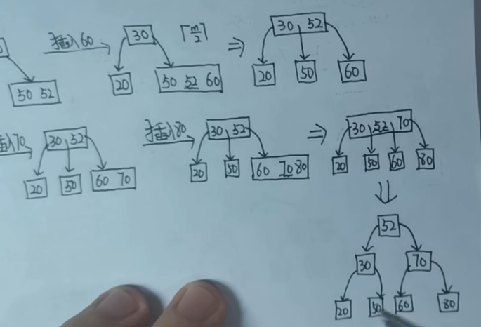

#### 删除

要删除关键字的结点大于1可直接删除

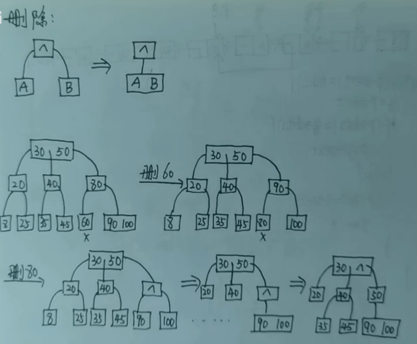

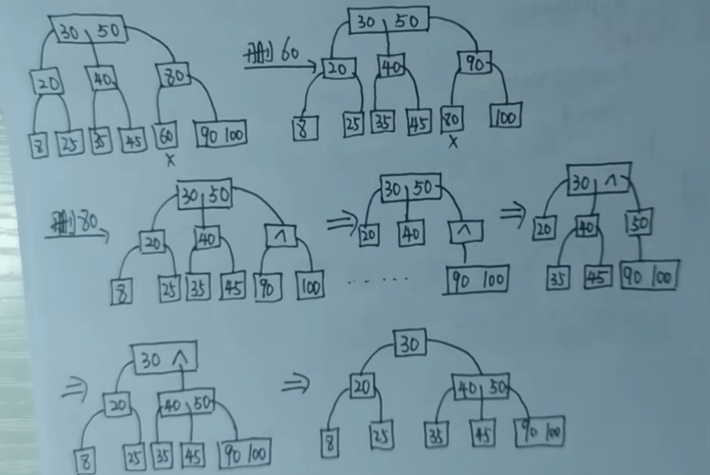

### B+树的基本概念

特性：

- 在B+树中，具有n个关键字的结点只含有n棵子树，即每个关键字对应一颗子树；
- 在B+树中，每个结点（非根内部结点）的关键字个数n的范围是$\frac{m}{2}\leq n \leq m$(非叶根结点$2 \leq n \leq m$)
- 在 B+树中，叶结点包含了全部关键字，非叶结点中出现的关键字也会出现在叶结点中;而在 B树中，最外层的终端结点包含的关键字和其他结点包含的关键字是不重复的。
- 在 B+树中，叶结点包含信息，所有非叶结点仅起索引作用，非叶结点的每个索引项只含有对应子树的最大关键字和指向该子树的指针，不含有对应记录的存储地址。这样能使一个磁盘块存储更多的关键字，使得磁盘读/写次数更少，查找速度更快。
- 在 B+树中，用一个指针指向关键字最小的叶结点，将所有叶结点串成一个线性链表。

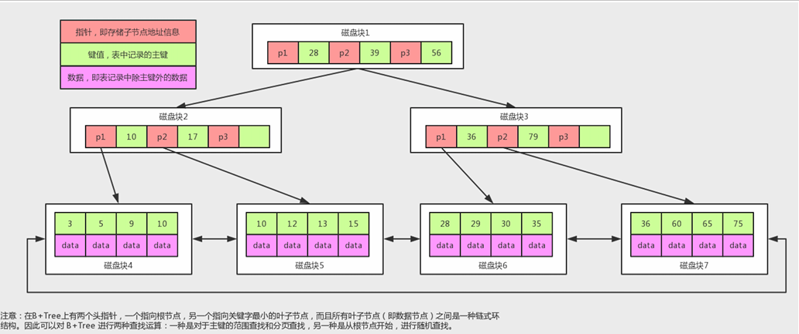

### B树与B+树的对比

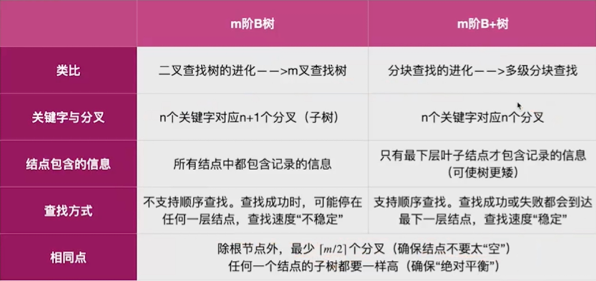

## 散列表（Hash）

- 散列查找一般适用于关键字集合与地址集合之间存在对应关系的情况下的查找
- 散列查找的思想是计算出散列地址来查找，然后比较关键字以确定是否比较成功
- 散列查找的平均查找长度与装填因子有关，与表长无关
- $装填因子=\frac{表中记录数}{散列表长度}$  一个表的装满程度
- 冲突是不可避免的，与装填因子无关
- 提高查找效率：1. 设计冲突少的散列函数‘2. 处理冲突时避免产生堆积现象
- 产生了堆积即产生了冲突，他对存储效率，散列函数合装填因子没有什么影响，但平均查找长度ASL会随着堆积现象而增大

### 散列表的基本概念

- 散列函数：一个把查找表中的关键字映射成该关键字对应地址（数组下标，索引，内存地址）的函数
- 冲突：散列函数会把两个或两个以上的不同关键字映射到同一地址
- 同义词：发生冲突的不同关键词

> 1. 散列函数设计要尽量减少冲突
> 2. 冲突不可避免，还需要设计好处理冲突的方法

- 散列表（hash表）：根据关键字而直接进行访问的数据结构，建立了关键字和存储地址之间的一种直接映射关系，查找的复杂度为$O(1)$

### 散列函数构造方法

注意点：

1. 散列函数的定义域必须包含全部关键字，而值域的范围依赖于散列表的大小
2. 散列函数计算出的地址应尽可能均匀分布在整个地址空间，尽可能地减少冲突
3. 散列函数应当尽量简单，能在较短时间内计算出任意一个关键字对应的散列地址

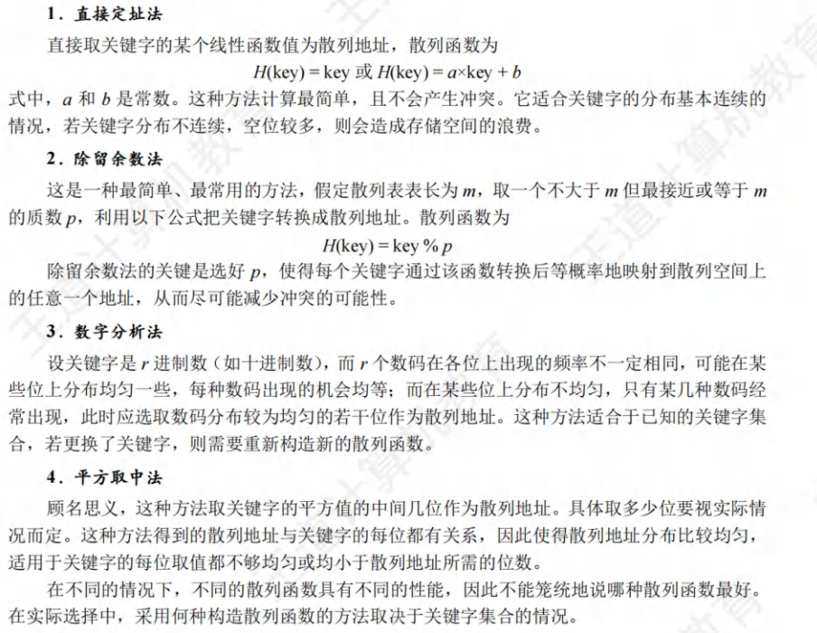

### 处理冲突的方法

#### 开放地址法

#### 拉链法

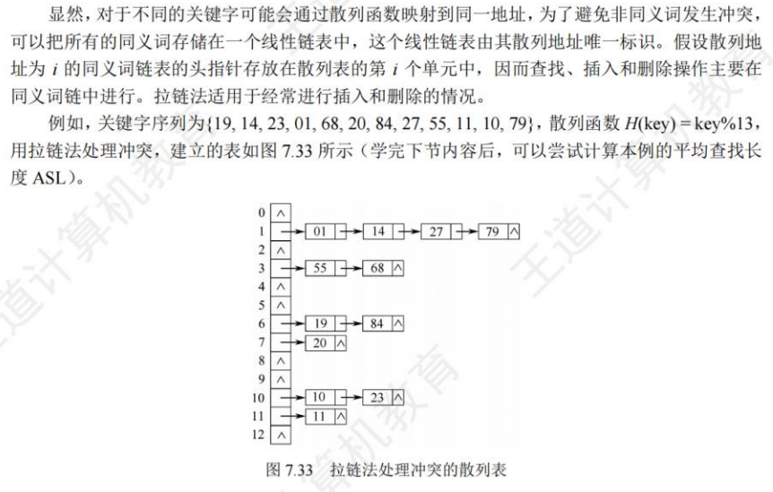

### 散列查找及其性能分析

查找过程：

1. 初始化`Addr=Bash(key);`
2. 查找表中地址为`Addr`的位置上是否有记录，若无记录，返回查找失败；若有记录，比较它与`key`的值，若相等，则返回查找成功的标志，否则执行步骤3；
3. 用给定的处理冲突方法计算“下一个散列地址”，并把`Addr`置为此地址，转入步骤2
