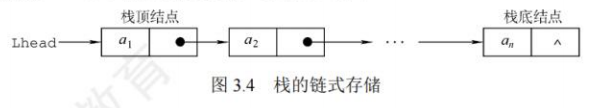

## 栈

### 栈的基本概念

栈(Stack)是只允许在一端进行插入或删除操作的线性表。首先栈是一种线性表，但限定这种线性表只能在某一端进行插入和删除操作。

栈顶(Top)。线性表允许进行插入删除的那一端。
栈底(Bottom)。固定的，不允许进行插入和删除的另一端。
空栈。不含任何元素的空表。

卡特兰数公式：当n个不同元素进栈时，出栈元素不同排列的个数为$\frac{1}{n+1}C_{2n}^n$

### 栈的顺序存储结构

**顺序栈实现**

```cpp
#include <iostream>
using namespace std;

#define MAXSIZE 100
typedef int datatype;

typedef struct seqstack {
    datatype elem[MAXSIZE];
    int top;
} seqstack;

void init(seqstack *s) {
    s->top = -1;
}

int empty(seqstack s) {
    return (s.top == -1 ? 1 : 0);
}

void push(seqstack *s, datatype x) {
    if (s->top == MAXSIZE - 1) {
        cout << "栈满" << endl;
        exit(1);
    }
    s->top++;
    s->elem[s->top] = x;
}

datatype pop(seqstack *s) {
    datatype x;
    if (s->top == -1) {
        cout << "栈空" << endl;
        exit(1);
    }
    x = s->elem[s->top];
    s->top--;
    return x;
}
```

**共享栈**
两个栈的栈底分别设置在共享空间的两端，两个栈的栈顶向共享空间的中间延伸

### 栈的链式存储结构

采用链式存储的栈称为链栈，链栈的优点是便于多个栈共享存储空间和提高其效率，且不存在栈满上溢的情况。通常采用单链表实现，并规定所有操作都是在单链表的表头进行的。这里规定链栈没有头结点，Lhead指向栈顶元素



采用链式存储，便于结点的插入与删除。链栈的操作与链表类似，入栈和出栈的操作都在链表的表头进行。需要注意的是，对于带头结点和不带头结点的链栈，具体的实现会有所不同。

```cpp
typedef struct Linknode{
  ElemType data;
  struct Linknode *next;
}LiStack
```

## 队列

### 队列的基本概念

一端进一端出，也是一种受限的线性表，头尾指针只能++

### 队列的顺序存储结构

顺序存储

代码实现

```cpp
typedef struct
{
    datatype elem[MAXSIZE];
    int front;
    int rear;
} sequeue;
void initq(sequeue *q)
{
    q->front = q->rear = -1;
}

void printq(sequeue *q)
{
    int i;
    if (q->front == q->rear)
        printf("循环队列是空的");
    else
        for (i = q->front + 1; i <= q->rear; i++)
        {
            printf("%5d", q->elem[i]);
            if ((i + 1) % 10 == 0)
                printf("\n");
        }
    printf("\n\n");
}
void add(sequeue *q, datatype x)
{
    if ((q->rear + 1) % MAXSIZE == q->front)
    {
        cout << "队满" << endl;
        exit(1);
    }
    q->rear = (q->rear + 1) % MAXSIZE;
    q->elem[q->rear] = x;
}
```

假溢出问题：头到达最大空间，尾后仍有存储空间

循环队列
  队首指针：front=(front+1)%MaxSize
  队尾指针：rear=(rear+1)%MaxSize
  队列长度：(MaxSize+rear-front)%MaxSize

  如何判断队满还是队空：1.牺牲一个单元来区分；2.类型中增设一个size。

### 队列的链式存储结构

实际为一个有队头与队尾指针的单链表

### 双端队列

输出受限的双端队列：允许在一段进行插入和删除，但在另一端只允许插入的双端队列
输入受限的双端队列：允许在一端进行插入和删除，但在另一端只允许删除的双端队列

## 数组和特殊矩阵

### 数组

&nbsp;&nbsp;&nbsp;&nbsp;由n个相同数据元素构成的有限序列

与线性表的关系：
数组是线性表的推广。一维数组可视为一个线性表;二维数组可视为其元素是定长数组的线性表，以此类推。数组一旦被定义，其维数和维界就不再改变。

多维数组的映射方式：
&nbsp;&nbsp;&nbsp;&nbsp;存储顺序按行优先：先行后列，先小后大

特殊矩阵的压缩存储：
为多个值相同的元素只分配一个存储空间，对零元素不分配空间

1. 对称矩阵$a_{ij}=a_{ji}$:
   将下三角存放在一维数组[n(n+1)/2]中，$a_{ij}$下标$=1+2+...+(i-1)+j-1=\frac{i(i-1)}{2}+j-1$（从0开始）
   上三角转换i和j即可
2. 三角矩阵（另一三角区元素为同一常量）：
   类比对称矩阵，在数组最后添加一个常数项
3. 三对角矩阵

稀疏矩阵
