## 知识结构

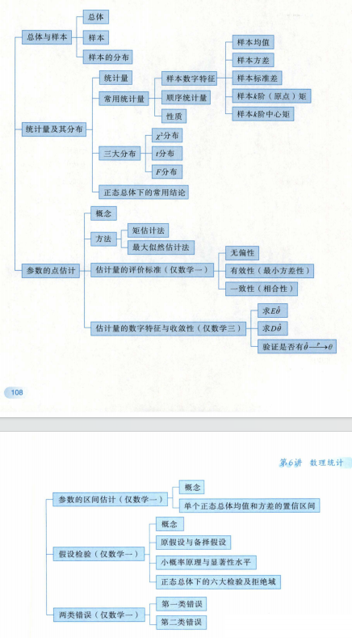

## 总体与样本

总体：试验中全部的可能观测到的值，研究对象的全称

样本：组成总体的每一个元素，$n$个相互独立且与总体$X$具有相同概率分布的随机变量$X_{1},X_{2},\dots,X_{N}$所组成的整体称为样本，一次具体抽样结果的$n$个具体值称为样本的观测值或者样本值

随机变量之间是独立同分布的，所以总体的概率等于各个值概率的乘积

通过抽取部分个体来判断总体：

总体X服从的分布不知道或知道服从分布的形式而不知道具体的参数

## 统计量及其分布

统计量的定义:
设$X_1,X_2,\dots ,X_n$是来自总体的X的一个样本，$g(X_1,X_2,\dots ,X_n)$是$X_1,X_2,\dots ,X_n$的函数，若$g$中不包含未知参数，则称$g(X_1,X_2,\dots ,X_n)$为一个统计量，$g(x_1,x_2,\dots ,x_n)$统计量的观测值。

> 就是对样本进行一些相关的统计计算处理
> 对这些数据进行统计分析，自然不包含未知参数
### 典型统计量

1. 样本平均值：$\bar{X}=\frac{1}{n}\sum^n_{i=1}X_i$
2. 样本方差：$S^2=\frac{1}{n-1}(X_i-\bar{X})^2=\frac{1}{n-1}(\sum^n_{i=1}X_i^2-n\bar{X})$
	>除n-1是考虑无偏性，为了样本方差的期望等于总体方差
3. 样本标准差：$S=\sqrt{S^2}$
4. 样本的k阶源点矩：$A_k=\frac{1}{n}\sum^n_{i=1}(X_i-0)^k$
5. 样本的k阶中心矩：$B_K=\frac{1}{n}\sum_{i=1}^n(X_i-\bar{X})^k$
### 顺序统计量

将样本的$n$个观测量按其取值从小到大的顺序排列，随机变量$X_{(k)}$表示第$k$小的值，称为第$k$顺序统计量

$X_{(n)}=max\{X_{1},X_{2},\dots,X_{n}\}$的分布函数为

$$
P\{max\{X_{1},X_{2},\dots,X_{n}\}\leq x\}=F_{n}(x)=[F(X)]^{n}
$$
概率密度为
$$
f_{(n)}=n[F(x)]^{n-1}f(x)
$$

$X_{(1)}=min \{X_{1},X_{2},\dots,X_{n}\}$的分布函数为
$$
F_{1}(x)=1-[1-F(x)]^{n}
$$
概率密度为

$$
f_{(1)}=n[1-F(x)]^{n-1}f(x)
$$

性质：设总体$X$期望为$\mu$，方差为$\sigma^{2}$，样本均值为$\bar{X}$,样本方差为$S^{2}$,则
- $EX_{i}=\mu,DX_i=\sigma^{2}$，每一个随机变量（样本）都是独立同分布的
- $E\bar{X}=EX,D\bar{X}=\frac{1}{n}DX,E(S^{2})=DX$

## 三大分布

只需了解相应统计量的概念，分布曲线示意图和分位数，能够查相应分位数的数值表
### 卡方分布$\chi ^2$

样本$X_1,X_2,\dots ,X_n$来自标准正态分布的总体$X\sim N(0,1)$,若统计量$\chi ^2=x_1^2+x_2^2+\dots +x_n^2$,则$\chi ^2$服从自由度为n的卡方分布，记作$\chi ^2 \sim \chi ^2(n)$(前一个为变量，后一个为卡方分布)

> 自由度：卡方统计量独立变量的个数。

为连续性随机变量，概率密度为

$$
f(x) = \begin{cases}
\frac{1}{2^{\frac{n}{2}} \cdot \Gamma\left(\frac{n}{2}\right)} \cdot x^{\frac{n}{2} - 1} \cdot e^{-\frac{x}{2}}, &  x > 0 \\
0, & \text{其他}
\end{cases}
$$
> 不用记，知道图长什么样子，根据$\alpha$和$n$进行查表即可
#### 性质

- $E[\chi ^2(n)]=n$
- $D[\chi ^2(n)]=2n$
- $X \sim \chi ^2(m)$,$Y \sim \chi ^2(n)$，X与Y相互独立，则$X+Y \sim \chi ^2(m+n)$
- $\chi ^2(n)$分布的上$\alpha$分位点,即存在一点使得$P(\chi ^2(n)\geq \alpha)=\alpha$成立，该点记作$\chi_{\alpha}^2(n)$

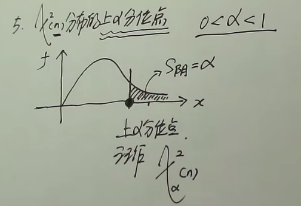

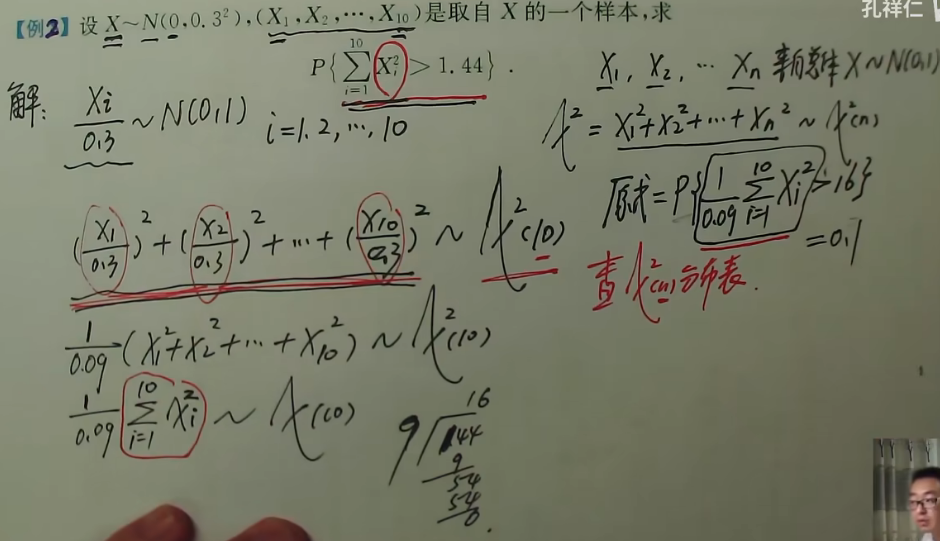

### T分布

$X\sim N(0,1),Y\sim \chi ^2(n)$，$X$与$Y$相互独立，$t=\frac{X}{\sqrt{\frac{Y}{n}}}$服从自由度为n的t分布，记作$t\sim t(n)$

#### 概率密度的函数图像

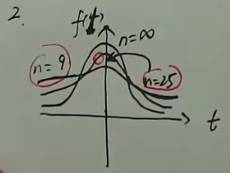
$n$越大越趋于标准正态分布
#### 性质

- $E[t(n)]=0$
- $D[t(n)]=\frac{n}{n-2}$
- n趋于无穷时，t分布近似等于标准正态分布$N(0,1)$
- t分布的上$\alpha$分位点，同理与卡方分布，存在一点$\alpha$使得$P(t(n)\geq \alpha)=\alpha$成立,该点记作$t_{\alpha}(n)$

如果要求左边对称横坐标的值，那面积为$1-\alpha$，带入查表$t_{1-\alpha}^{(n)}$

> 由于分布函数关于y轴对称性，因此在负半轴还有一个点，$-t_{\alpha}(n)=t_{1-\alpha}(n)$

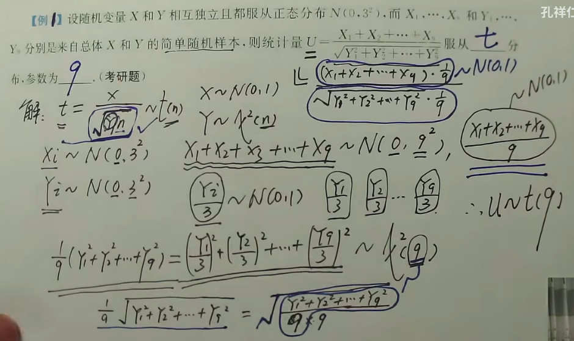

#### t分布表查找

纵轴为自由度，横轴为大于某点的概率，查到的点即为该点的坐标。

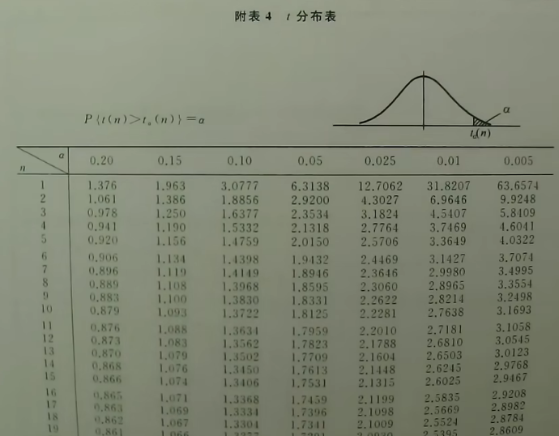

### F分布

$U\sim \chi ^2(n_1),V\sim \chi ^2(n_2)$,$U$和$V$相互独立，观测量$F=\frac{\frac{U}{n_1}}{\frac{V}{n_2}}$服从自由度为$(n_1,n_2)$的F分布，记为$F\sim F(n_1,n_2)$

根据定义易推出$\frac{1}{F}\sim F(n_{2},n_{1})$

#### 概率密度函数图像

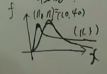

#### 性质

- $E(F)=\frac{n_2}{n_2-2}$
- $D(F)=\frac{2n_2^2(n_1+n_2-2)}{n_1(n_2-2)^2(n_2-4)}$
- F分布的上$\alpha$分位点，同理与卡方分布，存在一点$\alpha$使得$P(x\geq \alpha)=\alpha$成立,该点记作$F_{\alpha}(n_1,n_2)$
- ==$F_{1-\alpha}(n_1,n_2)=\frac{1}{F_{\alpha}(n_2,n_1)}$
- 若$F\sim F(n_{1},n_{2})$，则$\frac{1}{F}\sim F(n_{2},n_{1})$
- 若$t\sim t(n)$，则$t^{2}\sim F(1,n)$
>t分布定义带进去就可推出 

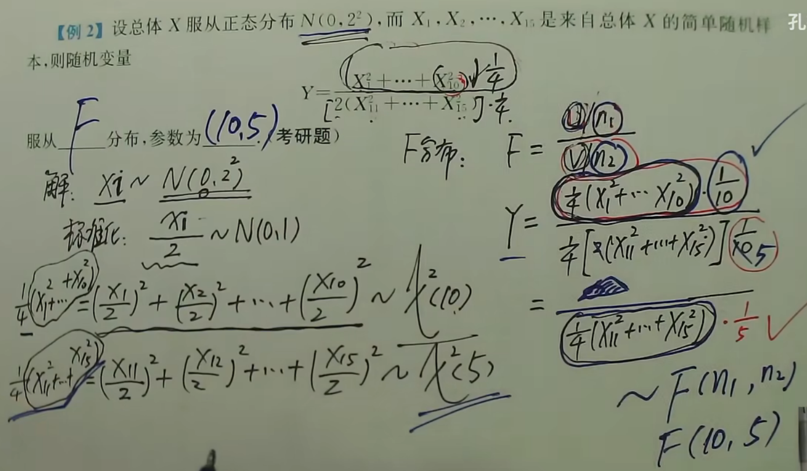

#### F分布表查找

由于有三个变量，因此我们只能设定$\alpha$的值并根据$n_1,n_2$的值来进行查找

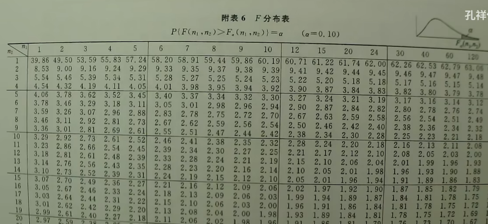

### 正态总体条件下的常用结论

#### 结论一

设$X_{1},X_{2},\dots,X_{n}$是来自正态总体$N(\mu,\sigma^{2})$的一个样本，$\bar{X},S^{2}$分别是样本均值和样本方差，有如下结论
$$
\bar{X} \sim N\left( \mu, \frac{\sigma^{2}}{n} \right), \frac{\bar{X}-\mu}{ \frac{\sigma}{\sqrt{ n }} }\sim N(0,1)
$$
#### 结论二
$$
\frac{1}{\sigma^{2}}\sum_{i=1}^{n}(X_{i}-\mu)^{2}\sim \chi^{2}(n)
$$
本质上就是转成标准正态后的平方和，那就是卡方分布的定义
#### 结论三
$$
\frac{(n-1)S^{2}}{\sigma^{2}}=\frac{1}{\sigma^{2}}\sum_{i=1}^{n}(X_{i}-\bar{X})^{2}\sim \chi^{2}(n-1)
$$

$\bar{X}$是由抽样数据所决定的，不是一个定值，而总体期望$\mu$是由总个整体所确定的，是一个定值
#### 结论四

$\bar{X}$与$S^{2}$相互独立(正态总体下才会相互独立)，有 
$$
\frac{(\bar{X}-\mu )}{ \frac{S}{\sqrt{ n }} }\sim t(n-1)
$$
>总体方差未知，用样本方差来代替
>推导则是先根据$\mu.\sigma$对样本标准化为正态分布。分子标准化后，利用$\sigma,S$去配分母的卡方分布，从而得到最后的化简结果

进一步有
$$
\frac{n(\bar{X}-\mu)^{2}}{S^{2}}\sim F(1,n-1)
$$

### 正态总体样本均值与样本方差的函数分布

#### 四个等式 不一定正态

- $E(\bar{X})=\mu$
- $D(\bar{X})=\frac{\sigma^2}{n}$
- $E(S^2)=\sigma^2$ 样本方差的期望等于总体方差，样本方差依概率收敛于总体方差。
- $D(S^2)=\frac{2\sigma ^4}{n-1}$

#### 四个定理 要正态分布

$X_1,X_2,\dots ,X_{n_1}$来自总体$X\sim N(\mu_1,\sigma_1^2)$,有$\bar{X}$和$S_1^2$，$Y_1,Y_2,\dots ,Y_{n_2}$来自总体$T\sim N(\mu_2,\sigma_2^2)$,有$\bar{Y}$和$S_2^2$

- $\bar{X}\sim N(\mu,\frac{\sigma_1^2}{n_1})$
- $\frac{\sum_{i=1}^n(X_i-\bar{X})^2}{\sigma_1^2}=\frac{(n_1-1)S_1^2}{\sigma_1^2}\sim \chi^2(n_1-1)$，且样本的均值与样本方差相互独立
- $\frac{\bar{X}-\mu_1}{S_1/\sqrt{n_1}}\sim t(n_1-1)$，进一步有$\frac{n(\bar{X}-\mu)^{2}}{S^{2}}\sim F(1,n-1)$
- $\frac{S_1^2/S_2^2}{\sigma_1^2/\sigma_2^2}\sim F(n_1-1,n_2-1)$
> 若$\sigma_1^2=\sigma_2^2=\sigma^2$时，$\frac{(\bar{X}-\bar{Y})-(\mu_1-\mu_2)}{S_w\sqrt{\frac{1}{n_1}+\frac{1}{n_2}}}\sim t(n_1+n_2-2)$,其中$S_w=\sqrt{\frac{(n_1-1)S_1^2+(n_2-1)S_2^2}{n_1+n_2-2}}$

## 参数估计

用样本的统计量来估计总体的参数，分为点估计和区间估计

### 点估计

总体X的分布函数的形式已知，一些参数未知，用样本的统计量来估计总体参数的值。

点估计的思路：用样本来构造一个恰当的统计量$\hat{\theta}(X_1,X_2,\dots ,X_n)$,用该统计量的观测值$\hat{\theta}(x_1,x_2,\dots ,x_n)$可以作为位置参数的近似值（估计值）

> 估计量的观测值为估计值

#### 矩估计法

总体$X$为连续性随机变量，概率密度为$f(x;\theta_1,\theta_2\dots,\theta_k)$,有$k$个未知数，$X_1.X_2,\dots,X_n$是来自总体$X$的样本，设总体$X$的前$k$阶矩（总体矩）

- $u_1=E[(X-0)^1]=E(X)=\int^{+\infty}_{-\infty}x\cdot f(x;\theta_1,\theta_2\dots,\theta_k)dx=u_1(\theta_1,\theta_2\dots,\theta_k)$(一个以$(\theta_1,\theta_2\dots,\theta_k)$为自变量的函数)
- $u_2=E[(X-0)^2]=E(X^2)=\int^{+\infty}_{-\infty}x^2\cdot f(x;\theta_1,\theta_2\dots,\theta_k)dx=u_2(\theta_1,\theta_2\dots,\theta_k)$
- $\dots$
- $u_k=E[(X-0)^k]=E(X^k)=\int^{+\infty}_{-\infty}x^k\cdot f(x;\theta_1,\theta_2\dots,\theta_k)dx=u_k(\theta_1,\theta_2\dots,\theta_k)$

k个方程，k个未知数，可全解：

> 可能会出现一些矩的值为0，这种就要继续往后求解，要有效的方程数与未知数个数相等

- $\theta_1=\theta_1(u_1,u_2\dots,u_k)$
- $\theta_2=\theta_2(u_1,u_2\dots,u_k)$
- $\dots$
- $\theta_k = \theta_k(u_1,u_2\dots,u_k)$

可知样本的原点矩为：

- $A_1=\frac{1}{n}\sum^n_{i=1}X_i^1$
- $A_2=\frac{1}{n}\sum^n_{i=1}X_i^2$
- $\dots$
- $A_k=\frac{1}{n}\sum^n_{i=1}X_i^k$

用$A_i代替u_i$,从而可以得到$\theta$的估计值$\hat{\theta}$，即

- $\hat{\theta_1}=\theta_1(A_1,A_2\dots,A_k)$
- $\hat{\theta_2}=\theta_2(A_1,A_2\dots,A_k)$
- $\dots$
- $\hat{\theta_k}=\theta_k(A_1,A_2\dots,A_k)$

称$\hat{\theta _i}为\theta _i$的矩估计量，$\hat{\theta _i}$的观测值为矩估计值。

#### 最大似然估计法

已经知道样本的观测值，计算这个观测值出现的概率可以得到一个$P$关于$\theta$，这个概率最大值时$\theta$的值即为估计值$\hat{\theta}$

##### 离散型

总体$X$的分布形式知道，$p(X=x)=p(x;\theta),\theta$为待估计的值，$X_1.X_2,\dots,X_n$是来自总体$X$的样本，$x_1.x_2,\dots,x_n$为观测的样本值，则
$$
P(X_1=x_1,X_2=x_2,\dots,X_n=x_n)=\prod_{i=1}^{n}p(X_i;\theta)=L(x_1,x_2,\dots,X_n;\theta)=L(\theta)
$$

因为该事件发生了，所以将该事件发生的概率取最大，取最大值时的$max L(x_1,x_2,\dots,x_n;\theta)=L(x_1,x_2,\dots,x_n;\hat{\theta})$，即求$L(\theta)$函数的最值

称$\hat{\theta}=\hat{\theta}(X_1.X_2,\dots,X_n)$为$\theta$的最大似然估计量,称$\hat{\theta}=\hat{\theta}(x_1.x_2,\dots,x_n)$为$\theta$的最大似然估计值

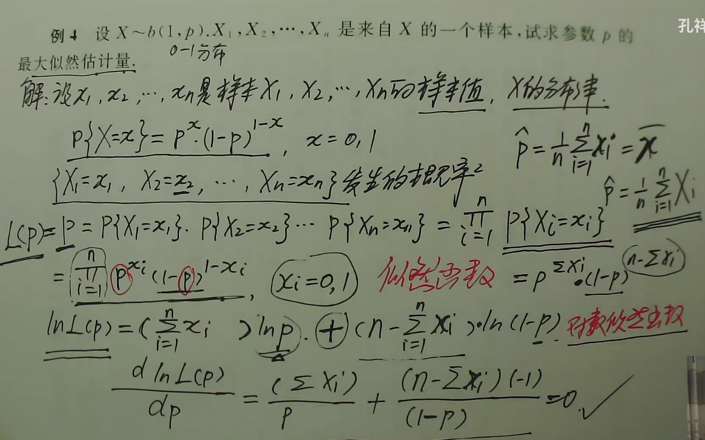

##### 连续型

总体$X$的概率密度为$f(x;\theta)$，$X_1.X_2,\dots,X_n$是来自总体$X$的样本，$x_1.x_2,\dots,x_n$为观测的样本值，则概率

$$
P(X_1=x_1,X_2=x_2,\dots,X_n=x_n)=\prod_{i=1}^{n}f(x_{i};\theta)dx_{i}=L(x_1,x_2,\dots,X_n;\theta)=L(\theta)
$$

求$L(\theta)$函数的最大值时的$\theta$即为变量$\theta$的估计量$\hat{\theta}$，$\prod_{i=1}^{n}dx_{i}$是已知量实则就是求解$\prod_{i=1}^{n}f(x_{i};\theta)$的极值

称$\hat{\theta}=\hat{\theta}(X_1.X_2,\dots,X_n)$为$\theta$的最大似然估计量,称$\hat{\theta}=\hat{\theta}(x_1.x_2,\dots,x_n)$为$\theta$的最大似然估计值

若有$k$个$\theta_{i}$，对各个求偏导得到$k$个式子，令这些偏导函数为零可求解$k$个值

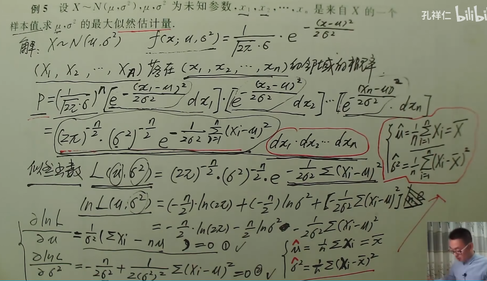

### 判断估计量是否恰当

#### 无偏性

$\theta$的估计量为$\hat{\theta}=\hat{\theta}(X_1.X_2,\dots,X_n)$
$\theta$的估计值为$\hat{\theta}=\hat{\theta}(x_1.x_2,\dots,x_n)$

若$E(\hat{\theta})=\theta$，则称$\hat{\theta}$为$\theta$的无偏估计

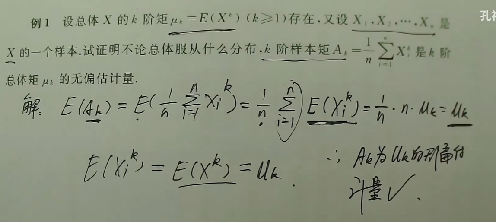
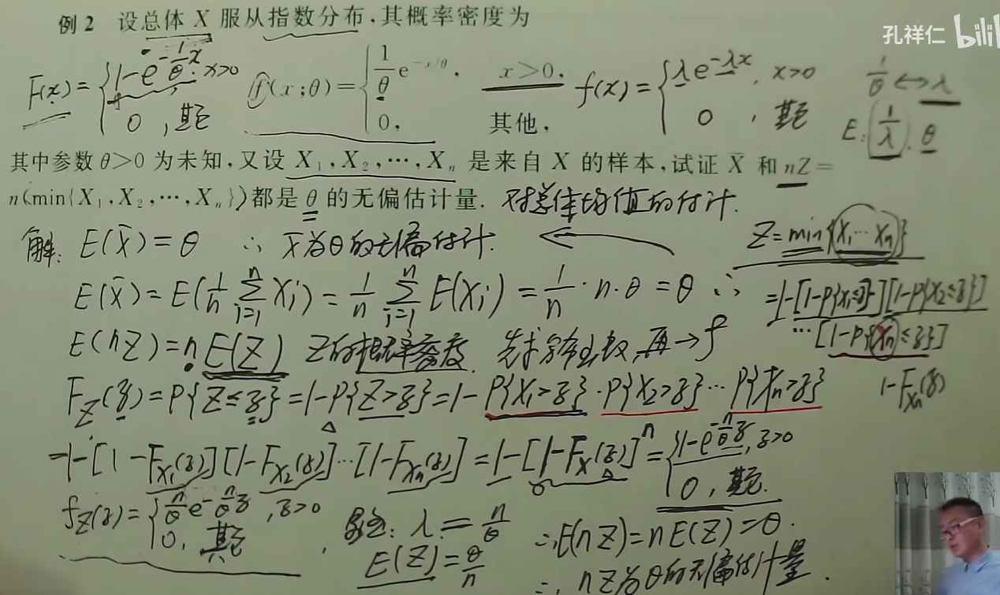
#### 有效性

若$E(\hat{\theta}_{1})=\theta,E(\hat{\theta}_{2})=\theta$，$D(\hat{\theta}_{1})\leq D(\hat{\theta}_{2})$，则称$\hat{\theta}_{1}$比$\hat{\theta}_{2}$更加有效

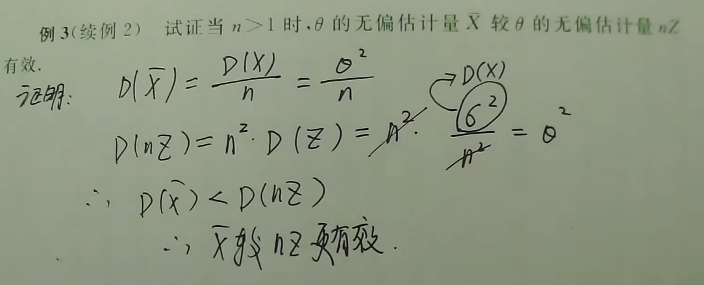
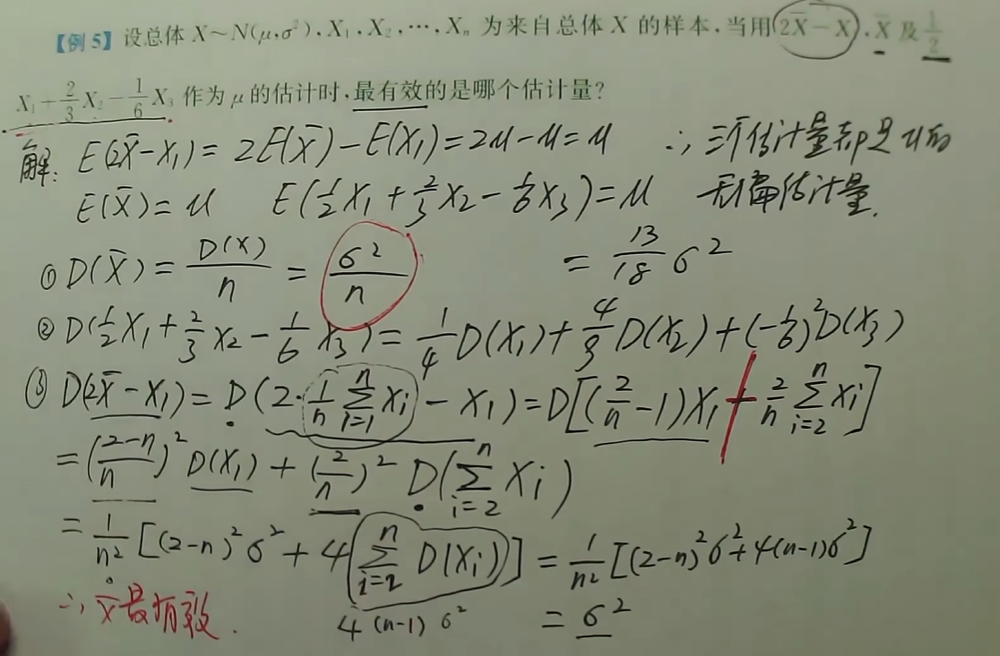

#### 相合性(一致性)

对任意$\epsilon$，有

$$
\lim_{ n \to \infty } P\{|\hat{\theta}-\theta|\leq \epsilon\}=1
$$
即当$n\to \infty$时，$\hat{\theta}$依概率收敛于$\theta$

充要条件为
$$
\begin{cases}
	\lim_{ n \to \infty } E(\hat{\theta})=\theta \\
	\lim_{ n \to \infty } D(\hat{\theta})=0
\end{cases}
$$
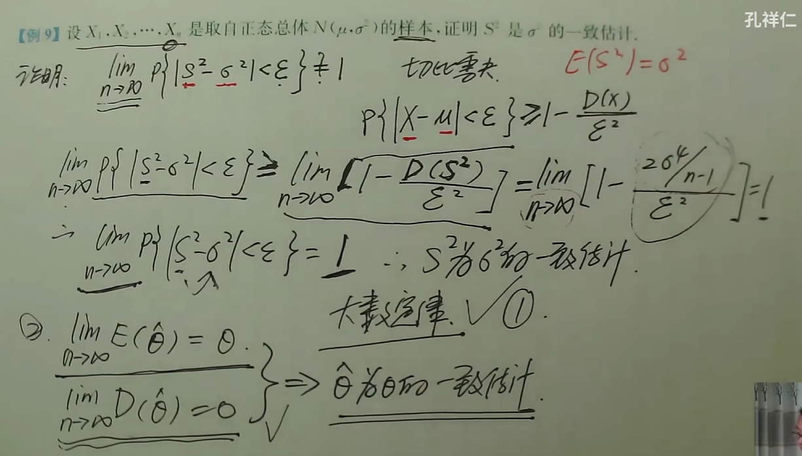

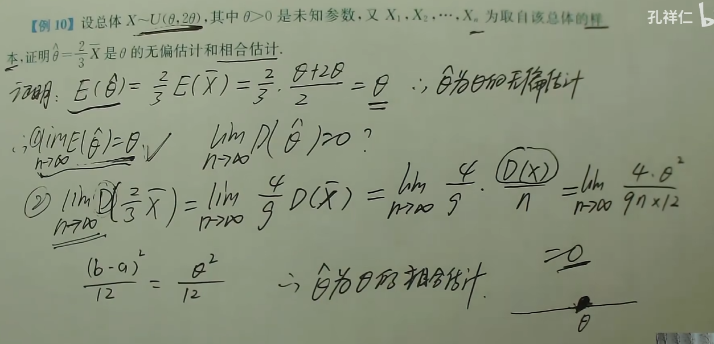

### 区间估计

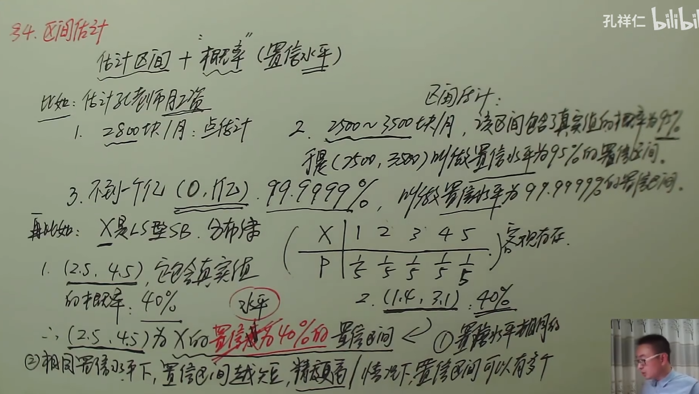
设$\theta$是总体$X$的分布函数的一个未知参数，对于给定的$\alpha(0<\alpha<1)$，由样本$X_{1},X_{2},\dots,X_{n}$确定两个统计量$\hat{\theta}_{1}=\hat{\theta}_{1}(X_{1},X_{2},\dots,X_{n})$和$\hat{\theta}_{2}=\hat{\theta}_{2}(X_{1},X_{2},\dots,X_{n})$，其中$\hat{\theta}_{1}<\hat{\theta}_{2}$使得

$$
P\{\hat{\theta}_{1}<\theta<\hat{\theta}_{2}\}=1-\alpha
$$
则称$(\hat{\theta}_{1},\hat{\theta}_{2})$是$\theta$的置信水平为$1-a$的置信区间，$\hat{\theta}_{1}$为置信下限，$\hat{\theta}_{2}$为置信上限

通过构造一个带$\theta$单不受$\theta$取值不影响的统计量（枢轴量）分布的式子，列式等于指定的概率，再换算成关于$\theta$的式子，从而求出置信区间

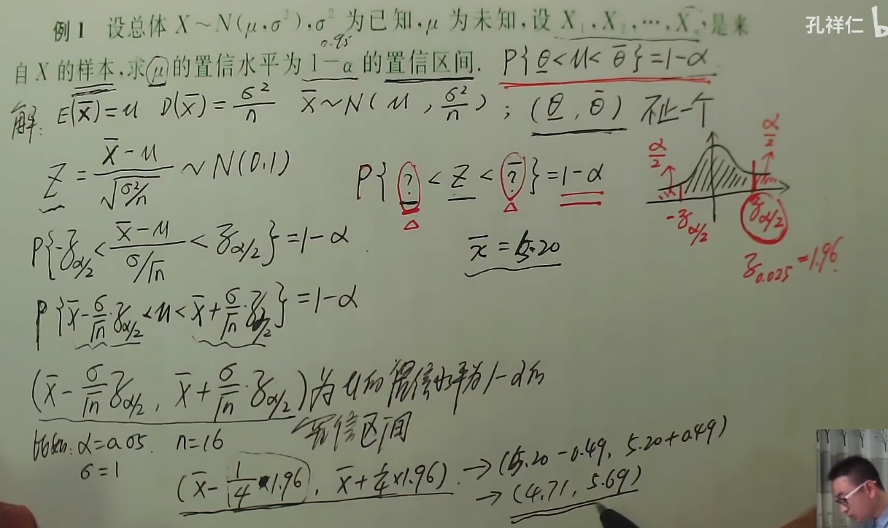
#### 单个正态总体估计均值$\mu$

当总体方差$\sigma^{2}$可知时，构造标准正态分布的枢轴量

$$
\frac{\bar{X}-\mu}{\frac{\sigma}{\sqrt{ n }}}\sim N(0,1)
$$

当总体方差$\sigma^{2}$未知时，构造$t$分布的枢轴量

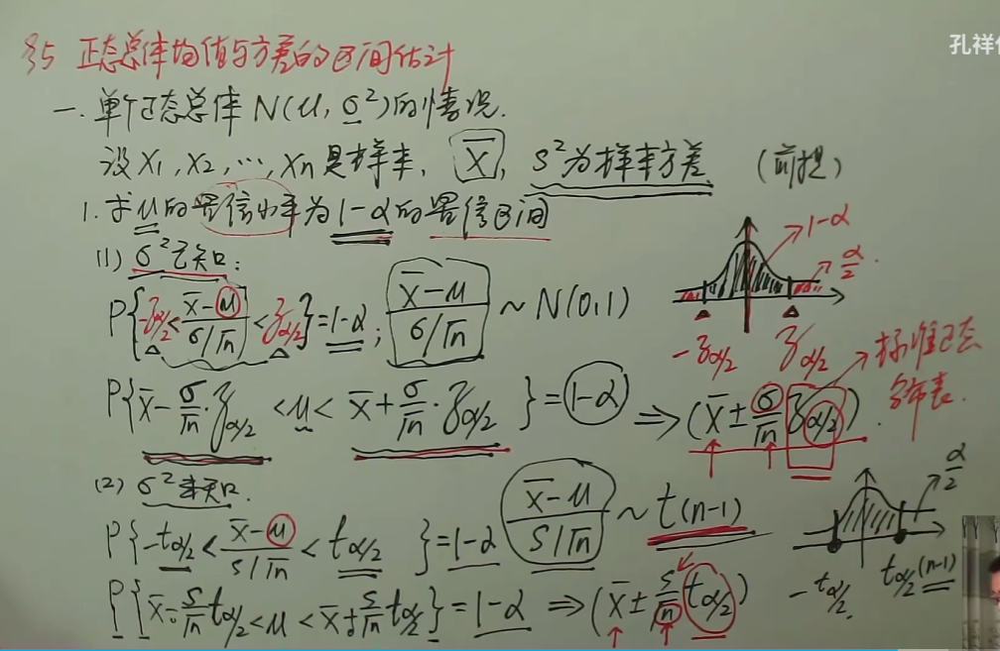

#### 单个正态总体估计方差

当总体均值$\mu$已知时，构造卡方分布的枢轴量、

$$
\sum_{i=1}^{n} (\frac{X_{i}-\mu}{\sigma})^{2} \sim \chi^{2}(n)
$$

> 这里不能构造标准正态分布，因为$\sigma\geq0$，然后标准正态分布化简出来会是一个$负数<\sigma<正数$的一个情况，那这样算出来只是一个$0<\sigma<正数$的一个区间，不对

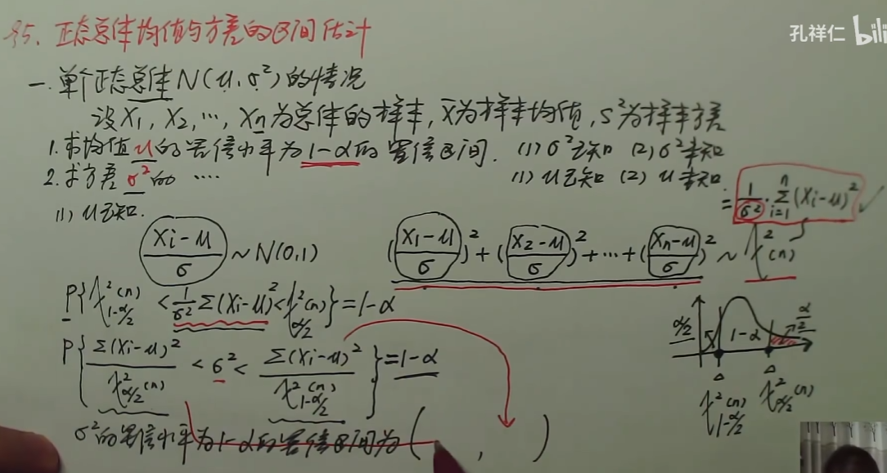

当总体均值$\mu$未知时，构造不含$\mu$的一个卡方分布

$$
\frac{(n-1)S^{2}}{\sigma^{2}}\sim \chi^{2}(n-1)
$$

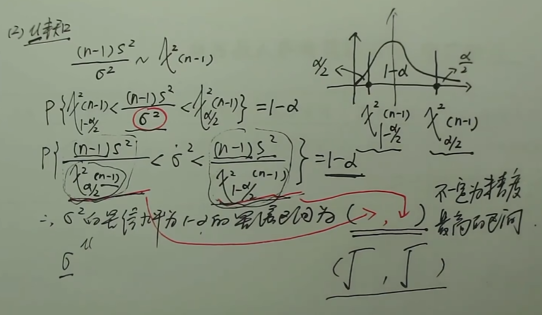
## 假设检验

关于总体的每一种论断称为统计假设，然后根据样本观察数据或试验结果所去推断这个看法是否成立，这类统计推断问题称为假设检验

原假设，也称为0假设、基本假设，没有证据不推翻的假设
>取相对大的概率作为原假设

对立假设，也称备选假设，为原假设的否定称述

### 小概率原理

在原假设的前提下，概率很接近于0的事件在一次试验或观察中认为不会发生，若小概率事件发生，则拒绝原假设

显著性水平$\alpha$，当一个事件的概率不大于$\alpha$既认为它是小概率事件

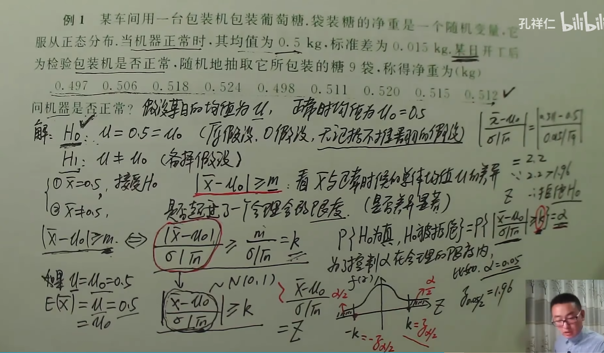

假设原假设为真，当$\bar{X}$落在两侧之外的范围时，我们拒绝原假设

因为会出现原假设为真但是拒绝的情况，以及原假设为假但是接受的情况，因此具体由分为两类错误

|           |                |               |
| --------- | -------------- | ------------- |
|           | 接受             | 拒绝            |
| $H_{0}$为真 | Ⅰ类，概率为$\alpha$ |               |
| $H_{0}$为假 |                | Ⅱ类，概率为$\beta$ |

### 正态总体下的六大检验及拒绝域

$\sigma$已知，$\mu$未知，原假设$H_{0}:\mu=\mu_{0},H_{1}: \mu\neq \mu_{0}$

