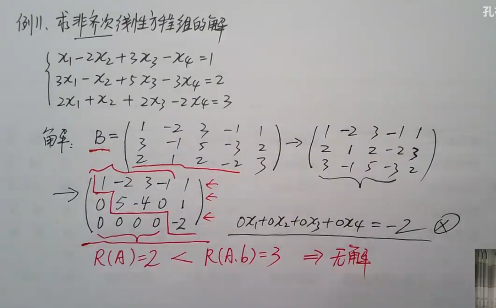
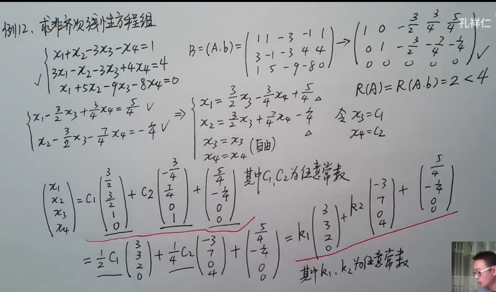

$n$元线性方程组$A_{m×n}x=b$，有
$$
\begin{cases}
	无解 \impliedby\implies r(A)<r(A,b) \\
	唯一解\impliedby\implies r(A)=r(A,b)=n \\
	无数解\impliedby\implies r(A)=r(A,b)<n
\end{cases}
$$

若$b=0$，当$r(A)=n$只有0解即唯一解，当$r(A)<n$有非零解即有无数解

