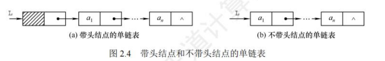
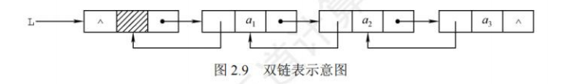
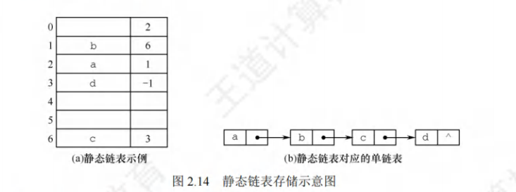

## 总结


## 线性表的定义和基本操作

### 线性表的定义

&nbsp;&nbsp;&nbsp;&nbsp;线性表是具有==相同数据类型==的 n (n>=0) 个数据元素的**有限序列**（数据之间具有前后驱关系），其中 n 为表长，当 n = 0 时线性表是一个空表。若用 L 命名线性表，则其一般表示为

L = (a₁, a₂, ⋯, aᵢ, aᵢ₊₁, ⋯, aₙ)

&nbsp;&nbsp;&nbsp;&nbsp;式中，a₁ 是唯一的“第一个”数据元素，又称表头元素；aₙ 是唯一的“最后一个”数据元素，又称表尾元素。除第一个元素外，每个元素有且仅有一个直接前驱。除最后一个元素外，每个元素有且仅有一个直接后继。

特点：

- 表中元素的个数有限。
- 表中元素具有逻辑上的顺序性，表中元素有其先后次序。
- 表中元素都是数据元素，每个元素都是单个元素。
- 表中元素的数据类型都相同，这意味着每个元素占有相同大小的存储空间。
- 表中元素具有抽象性，即仅讨论元素间的逻辑关系，而不考虑元素究竟表示什么内容。

**线性表是一种逻辑结构，表示元素之间一对一的相邻关系。顺序表和链表是指存储结构，两者属于不同层面的概念，因此不要将其混淆。**

### 线性表基本操作

1. 初始化表。构造一个空的线性表。
2. 求表长。返回线性表工的长度，即1中数据元素的个数。
3. 按值查找操作。在表工中查找具有给定关键字值的元素。
4. 按位査找操作。获取表工中第i个位置的元素的值。
5. 插入操作。在表工中的第i个位置上插入指定元素 e。
6. 删除操作。删除表,中第i个位置的元素,并用e返回删除元素的值。
7. 输出操作。按前后顺序输出线性表工的所有元素值。
8. 判空操作。若为空表，则返回true，否则返回 false。
9. 销毁操作。销毁线性表，并释放线性表工所占用的内存空间。

代码实现功能

```cpp
#include <iostream>
#include <vector>

class LinearList {
private:
    std::vector<int> list;

public:
    // 1. 初始化表。构造一个空的线性表。
    LinearList() {}

    // 2. 求表长。返回线性表的长度，即数据元素的个数。
    int length() const {
        return list.size();
    }

    // 3. 按值查找操作。在表中查找具有给定关键字值的元素。
    int findByValue(int value) const {
        for (int i = 0; i < list.size(); ++i) {
            if (list[i] == value) {
                return i;
            }
        }
        return -1; // 未找到返回 -1
    }

    // 4. 按位查找操作。获取表中第 i 个位置的元素的值。
    int findByIndex(int index) const {
        if (index < 0 || index >= list.size()) {
            throw std::out_of_range("Index out of range");
        }
        return list[index];
    }

    // 5. 插入操作。在表中的第 i 个位置上插入指定元素 e。
    void insert(int index, int value) {
        if (index < 0 || index > list.size()) {
            throw std::out_of_range("Index out of range");
        }
        list.insert(list.begin() + index, value);
    }

    // 6. 删除操作。删除表中第 i 个位置的元素，并返回删除元素的值。
    int remove(int index) {
        if (index < 0 || index >= list.size()) {
            throw std::out_of_range("Index out of range");
        }
        int value = list[index];
        list.erase(list.begin() + index);
        return value;
    }

    // 7. 输出操作。按前后顺序输出线性表的所有元素值。
    void print() const {
        for (int value : list) {
            std::cout << value << " ";
        }
        std::cout << std::endl;
    }

    // 8. 判空操作。若为空表，则返回 true，否则返回 false。
    bool isEmpty() const {
        return list.empty();
    }

    // 9. 销毁操作。销毁线性表，并释放线性表所占用的内存空间。
    void clear() {
        list.clear();
    }
};

int main() {
    LinearList list;

    // 初始化表
    std::cout << "初始化表" << std::endl;

    // 插入操作
    list.insert(0, 10);
    list.insert(1, 20);
    list.insert(2, 30);
    list.insert(1, 15);

    // 输出操作
    std::cout << "表的内容: ";
    list.print();

    // 求表长
    std::cout << "表长: " << list.length() << std::endl;

    // 按值查找操作
    int index = list.findByValue(20);
    std::cout << "值 20 的索引: " << index << std::endl;

    // 按位查找操作
    int value = list.findByIndex(2);
    std::cout << "索引 2 的值: " << value << std::endl;

    // 删除操作
    int removedValue = list.remove(1);
    std::cout << "删除的值: " << removedValue << std::endl;

    // 输出操作
    std::cout << "表的内容: ";
    list.print();

    // 判空操作
    std::cout << "表是否为空: " << (list.isEmpty() ? "是" : "否") << std::endl;

    // 销毁操作
    list.clear();
    std::cout << "表已销毁" << std::endl;

    // 判空操作
    std::cout << "表是否为空: " << (list.isEmpty() ? "是" : "否") << std::endl;

    return 0;
}
```

## 线性表的顺序表示

### 顺序表的定义

&nbsp;&nbsp;&nbsp;&nbsp;线性表的顺序存储又称顺序表。它是用一组地址连续的存储单元依次存储线性表中的数据元素，从而使得逻辑上相邻的两个元素在物理位置上也相邻。第1个元素存储在顺序表的起始位置,第i个元素的存储位置后面紧接着存储的是第i+1个元素，称i为元素q在顺序表中的位序。因此，顺序表的特点是表中元素的逻辑顺序与其存储的物理顺序相同。
&nbsp;&nbsp;&nbsp;&nbsp;每个数据元素的存储位置都和顺序表的起始位置相差一个和该数据元素的位序成正比的常数，因此，顺序表中的任意一个数据元素都可以随机存取，所以线性表的顺序存储结构是一种随机存取的存储结构。通常用高级程序设计语言中的数组来描述线性表的顺序存储结构。

内存分配
> &nbsp;&nbsp;&nbsp;&nbsp;一维数组可以是静态分配的，也可以是动态分配的。对数组进行静态分配时，因为数组的大小和空间事先已经固定，所以一旦空间占满，再加入新数据就会产生溢出，进而导致程序崩溃。
> &nbsp;&nbsp;&nbsp;&nbsp;而在动态分配时，存储数组的空间是在程序执行过程中通过动态存储分配语句分配的，一旦数据空间占满，就另外开辟一块更大的存储空间，将原表中的元素全部拷贝到新空间，从而达到扩充数组存储空间的目的，而不需要为线性表一次性地划分所有空间。

顺序表的优点：

1. 可进行随机访问,即可通过首地址和元素序号可以在 O(1)时间内找到指定的元素:
2. 存储密度高，每个结点只存储数据元素。

顺序表的缺点：

1. 元素的插入和删除需要移动大量的元素，插入操作平均需要移动 n/2 个元素，删除操作平均需要移动(n-1)/2个元素;
2. 顺序存储分配需要一段连续的存储空间，不够灵活。

### 顺序表代码实现

静态分配的顺序表储存结构实现

```cpp
#define MAXSIZE 100
typedef int DataType;
typedef struct
{
    DataType data[MAXSIZE];
    int last;
} Seqlist;

void initseqlist(Seqlist *L)
{
    L->last = 0;
}
```

动态分配的顺序表储存结构实现

```cpp
#define MAXSIZE 100
typedef int DataType;
typedef struct
{
    DataType *data;//指示动态分配数组的指针
    int last,size;
} Seqlist;

void initseqlist(Seqlist *L)
{
    L->data = new DataType[MAXSIZE];
    L->last = 0;
}
```

库文件

```cpp
#include <iostream>
using namespace std;
#define MAXSIZE 100
typedef int DataType;
typedef struct
{
    DataType *data;//指示动态分配数组的指针
    int last,size;
} Seqlist;

void initseqlist(Seqlist *L)
{
    L->data = new DataType[MAXSIZE];
    L->last = 0;
}

void input(Seqlist *L)
{
    DataType x;
    initseqlist(L);
    cout << "请输入顺序表中的元素，以0结束" << endl;
    cin >> x;
    while (x)
    {
        L->data[L->last++] = x;
        cin >> x;
    }
}

bool insert(Seqlist *L)
{
    int pos;
    DataType x;
    cout << "请输入插入位置和插入元素：" << endl;
    cin >> pos >> x;
    if (pos < 0 || pos > L->last)
    {
        cout << "插入位置不合法" << endl;
        return false;
    }

    if (L->last >= MAXSIZE)
    {
        cout << "顺序表已满，无法插入" << endl;
        return false;
    }

    for (int i = L->last; i >= pos; i--)
    {
        L->data[i] = L->data[i - 1];
    }

    L->data[pos - 1] = x;

    L->last++;

    return true;
}

bool deletel(Seqlist *L)
{
    int pos;
    DataType x;
    cout << "请输入删除数据的位置：" << endl;
    cin >> pos;
    if (pos < 0 || pos > L->last)
    {
        cout << "删除位置不合法" << endl;
        return false;
    }

    if (L->last <= 0)
    {
        cout << "顺序表为空，无法删除" << endl;
        return false;
    }

    for (int i = pos - 1; i <= L->last - 1; i++)
    {
        L->data[i] = L->data[i + 1];
    }

    L->last--;

    return true;
}

bool lookfor(Seqlist *L)
{
    int pos;
    DataType x;
    cout << "1. 查找元素第一次出现的位置" << endl;
    cout << "2. 查找某一位置上的元素" << endl;
    cout << "请输入你的选择：" << endl;
    int choice;
    cin >> choice;
    if (choice)
        if (choice == 1)
        {
            cout << "请输入想要查询的元素" << endl;
            cin >> x;
            for (int i = 0; i < L->last; i++)
            {
                if (L->data[i] == x)
                {
                    cout << "元素" << x << "第一次出现的位置是：" << i + 1 << endl;
                    return true;
                }
            }
            cout << "元素" << x << "不存在" << endl;
            return false;
        }
        else if (choice == 2)
        {
            cout << "请输入想要查询的位置" << endl;
            cin >> pos;
            if (pos < 0 || pos > L->last)
            {
                cout << "查询位置不合法" << endl;
                return false;
            }
            cout << "位置" << pos << "上的元素是：" << L->data[pos - 1] << endl;
            return true;
        }
    return true;
}

void sprit(Seqlist *L1, Seqlist *L2, Seqlist *L3)
{
    initseqlist(L2);
    initseqlist(L3);

    for (int i = 0; i < L1->last; i++)
    {
        if (L1->data[i] % 2 == 1)
        {
            L2->data[L2->last++] = L1->data[i];
        }
        else
        {
            L3->data[L3->last++] = L1->data[i];
        }
    }
}

void print(Seqlist *L)
{
    int i;
    if (L->last == 0)
        cout << "顺序表为空" << endl;
    else
        for (i = 0; i < L->last; i++)
        {
            cout << L->data[i] << " ";
            if ((i + 1) % 10 == 0)
                cout << endl;
        }
    cout << endl;
}

void inputfromfile(Seqlist *L, char *f)
{
    initseqlist(L);
    FILE *fp = fopen(f, "r");
    if (fp)
    {
        while (!feof(fp))
        {
            fscanf(fp, "%d", &L->data[L->last++]);
        }
        fclose(fp);
    }
}
```

测试函数

```cpp
#include "seqlist.h"

int main()
{
    Seqlist L1, L2, L3;
    input(&L1);
    print(&L1);
    if (insert(&L1))
    {
        cout<<"插入成功"<<endl;
    }
    else{
        cout<<"插入失败"<<endl;
    }
    print(&L1);
    if (deletel(&L1))
    {
        cout<<"删除成功"<<endl;
    }
    else{
        cout<<"删除失败"<<endl;
    }
    print(&L1);
    if (lookfor(&L1))
    {
        cout<<"查找成功"<<endl;
    }
    else{
        cout<<"查找失败"<<endl;
    }
    sprit(&L1, &L2, &L3);
    cout << "原序列为：" << endl;
    print(&L1);
    cout << "奇数序列为：" << endl;
    print(&L2);
    cout << "偶数序列为：" << endl;
    print(&L3);
    return 0;
}
```

## 线性表的链式表示

### 单链表的定义

线性表的链式存储又称单链表，它是指通过一组任意的存储单元来存储线性表中的数据元素。为了建立数据元素之间的线性关系，对每个链表结点，除存放元素自身的信息之外，还需要存放一个指向其后继的指针。

| data | next |
| ---- | ---- |
| 数据域|指针域|

&nbsp;&nbsp;&nbsp;&nbsp;通常用头指针$head$来标识一个单链表，指出链表的起始地址，头指针为NULL是表示一个空表。
&nbsp;&nbsp;&nbsp;&nbsp;头结点，在单链表第一个数据结点之前附加的一个结点，可不设任何信息，也可记录表长，带头结点时，头指针指向头结点；不带头结点时，头指针指向第一个数据结点。尾结点的指针域为NULL（用^表示）



为什么要引入头结点：

1. 由于第一个数据结点的位置被存放在头结点的指针域中，因此在链表的第一个位置上的操作和在表的其他位置上的操作一致，无须进行特殊处理;
2. 无论链表是否为空,其头指针都是指向头结点的非空指针(空表中头结点的指针域为空),因此空表和非空表的处理也就得到了统一。

### 单向链表基本操作实现

头文件

```cpp
#include <iostream>
using namespace std;
#define MAXSIZE 100
typedef int Datatype;
typedef struct node
{
    Datatype data;
    struct node *next;
} LNode, *LinkList;

LinkList creatbystack()
{
    LinkList head, tail;
    Datatype x;
    head = new LNode;
    head->next = NULL;
    cout << "请输入链表数据（以0结束）：" << endl;
    cin>>x;
    while (x != 0)
    {
        tail = new LNode;
        tail->data = x;
        tail->next = head->next;
        head->next = tail;//早插入的在队尾，新的在队首
        cin>>x;
    }
    return head;
}

LinkList creatbyqueue()
{
    LinkList head, r, s;
    Datatype x;
    head = new LNode;
    head->next = NULL;
    r = head;
    cout << "请输入链表数据（以0结束）：" << endl;
    cin>>x;
    while (x != 0)
    {
        s = new LNode;
        s->data = x;
        r->next = s;
        r = s;
        cin>>x;
    }
    r->next = NULL;
    return head;
}

void print(LinkList head)
{
    LinkList p;
    int i = 0;
    p = head->next;
    while (p)
    {
        cout << p->data << " ";
        i++;
        if (i % 10 == 0)
            cout << endl;
        p = p->next;
    }
    cout << endl;
}

void delList(LinkList head)
{
    LNode *p = head; // 直接从头节点开始删除
    LNode *nextNode = NULL;

    while (p != NULL)
    {
        nextNode = p->next; // 保存下一个节点的指针
        delete p;           // 删除当前节点
        p = nextNode;       // 移动到下一个节点
    }
}

// 合并两个有序链表
LNode *Merge(LNode *l1, LNode *l2)
{
    if (!l1)
        return l2;
    if (!l2)
        return l1;

    LNode *result = NULL;
    if (l1->data <= l2->data)
    {
        result = l1;
        result->next = Merge(l1->next, l2);
    }
    else
    {
        result = l2;
        result->next = Merge(l1, l2->next);
    }
    return result;
}

// 分割链表
void SplitList(LNode *source, LNode **front, LNode **back)
{
    LNode *fast;
    LNode *slow;
    slow = source;
    fast = source->next;

    while (fast != NULL)
    {
        fast = fast->next;
        if (fast != NULL)
        {
            slow = slow->next;
            fast = fast->next;
        }
    }

    *front = source;
    *back = slow->next;
    slow->next = NULL;
}

// 归并排序
void MergeSort(LinkList *headRef)
{
    LNode *head = *headRef;
    LNode *a;
    LNode *b;

    if ((head == NULL) || (head->next == NULL))
    {
        return;
    }
    SplitList(head, &a, &b);

    MergeSort(&a);
    MergeSort(&b);

    *headRef = Merge(a, b);
}

void InsertHead(LinkList head, Datatype x)
{
    if (head == NULL)
    {
        cout << "链表不存在" << endl;
        return;
    }
    LinkList p = new LNode;
    p->data = x;
    p->next = head->next;
    head->next = p;
}

void InsertTail(LinkList head, Datatype x)
{
    if (head == NULL)
    {
        cout << "链表不存在" << endl;
        return;
    }
    LinkList p = head;
    while (p->next != NULL)
    {
        p = p->next;
    }
    LinkList q = new LNode;
    q->data = x;
    q->next = NULL;
    p->next = q;
}

void InsertMid(LinkList head, Datatype x, int i)
{
    if (head == NULL)
    {
        cout << "链表不存在" << endl;
        return;
    }
    LinkList p = head;
    int j = 0;
    while (p != NULL && j < i - 1)
    {
        p = p->next;
        j++;
    }
    if (p == NULL)
    {
        cout << "插入位置不合法" << endl;
        return;
    }
    LinkList q = new LNode;
    q->data = x;
    q->next = p->next;
    p->next = q;
}

void unit(LinkList A, LinkList B, LinkList C)
{
    LinkList p = A->next;
    LinkList q = B->next;
    LinkList r = NULL;
    while (p != NULL && q != NULL)
    {
        if (p->data < q->data)
        {
            LinkList temp = p->next;
            p->next = r;
            r = p;
            p = temp;
        }
        else
        {
            LinkList temp = q->next;
            q->next = r;
            r = q;
            q = temp;
        }
    }

    while (p != NULL)
    {
        LinkList temp = p->next;
        p->next = r;
        r = p;
        p = temp;
    }

    while (q != NULL)
    {
        LinkList temp = q->next;
        q->next = r;
        r = q;
        q = temp;
    }

    C->next = r;
}
```

测试函数

```cpp
int main()
{
    LinkList list1, list2;

    cout << "使用头插法创建链表：" << endl;
    list1 = creatbystack();
    cout << "头插法创建的链表list1：" << endl;
    print(list1);
    cout << "归并排序后的链表list1：" << endl;
    MergeSort(&list1);
    print(list1);

    cout << "使用尾插法创建链表：" << endl;
    list2 = creatbyqueue();
    cout << "尾插法创建的链表list2：" << endl;
    print(list2);
    cout << "归并排序后的链表list2：" << endl;
    MergeSort(&list2);
    print(list2);

    cout << "在list1头部插入元素：" << endl;
    int x;
    cin >> x;
    InsertHead(list1, x);
    cout << "头插法插入元素后的链表list1：" << endl;
    print(list1);
    cout << "排序后的链表list1：" << endl;
    MergeSort(&list1);
    print(list1);

    cout << "在list1尾部插入元素：" << endl;
    cin >> x;
    InsertTail(list1, x);
    cout << "尾插法插入元素后的链表list1：" << endl;
    print(list1);
    cout << "排序后的链表list1：" << endl;
    MergeSort(&list1);
    print(list1);

    cout << "在list1第i个位置插入元素：" << endl;
    int i;
    cin >> i;
    cout << "请输入要插入的元素：" << endl;
    cin >> x;
    InsertMid(list1, x, i);
    cout << "在第" << i << "个位置插入元素后的链表list1：" << endl;
    print(list1);
    cout << "排序后的链表list1：" << endl;
    MergeSort(&list1);
    print(list1);

    LinkList list3 = new LNode;
    list3->next = NULL;
    cout << "合并两个链表：" << endl;
    unit(list1, list2, list3);
    cout << "合并后的链表list3：" << endl;
    print(list3);

    delList(list1);
    delList(list2);
    delList(list3);

    return 0;
}
```

### 双链表

&nbsp;&nbsp;&nbsp;&nbsp;双链表结点中有两个指针 prior和next，分别指向其直接前驱和直接后继，如图2.9所示。表头结点的prior域和尾结点的next域都是 NULL。



1. 插入
2. 删除

代码实现

```cpp
#include <iostream>
using namespace std;
#define MAXSIZE 100
typedef int Datatype;
typedef struct DNode
{
    Datatype data;
    struct DNode *prior, *next;
} DNode, *DLinkList;

// 创建双链表
DLinkList createDLinkList()
{
    DLinkList list = new DNode;
    list->next = nullptr;
    list->prior = nullptr;
    return list;
}

// 初始化双链表
void initDLinkList(DLinkList &list)
{
    list = nullptr;
}

// 插入节点
void insertNode(DLinkList &list, int position, Datatype value)
{
    DNode *newNode = new DNode;
    newNode->data = value;

    if (position == 0)
    {
        newNode->next = list;
        newNode->prior = nullptr;
        if (list != nullptr)
        {
            list->prior = newNode;
        }
        list = newNode;
    }
    else
    {
        DNode *current = list;
        for (int i = 0; i < position - 1 && current != nullptr; ++i)
        {
            current = current->next;
        }
        if (current == nullptr)
        {
            cout << "插入位置超出链表长度" << endl;
            delete newNode;
            return;
        }
        newNode->next = current->next;
        newNode->prior = current;
        if (current->next != nullptr)
        {
            current->next->prior = newNode;
        }
        current->next = newNode;
    }
}

// 删除节点
void deleteNode(DLinkList &list, int position)
{
    if (list == nullptr)
    {
        cout << "链表为空" << endl;
        return;
    }

    DNode *current = list;
    if (position == 0)
    {
        list = list->next;
        if (list != nullptr)
        {
            list->prior = nullptr;
        }
        delete current;
    }
    else
    {
        for (int i = 0; i < position && current != nullptr; ++i)
        {
            current = current->next;
        }
        if (current == nullptr)
        {
            cout << "插入位置超出链表长度" << endl;
            return;
        }
        if (current->prior != nullptr)
        {
            current->prior->next = current->next;
        }
        if (current->next != nullptr)
        {
            current->next->prior = current->prior;
        }
        delete current;
    }
}

// 打印链表
void printList(DLinkList list)
{
    DNode *current = list;
    while (current != nullptr)
    {
        cout << current->data << " ";
        current = current->next;
    }
    cout << endl;
}

int main()
{
    DLinkList list;
    initDLinkList(list);

    insertNode(list, 0, 10);
    insertNode(list, 1, 20);
    insertNode(list, 2, 30);
    insertNode(list, 1, 15);

    cout << "插入后的链表: ";
    printList(list);

    deleteNode(list, 2);
    cout << "删除后的链表: ";
    printList(list);
    return 0;
}
```

### 循环链表

**单向循环链表**：

&nbsp;&nbsp;&nbsp;&nbsp;循环单链表和单链表的区别在于，表中最后一个结点的指针不是 NULL，而改为指向头结点,从而整个链表形成一个环。


**循环双链表**：

&nbsp;&nbsp;&nbsp;&nbsp;由循环单链表的定义不难推出循环双链表。不同的是，在循环双链表中，头结点的prior指针还要指向表尾结点，当某结点*p为尾结点时，p->next==L。


### 静态链表

&nbsp;&nbsp;&nbsp;&nbsp;静态链表是用数组来描述线性表的链式存储结构，结点也有数据域 data 和指针域 next,与前面所讲的链表中的指针不同的是，这里的指针是结点在数组中的相对地址(数组下标)，又称游标。和顺序表一样，静态链表也要预先分配一块连续的内存空间。



静态链表以 next==-1作为其结束的标志。静态链表的插入、删除操作与动态链表的相同,只需要修改指针，而不需要移动元素。总体来说，静态链表没有单链表使用起来方便，但在一些不支持指针的高级语言(如 Basic)中，这是一种非常巧妙的设计方法。

### 顺序表和链表比较

1. 顺序表可以顺序存取，也可以随机存取，链表只能从表头开始依次顺序存取。例如在第i个位置上执行存取的操作，顺序表仅需一次访问，而链表则需从表头开始依次访问i次。
2. 采用顺序存储时，逻辑上相邻的元素，对应的物理存储位置也相邻。而采用链式存储时，逻辑上相邻的元素，物理存储位置不一定相邻，对应的逻辑关系是通过指针链接来表示的。
3. 对于按值查找，顺序表无序时，两者的时间复杂度均为 0(n);顺表有序时，可采用折半查找,此时的时间复杂度为 O(logn)。对于按序号査找,顺序表支持随机访问,时间复杂度仅为 O(1),而链表的平均时间复杂度为 O(n)。顺序表的插入、删除操作，平均需要移动半个表长的元素。链表的插入、删除操作，只需修改相关结点的指针域即可。
4. 顺序存储在静态存储分配情形下容易出现溢出和浪费的情况，动态存储分配虽然存储空间可以扩充，但需要移动大量元素，导致操作效率降低，而且若内存中没有更大块的连续存储空间，则会导致分配失败;链式存储的结点空间只在需要时申请分配，只要内存有空间就可以分配，操作灵活、高效，但由于链表的每个结点都带有指针域，因此存储密度不够大。
