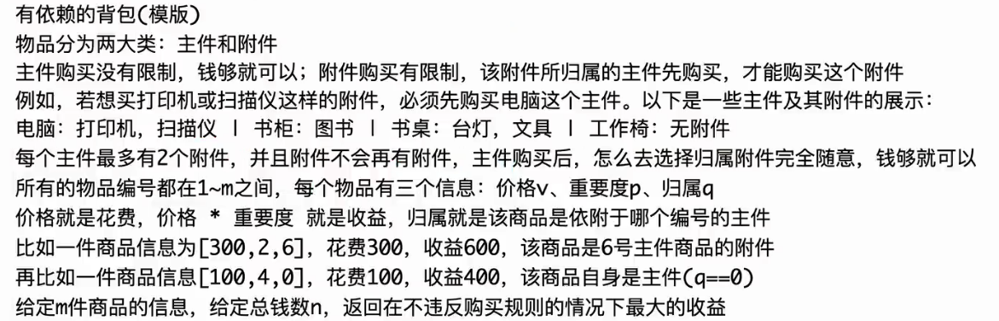

## 01背包

### 原理思想

给定一个正数c，表示背包的容量，有n个货物，每个货物有自己的体积和价值，在不超过总容量的情况下，挑选货物达到价值最大

`dp[i][j]`表示第i个物品自由选择，在容量不超过j的情况下，那么便有两种情况：

- 不选择第i个物品`dp[i][j]=dp[i-1][j]`
- 选择第i个物品，那么`dp[i][j]=dp[i-1][j-cost[i]]+val[i]`

取两种情况的最大值存入数组当中，写入整个二维数组，取右下点即为最大值

```cpp
#include <bits/stdc++.h>
using namespace std;
typedef long long ll;
void solve() {
    int n, C;
    cin >> n >> C;
    vector<int> cost(n), val(n);
    for (int i = 0; i < n; ++i) {
        cin >> cost[i] >> val[i];
    }
    int n = cost.size();
    vector<vector<int>> dp(n + 1, vector<int>(C + 1, 0));
    for (int i = 1; i <= n; ++i) {
        for (int j = 0; j <= C; ++j) {
            if (j >= cost[i - 1]) {
                dp[i][j] = max(dp[i - 1][j], dp[i - 1][j - cost[i - 1]] + val[i - 1]);
            } else {
                dp[i][j] = dp[i - 1][j];
            }
        }
    }
    int max_value = dp[n][C];
    cout << max_value << endl;
}

int main() {
    solve();
    return 0;
}
```

#### 空间压缩dp数组

&nbsp;&nbsp;&nbsp;&nbsp;该一维数组为原二维表的每一行，每次遍历后自我向下更新。

&nbsp;&nbsp;&nbsp;&nbsp;实现原理：因为每一个元素只由它上方和左上方的两个元素确定，因此只需从右往左遍历数组进行根据，为遍历到的位置仍为上一行，已遍历的位置为新一行的数据，所以可以用一维表替代二维表从而实现空间压缩。

```java
public static int compute2(){
	Array.fill(dp, 1, C+1, 0);
    for(int i = 1; i <=n; i++){
        for (int j = C; j>= cost[i]; j--){//从后往前，要取上一行数据
            dp[j] = Math.max(dp[j], dp[j-cost[i]]+val[i])
        }
    }
}
```

### 例题

#### 特殊的购物规则

#### 目标和问题

#### 最后一块石头的重量

## 有依赖关系的背包

&nbsp;&nbsp;&nbsp;&nbsp;多个物品变成一个复合物品（互斥），每件复合物品要和怎么要多种可能性展开，时间复杂度O(物品个数 x 背包容量),额外空间复杂度O(背包容量)

### 原理思想



### 例题

## 分组背包

&nbsp;&nbsp;&nbsp;&nbsp;多个物品分组，每组只能取1件，讲每一组的物品的可能性都展开，O(物品数量 x 背包容量)

### 原理思想

&nbsp;&nbsp;&nbsp;&nbsp;给定一个正数m表示背包容量，有n个货物可供挑选，每个货物有字节的提交，价值，组号，同一组的物品只能挑选一件，挑选的物品的体积总和不能超过背包容量，怎么挑选货物能达到价值最大，返回最大的价值。

&nbsp;&nbsp;&nbsp;&nbsp;`dp[i][j]`表示第i组自由选择，在容量不超过j的情况下，那么便有两种情况：

- 不选择第i组物品`dp[i][j]=dp[i-1][j]`
- 选择第i组物品，列举所有的可能取最大的那个`dp[i][j]=dp[i-1][j-xi的体积]+xi的价值`

取两种情况的最大值存入数组当中，写入整个二维数组，取右下点即为最大值


```java
public static int compute1(){
    int teams = 1;//统计组数,组号可能不连续
    for (int i = 2; i <= n; i++){
        if (arr[i - 1][2] != arr[i][2]){//arr数组读入了体积，价值和组号并按照组号进行了排序
            teams++;
        }
    }
    int[][] dp = new int [team + 1][m + 1];
    for (int start = 1, end = 2, i = 1; start <= n; i++){
        while (end <= n && arr[end][2] == arr[start][2]){
            end++;
        }
        for (int j = 0; j <= m; j++){
            dp[i]][j] = dp[i - 1][j];
            for (int k = start; k < end; k++){
                if(j - arr[k][0]>=0){
                	dp[i][j] = Math.max(dp[i][j],dp[i-1][j-arr[k][0]]+arr[k][1]);
            	}
            }
        }
        start = end++;
    }
    return dp[team][m]
}
```

#### 空间压缩

```java
public static int compute2(){
    Arrays.fill(dp, 0, m + 1, 0);
    for(int start = 1, end = 2; start < n;){
        while (end <= n && arr[end][2] == arr[start][2]){
            end++;
        }
        for(int j = m; j >= 0; j--){
            for(int k = start; k < end; k++){
                if(j - arr[k][0] >= 0){
                    dp[j] = Math.max(dp[j], dp[j - arr[k][0]] + arr[k][1]);
                }
            }
        }
        start = end++;
    }
    return dp[m];
}
```


### 例题

#### 栈中取k个硬币的最大价值和

## 完全背包

### 原理思想

&nbsp;&nbsp;&nbsp;&nbsp;给定一个正数t，表示背包容量，有m中货物，每种货物可以选择任意个，每种货物都有体积和价值，返回在不超过总容量的情况下，怎么挑选货物能达到价值最大。

`dp[i][j]`表示第i个物品自由选择，在容量不超过j的情况下，那么便有两种情况：

- 不选择第i个物品`dp[i][j]=dp[i-1][j]`
- 选择第i个物品，那么`dp[i][j]=dp[i][j-cost[i]]+val[i]`

#### 空间压缩

```java
public static int compute2(){
	Array.fill(dp, 1, C+1, 0);
    for(int i = 1; i <=n; i++){
        for (int j = cost[i]; j <= C; j--){//从前往后，不需要上一行的数据
            dp[j] = Math.max(dp[j], dp[j-cost[i]]+val[i])
        }
    }
}
```

### 例题

#### 正则表达式匹配

#### 购买足量甘草的最小花费

## 三维背包

### 01背包

一天，小智和皮卡丘来到了小精灵狩猎场，里面有很多珍贵的野生宠物小精灵。小智也想收服其中的一些小精灵。然而，野生的小精灵并不那么容易被收服。对于每一个野生小精灵而言，小智可能需要使用很多个精灵球才能收服它，而在收服过程中，野生小精灵也会对皮卡丘造成一定的伤害（从而减少皮卡丘的体力）。当皮卡丘的体力小于等于0时，小智就必须结束狩猎（因为他需要给皮卡丘疗伤），而使得皮卡丘体力小于等于0的野生小精灵也不会被小智收服。当小智的精灵球用完时，狩猎也宣告结束。

我们假设小智遇到野生小精灵时有两个选择：收服它，或者离开它。如果小智选择了收服，那么一定会扔出能够收服该小精灵的精灵球，而皮卡丘也一定会受到相应的伤害；如果选择离开它，那么小智不会损失精灵球，皮卡丘也不会损失体力。

小智的目标有两个：主要目标是收服尽可能多的野生小精灵；如果可以收服的小精灵数量一样，小智希望皮卡丘受到的伤害越小（剩余体力越大），因为他们还要继续冒险。

现在已知小智的精灵球数量和皮卡丘的初始体力，已知每一个小精灵需要的用于收服的精灵球数目和它在被收服过程中会对皮卡丘造成的伤害数目。请问，小智该如何选择收服哪些小精灵以达到他的目标呢？

输入

输入数据的第一行包含三个整数：N(0 < N < 1000)，M(0 < M < 500)，K(0 < K < 100)，分别代表小智的精灵球数量、皮卡丘初始的体力值、野生小精灵的数量。
之后的K行，每一行代表一个野生小精灵，包括两个整数：收服该小精灵需要的精灵球的数量，以及收服过程中对皮卡丘造成的伤害。

输出

输出为一行，包含两个整数：C，R，分别表示最多收服C个小精灵，以及收服C个小精灵时皮卡丘的剩余体力值最多为R。

样例输入

```
样例输入1：
10 100 5
7 10
2 40
2 50
1 20
4 20

样例输入2：
10 100 5
8 110
12 10
20 10
5 200
1 110
```

样例输出

```
样例输出1：
3 30

样例输出2：
0 100
```

#### 代码实现

```cpp
#include <bits/stdc++.h>
using namespace std;

typedef long long ll;

void solve() {
    int N, M, K;
    cin >> N >> M >> K;
    vector<int> balls(K), damage(K);
    for (int i = 0; i < K; i++) {
        cin >> balls[i] >> damage[i];
    }

    // 初始化dp数组，dp[精灵球数量][累计伤害] = 能收服的最大精灵数量
    // 体力范围为0到M，精灵球数量范围为0到N
    int dp[1001][501];
    memset(dp, -1, sizeof(dp));
    dp[0][0] = 0;

    for (int i = 0; i < K; i++) {
        int ball = balls[i];
        int dam = damage[i];
        // 倒序遍历，防止状态被重复更新
        for (int b = N - ball; b >= 0; b--) {
            for (int d = M - 1 - dam; d >= 0; d--) {
                if (dp[b][d] >= 0) {
                    int new_b = b + ball;
                    int new_d = d + dam;
                    // 确保累计伤害不导致体力降为0或以下
                    if (new_d < M) {
                        dp[new_b][new_d] = max(dp[new_b][new_d], dp[b][d] + 1);
                    }
                }
            }
        }
    }

    int maxC = 0, maxR = 0;
    for (int b = 0; b <= N; b++) {
        for (int d = 0; d < M; d++) {
            if (dp[b][d] > maxC) {
                maxC = dp[b][d];
                maxR = M - d;
            } else if (dp[b][d] == maxC) {
                if (M - d > maxR) {
                    maxR = M - d;
                }
            }
        }
    }

    cout << maxC << " " << maxR << endl;
}

int main() {
    solve();
    return 0;
}
```

