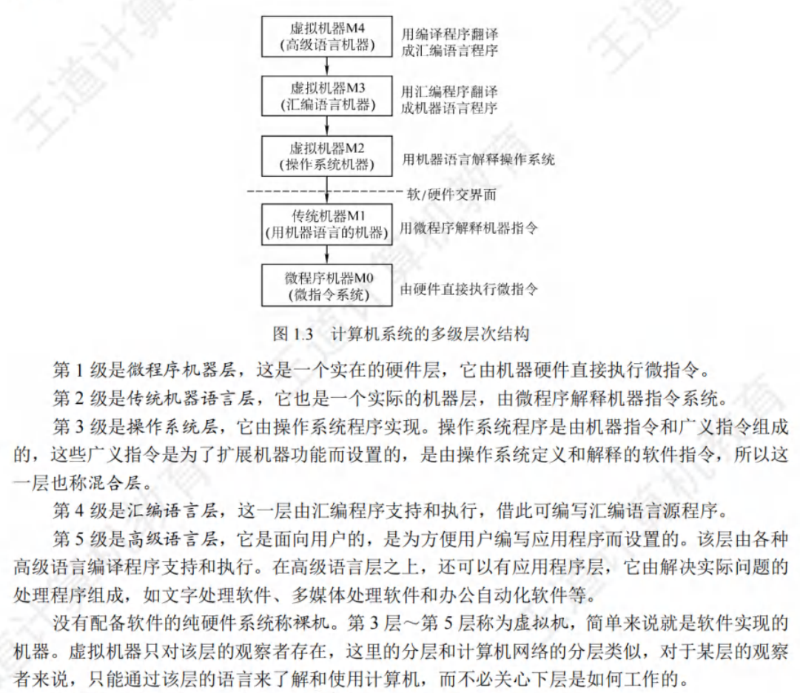

摩尔定律：当价格不变时，集成电路上可容纳的品体管数目，约每隔 18 个月便会增加一倍，性能也将提升一倍。也就是说，我们现在和 18个月后花同样的钱买到的 CPU，后者的性能是前者的两倍。这一定律揭示了信息技术进步的速度。

## 计算机层次结构

### 硬件系统

功能部件

1. 输入设备
2. 输出设备
3. 存储器：
   > 主存储器（内存储器或主存）：
   - CPU能够直接访问的存储器是主存储器
   - 主存储器的工作方式是按存储单元的地址进行存取，这种存取方式称为按地址存取方式
   
   - 存储体存放二进制信息，存储器地址寄存器(MAR)存放访存地址，经过地址译码后找到所选的存储单元。存储器数据寄存器(MDR)用于暂存要从存储器中读或写的信息，时序控制逻辑用于产生存储器操作所需的各种时序信号。
   - 存储体由许多存储单元组成，每个存储单元包含若干存储元件，每个存储元件存储一位二进制代码“0”或“1”。因此存储单元可存储一串二进制代码，称这串代码为存储字，称这串代码的位数为存储字长，存储字长可以是 1B(8bit)或是字节的偶数倍。
   - MAR 用于寻址，其位数反映最多可寻址的存储单元的个数，如MAR为10 位，则最多有210=1024 个存储单元，记为 1K。MAR 的长度与 PC 的长度相等。MDR 的位数通常等于存储字长，一般为字节的2次幂的整数倍。
   > 辅助存储器（外存储器或外存）
   - 用于帮助主存储器记忆更多的信息，辅助存储器中的信息必须调入主存储器后,才能为 CPU 所访问。

4. 运算器
5. 控制器
   >程序计数器（PC）
   >指令寄存器（IR）
   >控制单元（CU）
   IR 存放当前执行的指令代码，PC存放下一条指令的地址，不要将它们混淆。此外，MAR用来存放待访问的存储单元地址，MDR 则用来存放取处存储单元的数据。

### 软件系统

三种机器语言特点：

1. 机器语言。也称二进制代码语言，需要编程人员记忆每条指令的二进制编码。机器语言是计算机唯一可以直接识别和执行的语言。

2. 汇编语言。汇编语言用英文单词或其缩写代替二进制的指令代码，更容易为人们记忆和理解。使用汇编语言编辑的程序，必须经过一个称为汇编程序的系统软件的翻译，将其转换为机器语言程序后，才能在计算机的硬件系统上执行。

3. 高级语言。高级语言(如C、C++、Java 等)是为方便程序设计人员写出解决问题的处理方案和解题过程的程序。通常高级语言需要经过编译程序编译成汇编语言程序，然后经过汇编操作得到机器语言程序，或直接由高级语言程序翻译成机器语言程序。

三种翻译程序

1. 汇编程序(汇编器)：将汇编语言程序翻译成机器语言程序。
2. 解释程序(解释器)：将源程序中的语句按执行顺序逐条翻译成机器指令并立即执行。
3. 编译程序(编译器)：将高级语言程序翻译成汇编语言或机器语言程序。

### 硬软件对比

软件和硬件具有逻辑功能上的等价性，硬件实现具有更高的执行速度，软件实现具有更好的灵活性。执行频繁、硬件实现代价不是很高的功能通常由硬件实现。

### 计算机层次架构

### 计算机系统的工作原理

**存储程序工作方式**

**从源程序到可执行文件**：
预处理阶段
编译阶段
汇编阶段
链接阶段

