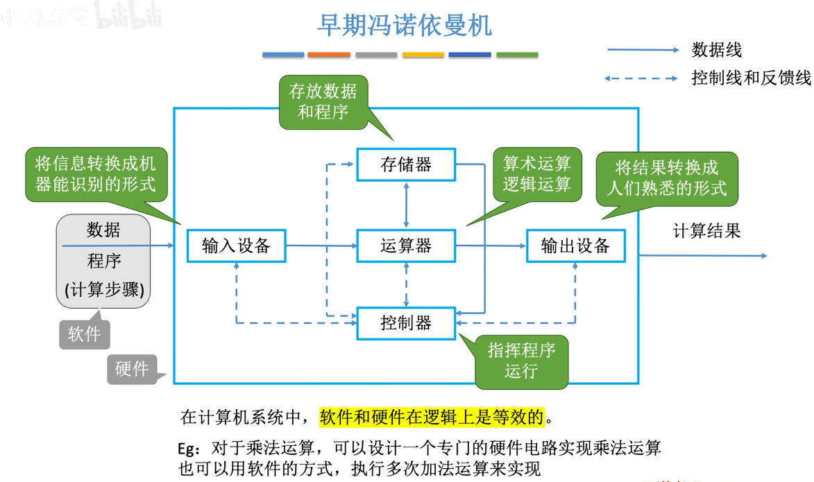
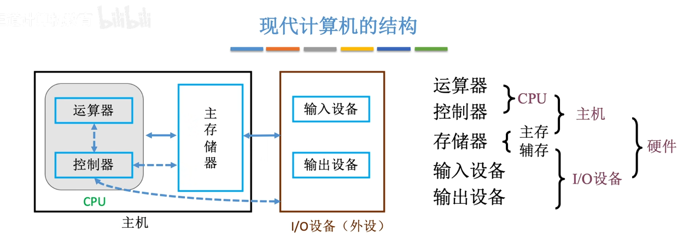
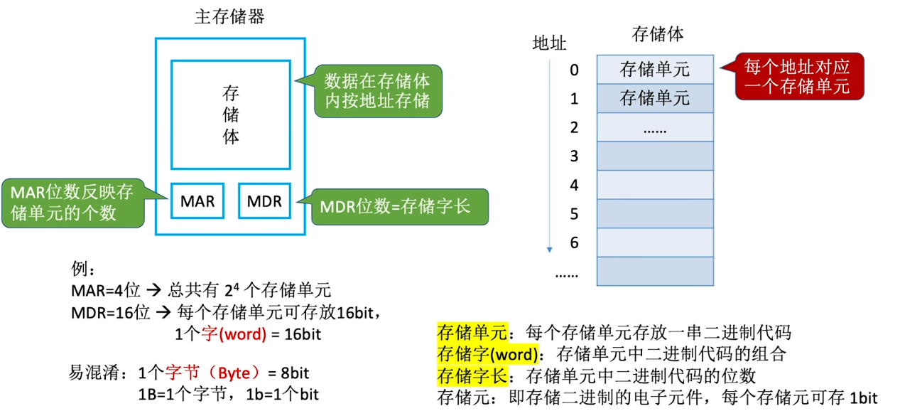
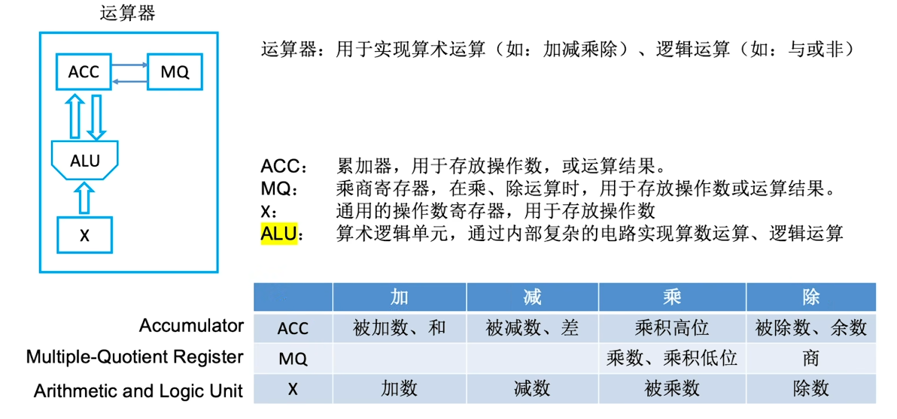
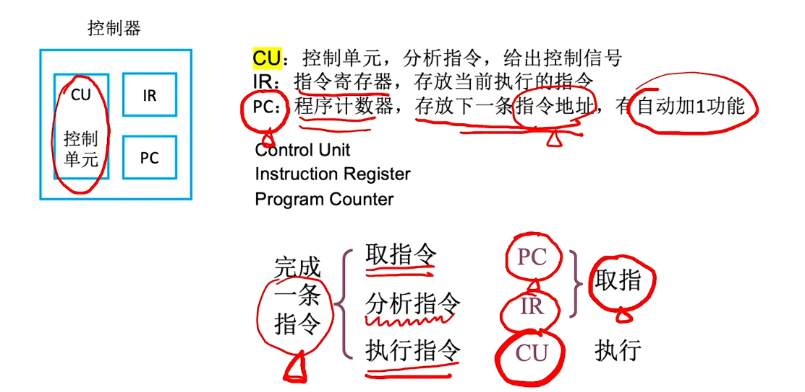
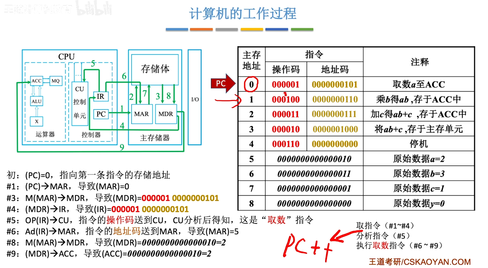
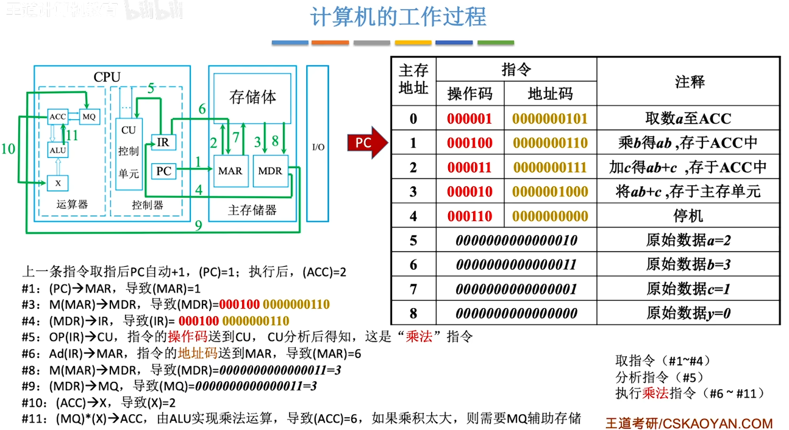
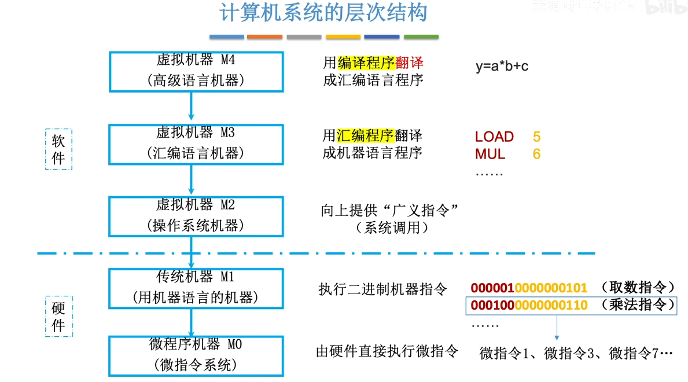

## 计算机硬件的基本组成

### 早七冯诺依曼机结构



特点：

1. 由五大部件组成
2. 指令和数据以同等地位存于存储器，可按地址寻访
3. 指令和数据用二进制表示
4. 指令由操作码和地址码组成
5. 存储程序
6. 以运算器为中心

### 现代计算机结构



## 各硬件的工作原理

### 主存储器



MAR(Memory Address Register)：存储地址寄存器

MDR(Memory Data Register)：存储数据寄存器

### 运算器



### 控制器



### 计算机工作过程

```cpp
int a = 2, b = 3, c = 1, y = 0;
void main(){
	y = a * b + c;
}
```





## 计算机软件

具体分为

- 系统软件：负责管理硬件资源，并向上层应用程序提供基础服务
- 应用软件：为了解决某个应用领域的问题而编制的程序

三种翻译程序

1. 汇编程序(汇编器)：将汇编语言程序翻译成机器语言程序。
2. 解释程序(解释器)：将源程序中的语句按执行顺序逐条翻译成机器指令并立即执行。
3. 编译程序(编译器)：将高级语言程序翻译成汇编语言或机器语言程序。

软件和硬件具有逻辑功能上的等价性，硬件实现具有更高的执行速度，软件实现具有更好的灵活性。执行频繁、硬件实现代价不是很高的功能通常由硬件实现。

## 计算机系统层次结构



## 计算机的性能指标

- 总容量：存储单元个数×存储字长bit

- CPU主频：CPU内数字脉冲信号振荡的频率，$\frac{1}{CPU时钟周期}$，单位HZ，也就是说一秒钟有几个时钟zhou'qi
- CPU时钟周期：一段高电平+低电平的时间
- CPI：执行一条指令所需的时钟周期数

> 执行单条之类的耗时=CPI×CPU时钟周期

- IPS：每秒执行多少条指令，$IPS=\frac{主频}{平均CPI}$
- FLOPS：每秒执行多少次浮点运算

系统整体的性能指标

- 数据通路带宽：数据总线一次所能并行传送信息的位数
- 吞吐量：系统在单位时间内处理请求的数量
- 响应时间：用户向计算机发送一个请求，到系统对该请求做出相应并获得它所需要的结果的等待时间

