## 存储器的基本概念

### 存储器的层次化结构

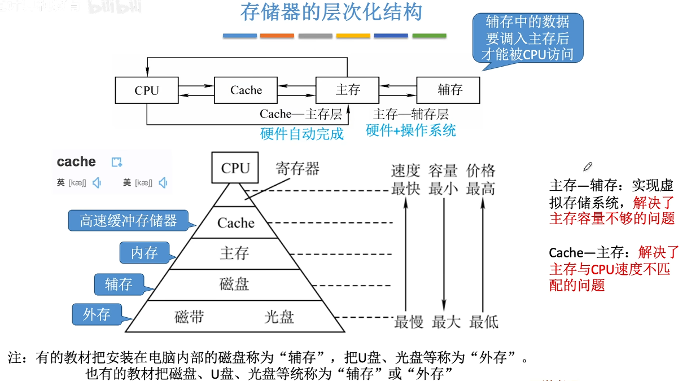

### 存储器的分类

按层次分：

- 高数缓存（Cache）：能够被CPU直接读写
- 主存储器（主存，内存）：运行内存，能够被CPU直接读写
- 辅组存储器（辅存，外存）：

按存储介质分：

- 半导体存储器：主存、Cache
- 磁表面存储器：磁盘、磁带

- 光存储器：光盘

按存取方式分：

- 随机存取存储器（RAM）：读写任何一个存储单元所需时间相同
- 顺序存取存储器（SAM）：读写一个单元所需时间取决于存储单元所在的物理位置
- 直接存取存储器（DAM）：先直接选取信息所在的区域，然后按顺序方式存取，既有随机存取特性也有顺序存取特性
- 相连存储器（CAM）：按内容访问的存储器按照内容检索到存储位置进行读写，快表

按信息可改性分：

- 读写存储器：可读也可写，磁盘、内存、Cache
- 只读存储器：只能读，不能写，光碟

### 存储器的性能指标

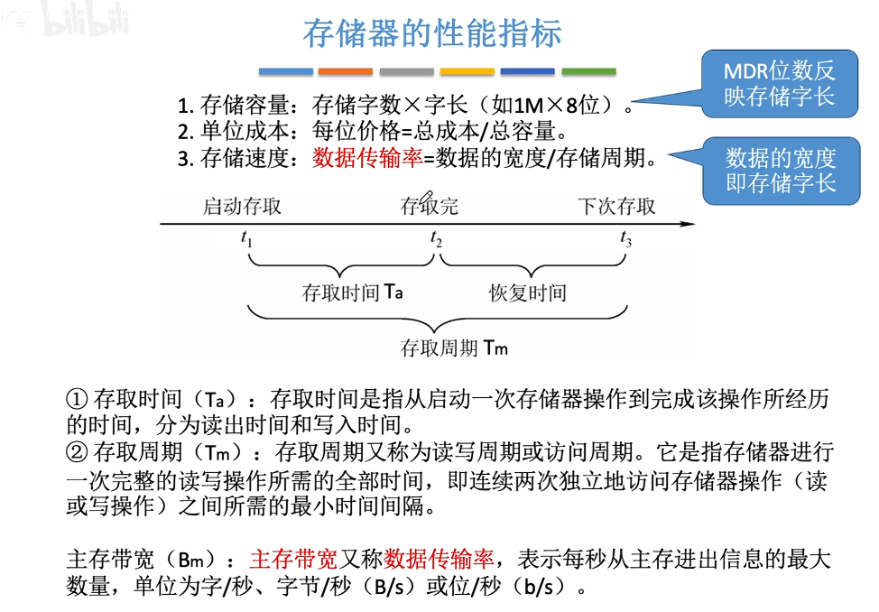

存取时间不等于存取周期，通常存取周期大于存取时间。这是因为对任何一种存储器，在读/写操作之后，总要有一段恢复内部状态的复原时间。

## 主存储器

### 主存储器的基本组成

#### 半导体元件的原理

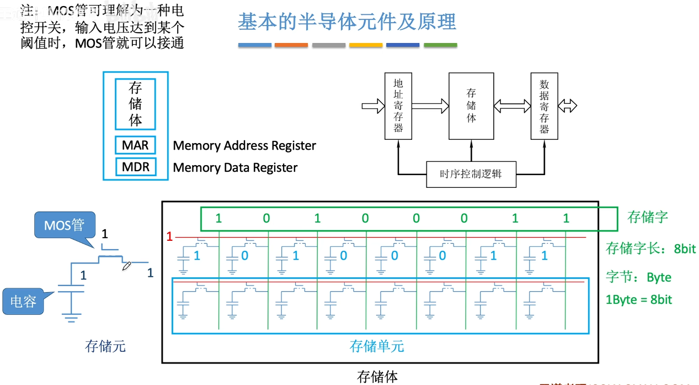

译码驱动：使译码器发出的电信号稳定

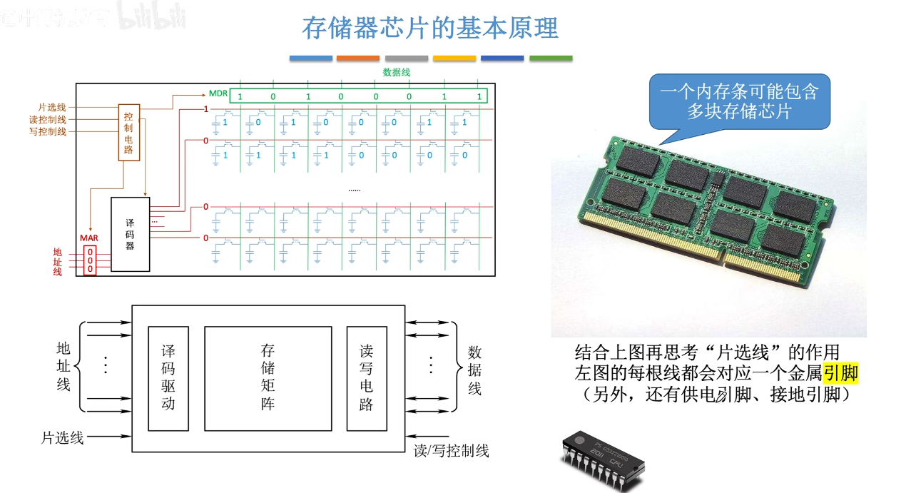

n位地址表示有$2^n$行存储单元，$总容量=存储单元个数×存储字长$

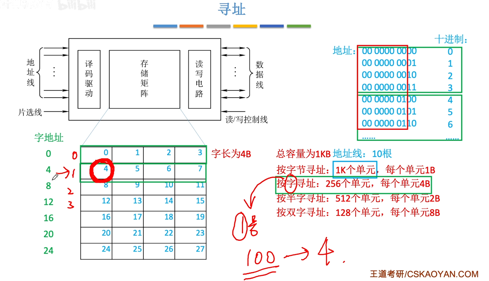

### 易失性存储器（DRAM和SRAM）

都为易失性存储器，断电后信息消失

#### DRAM

DRAM 动态随机存取存储器，用于主存，使用**栅极电容**存储信息

> 每个存储元制造成本更低，集成度更高，功耗低
>
> 电容内的电荷只能维持2ms，2ms之内必须刷新一次给电容充电

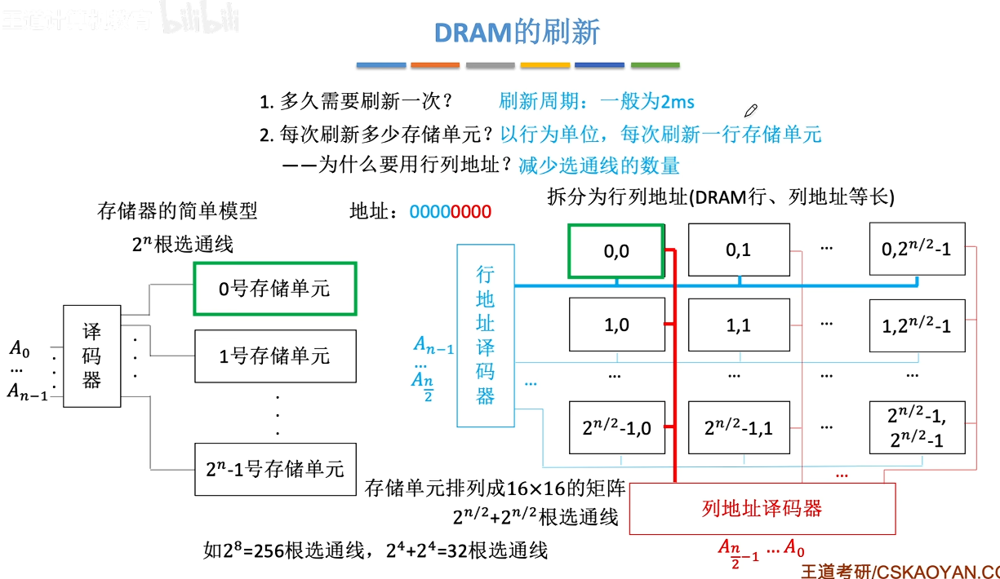

刷新实质是读出一行的信息后重新写入，占用1个读/写周期

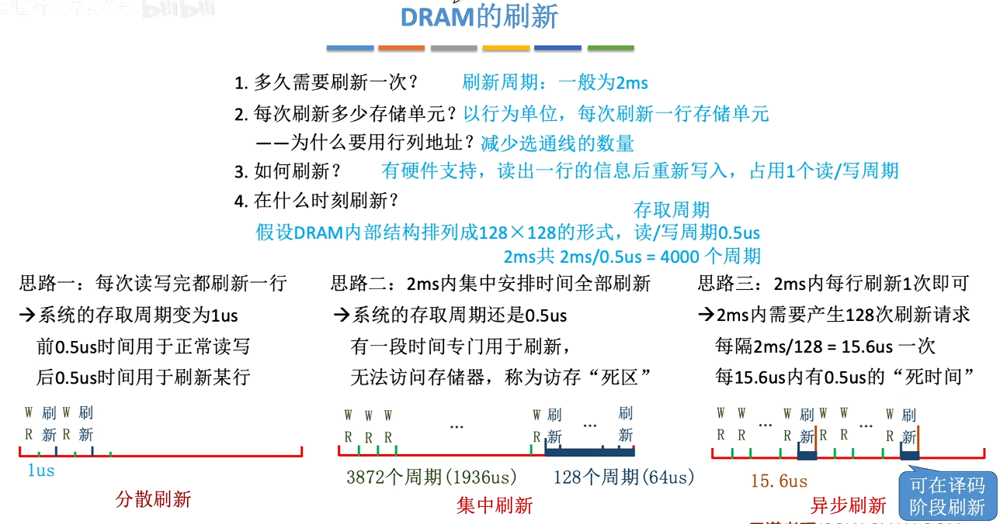

#### SRAM

SRAM 静态随机存取存储器，用于Cache，使用**双稳态触发器**存储信息

> 每个存储圆制造成本更高，集成度低，功耗大
>
> 只要不断电，触发器的状态不会改变

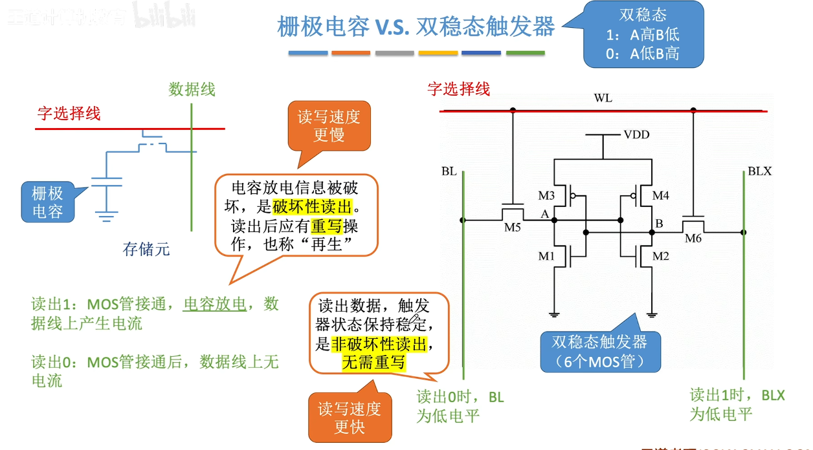

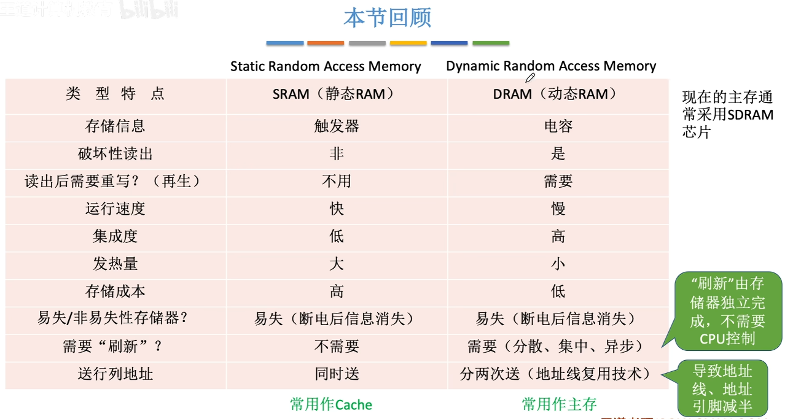

**SRAM**
静态随机存储器(SRAM)的存储元是用双稳态触发器(六品体管 MOS)来记忆信息的，静态是指即使信息被读出后，它仍保持其原状态而不需要再生(非破坏性读出)。SRAM 的存取速度快，但集成度低，功耗较大，价格昂贵，一般用于高速缓冲存储器

**DRAM**
动态随机存储器(DRAM)是利用存储元电路中栅极电容上的电荷来存储信息的，DRAM 的基本存储元通常只使用一个品体管，所以它比SRAM 的密度要高很多。相对于 SRAM 来说，DRAM具有集成度高、位价低和功耗低等优点，但 DRAM 的存取速度比 SRAM 慢，且必须定时刷新和读后再生，一般用于大容量的主存系统。

DRAM 电容上的电荷一般只能维持1~2ms，读操作会使其状态发生改变(破坏性读出)，需读后再生，这也是称其为动态存储器的原因。对同一行进行相邻两次刷新的时间间隔称为刷新周期，通常取2ms。

1. 集中刷新：刷新时停止读写
2. 分散刷新：前半部分负责读写，后半部分负责刷新
3. 异步刷新：将刷新分散到每一行，一行读写一行刷新

注：
①刷新对 CPU 是透明的，即刷新不依赖于外部的访问；
②DRAM 的刷新单位是行，由芯片内部自行生成行地址；
③刷新操作类似于读操作，但又有所不同；
④刷新时不需要选片，即整个存储器中的所有芯片同时被刷新。

**SRAM和DRAM比较**
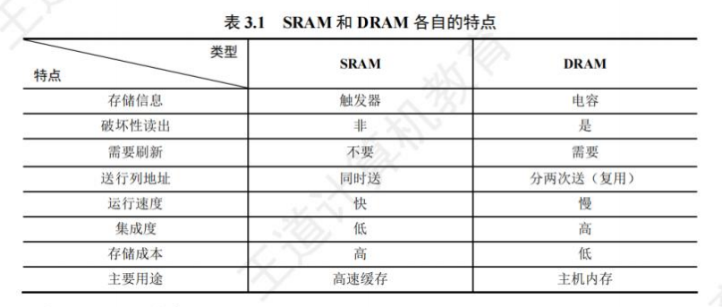
由于DRAM芯片容量大，地址位数多，为了减少地址引脚线，采用地址复用技术（DRAM分两次发送，长度相同）
引脚数=地址线减半+数据线不变+行通选（1）+列通选（1）+读写控制线（2)

### 只读存储器（ROM）

非易失性存储器，断电之后数据不会丢失

特点：①结构简单，所以位密度比可读/写存储器的高。②具有非易失性，所以可靠性高。

类型：

1. 掩模式只读存储器（MROM）
    MROM 的内容由半导体制造厂按用户提出的要求在芯片的生产过程中直接写入，写入以后任何人都无法改变其内容。优点是可靠性高，集成度高，价格便宜；缺点是灵活性差。

2. 一次可编程只读存储器（PROM）
    PROM 是可以实现一次性编程的只读存储器。允许用户利用专门的设备(编程器)写入自己的程序，一旦写入，内容就无法改变。

3. 可擦除可编程只读存储器（EPROM）
    允许用户写入信息，之后才用某种方法擦除数据，可进行多次重写。EPROM 虽然既可读又可写，但它不能取代 RAM，因为 EPROM 的编程次数有限，且写入时间过长。

    > EEPROM：可用“电擦除”的方式，擦除特定的字
    >
    > UVEPROM：用紫外线照射8~20分钟，擦除所有信息

4. Flash存储器
    Flash 存储器是在 EEPROM 的基础上发展起来的，断电后也能保存信息，且可以进行多次快速擦除重写。由于闪存要先擦除再写入，因此闪存读取比写入要快。U盘、SD卡也是这种闪存

5. 固态硬盘（SSD）
    基于闪存的固态硬盘是用固态电子存储芯片阵列制成的硬盘，由控制单元和存储单元(Flash芯片)组成。保留了 Flash 存储器长期保存信息、快速擦除与重写的特性。对比传统硬盘也具有读/写速度快、低功耗的特性，缺点是价格较高。

主板上的BIOS芯片（ROM），存储了“自举装入程序”，负责引导装入操作系统（开机）

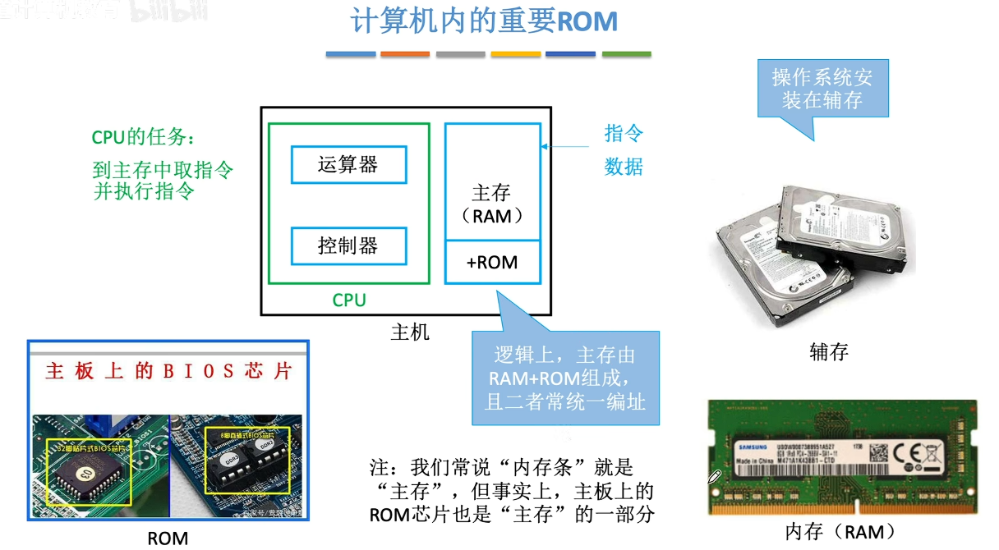

### 双端口RAM

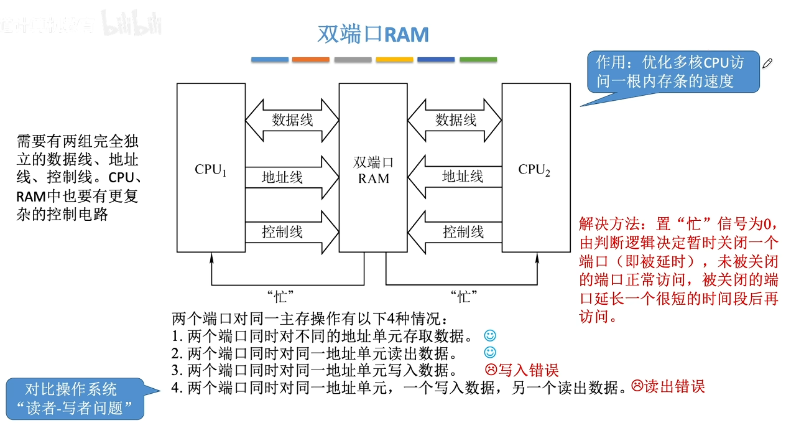

### 多模块存储器

存取周期=存取时间+恢复时间

多模块存储器是一种空间并行技术,利用多个结构完全相同的存储模块的并行工作来提高存储器的吞吐率。常用的有单体多字存储器和多体低位交叉存储器。

1. 单体多字存储器
    在单体多字系统中，每个存储单元存储 m个字，总线宽度也为 m个字，一次并行读出 m个字。在一个存取周期内，从同一地址取出m条指令，然后将指令逐条送至 CPU 执行，即每隔 1/m存取周期，CPU 向主存取一条指令。这显然提高了单体存储器的工作速度。
    缺点:
    只有指令和数据在主存中连续存放时，这种方法才能有效提升存取速度。一旦遇到转移指令，或操作数不能连续存放时，这种方法的提升效果就不明显。
2. 多体并行存储器
    多体并行存储器由多体模块组成。每个模块都有相同的容量和存取速度，各模块都有独立的读/写控制电路、地址寄存器和数据寄存器。它们既能并行工作，又能交叉工作。

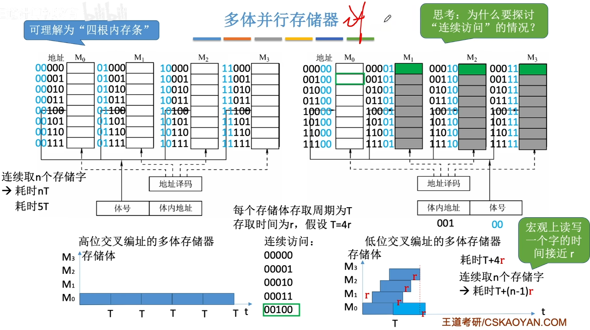

存取周期为$T$，存取时间为$r$，为了使流水线不间断，应保证模块数$m\leq \frac{T}{r}$

存取周期为$T$，总线传输周期为$r$，为了使流水线不间断，应保证模块数$m\leq \frac{T}{r}$

## 主存储器与CPU的链接

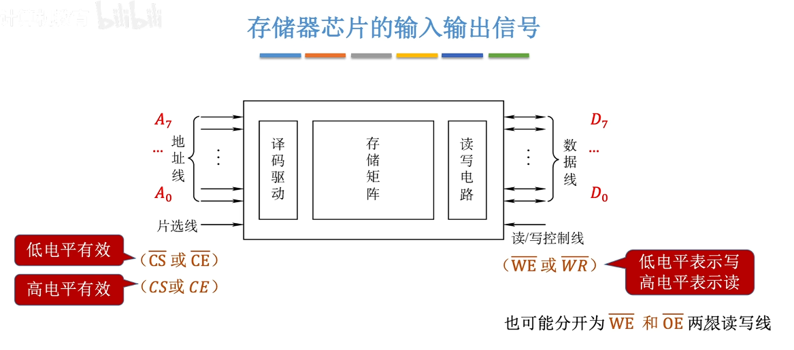

### 链接原理

1)主存储器通过数据总线、地址总线和控制总线与CPU连接。
2)数据总线的位数与工作频率的乘积正比于数据传输速率。
3)地址总线的位数决定了可寻址的最大内存空间。 
4)控制总线(读/写)指出总线周期的类型和本次输入/输出操作完成的时刻。

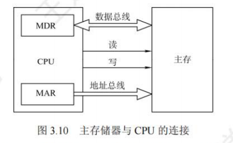

### 主存容量扩展

$x*y$位，其中$x$表示存储单元的行数，$y$表示一个字有几位，地址线的条数$log_2x$

**位扩展法**

数据总线宽度$>$存储芯片字长—>位扩展

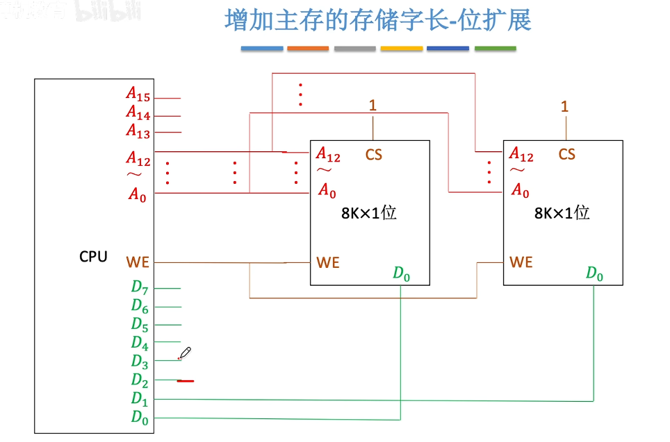

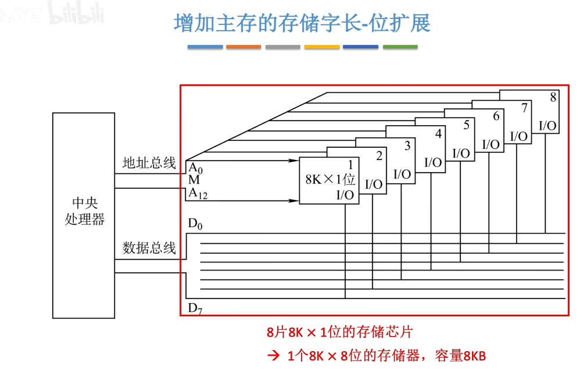

读取的是相同位置的数据

添加位数，地址线与系统总线并联，一片8K*8位芯片=8片8K*1位的芯片

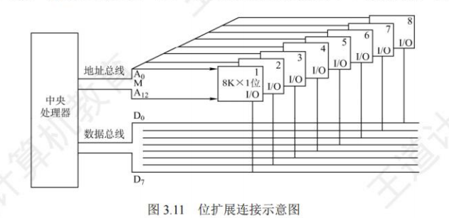

**字扩展法**

地址总线宽度$>$芯片地址线数

线选法：用专门的地址线作为片选信号

> 就是用多余出来的地址线来确定是调用哪个芯片的数据

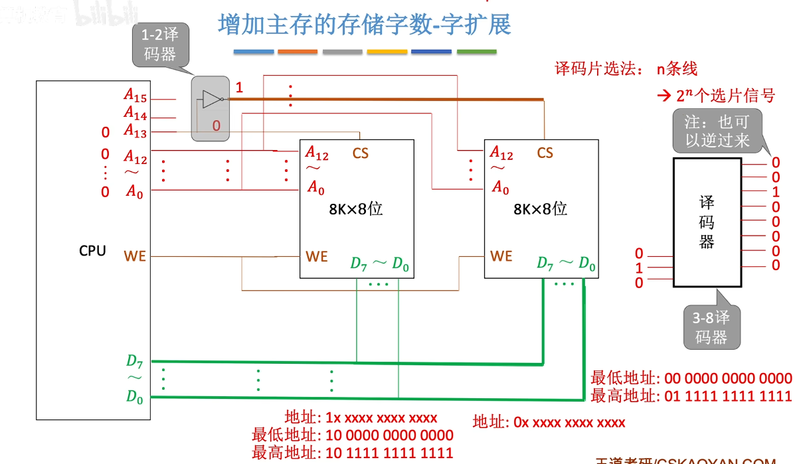

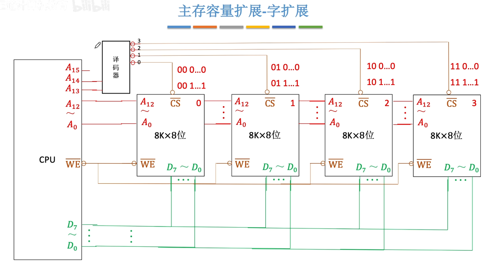

对存储字数量进行扩展，数据线与系统总线并联，16K*8位的存储器=2片8K*8位的存储器
例：4片16K*8位的芯片字扩展后位64K*8位的地址分配：
第一片，最低地址:0000000000000000:最高地址:0011111111111111(16位)
第二片，最低地址:0100000000000000:最高地址:0111111111111111
第三片，最低地址:1000000000000000:最高地址:1011111111111111
第四片，最低地址:1100000000000000:最高地址:1111111111111111

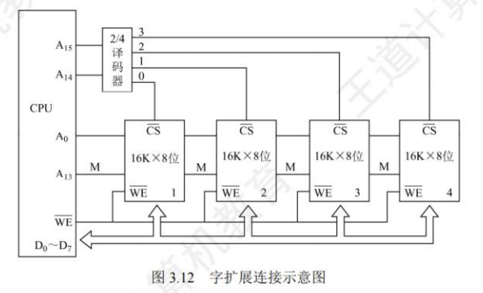

**字位同时扩展法**
同时进行字扩展与位扩展

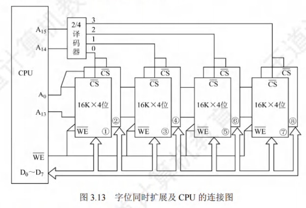

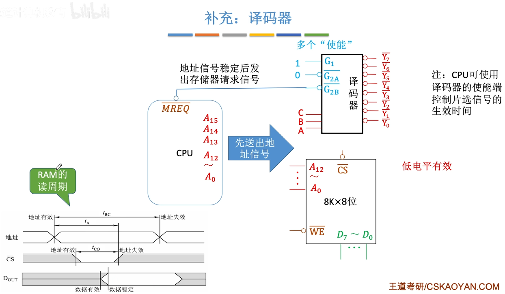

### 存储芯片的地址分配和片选（未）

CPU要实现对存储单元的访问，首先要选择存储芯片，即进行片选:然后在选定的芯片中选择具体的存储单元，以进行数据的读/写，即进行字选。

线选法

译码片选法

## 外部存储器

### 磁表面存储器（详情见操作系统）

优点：
&nbsp;&nbsp;&nbsp;&nbsp;①存储容量大，位价格低；
&nbsp;&nbsp;&nbsp;&nbsp;②记录介质可重复使用；
&nbsp;&nbsp;&nbsp;&nbsp;③记录信息可长期保存而不丢失，甚至可脱机存档；
&nbsp;&nbsp;&nbsp;&nbsp;④非破坏性读出，读出时不需要再生。
缺点:存取速度慢，机械结构复杂，对工作环境要求较高。

磁盘存储器：
由磁盘驱动器、磁盘控制器和盘片组成

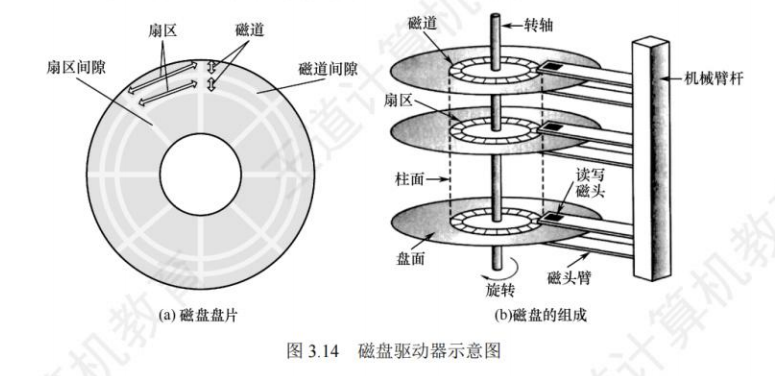

&nbsp;&nbsp;&nbsp;&nbsp;一个磁盘含有若干记录面，每个记录面划分为若干圆形的磁道，而每条磁道又划分为若干扇区，扇区(也称块)是磁盘读/写的最小单位，磁盘按块存取。

- 磁头数(Heads)：即记录面数，表示磁盘共有多少个磁头，磁头用于读取/写入盘片上记录面的信息，一个记录面对应一个磁头。
- 柱面数(Cylinders)：表示磁盘每面盘片上有多少条磁道。在一个盘组中，不同记录面的相同编号(位置)的诸磁道构成一个圆柱面。
- 扇区数(Sectors)：表示每条磁道上有多少个扇区。

> 相邻磁道及相邻扇区间通过一定的间隙分隔开，以避免精度错误。
> 由于扇区按固定圆心角度划分，因此位密度从最外道向里道增加，磁盘的存储能力受限于最内道的最大记录密度。

磁盘高速缓存(Disk Cache):
&nbsp;&nbsp;&nbsp;&nbsp;在内存中开辟一部分区域，用于缓冲将被送到磁盘上的数据。
&nbsp;&nbsp;&nbsp;&nbsp;优点:写磁盘时是按“簇”进行的，可以避免频繁地用小块数据写盘;有些中间结果数据在写回磁盘之前可被快速地再次使用。

#### 性能指标

1. 记录密度：
   &nbsp;&nbsp;&nbsp;&nbsp;记录密度是指盘片单位面积上记录的二进制信息量，通常以道密度、位密度和面密度表示。

   - 道密度是沿磁盘半径方向单位长度上的磁道数

   - 位密度是磁道单位长度上能记录的二进制代码位数

       > 内外磁道所分配的信息数量是一样的,越靠近内侧的磁道位密度越大

   - 面密度是位密度和道密度的乘积。

2. 磁盘的容量：
   &nbsp;&nbsp;&nbsp;&nbsp;磁盘容量有非格式化容量和格式化容量之分。

   &nbsp;&nbsp;&nbsp;&nbsp;非格式化容量是指磁记录表面可利用的磁化单元总数，非格式化容量=记录面数x柱面数x每条磁道的磁化单元数。
   &nbsp;&nbsp;&nbsp;&nbsp;格式化容量是指按照某种特定的记录格式所能存储信息的总量。格式化容量=记录面数x柱面数x每道扇区数x每个扇区的容量。格式化后的容量比非格式化容量要小。

3. **存取时间**：
    &nbsp;&nbsp;&nbsp;&nbsp;由寻道时间(磁头移动到目的磁道的时间)、旋转延迟时间(磁头定位到要读/写扇区的时间)和传输时间(传输数据所花费的时间)三部分构成。

    > 旋转延迟时间题目没给的话，默认按转半圈的时间来计算

4. 数据传输速率：
   &nbsp;&nbsp;&nbsp;&nbsp;磁盘存储器在单位时间内向主机传送数据的字节数，假设磁盘转数为r转/秒，每条磁道容量为N字节，则数据传输速率为$D_r=rN$

#### 磁盘地址

若系统中有4个驱动器，每个驱动器带一个磁盘，每个磁盘256个磁道、16个盘面，每个盘面划分为16个扇区，则每个扇区地址要18位二进制代码;

| 驱动器号      | 柱面/磁道号   | 盘面号        | 扇区号        |
| ------------- | ------------- | ------------- | ------------- |
| 确定磁盘 2bit | 确定磁道 8bit | 确定盘面 4bit | 确定扇区 4bit |

#### 磁盘列阵（RAID）

将多个独立的物理磁盘组成一个独立的逻辑盘，数据在多个物理盘上分割交叉存储、并行访问，具有更好的存储性能、可靠性和安全性。

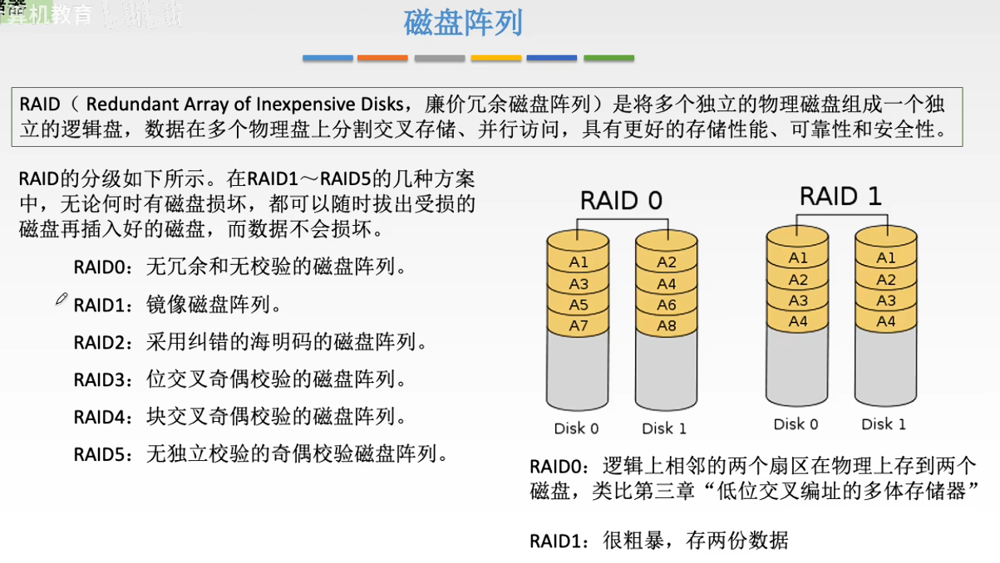

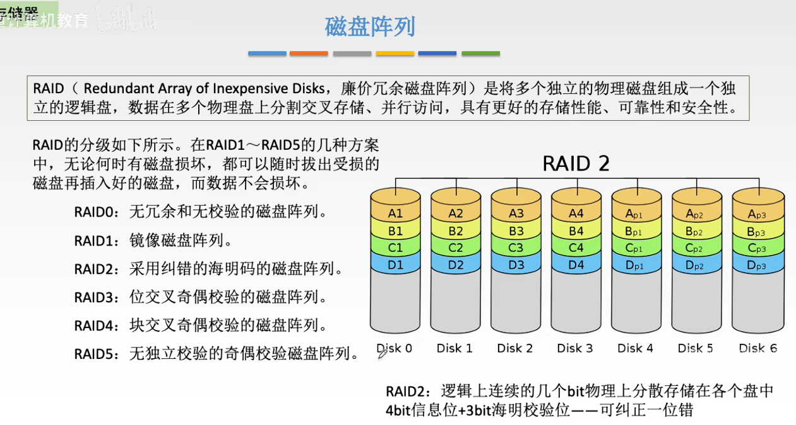

RAID0：无容错能力

RAID1：有容错能力，但容量要减少一半

### 固态硬盘SSD

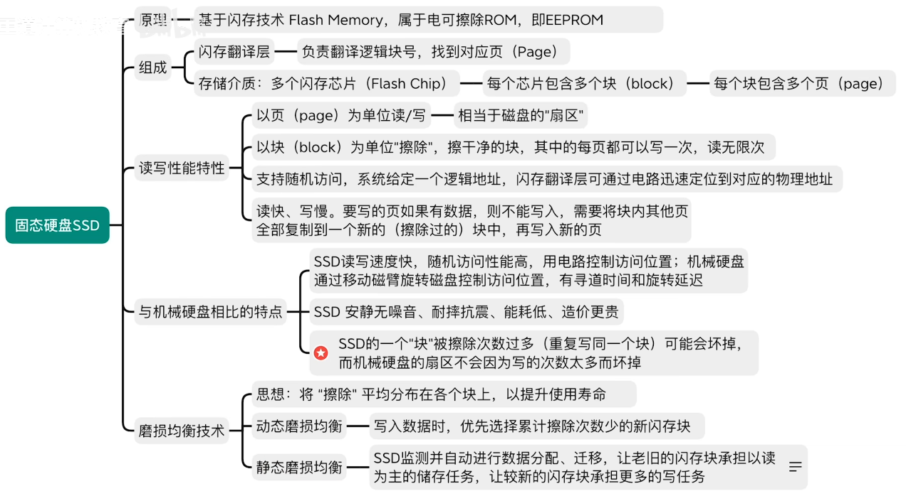

基于闪存技术，属于EEPROM，由半导体存储器构成，没有移动的部件，一个SSD由一个或多个闪存芯片和闪存翻译层组成。

读写以页为单位，闪存翻译层负责将逻辑块号找到对应的页

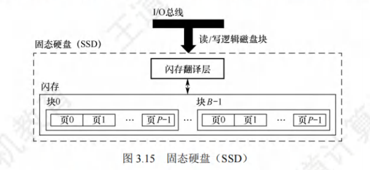

优点：
&nbsp;&nbsp;&nbsp;&nbsp;①随机访问时间远快于机械磁盘；
&nbsp;&nbsp;&nbsp;&nbsp;②没有机械噪声和振动；
&nbsp;&nbsp;&nbsp;&nbsp;③能耗更低，抗震性好，安全性高
缺点:容易磨损导致损坏

## 高速缓冲存储器

### 程序访问的局部性原理

&nbsp;&nbsp;&nbsp;&nbsp;程序访问的局部性原理包括时间局部性和空间局部性，Cache的分块打包正是运用了局部性原理
&nbsp;&nbsp;&nbsp;&nbsp;时间局部性：是指最近的未来要用到的信息，很可能是现在正在使用的信息；
&nbsp;&nbsp;&nbsp;&nbsp;空间局部性：是指最近的未来要用到的信息，很可能与现在正在使用的信息在存储空间上是邻近的；

### Cache的基本工作原理

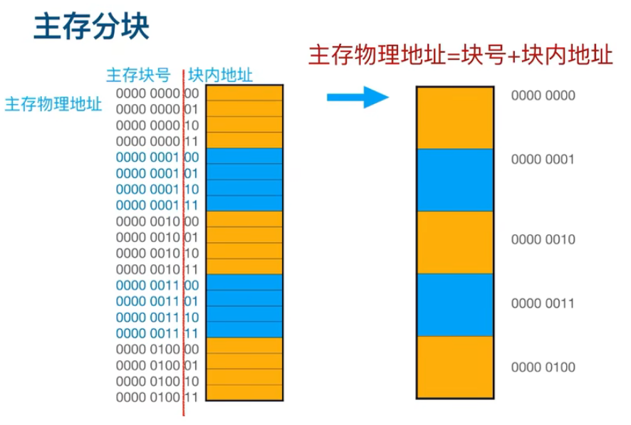
&nbsp;&nbsp;&nbsp;&nbsp;将主存物理地址分为块号和块内地址，也可以叫作页，CPU与Cache（或主存)间信息交互的单位是字，而Cache与主存直接的交互是块

命中：CPU欲访问的信息已在cache中命中的比率

性能分析：
$$
Cache\text{命中率}=\frac{Cashe\text{的总命中次数}}{Cache的总命中次数+访问主存的总次数}
$$

$$
系统平均访问时间 =
\text{Cache命中的概率} \times \text{Cache命中所需要花费的时间} + \\
\text{缺失的概率} \times \text{总线命中所需花费的时间}
$$

$$
性能效率=\frac{访问Cache的时间}{系统平均访问时间}
$$

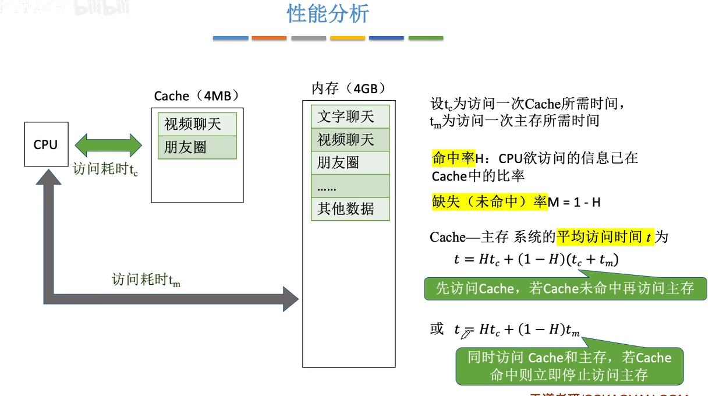

### Cache和主存的映射方式

将Cache的内容与主存中的内容对应

题目未说明时，默认为一字节。1B=8bits

#### 直接映射

每个主存块只能放到一个特定的位置：$Chche块号=主存块号%Cache总块数$

&nbsp;&nbsp;&nbsp;&nbsp;主存物理地址=标记+Cache行号+块内地址
一路组相联，一个块为一组，组的位置为固定的。

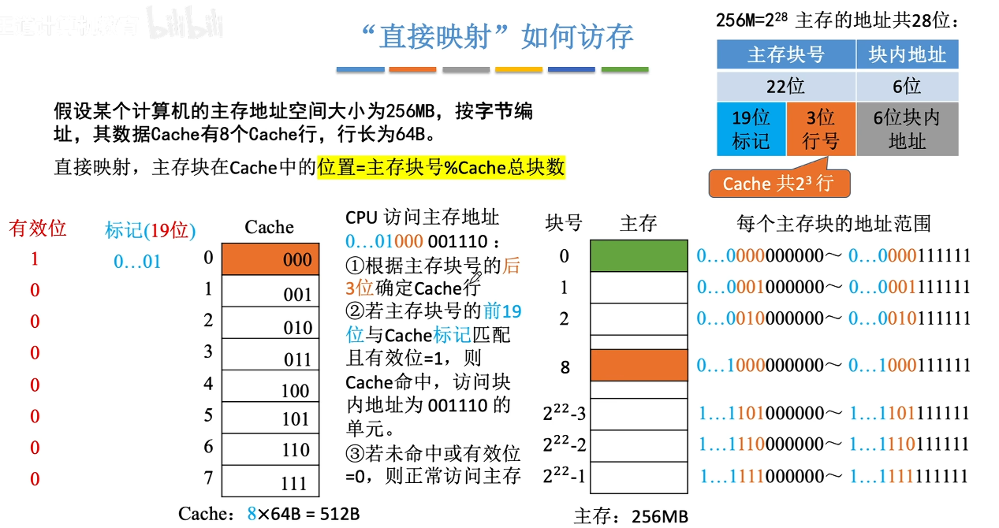

#### 全相联映射

主存块可以放在Cache的任意位置

&nbsp;&nbsp;&nbsp;&nbsp;主存物理地址=标记+块内地址
随便映射。

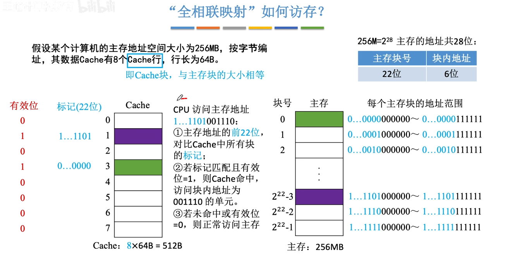

#### 组相联映射

将Cache块分为若干组，每个主存块可放到特定分组中的任意一个位置

$组号=主存块号%分组数$

&nbsp;&nbsp;&nbsp;&nbsp;主存物理地址=标记+组号+块内地址
n路组相联，n个块为一组，块在组里的位置可以改变，整个组的位置固定。

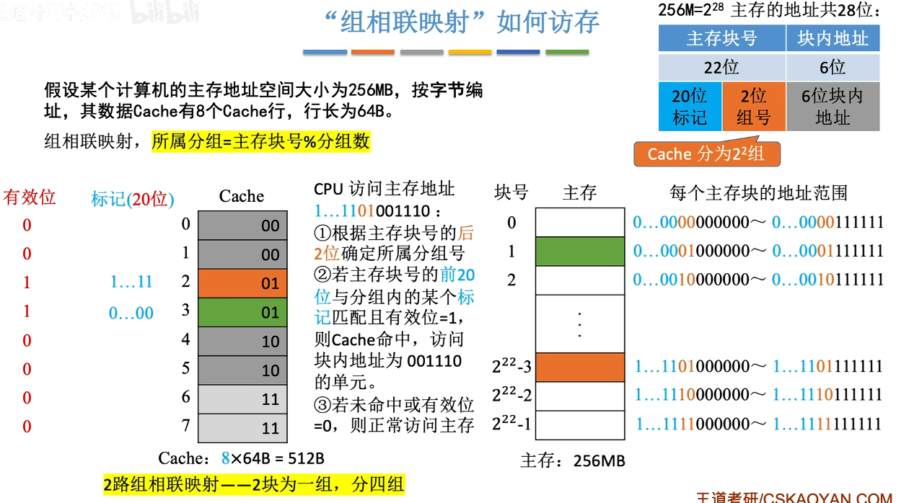

### Cache中主存块的替换算法（未）

当Cache里面对应位置满了该如何进行替换

全相联映射

Cache完全满了才需要替换，需要在全局选择替换哪一块

直接映射

无需考虑替换算法，每一块都只有一个位置

组相联映射

分组内满了才需要替换，需要在分组内选择替换哪一块

抖动现象：频繁的换入换出，刚被替换的块很快又被调入

#### 随机算法（RAND）

若Cache已满，则随机选择一块替换

#### 先进先出算法（FIFO）

若Cache已满，则替换最先调入的Cache块

#### 近期最少使用算法（LRU）

为每个Cache块设置一个计数器，用于记录每个Cache块已经有多久没被访问了，替换最久没有访问的Cache块

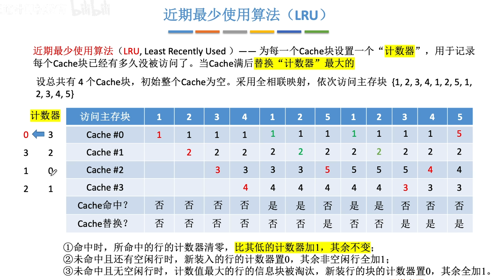

#### 最不经常使用算法（LFU）

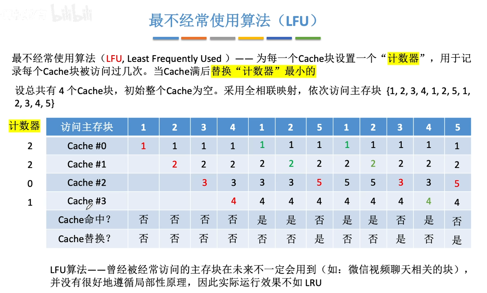

### Cache的一致性问题

CPU修改了Cache中的数据副本，如何确保主存中数据母本的一致性

#### 写命中

即Cache里面有想要的数据

全写法：当CPU对Cache写命中时，必须把数据同时写入Cache和主存。

> 使用写缓冲实现，CPU写入Cache时也写入写缓冲里，后续通过写缓冲再写入主存

写回法：当CPU对Cache写命中时，只把数据写入Cache，而不立即写入主存，只有当此块被替换出时才写回主存。

#### 写不命中

即Cache里面没有有想要的数据

写分配法：当CPU对Cache写不命中时，把主存中的块调入Cache，在Cache中修改。通常搭配写回法使用。

非写分配法：当CPU对Cache写不命中时，只写入主存，不调入Cache。

现代计算机通常采用多级Cache结构，各级Cache间常采用“全写法+非写分配法”，Cache和主存之间常  采用"写回法+写分配法"

## 虚拟存储器

### 虚拟存储器基本概念

&nbsp;&nbsp;&nbsp;&nbsp;将主存或辅存的地址空间进行统一编址，形成一个庞大的地址空间，在这个空间内，用户可以自由编程，不必在乎实际主存容量和程序在主存中实际的存放位置。
&nbsp;&nbsp;&nbsp;&nbsp;用户编程允许设计的地址称为虚地址或逻辑地址，虚地址对应的存储空间称为虚拟空间或程序空间。
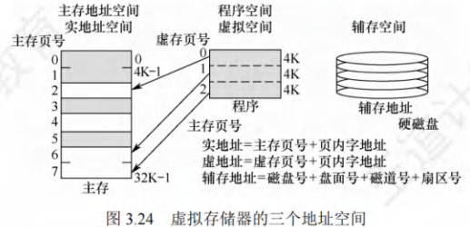

### 页式虚拟存储器

### 段式虚拟存储器

### 段页式虚拟存储器

### 虚拟存储器与Cache的比较
