## 计算机网络概念

计算机网络：将众多分散的、自治的计算机系统，通过通信设备与线路连接起来，由功能完善的软件实现资源共享和信息传递的系统。

计算机网络(简称网络)由若干节点(Node，或译为结点)和连接这些节点的链路(Link)组成。

> internet(互连网)：
> 是一个通用名词，泛指由多个计算机网络通过路由器互连而成的计算机网络。在这些网络之间可以使用任意的通信协议作为通信规则，不一定非要使用TCP/IP。
> Internet(互联网或因特网)：
> 则是一个专用名词，指当前全球最大的、开放的、由众多网络和路由器互连而成的特定计算机网络，它采用TCP/IP 族作为通信规则。

交换机：可以把多个结点连接起来，组成一个计算机网络

路由器：可以将两个或多个计算机网络互相连接起来

家用路由器=路由器+交换机+其他功能

ISP,互联网服务提供商

## 计算机网络的组成与功能

&nbsp;&nbsp;&nbsp;&nbsp;组成：硬件（主机/端系统，通信设备，通信链路）、软件、协议（是计算机网络的核心，规定了网络传输数据时所遵守的规范）

&nbsp;&nbsp;&nbsp;&nbsp;功能：数据通信、资源共享、分布式处理、提高可靠性、负载均衡、其他

## 三种交换

### 电路交换：用于电话网络

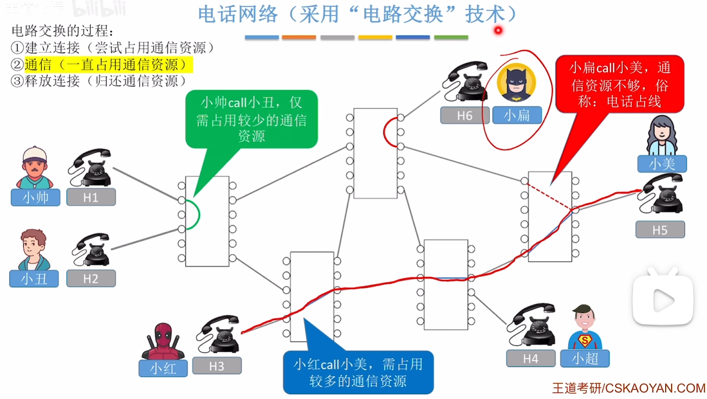

通信前从主叫端到被叫端建立一条专用的物理通路，在通信的全部时间内，两个用户始终占用端到端的线路资源。适用于低频次，长时间的连接

优点：数据直送，传输效率高
缺点：

   	1.  建立/释放连接，需要额外的时间开销；
   	2.  线路被通信双方独占，利用率低；
   	3.  线路分配的灵活性差；
   	4.  交换结点不支持差错控制，无法发现传输过程种发生的数据错误。

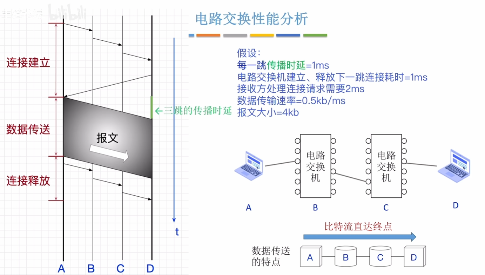

### 报文交换：用于电报网络

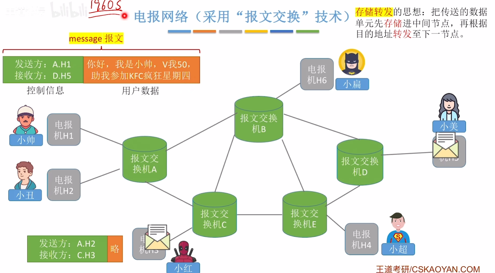

优点：

1. 通信前无需建立连接；
2. 数据以“报文”为单位被交换节点间“存储转发”，通信线路可以灵活分配
3. 在通信时间内，两个用户无需独占一整条物理线路
4. 交换节点通过校验技术实现“差错控制”

缺点：

1. 报文不定长，不方便存储转发管理；
2. 长报文的存储转发时间开销大、缓存开销大；
3. 长报文容易出错，重传代价高；

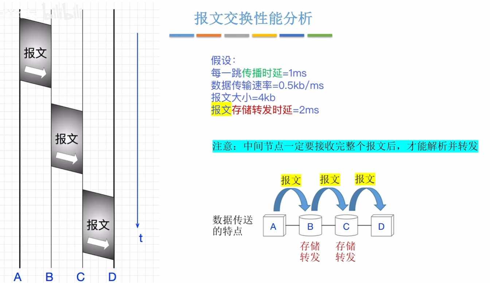

### 分组交换：用于现代计算机网络

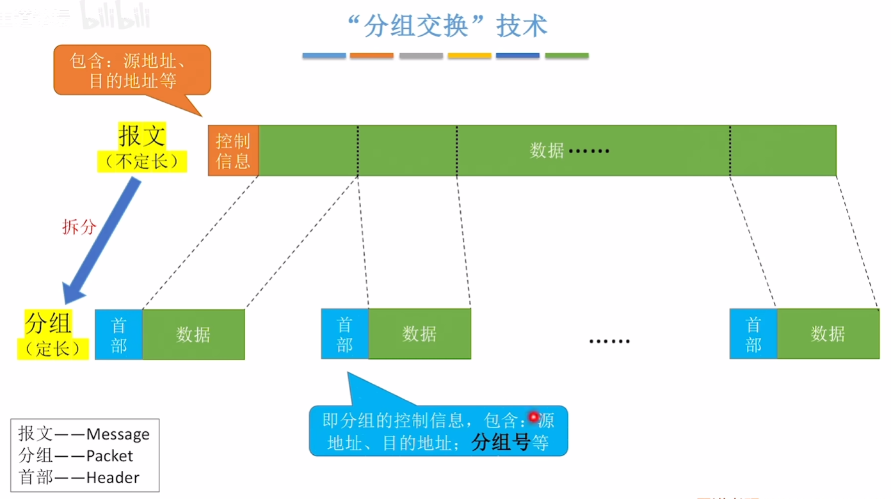

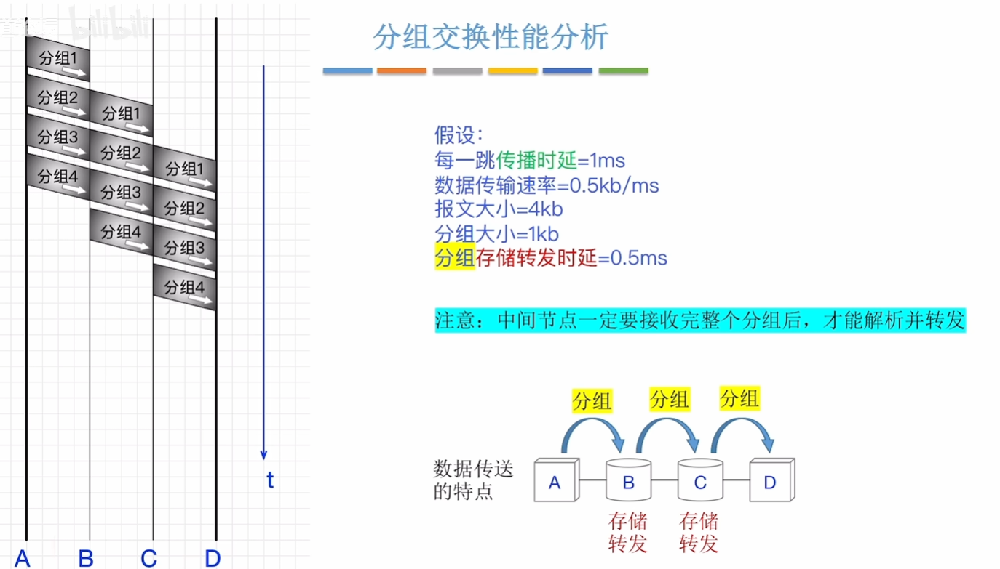

### 虚电路交换
先建立连接再发送数据

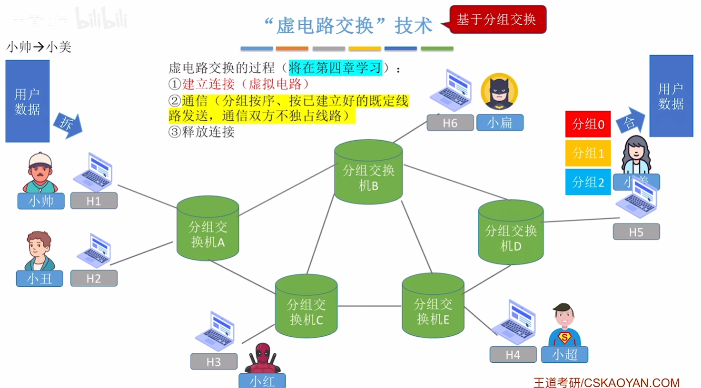

## 计算机网络的分类

按分布范围分：广域网（WAN）、城域网（MAN）、局域网(LAN)、个人区域网(PAN)

按传输技术分：广播式网络、点对点网络

按拓扑结构分类：

总线形结构：数据“广播式”传输；存在总线争用的问题。
>  集线器连接设备

环形结构：数据“广播式”传输；通过“令牌”解决总线争用问题，令牌顺环形依次传递。拿到令牌者可使用总线。 
>  令牌环网

星形结构：由中央设备实现数据的“点对点”传输
> 以太网交换机连接的设备

网状网络：数据通过各中间节点逐一存储转发实现“点到点”传输
> 由众多路由器构建的局域网

按使用者分类：分为公用网和专用网

按传输介质分为：有线网络，无线网络

## 计算机网络性能指标

### 速率

连接到网络上的节点在信道上传输数据的速率。也成为数据率、比特率、数据传输速率。

> 信道：表示向某一方向传送信息的通道
> 一条通信线路在逻辑上往往对应一条发送信道和一条接收信道

单位：bit/s,b/s,**bps**（bit per second）

> 数据传输中$1KB=10^3B$,数据存储中$1KB=2^{10}B$

带宽：某信道所能传送的最高数据率 

> 在通信原理中带宽表示某信道允许通过的信号频带范围

节点间通信实际能达到的最高速率由带宽、节点性能共同限制

### 吞吐量

单位时间内通过某个网络、信道、接口的实际数据量，受带宽限制、受复杂的网络负载情况影响

### 时延

数据从网络的一端传送到另一端所需的时间，有时也称为延迟或迟延。

总时延=发送时延+传播时延+处理时延+排队时延

- 发送时延：也叫传输时延，节点将数据推向信道所花的时间 $\frac{数据长度(bit)}{发送速率(bit/s)}$
- 传播时延：电磁波在信道中传播一定距离所花的时间 $\frac{信道长度(m)}{电磁波在信道中的传播速度(m/s)}$
- 处理时延：被路由器处理所花的时间
- 排队时延：数据排队进入、排队发出路由器所花的时间

### 时延带宽积

时延带宽积=传播时延×带宽

一条链路中，已经从发送端发出但尚未到达接收端的最大比特数

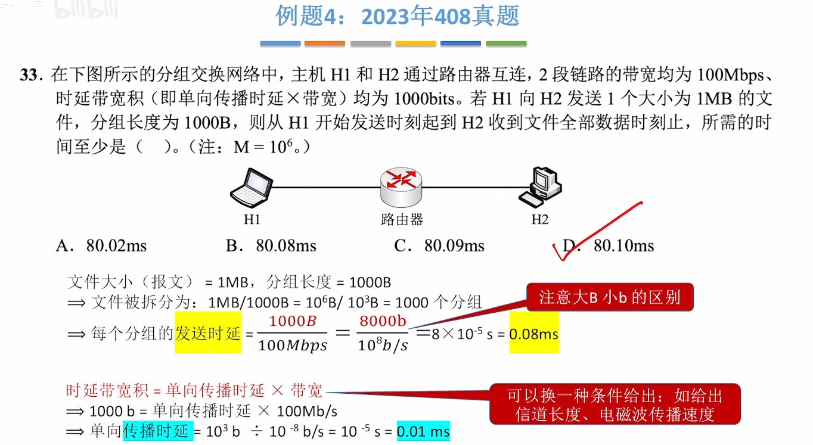

### 往返时延RTT

表示从发送方发送完数据，到发送方收到来自接收方的曲儿总共经历的时间。

即传播时延+接收方处理时延+接收方发送时延+传播时延

### 信道利用率

数据传输时某个信道有多少比例的时间是有数据通过的
$$
信道利用率=\frac{发送数据的时间}{有数据通过的时间+没有数据通过的时间}
$$

$$
信道利用率=\frac{实际传输速率}{最大带宽}
$$

## 计算机网络分层结构

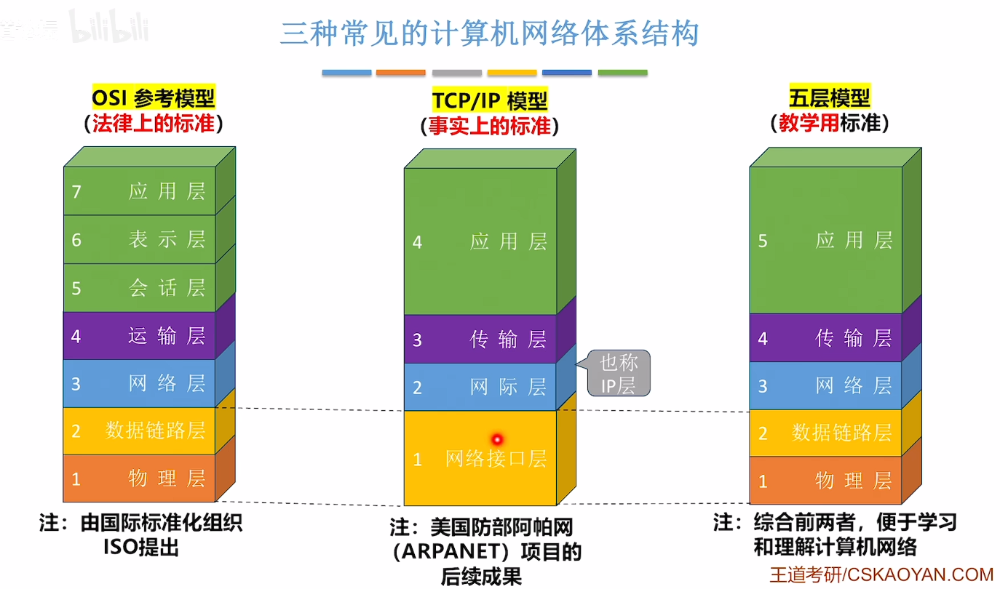

网络的体系结构是计算机网络的各层及其协议的集合，就是这个计算机网络及其构件所应完成的功能的精确定义。

- 在计算机网络的分层结构中，第n层中的活动元素（软件+硬件）通常称为第n层实体，不同机器上的同一层称为**对等层**，同一层的实体称为**对等实体**

- 网络协议：是控制对等实体之间进行通信的规则的集合，由语法、语义和同步/时序三部分组成。

    > 语法：数据与控制信息的格式
    >
    > 语义：需要发出何种控制信息、完成何种动作及做出何种应答
    >
    > 同步/时序：执行各种操作的条件、时序关系等

- 接口：同一节点内相邻两层的实体交换信息的逻辑接口，又称为服务访问点

- 服务：指下层为紧邻的上层提供的功能调用

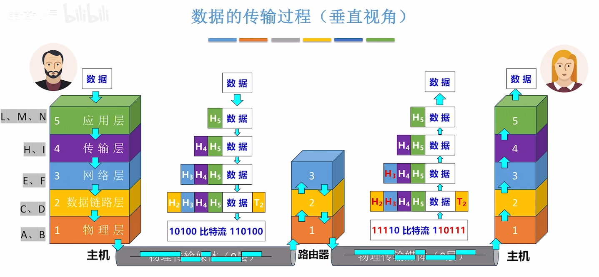

- 协议数据单元（PDU）：对等层次之间传送的数据单位。第n层的PDU记为n-PDU
- 服务数据单元（SDU）：为完成上一层实体所要求的功能而传送的数据。第n层的SDU记为n-SDU
- 协议控制信息（PDI）：控制协议操作的信息。第n层的PCI记为n-PCI

> PDU=SDU+PDI
>
> n-SDU+n-PCI=n-PDU=（n-1）-SDU

协议由语法、语义和同步三部分组成

### OSI模型

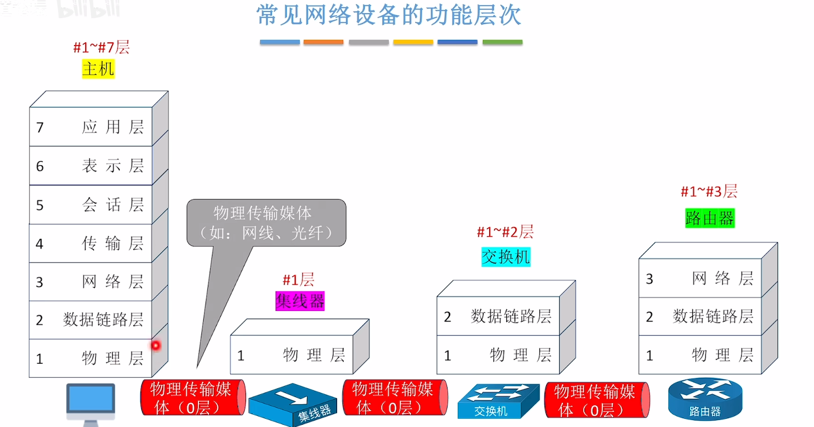

#### 物理层

实现相邻节点之间比特的传输

1. 需要定义电路接口参数
2. 定义传输信号的含义、电气特征等

#### 数据链路层

确保相邻节点之间的链路逻辑上无差错，使用校验编码技术，添加校验信息确保无错，以帧为单位

1. 差错控制：检错+纠错 或 检错+丢弃+重传
2. 流量控制：协调两个节点的速率

#### 网络层

实现转发，把数据转发到对应的目的节点，以分组为单位

1. 路由选择：构造并维护路由表，决定分组到达目的节点的最佳路径
2. 分组转发：将分组从合适的端口转发出去
3. 拥塞控制：发现网络拥塞，采取措施缓解拥塞
4. 网际互联：实现异构网络互联
5. 其他功能：差错控制、流量控制、连接建立与释放、可靠传输管理

> OSI中分组Packet又称数据报

#### 传输层

实现不同设备端到端（进程到进程）的通信，实现端口号与进程的映射，以报文段Segment为单位

1. 复用和分用：发送端几个高层实体复用一条低层的连接，在接收端再进行分用
2. 其他功能：差错控制、流量控制、连接建立与释放、可靠传输管理

#### 会话层

管理进程间的会话

1. 会话管理：采用检查点机制，当通信失效时从检查点继续恢复通信

#### 表示层

解决不同主机上信息表示不一致的问题

1. 数据格式转化：如编码转换、压缩/解压、加密/解密

#### 应用层

实现特定的网络应用，以报文Message为单位

### TCP/IP模型

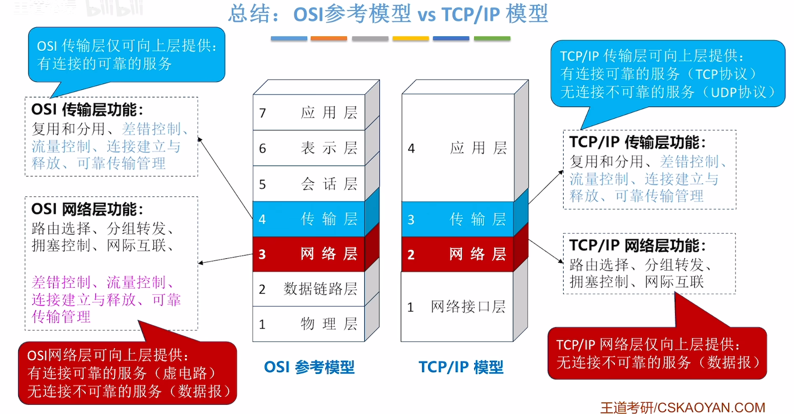
