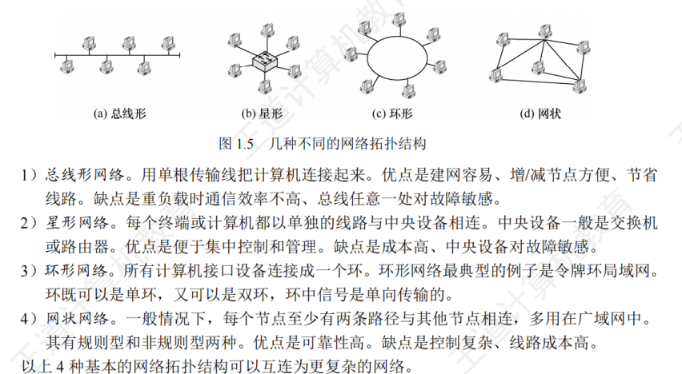

## 计算机网络概述

计算机网络(简称网络)由若干节点(Node，或译为结点)和连接这些节点的链路(Link)组成。

> internet(互连网)：
> 是一个通用名词，泛指由多个计算机网络互连而成的计算机网络。在这些网络之间可以使用任意的通信协议作为通信规则，不一定非要使用TCP/IP。
> Internet(互联网或因特网)：
> 则是一个专用名词，指当前全球最大的、开放的、由众多网络和路由器互连而成的特定计算机网络，它采用TCP/IP 族作为通信规则。

计算机网络组成：硬件、软件、协议（是计算机网络的核心，规定了网络传输数据时所遵守的规范）

### 计算机网络的功能

&nbsp;&nbsp;&nbsp;&nbsp;数据通信 资源共享 分布式处理 提高可靠性 负载均衡

### 电路交换、报文交换与分组交换

### 计算机网络的分类

按分布范围分：广域网、城域网、局域网、个人区域网

按传输技术分：广播式网络、点对点网络

按拓扑结构分类：

### 计算机网络性能指标

数据传输速率 带宽（最高数据传输速率） 
