## 组帧

帧定界：如何让数据接收方确定帧的界限

透明传输：接收方能够将数据恢复原貌

组帧方法：字符计数法、字节填充法、零比特填充法、违规编码法

### 字符计数法

在每个帧的开头，用一个定长计数字段表示帧长

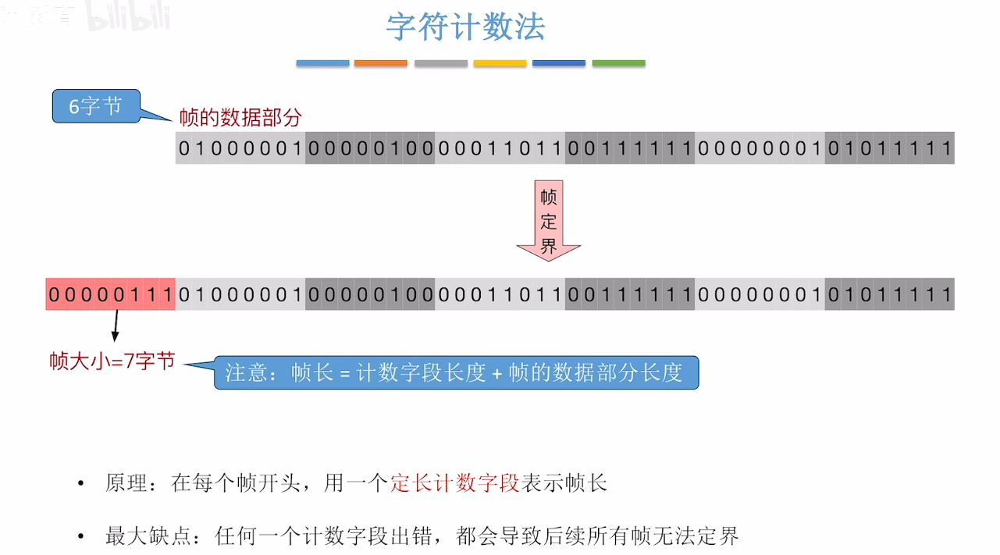

### 字节填充法

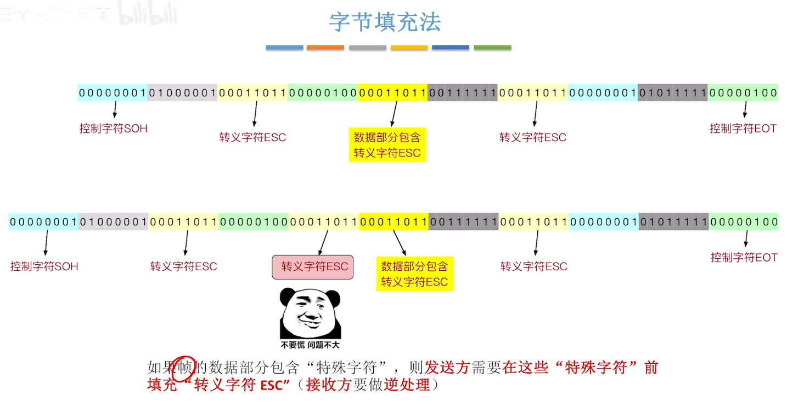

### 零比特填充法

HDLC和PPP协议使用的是零比特填充法

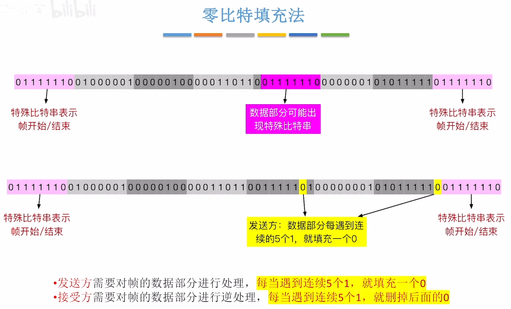

### 违规编码法

## 差错控制

发现并解决一个帧内部的位错

### 检错编码

接收方发现比特错误后丢弃帧，并通知发送方重传帧

#### 奇偶校验码

 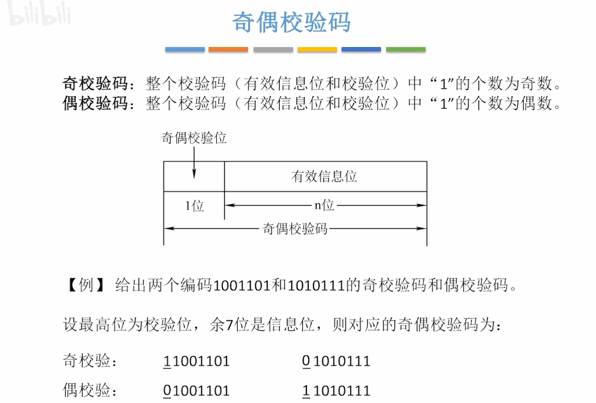

通过异或和实现，所以0异或和为0，奇数个1异或和为1，偶数个1异或和为0

#### 循环冗余校验校验码CRC

 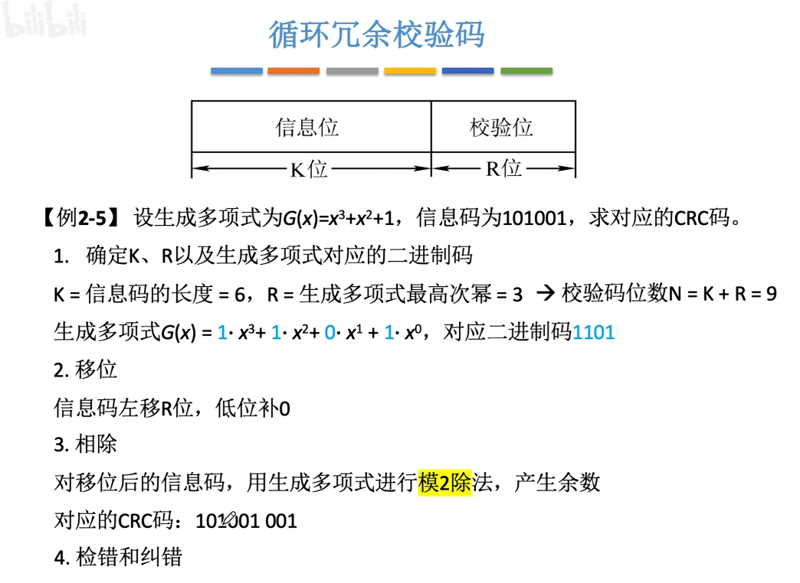

 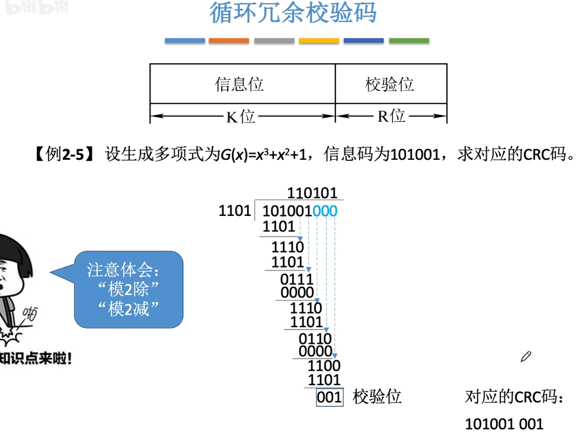

### 纠错编码

由接受方发现并纠正比特错误

#### 海明校验码

基于奇偶校验码的基础上，将信息位分组后进行偶校验，n个信息位，k个校验位，则$2^k=n+k+1$,校验位$p_i$放在海明位号位$2^{i-1}$，纠错能力只有一位

> 校验位的位置的二进制形式只会有一个地方是1，其余为0，所以这个校验位就是监控位置的二进制形式在这个地方为一的所有数据，若这个校验位的数值为0，则所有在这个位置为1 的信息位的数据都是正确的。出错校验位组合即可，即可确定出错的是哪位信息位

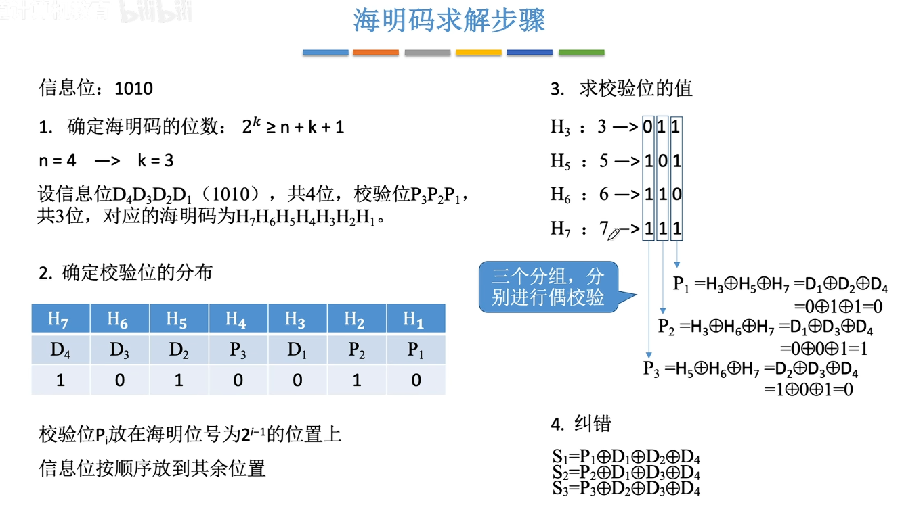

## 可靠传输和流量控制

可靠传输：发现并解决帧错误，包含帧丢失、帧重复和帧失序

流量控制：控制发送方发送的速率别太快，让接收方来得及接受

滑动窗口来实现，帧编号要求$W_t+W_R \leq 2^n$

### 停止等待协议（S-W,Stop-Wait）

发送窗口=1，接收窗口=1,需要1bit给帧编号

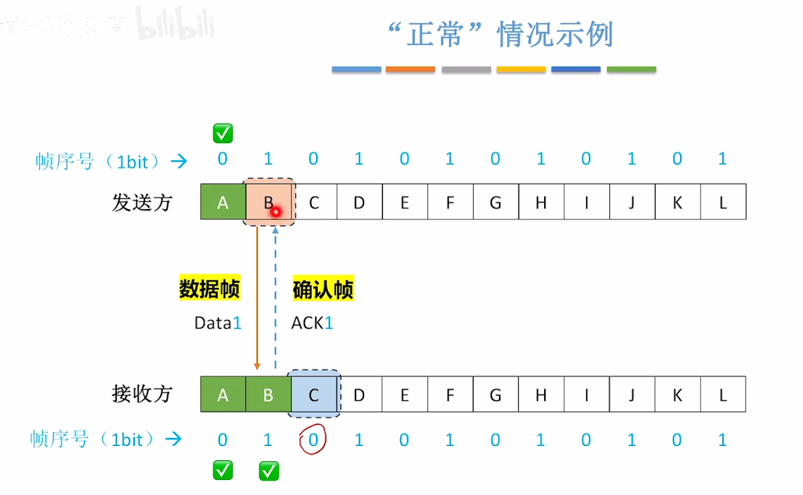

确认帧：ACK_i,若接受方收到i号帧，且没有检测出”差错“，需要给发送方返回确认帧ACK_i

超时重传：若发送方超时未收到ACK_i,则重传i号帧

确认帧丢失：发送方重发原来的帧，接收方丢弃重复帧，返回重复帧的ACK

### 后退N帧协议（GBN,Go-Back-N）

发送窗口>1，接收窗口=1，至少需要n bit给帧编号

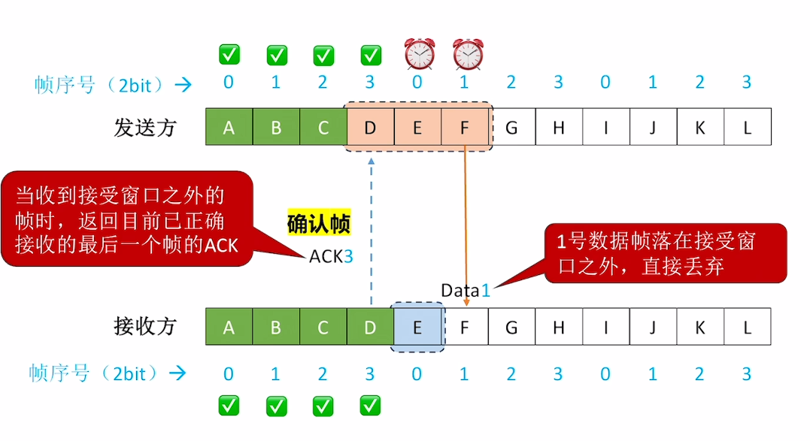

确认帧：接收方可以累计确认，即连续收到多个数据帧时，可以仅返回最后一个帧的ACK

超时重传：若发送方超时未收到ACK_i,则重传i号帧，及其之后的所有帧

确认帧丢失：发送方重发原来窗口大小的帧，接收方收到非法帧返回目前收到的最后一个正确帧的ACK

### 选择重传协议（SR,Selective Repeat）

发送窗口>1，接收窗口>1,至少需要n bit给帧编号，接收窗口小于等于发送窗口

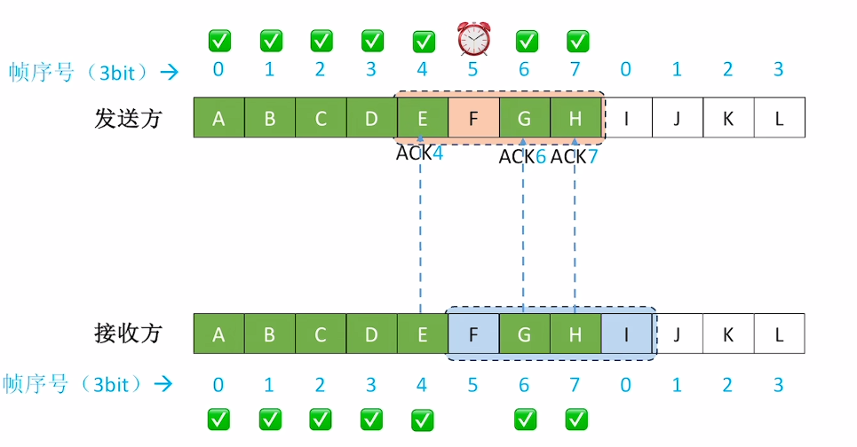

不支持累计确认，必须一帧一帧确认

否认帧NAK_i:接收方收到i号帧有差错，丢弃该帧，并给发送方返回否认帧NAK_i

请求重传：发送方收到NAK_i，重传i号帧

### 信道利用率对比

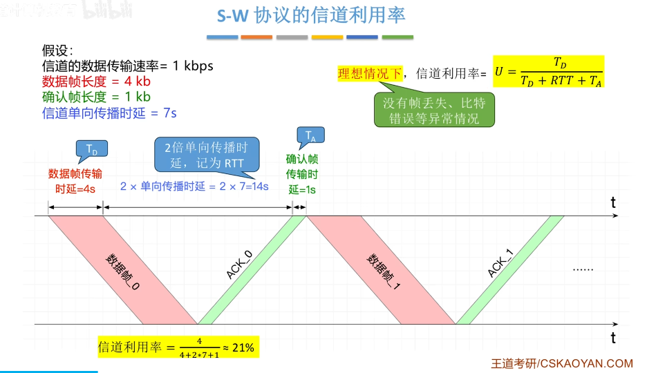

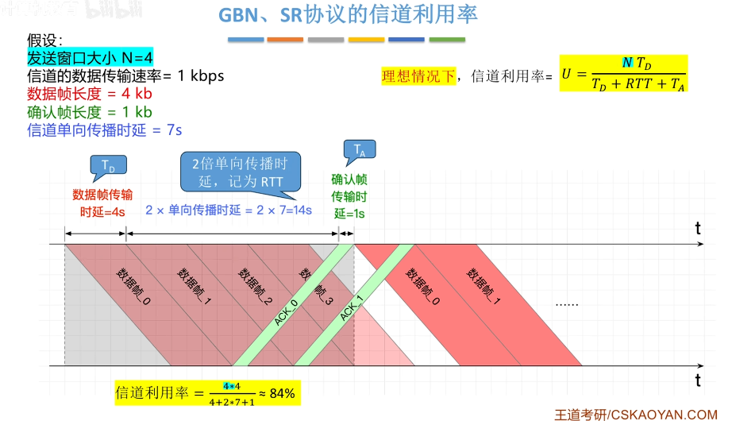

滑动窗口协议：GBN，SR

ARQ（Automatic repeat request）协议：自动重传协议，包含S-W，FBN，SR三种协议

连续ARQ协议：包含GBN，SR

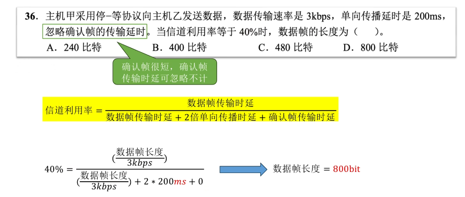

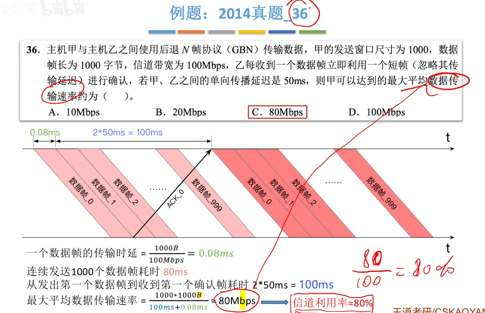

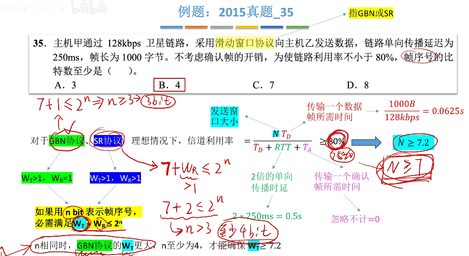

## 介质访问控制（MAC,Medium Access Control）

多个结点共享一个总线型广播信道时，可能会发生信号冲突，如何去控制各个结点对传输介质的访问

### 信道划分

#### 时分复用（TDM）

将时间分为等长的TDM帧，每个TDM帧又分为等长的m个时隙，将m个时隙分配给m对用户使用

每个结点最多只分到信道总带宽的$\frac{1}{m}$,算的是平均速率

#### 统计时分复用（STDM）

异步时分复用，在TDM的基础上，动态按序分配时隙

需要时，一个节点可以在一段时间内获得所有的信道带宽资源，某节点暂不发送数据，可以不分配时隙，使得信道利用率更高

#### 频分复用（FDM）

将信道总频带划分为多个子频带，每个子频带作为一个子信道，每对用户使用一个子信道进行通信

各个节点可以同时发送信号，充分利用了信道带宽，但是只能用于模拟信号的传输

#### 波分复用（WDM）

即光的频分复用，将各个节点发送出的不同波长的光信号复合后传输到光纤上

#### 码分复用技术（CDM）

类似于数字信号的频分复用，不同频率就相当于是相互正交的码片序列

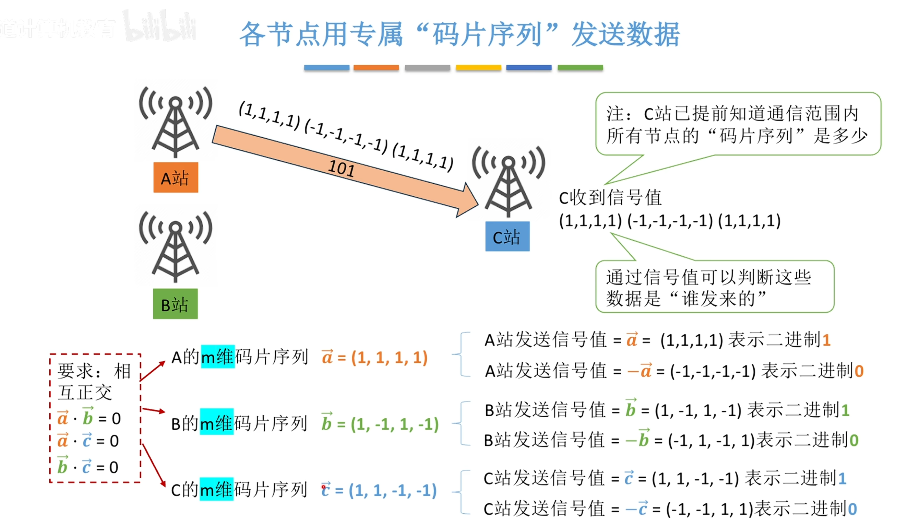

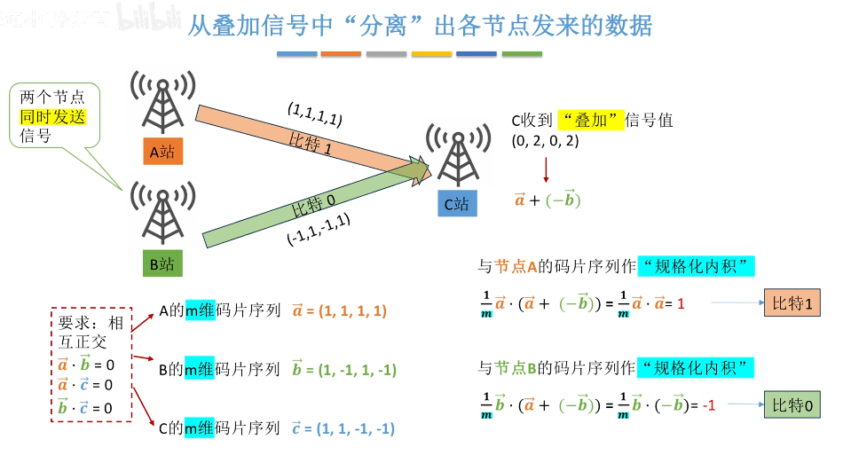

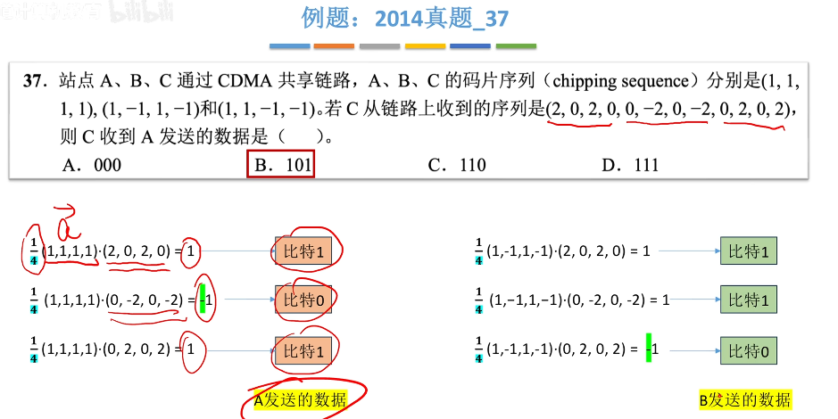

### 随机访问

#### ALOHA协议

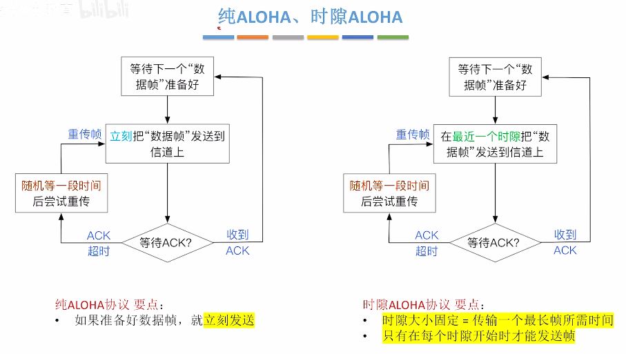

#### CSMA协议

载波监听协议

在发送数据之前，先监听信道是否空闲，只有信道空闲时，才会尝试发送

通过在节点的网络适配器安装载波监听装置

##### 1-坚持CSMA

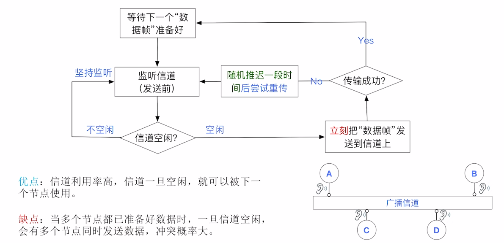

##### 非坚持CSMA

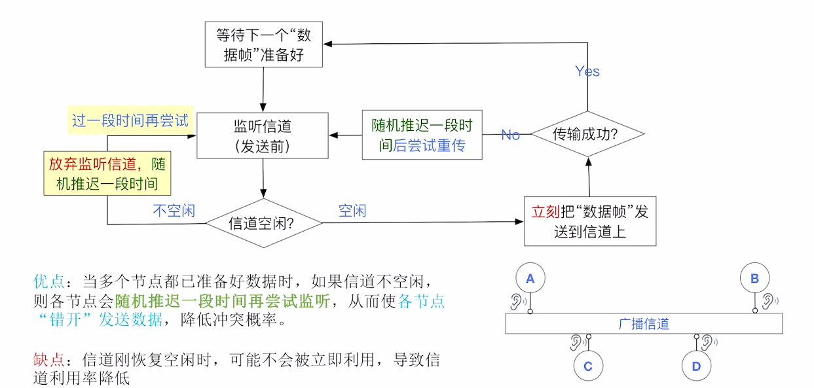

##### p-坚持CSMA

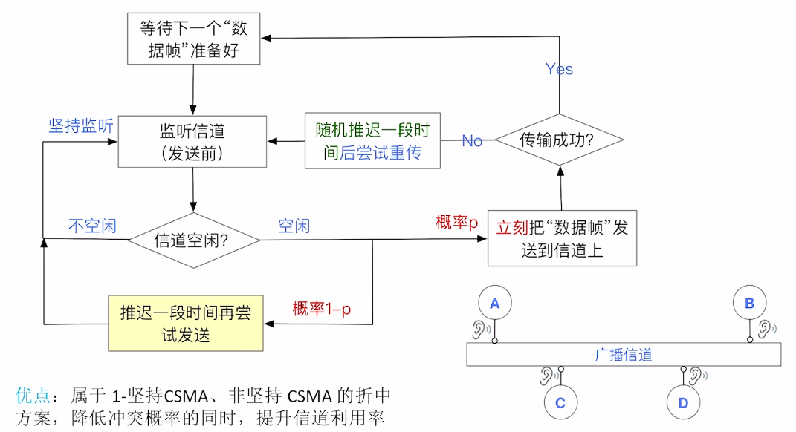

#### CAMA/CD协议

载波监听/冲突检测协议，用于早期的有线以太网（总线型）                                                                                                                                                                                                                                                                                                                                                                                                                                                                                                                                                                                                                                                                                                                                                                                                                                                                                                                                                                                                                                                                                                                                                                                                                                                                                                                                                                                                                                                                                                                                                                                                                                                                                                                                                                                                                                                                                                                                                                                                                                                                                                                                                                                                                                                                                                                                                                                                                                                                                                                                                                                                                                                                                                                                                                                                                                                                                                                                                                                                                                                                                                                                                                                                                                                                                                                                                                                                                                                                                                                                                                                                                                                                                                                                                                                                                                                                                                                                                                                                                                                                                                                                                                                                                                                                                                                                                                                                                                                                                                                                                                                                                                                                                                                                                                                                                                                                                                                                                                                                                                                                                                                                                                                                                                                                       

#### CSMA/CA协议

用于IEEE 802.11无线局域WiFi

### 轮询访问