## 组帧

帧定界：如何让数据接收方确定帧的界限

透明传输：接收方能够将数据恢复原貌

组帧方法：字符计数法、字节填充法、零比特填充法、违规编码法

### 字符计数法

在每个帧的开头，用一个定长计数字段表示帧长

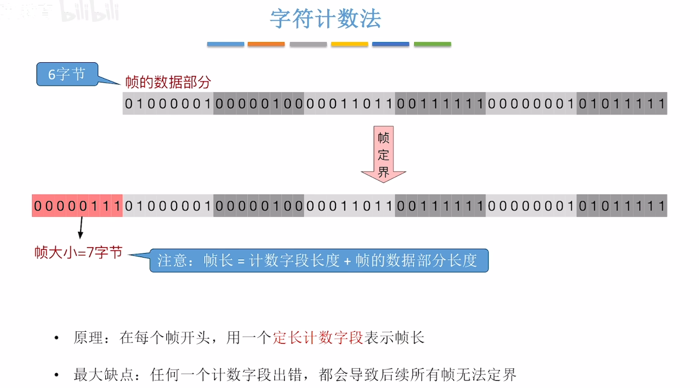

### 字节填充法

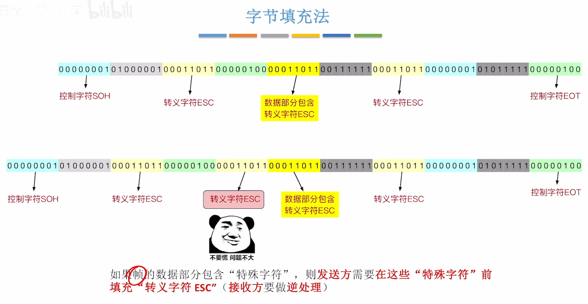

### 零比特填充法

HDLC和PPP协议使用的是零比特填充法

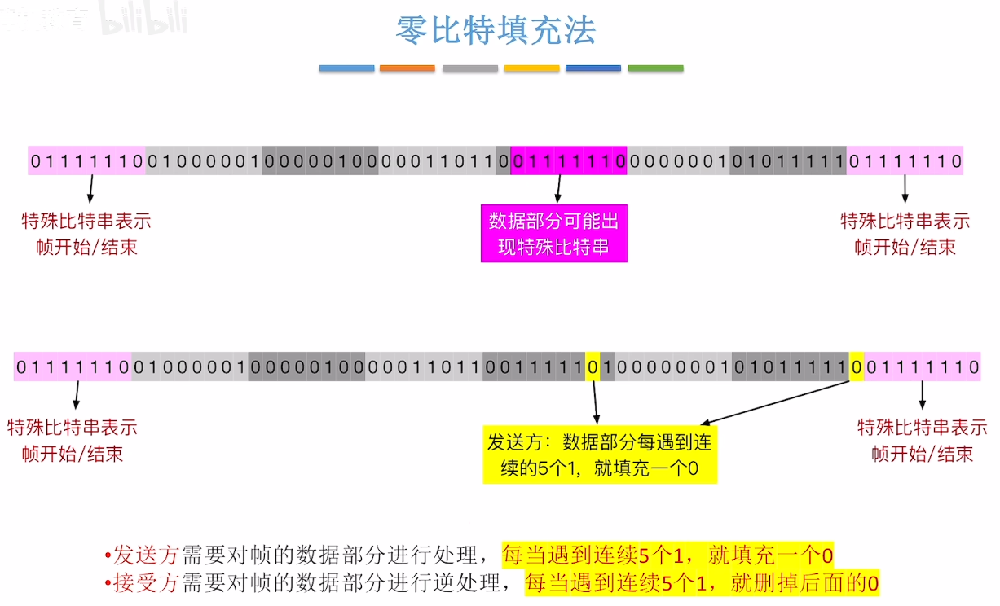

### 违规编码法

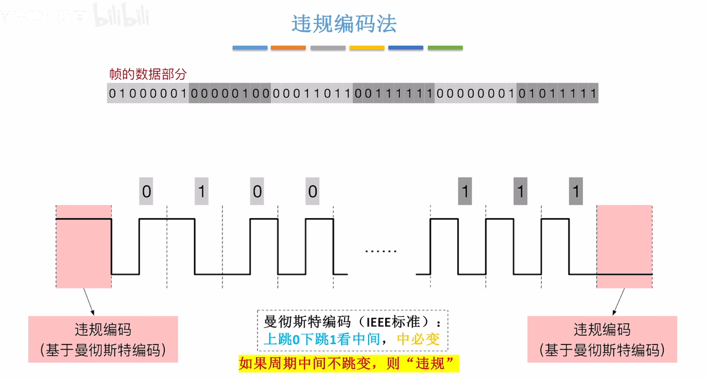

## 差错控制

发现并解决一个帧内部的位错

### 检错编码

接收方发现比特错误后丢弃帧，并通知发送方重传帧

#### 奇偶校验码

 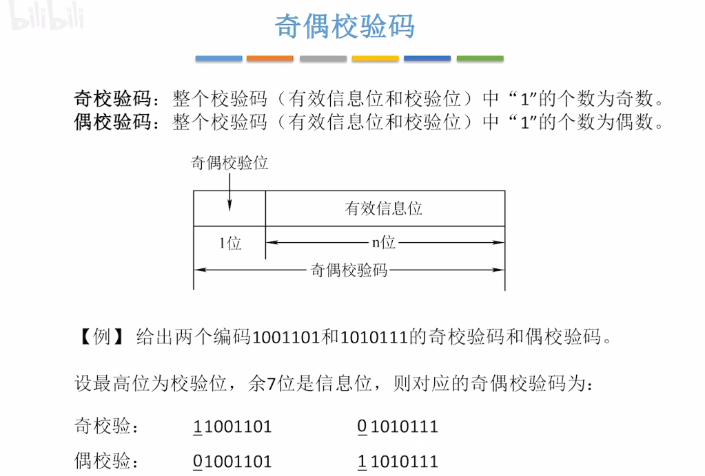

通过异或和实现，所以0异或和为0，奇数个1异或和为1，偶数个1异或和为0

#### 循环冗余校验校验码CRC

 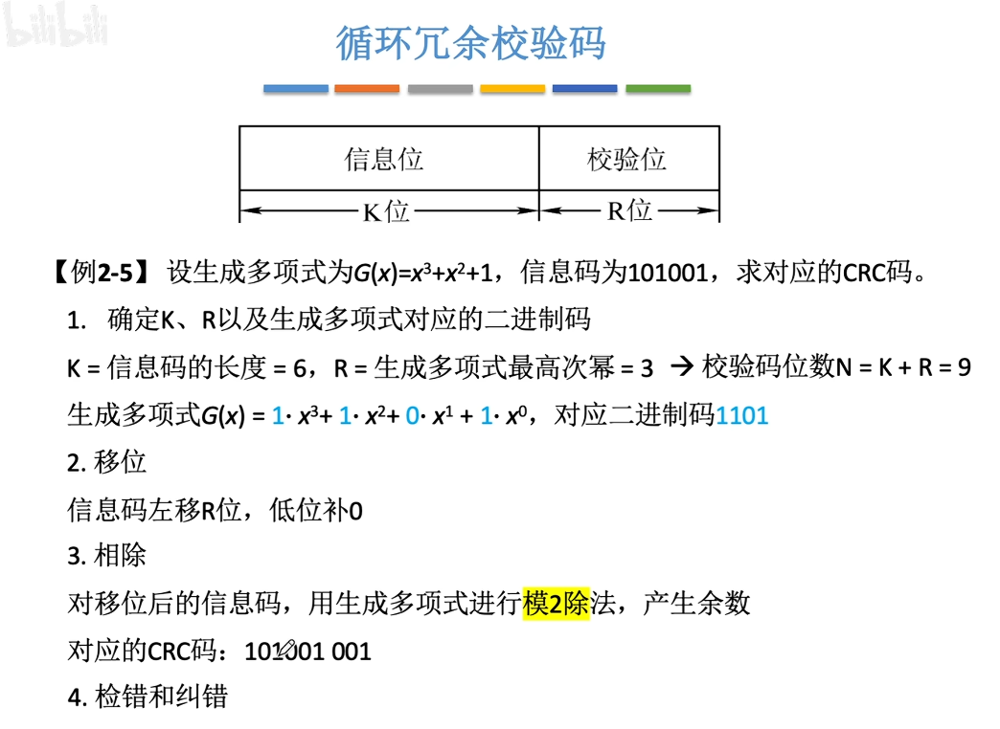

 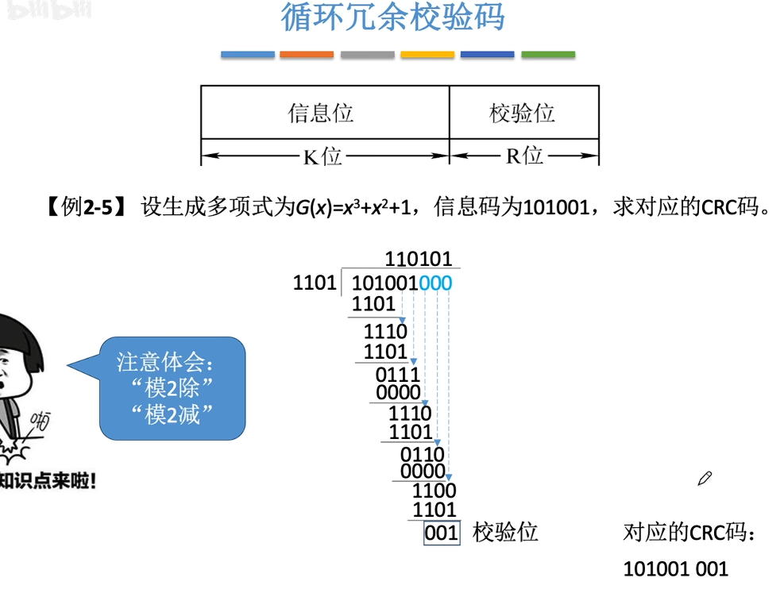

### 纠错编码

由接受方发现并纠正比特错误

#### 海明校验码

基于奇偶校验码的基础上，将信息位分组后进行偶校验，n个信息位，k个校验位，则$2^k=n+k+1$,校验位$p_i$放在海明位号位$2^{i-1}$，纠错能力只有一位

> 校验位的位置的二进制形式只会有一个地方是1，其余为0，所以这个校验位就是监控位置的二进制形式在这个地方为一的所有数据，若这个校验位的数值为0，则所有在这个位置为1 的信息位的数据都是正确的。出错校验位组合即可，即可确定出错的是哪位信息位

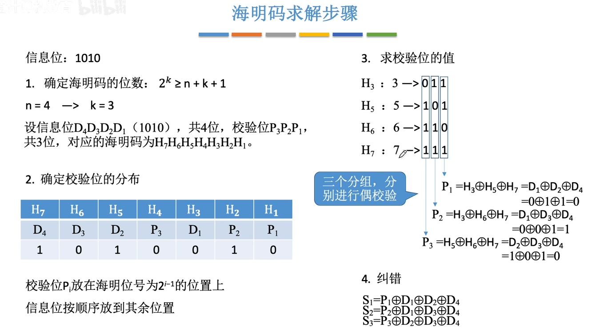

## 可靠传输和流量控制

可靠传输：发现并解决帧错误，包含帧丢失、帧重复和帧失序

流量控制：控制发送方发送的速率别太快，让接收方来得及接受

滑动窗口来实现，帧编号要求$W_t+W_R \leq 2^n$

### 停止等待协议（S-W,Stop-Wait）

发送窗口=1，接收窗口=1,需要1bit给帧编号

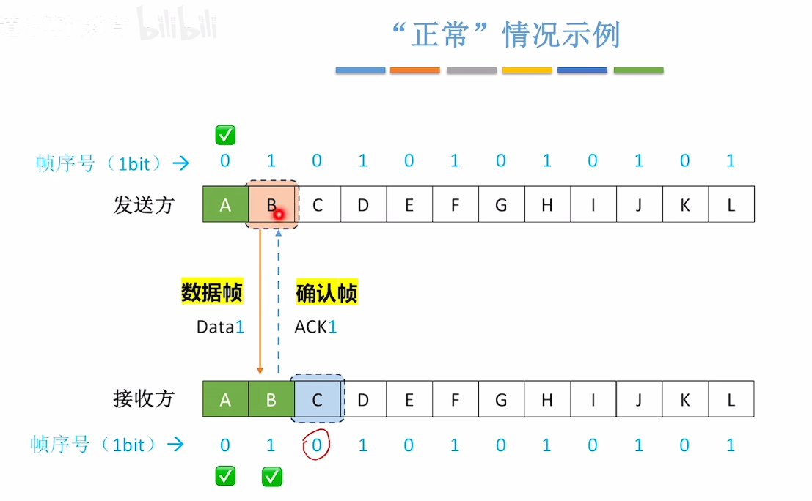

确认帧：ACK_i,若接受方收到i号帧，且没有检测出”差错“，需要给发送方返回确认帧ACK_i

超时重传：若发送方超时未收到ACK_i,则重传i号帧

确认帧丢失：发送方重发原来的帧，接收方丢弃重复帧，返回重复帧的ACK

### 后退N帧协议（GBN,Go-Back-N）

发送窗口>1，接收窗口=1，至少需要n bit给帧编号

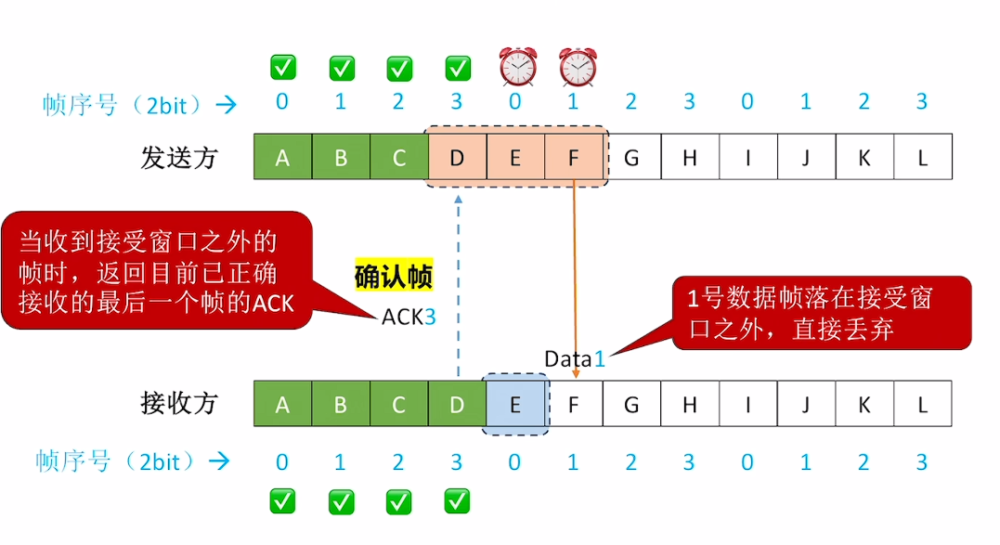

确认帧：接收方可以累计确认，即连续收到多个数据帧时，可以仅返回最后一个帧的ACK

超时重传：若发送方超时未收到ACK_i,则重传i号帧，及其之后的所有帧

确认帧丢失：发送方重发原来窗口大小的帧，接收方收到非法帧返回目前收到的最后一个正确帧的ACK

### 选择重传协议（SR,Selective Repeat）

发送窗口>1，接收窗口>1,至少需要n bit给帧编号，接收窗口小于等于发送窗口

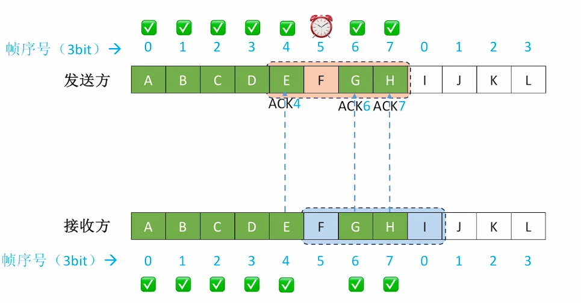

不支持累计确认，必须一帧一帧确认

否认帧NAK_i:接收方收到i号帧有差错，丢弃该帧，并给发送方返回否认帧NAK_i

请求重传：发送方收到NAK_i，重传i号帧

### 信道利用率对比

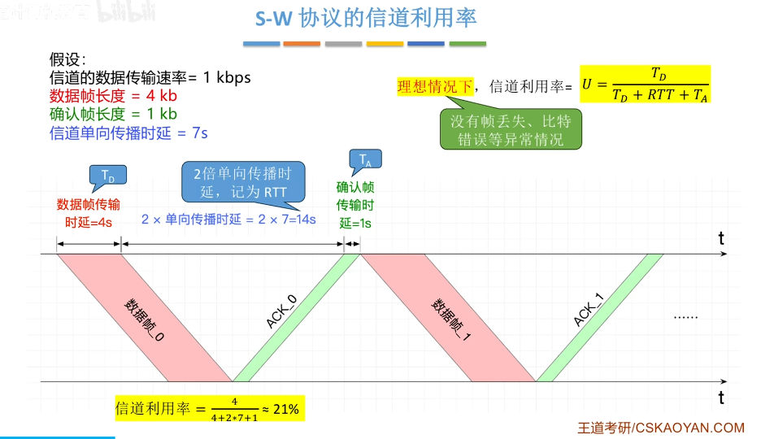

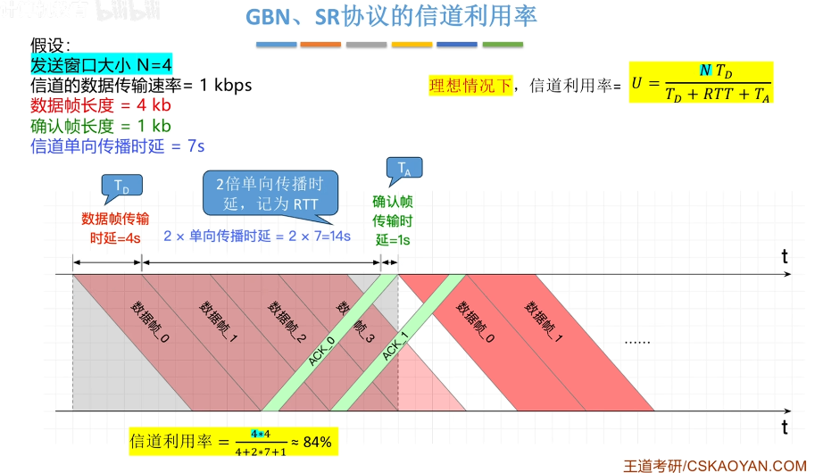

滑动窗口协议：GBN，SR

ARQ（Automatic repeat request）协议：自动重传协议，包含S-W，FBN，SR三种协议

连续ARQ协议：包含GBN，SR

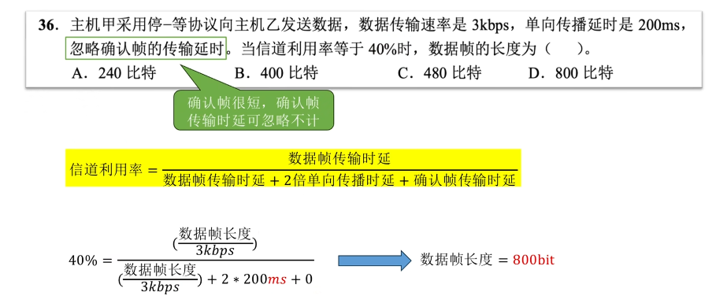

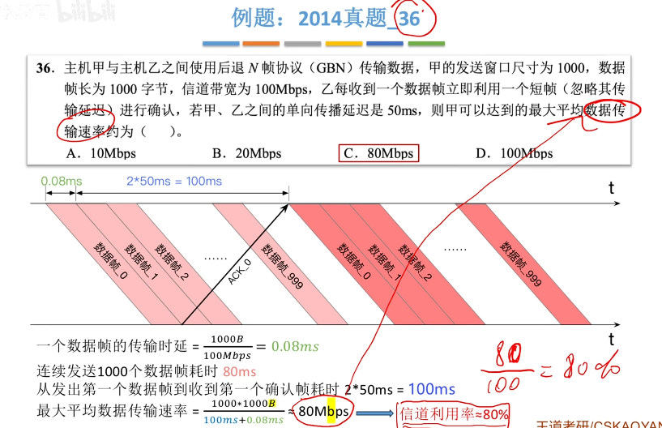

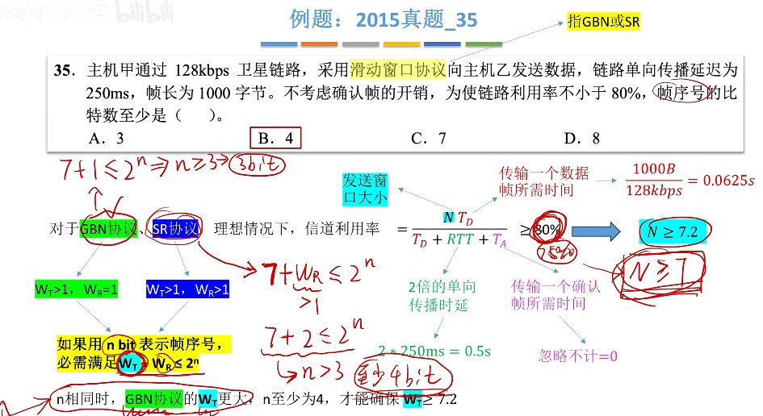

## 介质访问控制（MAC,Medium Access Control）

多个结点共享一个总线型广播信道时，可能会发生信号冲突，如何去控制各个结点对传输介质的访问

### 信道划分

不同波段的数据混合

#### 时分复用（TDM）

将时间分为等长的TDM帧，每个TDM帧又分为等长的m个时隙，将m个时隙分配给m对用户使用

每个结点最多只分到信道总带宽的$\frac{1}{m}$,算的是平均速率

#### 统计时分复用（STDM）

异步时分复用，在TDM的基础上，动态按序分配时隙

需要时，一个节点可以在一段时间内获得所有的信道带宽资源，某节点暂不发送数据，可以不分配时隙，使得信道利用率更高

#### 频分复用（FDM）

将信道总频带划分为多个子频带，每个子频带作为一个子信道，每对用户使用一个子信道进行通信

各个节点可以同时发送信号，充分利用了信道带宽，但是只能用于模拟信号的传输

#### 波分复用（WDM）

即光的频分复用，将各个节点发送出的不同波长的光信号复合后传输到光纤上

#### 码分复用技术（CDM）

类似于数字信号的频分复用，不同频率就相当于是相互正交的码片序列

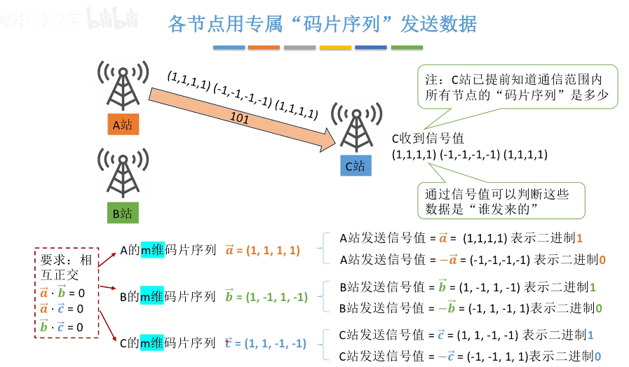

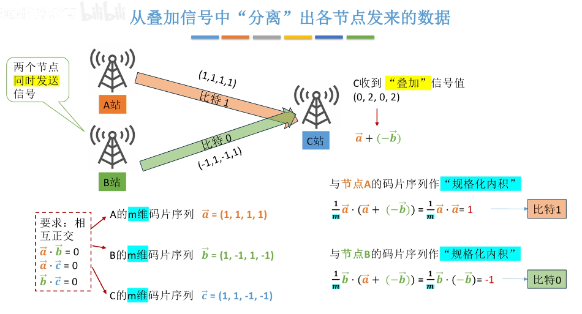

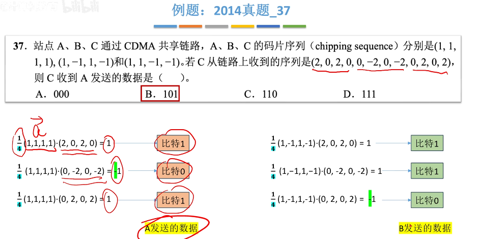

### 随机访问

同一波段的数据控制

#### ALOHA协议

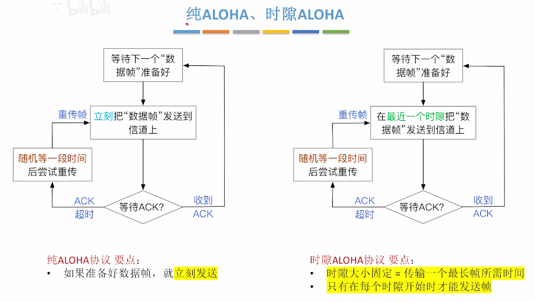

#### CSMA协议

载波监听多路访问（Carrier Sense Multiple Access）

在发送数据之前，先监听信道是否空闲，只有信道空闲时，才会尝试发送

通过在节点的网络适配器安装载波监听装置

##### 1-坚持CSMA

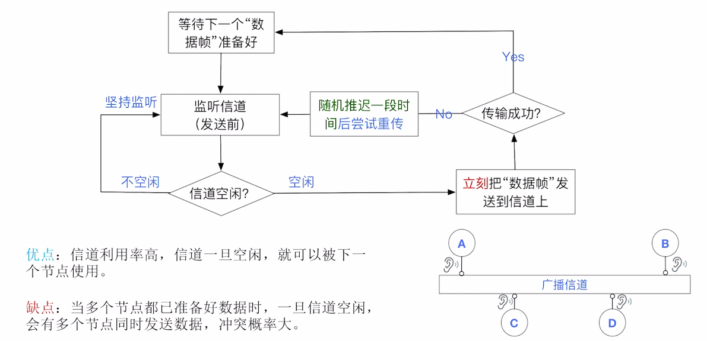

##### 非坚持CSMA

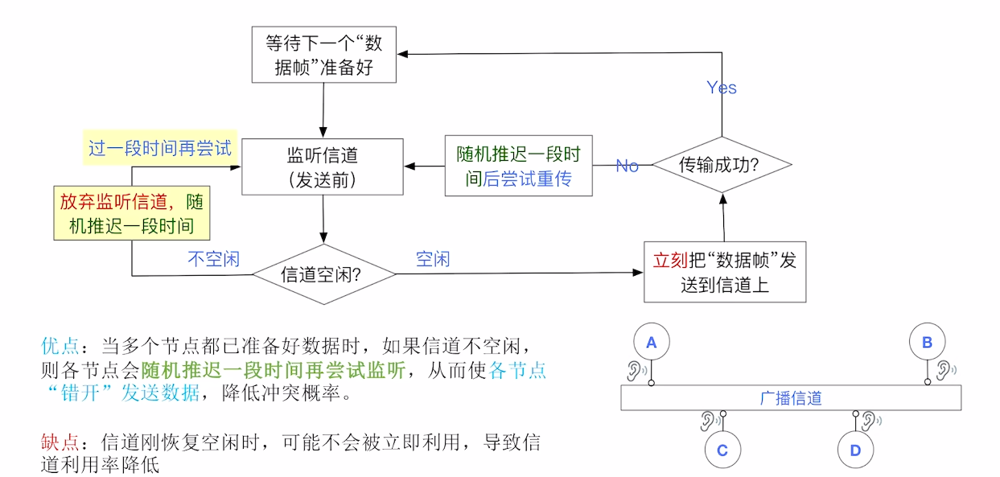

##### p-坚持CSMA

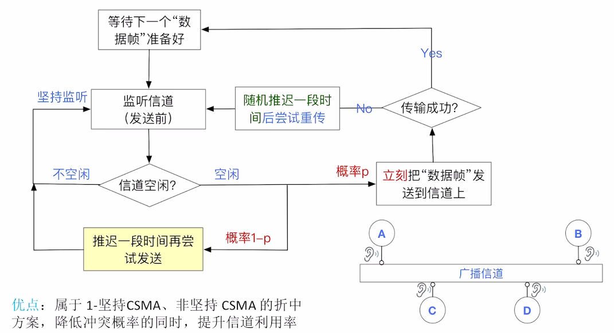

#### CSMA/CD协议

载波监听/冲突检测协议（Collision Detection），用于早期的有线以太网（总线型）                                                                                                                                                                                                                                                                                                                                                                                                                                                                                                                                                                                                                                                                                                                                                                                                                                                                                                                                                                                                                                                                                                                                                                                                                                                                                                                                                                                                                                                                                                                                                                                                                                                                                                                                                                                                                                                                                                                                                                                                                                                                                                                                                                                                                                                                                                                                                                                                                                                                                                                                                                                                                                                                                                                                                                                                                                                                                                                                                                                                                                                                                                                                                                                                                                                                                                                                                                                                                                                                                                                                                                                                                                                                                                                                                                                                                                                                                                                                                                                                                                                                                                                                                                                                                                                                                                                                                                                                                                                                                                                                                                                                                                                                                                                                                                                                                                                                                                                                                                                                                                                                                                                                                                                                                                                                       

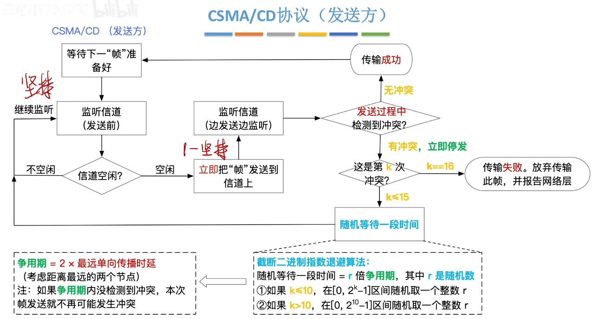

发数据的同时也就相当于是在占领信道，对各个经过的节点进行宣告，让其不要再发数据了

最短帧长=2×最大传播时延×信道带宽

发送时间$\geq$争用期

没有ACK机制，若发送过程中未检测到冲突，就认为发送成功

以太网规定，最短帧长=64B,最长帧长=1518B

#### CSMA/CA协议

载波监听/冲突避免协议（Collision Avoidance），用于IEEE 802.11无线局域网（WiFi）

AP:接入点，无线信号收发装置，切换wifi热点叫作漫游

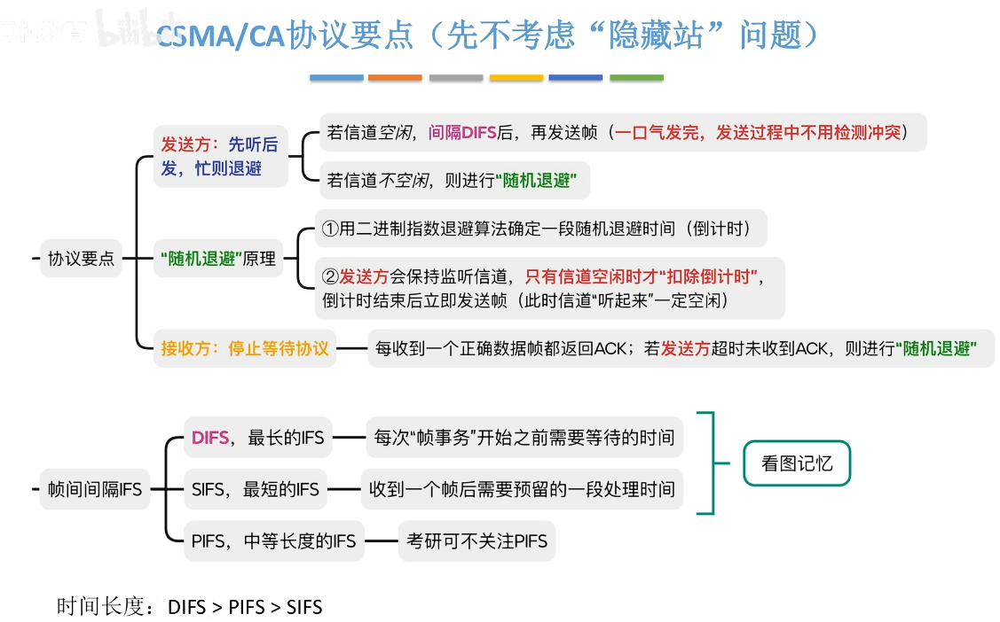

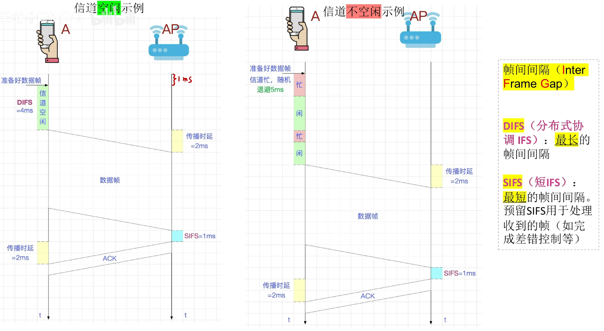

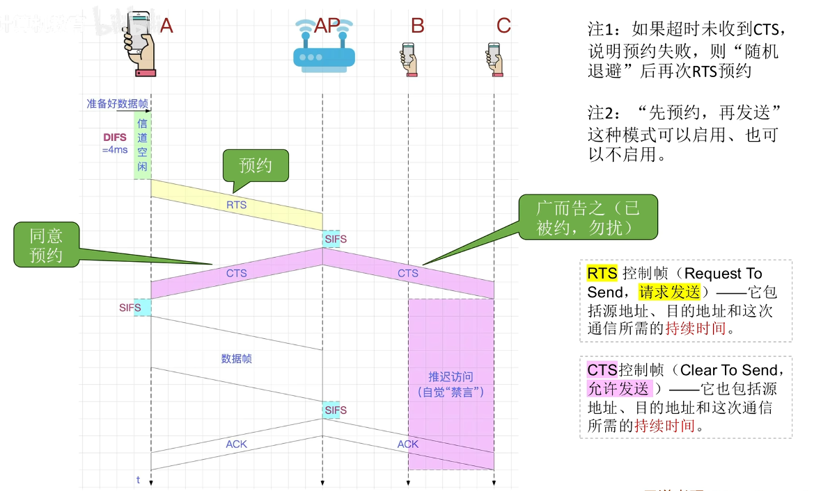

这种禁言机制称为虚拟载波监听机制

DIFS>传播时延+SIFS,从而确保数据处理和返回ACK的时候信道处于空闲状态

### 轮询访问

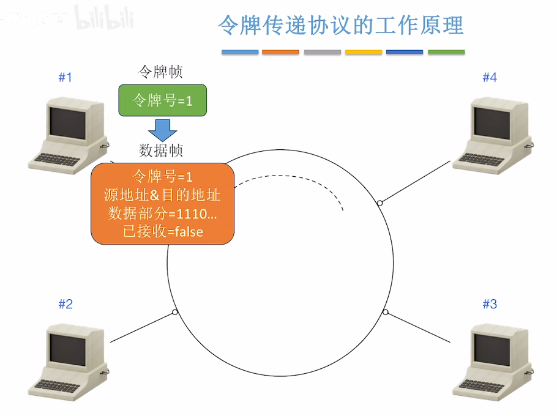

只有获得令牌的节点才能往信道上发送数据帧

获得令牌的节点，每次只能发送一帧，发完就释放令牌，令牌沿单项传递

每个获得令牌的节点没有数据要发送，就将令牌传递下一个节点

## 局域网

IEEE：电气电子工程师学会，负责网络的标准化

802.3工作组负责以太网（有线局域网）技术标准，802.11负责无线局域网（Wi-Fi）技术,802.1Q负责虚拟局域网技术VLAN

特点：

1. 覆盖较小的地理范围
2. 较低的时延和误码率
3. 局域网内各个节点之间以帧为单位进行传输
4. 支持单播（一对一发送），广播（一对全部发送），多播（一对部分发送）

### 分类

关注三要素：

1. 拓扑结构
2. 传输介质
3. 介质访问方式

#### 以太网（Ethernet）

##### 同轴电缆以太网

802.3，有线局域网

物理层采用曼彻斯特编码

总线型结构

同轴电缆（十九世纪八十年代），可使用中继器连接多个同轴电缆网段

> 1994年后逐步转向交换机

CSMA/CD协议

##### 双绞线以太网

八十年代后期，双绞线以太网，10BaseT,1990年

集线器连接的双绞线以太网：

1. 物理上星形，逻辑上总线形
2. 双绞线
3. CSMA/CD协议

交换机连接的双绞线以太网：

1. 星形
2. 双绞线
3. CSMA/CD协议或NULL

半双工模式下，采用CSMA/CD争抢信道

全双工模式下，不用争抢信道，不需要使用CSMA/CD协议

##### 光纤以太网

九十年代初光纤以太网，10BaseF，1993年

点对点

光纤

NULL（用两条光纤实现全双工通信）

#### 令牌环网（Token Ring）

1984~2000，有线局域网

环形

同轴电缆或双绞线

令牌传递协议

#### WiFi

无线局域网（WLAN），802.11

星形结构（一个AP+N台移动设备）

无线

CSMA/CA协议

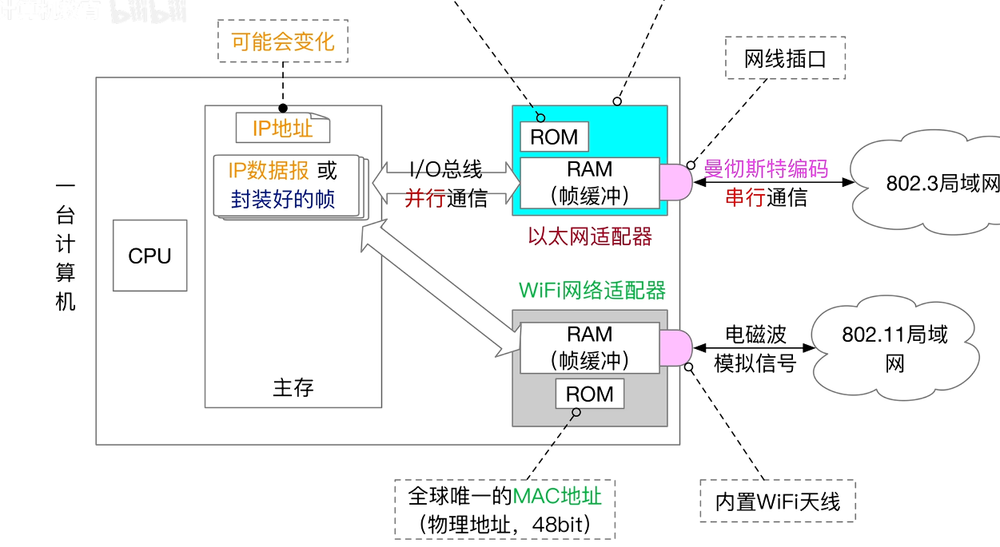

### IEEE 802.3

IEEE 802将数据链路层划分为逻辑链路控制子层（LLC）和介质访问控制子层（MAC）

802.3主要研究物理层与介质访问控制子层

#### 物理层

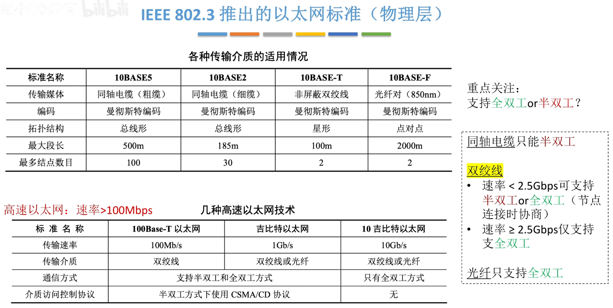

交换机连接的终端节点都可以全双工

#### 介质访问控制子层（MAC层）

DEC、Intel、Xerox推出了DIX Ethernet V2标准

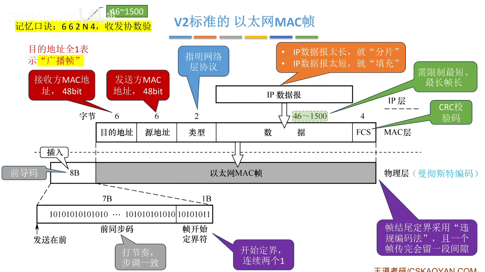

最大传送单元（MTU）：一个数据链路层数据帧能承受的最大数据量，即1500B

IEEE 802.3 根据V2标准推出了IEEE 802.3标准

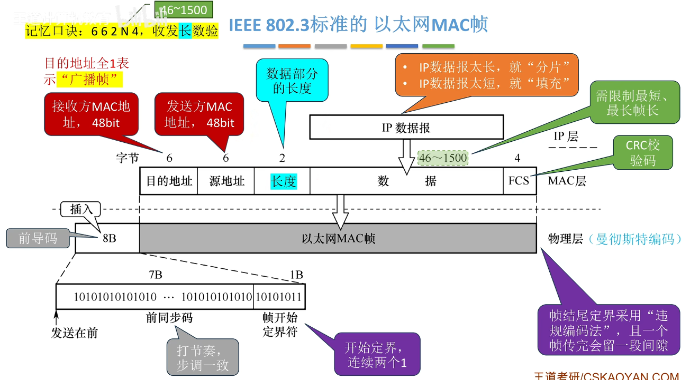

路由器、交换机都要MAC地址，集线器没有MAC地址

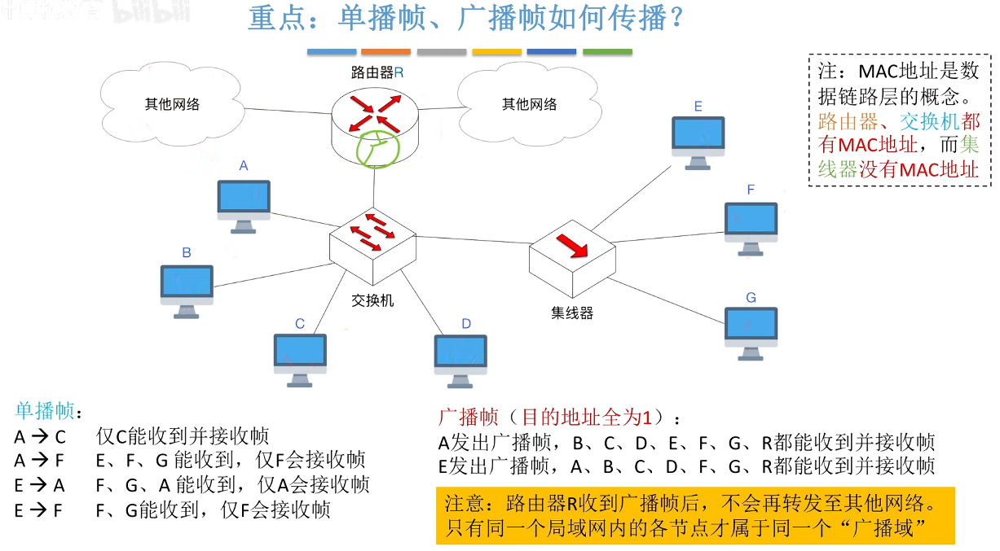

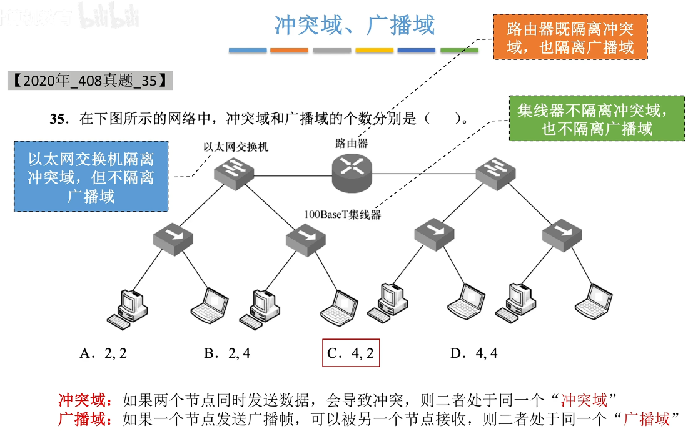

### VLAN虚拟局域网

由802.1Q工作组负责

将一个大型局域网分割为若干个较小的VLAN，每个VLAN是一个广播域，每一个VLAN对应一个VID

VLAN划分方式：

基于接口划分

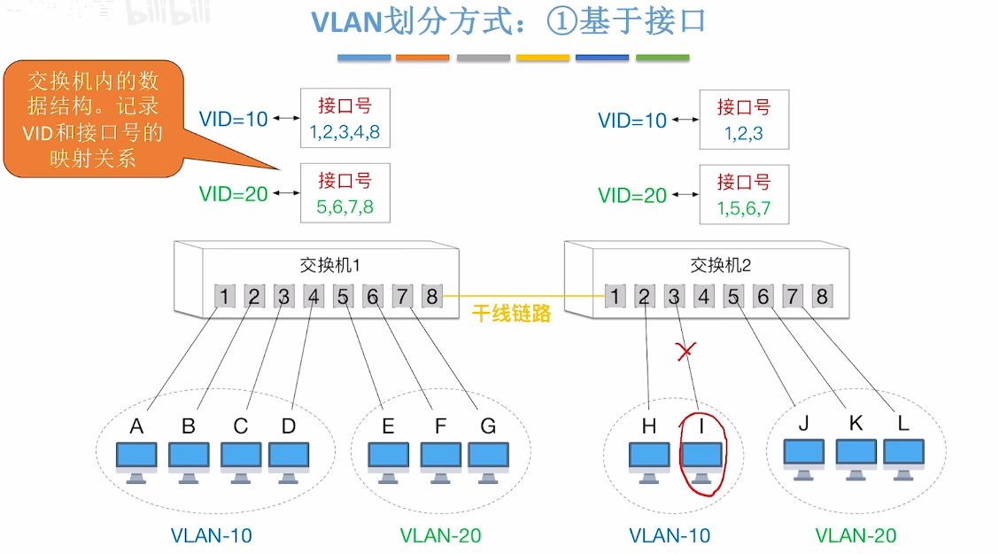

基于MAC地址划分

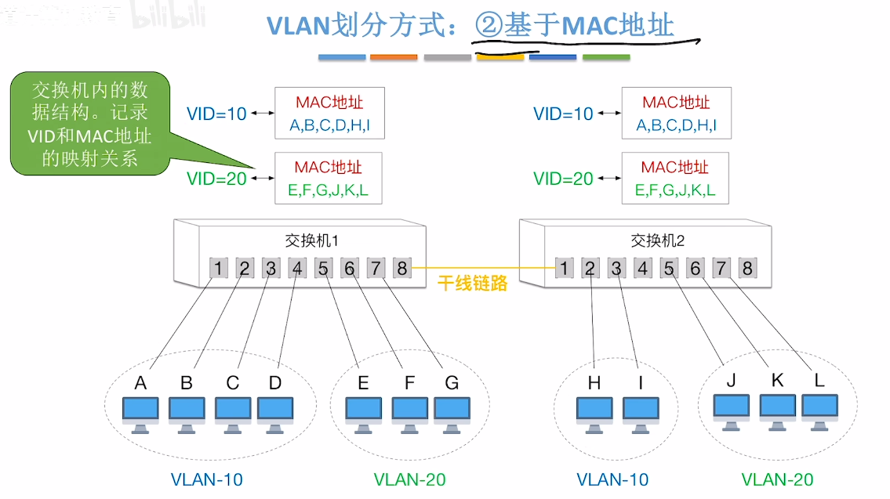

基于IP地址划分

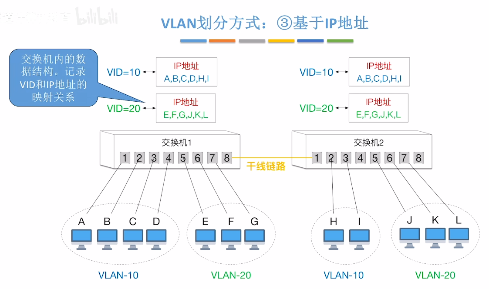

主机与交换机之间传输标准以太网帧，交换机和交换机之间传输802.1Q帧

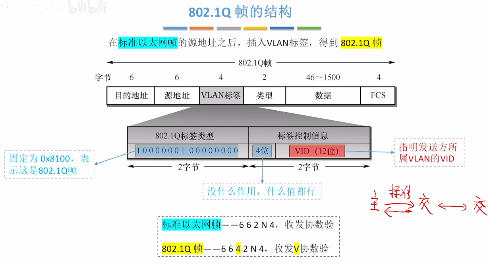

### 无线局域网

可分为：

1. 有固定基础设施的无线局域网：如802.11无线局域网
2. 无固定基础设施移动自组织网络

#### IEEE 802.11 无线局域网

通过门户（Portal）设备将不同类型的局域网连接，变成一个更大的局域网，可将802.11无线局域网接入802.3有线以太网

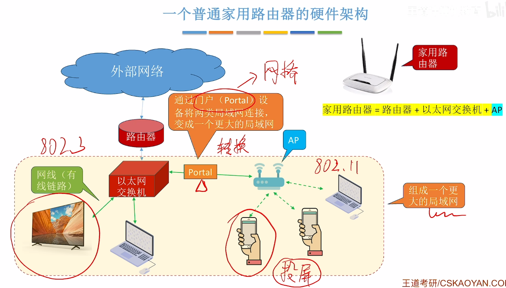

802.11无线局域网是星形拓扑，中心成为接入点（AP）,也可称为无线接入点（WAP）

基本服务集BSS：一个基站（AP）+多个移动站

- 服务集标识符SSID：我无限局域网的名字，不超过32字节
- 基本服务区BSA：指一个基本服务集能够覆盖的地理范围

扩展服务集ESS：将多个AP连接到同一个分配系统，组成一个更大的服务集

漫游：一个移动站从一个基本服务集切换到另一个基本服务集，仍然可以保持通信

帧分为：

1. 数据帧
2. 控制帧：如ACK、RTS、CTS帧
3. 管理帧：如探测请求/探测相应帧

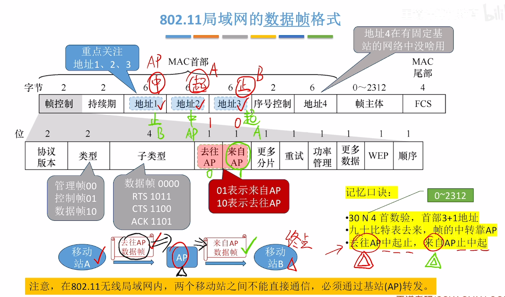

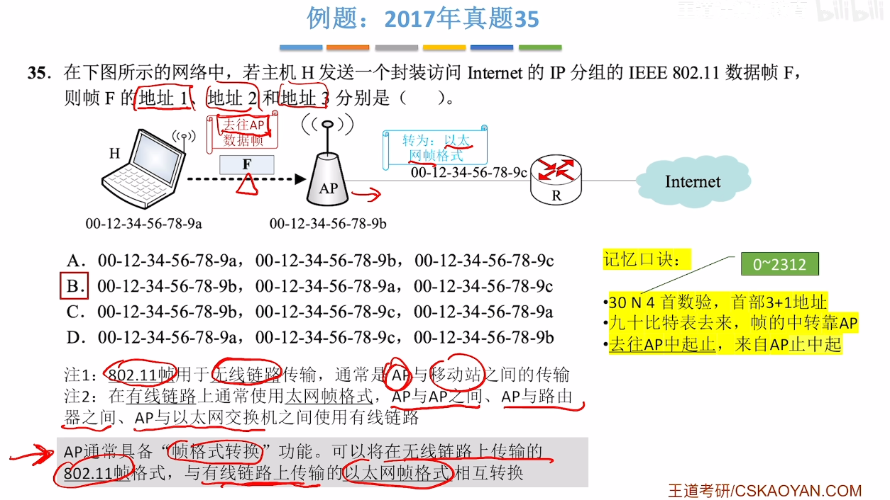

## 广域网

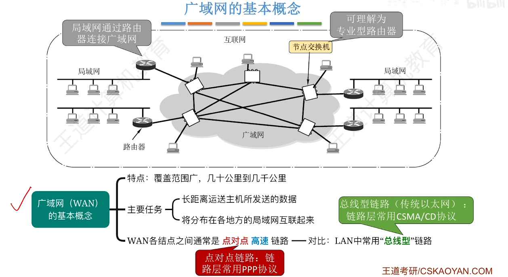

### PPP协议

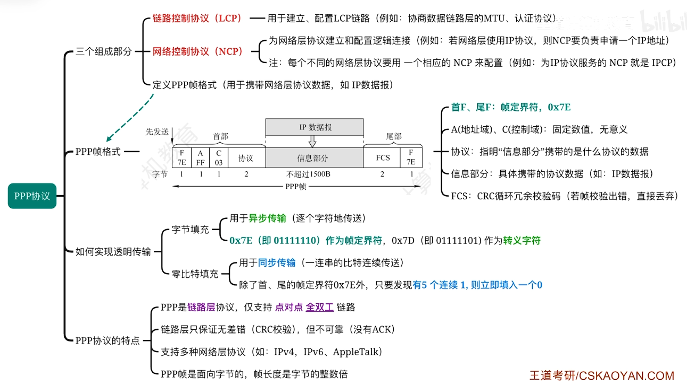

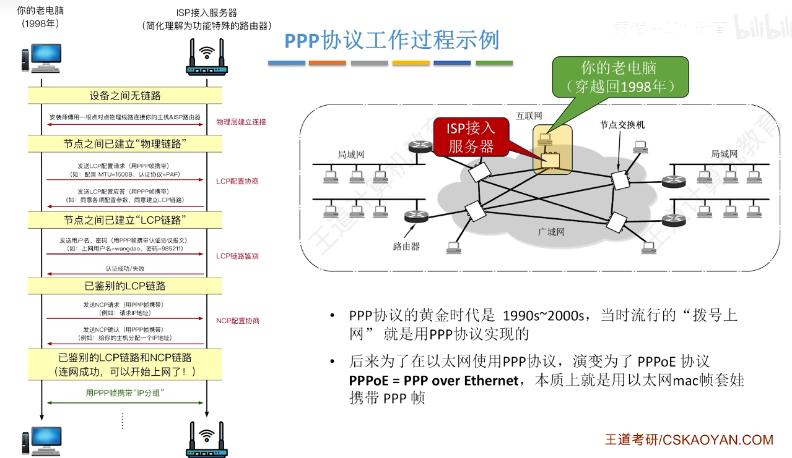

## 以太网交换机及其工作原理

交换机=多端口网桥

交换机工作在数据链路层，可以根据目的的MAC地址转发帧

交换机采用全双工通信，当与集线器连接采用半双工通信

### 自学习功能

交换表：记录MAC地址与端口号的对应关系

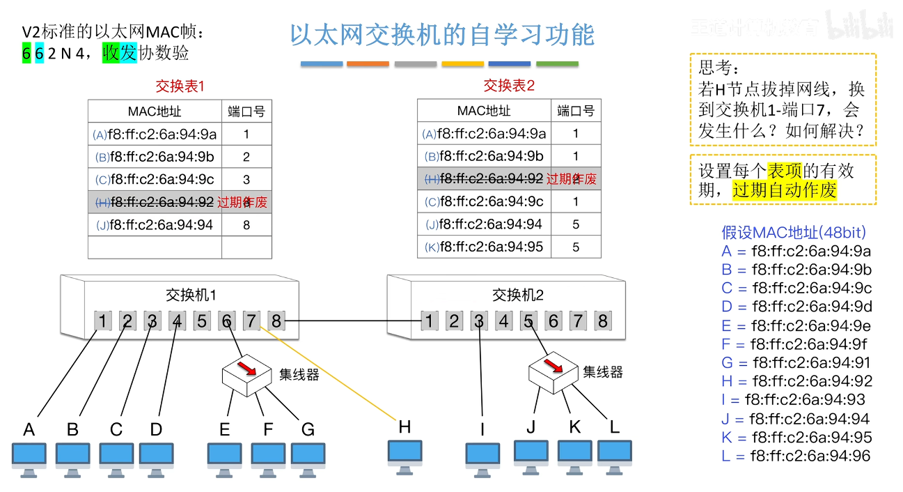

### 交换方式

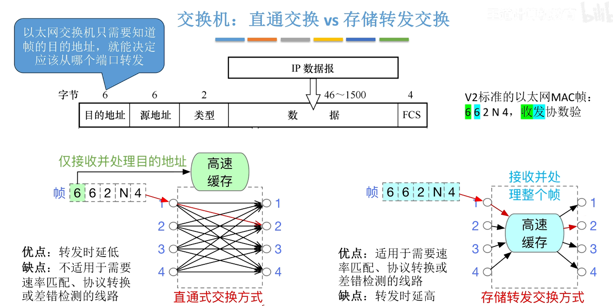

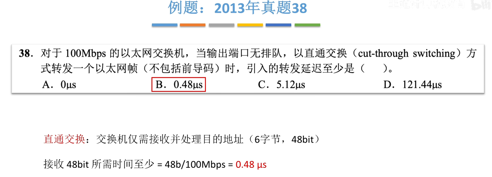
