## 通信基础基本概念

- 信源：信号的来源

- 信宿：信号的接收方

- 信道：信号的通道

    > 一条物理线路通常包含两条信道，即发送信道、接收信道

- 信号：数据的载体，若干bit的二进制码，可分为数字信号与模拟信号
- 码元：每一个信号就是一个码元，一共有几种类型的信号就有几种码元，如有四种情况，我需要两位二进制来表示这四种情况，一个码元大小为2bit

- 波特率：每秒传输几个码元，单位码元/秒，波特（Baud）
- 比特率：每秒传输几个比特，单位bit/s,b/s,bps

## 信道的极限容量

### 奈奎斯特定理

对于一个理想低通道（没有噪声、带宽有限的信道），极限波特率为两倍的信道频率带宽

### 香农定理

对于一个有噪声、带宽有限的信道，极限比特率=$Wlog_2(1+S/N)$

其中W为信道频率带宽，S/N为$信噪比=\frac{信号的功率}{噪声的功率}$，以分贝为单位的$信噪比=10log_{10}(S/N)$

## 编码和调制

变换器/编码器：将二进制数据转化为信号

反变换器/解码器：将信号转换为二进制数据

编码：二进制数据转化为数字信号

解码：数字信号转化为二进制数据

调制：二进制数据转化为模拟信号

解调：模拟信号转化为二进制数据

### 编码

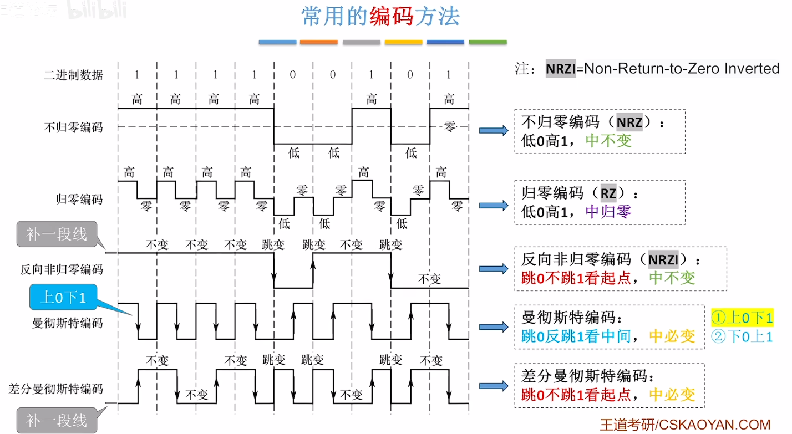

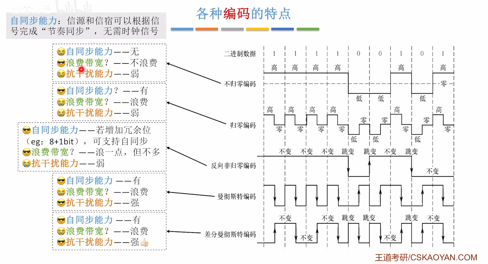

### 调制

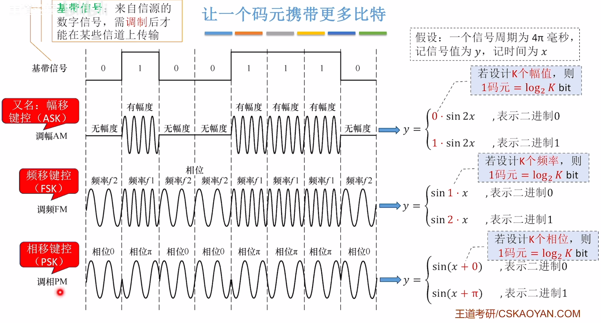

正交幅度调制（QAM）：将常用的调制方法组合，例如将调幅和调频组合，调幅有两种情况，调频有四种情况，一共就有八种情况。

QAM-16即最后调制出了16种信号

## 传输介质

### 有线传输

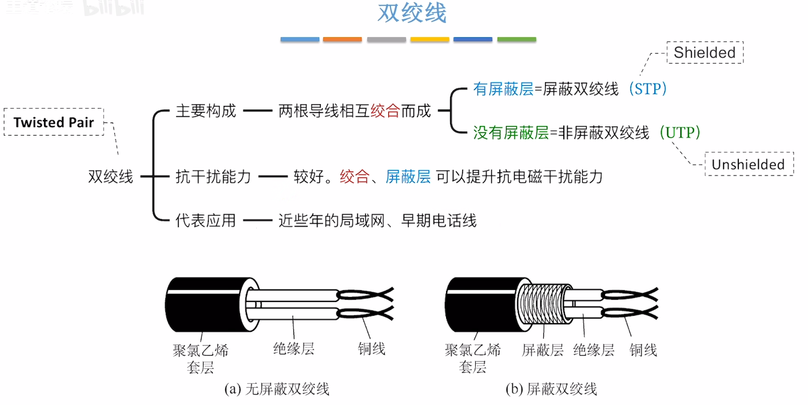

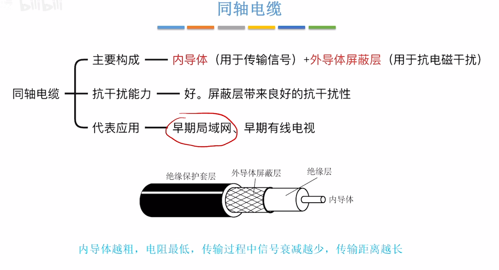

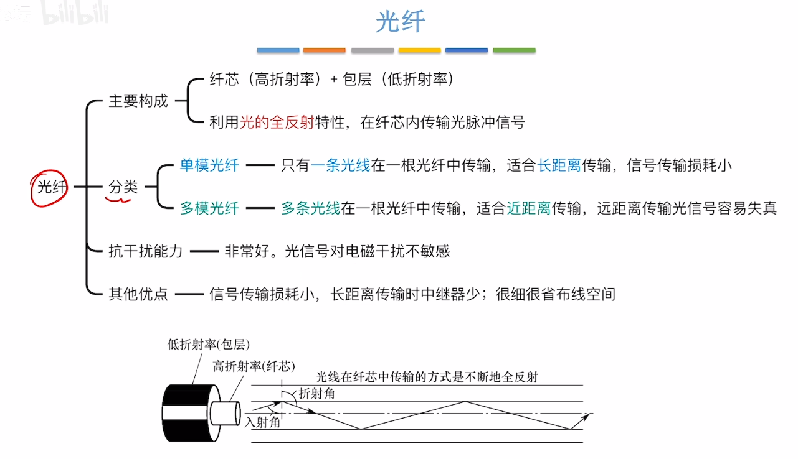

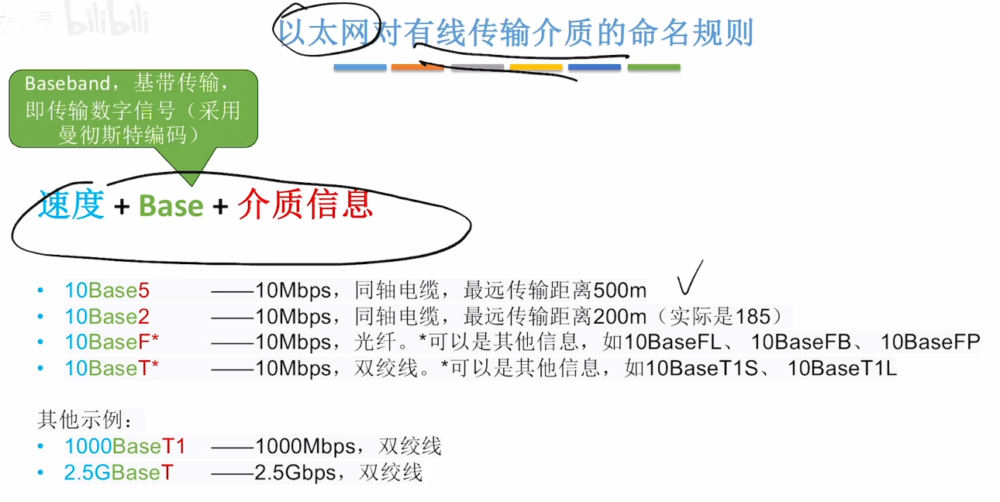

### 无线传输

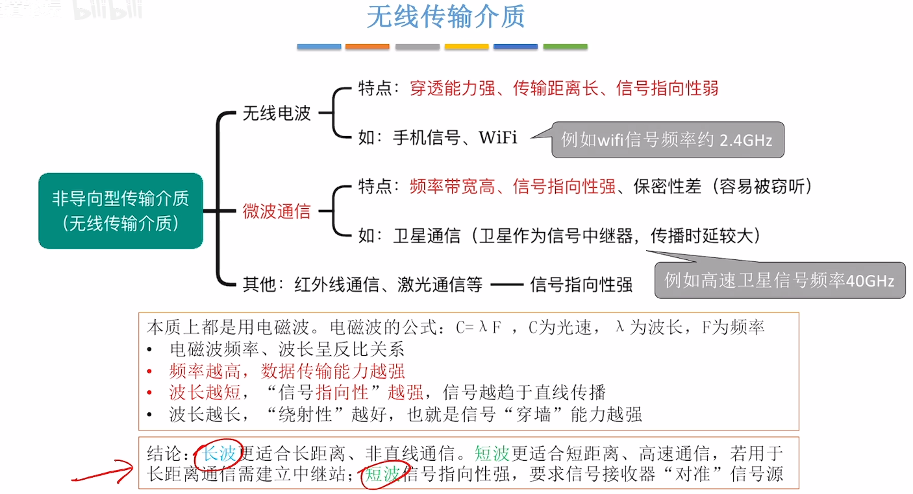

波长差异，**所有微波通信都是无线电波通信，但无线电波通信远不止微波通信**。

## 物理层设备

### 中继器

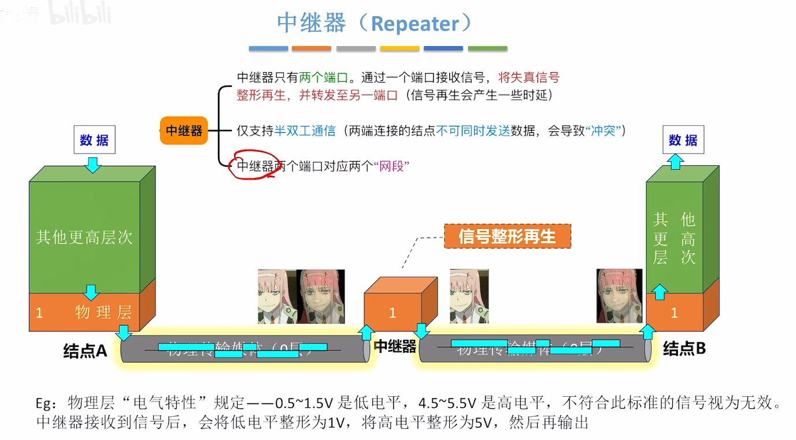

### 集线器

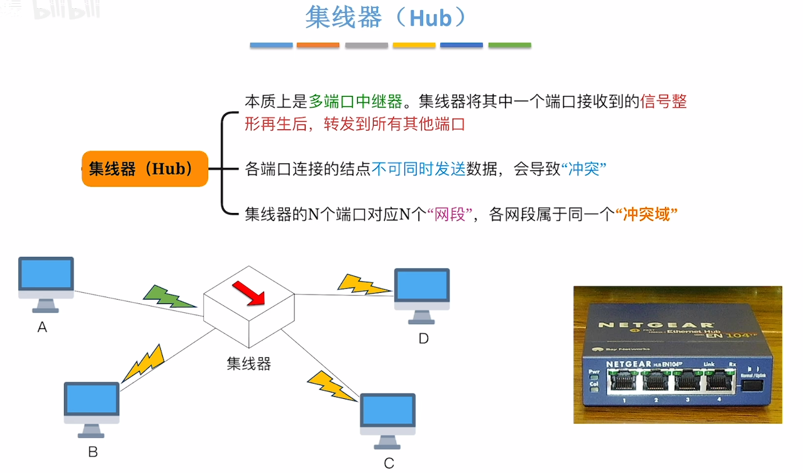

冲突域/碰撞域：两台主机同时发送数据会导致冲突，则这两台主机处于同一个冲突域，处于同一冲突域的主机在发送数据前需要进行信道争用

集线器不能隔离冲突域

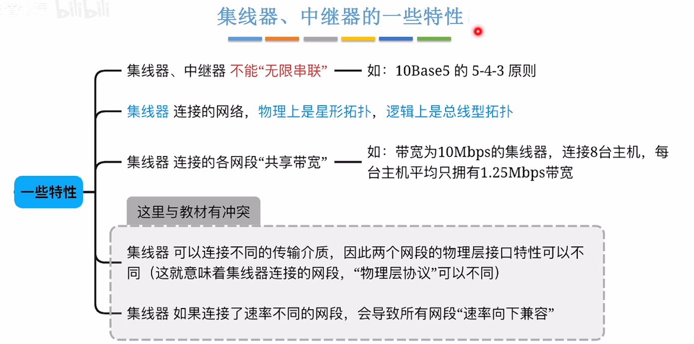

5-4-3：最多只能串联五个网段，使用四台集线器/中继器，只有三个网段可以挂接计算机