## 传输层概述

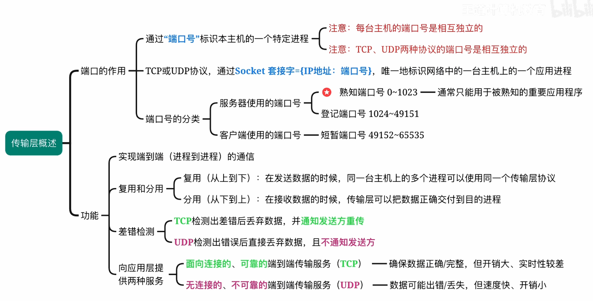

## UDP协议

小题×3

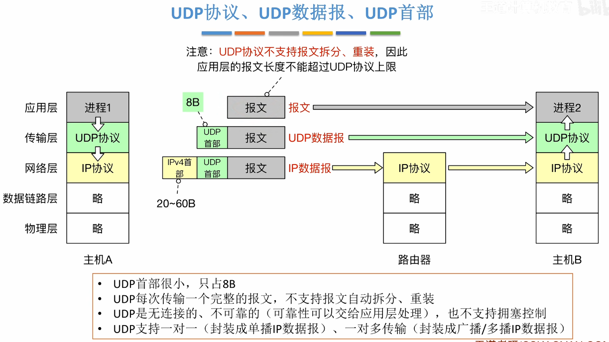

### UDP数据报

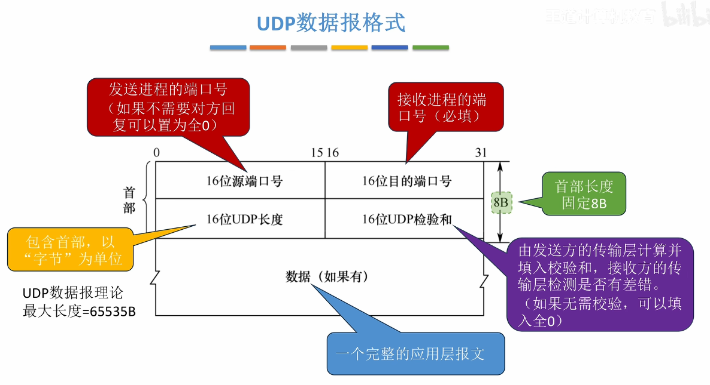

### UDP检验

差错检验方法

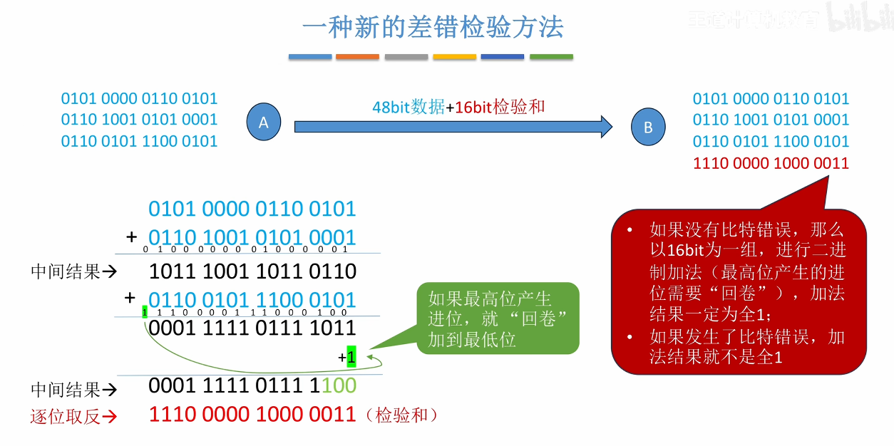

> 不回卷的话，在出现二次进位时候会出问题，例如0001->1001时，不回卷检测不出问题，回卷能够检测出问题

在生成和校验过程中需要添加伪首部来进行计算

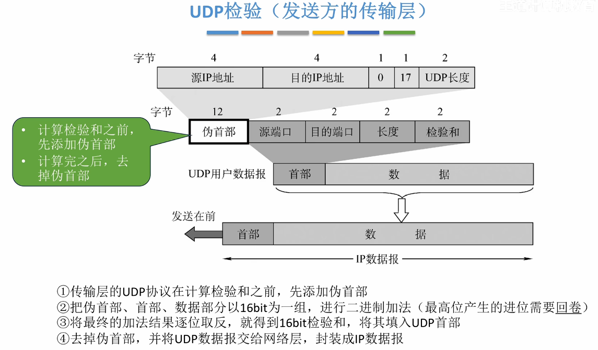

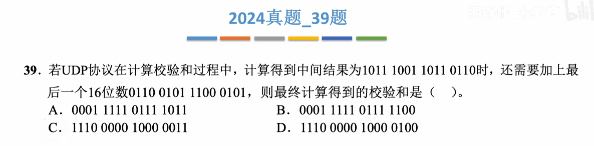

## TCP协议

小题×20，大题×2

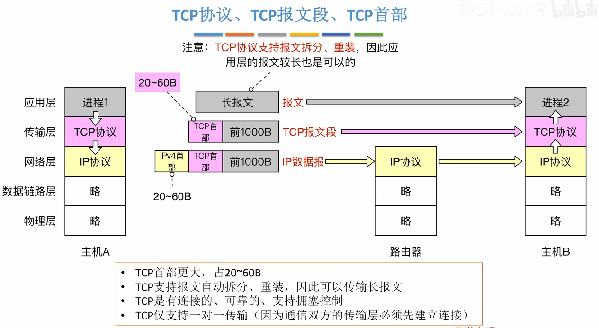

TCP协议三大阶段

- 建立连接（三次握手）
- 数据传输
- 释放连接（四次挥手）

建立一次TCP连接可以传输多个报文

MSS(Maximum Segment Size)：最大段长，一个TCP报文段能够携带的数据部分最大长度

### TCP段

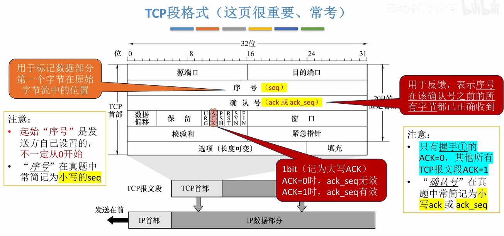

需要理解每个字段的作用

数据偏移：4bit，表示TCP首部长度，以4B为单位，因此TCP首部最长为60B

填充：凑足4B的整数倍

URG：1bit，为1时，紧急指针有效，表示这是紧急数据，应尽快插队发送

PSH：1bit，为1时，表示希望接收方尽快恢复（用于交互式通信）

RST：1bit，为1时，表示出现严重差错，必须释放连接，也可用于拒绝一个非法报文段

**SYN**：1bit，为1时，表示这是一个连接请求或连接接受报文

**FIN**：1bit，为1时，表明此报文段的发送方的数据已发送完毕，要求释放传输连接

> 只有握手1的ACK=0，其余都为1
>
> 握手1和握手2的SYN为1，其余SYN都为0
>
> 挥手1和挥手3的FIN为1，其余FIN都为0
>
> 若SYN=1，可称为SYN段
>
> 若FIN=1，可称为FIN段
>
> 若ACK=1，可称为ACK段
>

**窗口**：简写为rwnd或rcvwnd，16bit，表示接收窗口的大小。指目前数据接收缓冲区中还能接收多少字节的数据部分

校验和：原理与UDP相同，在计算校验和之前也需要添加12B伪首部

紧急指针：紧急数据专用序号，同理于上文的序号

### TCP连接管理

#### 建立连接过程

##### TCP首部数值变化

握手1，握手2不能携带数据，但是仍要消耗一个数据

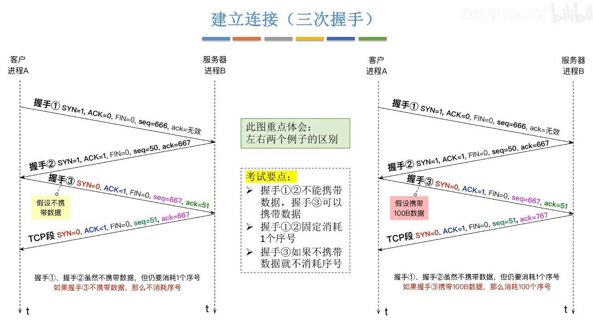

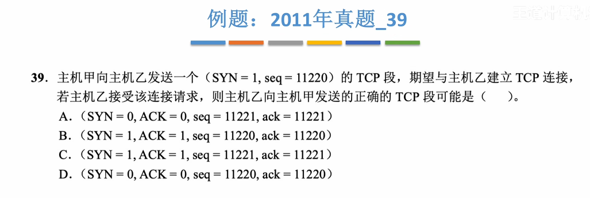

C

##### 进程状态转换

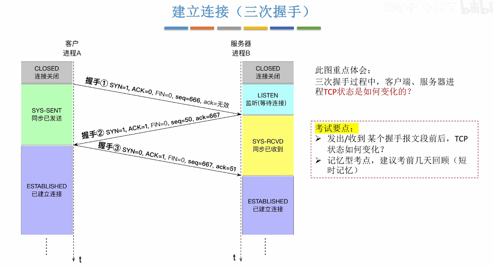

##### 耗时分析

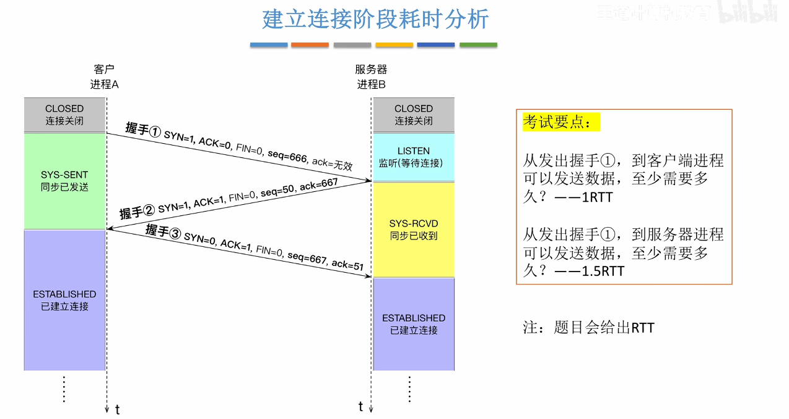

#### 释放连接过程

##### TCP首部数值变化

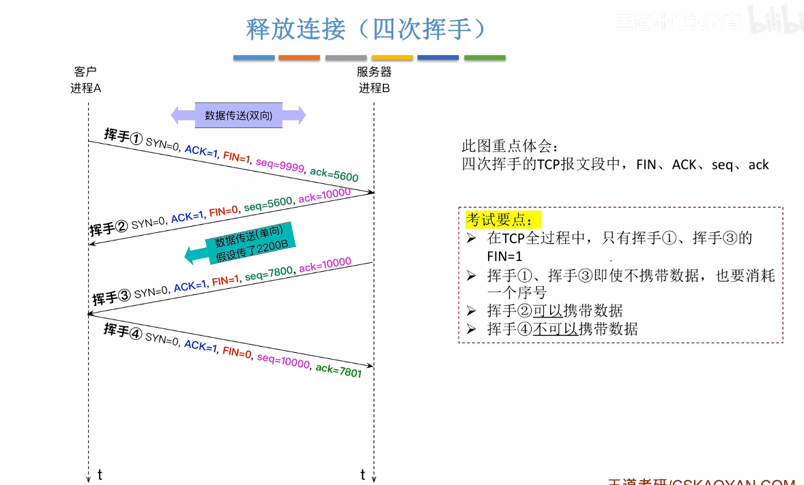

##### 进程状态转换

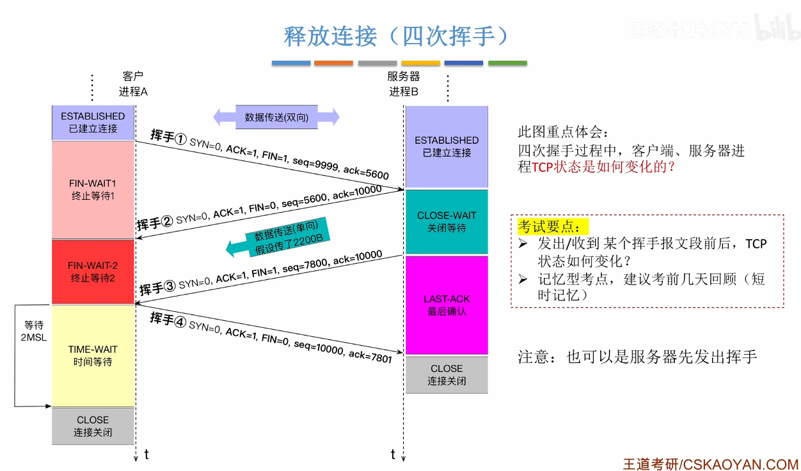

MSL(Maximum Segment Lifetime):最长报文段寿命，由TCP协议规定的一个固定时间长度

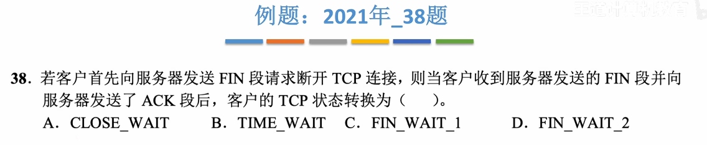

B

##### 耗时分析

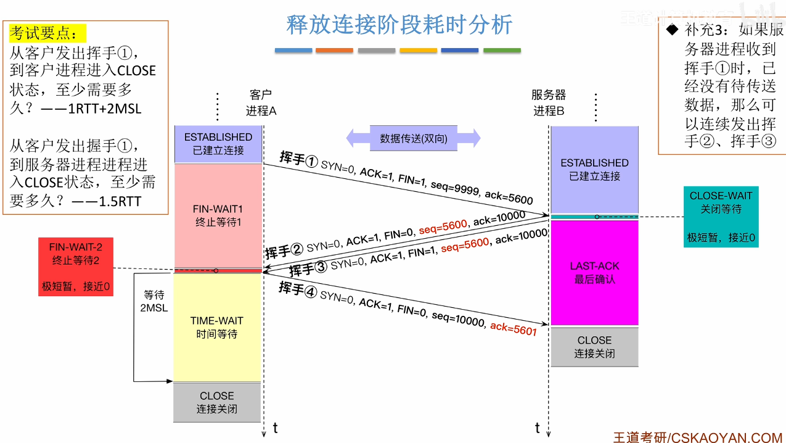

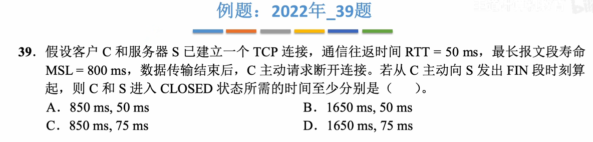

D

### TCP可靠传输

### TCP流量控制与拥塞控制