## 网络应用模型

### 客户/服务器模型 C/S模型

DNS、电子邮件、FTP、Web应用都是C/S模型

工作流程

- 服务器长期运行，等待客户发来请求
- 客户主动向服务器发出请求，客户必须提前知道服务器的地址
- 服务器被动处理客户请求，并将处理结果返回给客户

模型特点：

- 客户、服务器地位不平等，服务器处于中心
- 客户进程之间不直接通信

优点：便于集中管理数据资源、带宽资源等

缺点：

- 如果服务器损坏，影响全局
- 处于中心位置的服务器负载大，服务器性能决定了整个系统的性能

### P2P模型

BT种子下载

Peer to Peer,任意两台主机之间成为对等方(Peer)

模型特点：

- 是去中心化，主机之间地位平等
- 主机之间直接通信

优点：

- 单个节点损坏不影响全局
- 各节点可以分摊负载

缺点：

- 应该主机被服务的同时，也要为其他主机服务，主机负载较大
- 可能导致网络数据流量大，网络拥塞

## 域名系统DNS

将域名解析为IP地址

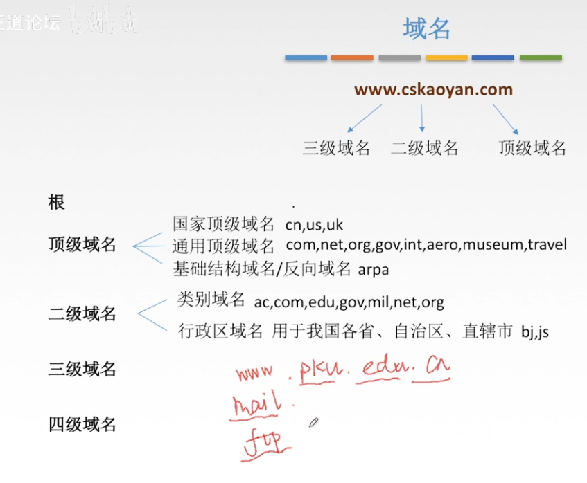

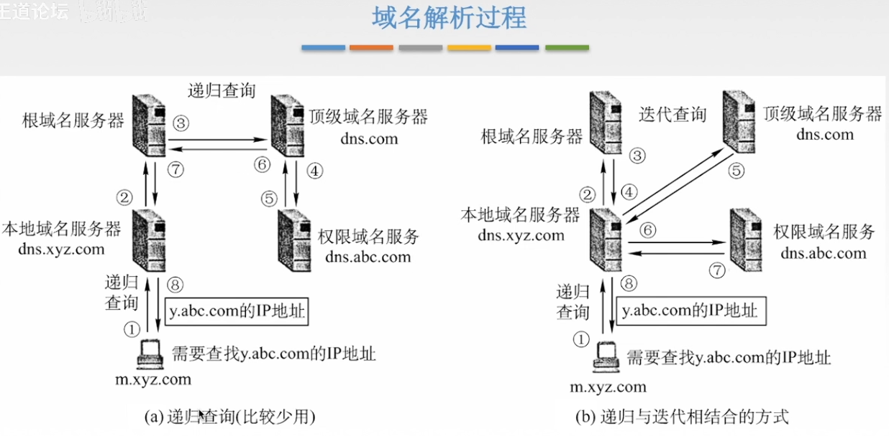

## 文件传输协议FTP

C/S模型

- 提供不同种类主机系统之间文件传输能力
- 以用户权限管理的方式提供用户对远程FTP服务器上的文件管理能力
- 以匿名FTP的方式提供公用文件共享的能力

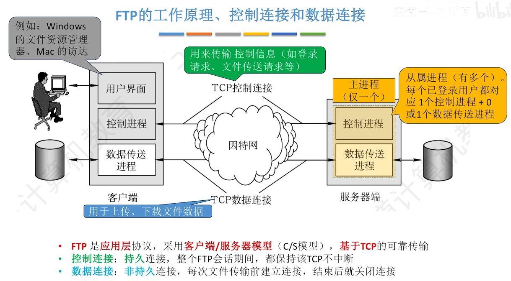

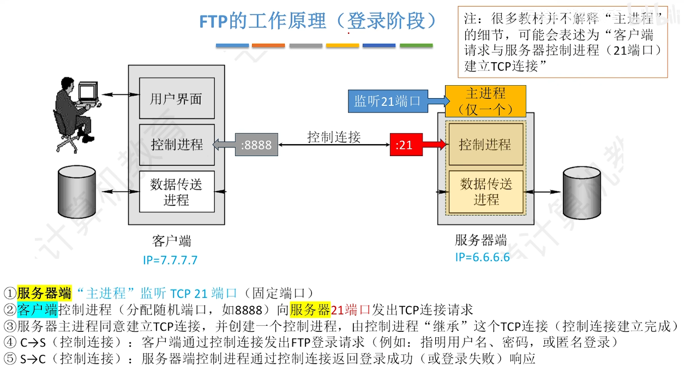

数据传送的模式：

- 主动模式PORT：服务器数据传送进程主动向客户端数据传送进程发起数据连接

> 服务器发给客户端

- 被动模式PASV：服务器数据传送进程被动等待客户端数据传送进程发起数据连接

>  客户端发给服务器

在数据传送前，客户端必须发送PORT或PASV命令来指定模式，没有强调默认采用主动模式

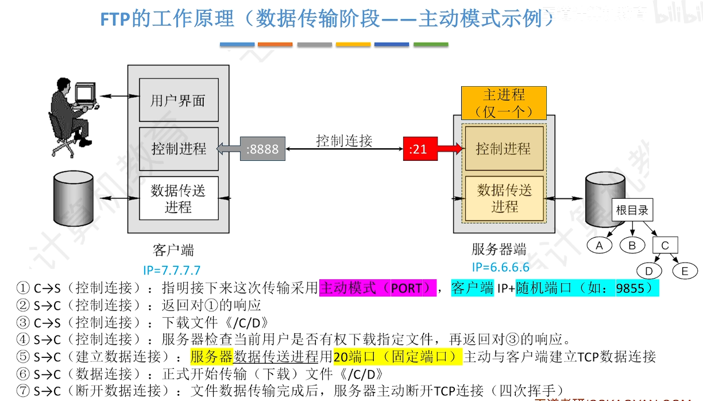

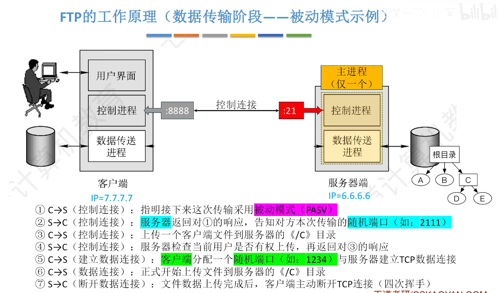

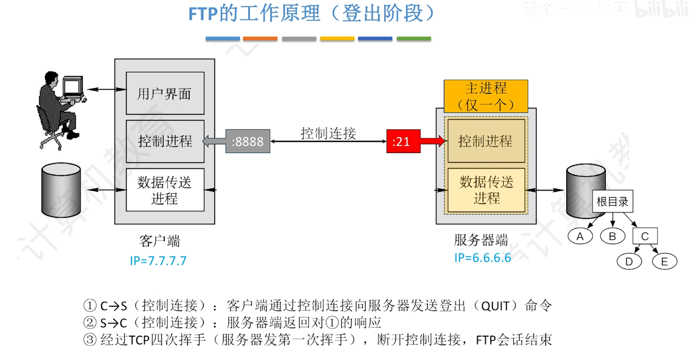

- FTP文件修改效率低，需整体下载再上传
- FTP分离控制与数据，控制信息是带外传输，控制命令不会因为数据传输而阻塞
- 客户端可通过控制连接，请求服务器返回文件列表(LIST命令),服务器传输文件列表信息是通过数据连接实现的
- RFC官方默认为主动模式，由于主动模式无法穿透NAT，因此在现实应用中更多默认采用被动模式

##  电子邮件

### 电子邮件系统的组成结构

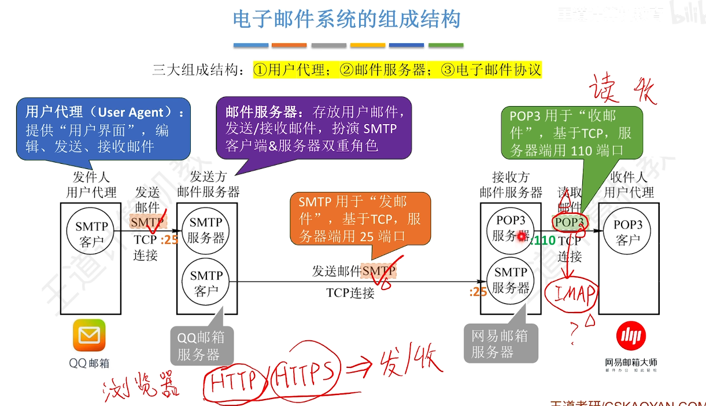

### 电子邮件格式

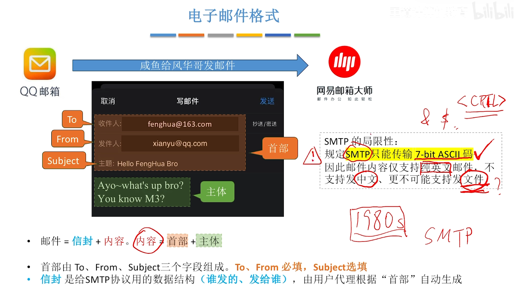

### MIME协议

MIME(Multipurpose Internet Mail Extensions):多用途因特网邮件扩展，只是格式规范，描述邮件内容长什么样，如何编码

主要包括：

- 定义了五个新的邮件首部字段
- 定义了许多邮件主体的格式
- 定义了传送编码

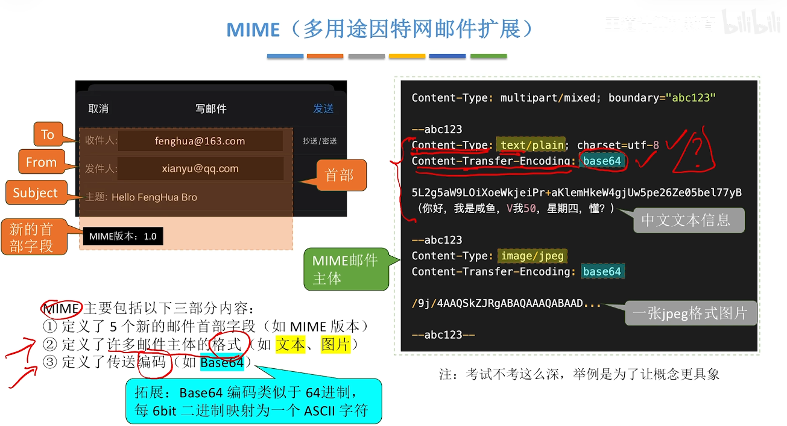

### SMTP与POP3

SMTP(Simple Mail Transfer Protocol):简单邮件协议，用于实现发邮件

POP3(Post Office Protocol v3):邮局协议，用于实现接受邮件

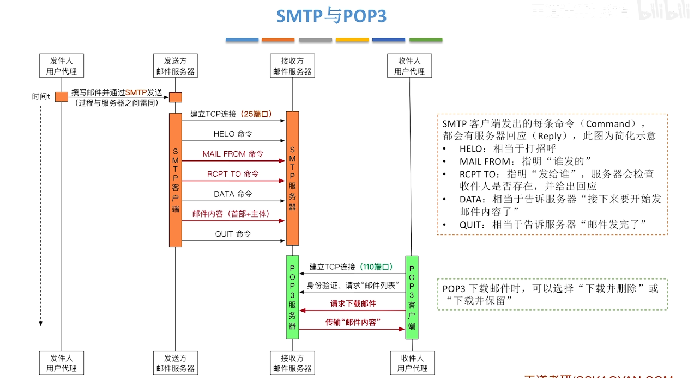

邮件缓存:用户发送的邮件，放入邮件缓存队列中，等待发送

## 万维网WWW

是一个全球范围的、分布式、联机式的信息存储空间，各种资源通过HTTP协议传送给用户

同一资源定位符(URL)：URL=<协议>://<主机>:<端口号>/<路径>

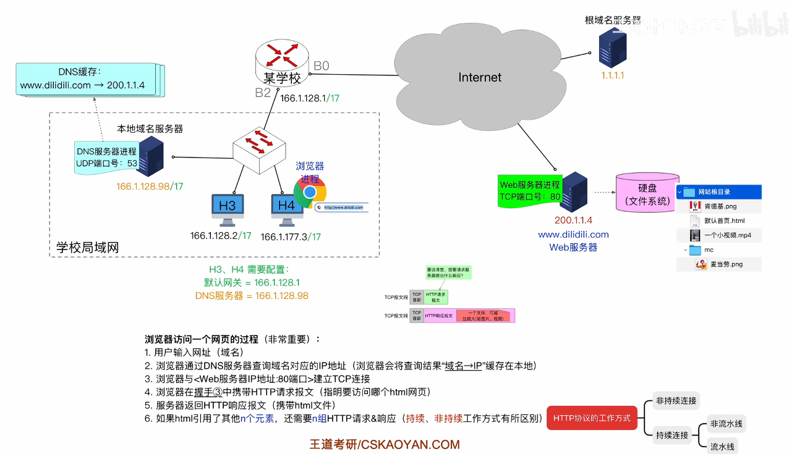

## 超文本传输协议HTTP

### HTTP协议工作方式

#### 非持续连接

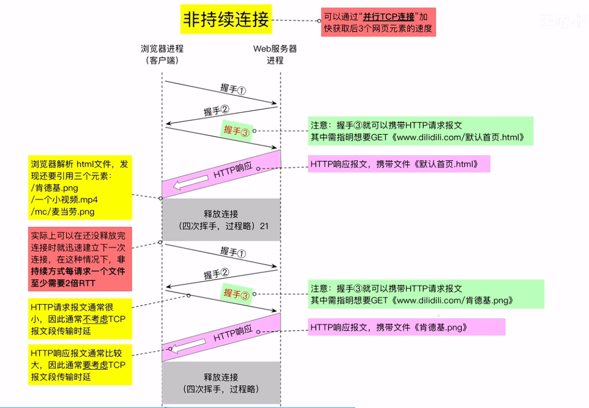

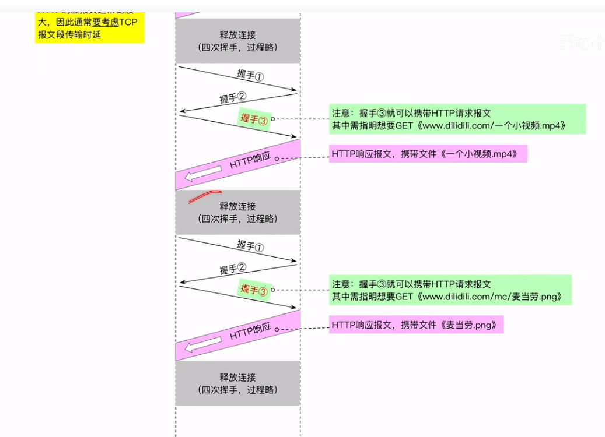

#### 持续连接 非流水线方式

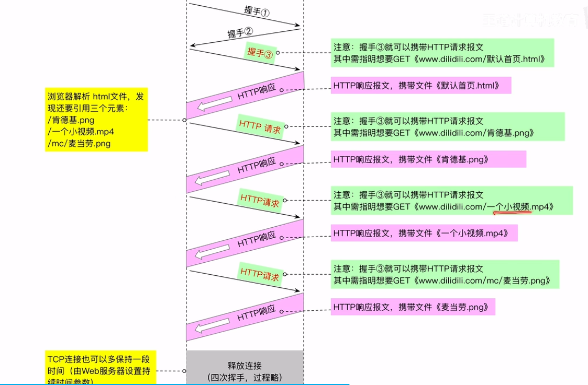

#### 持续连接 流水线方式

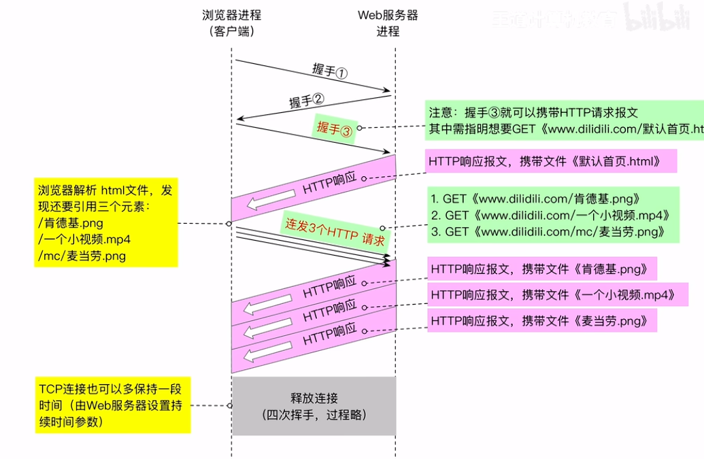

### HTTP报文格式

 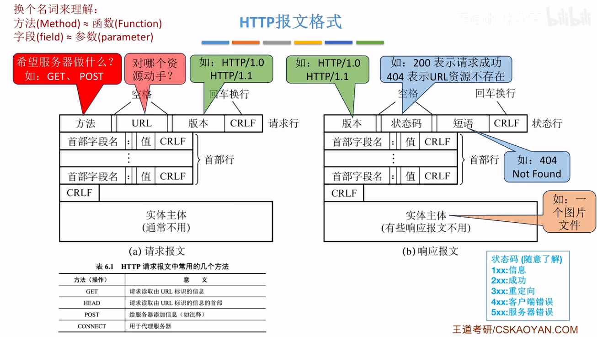

 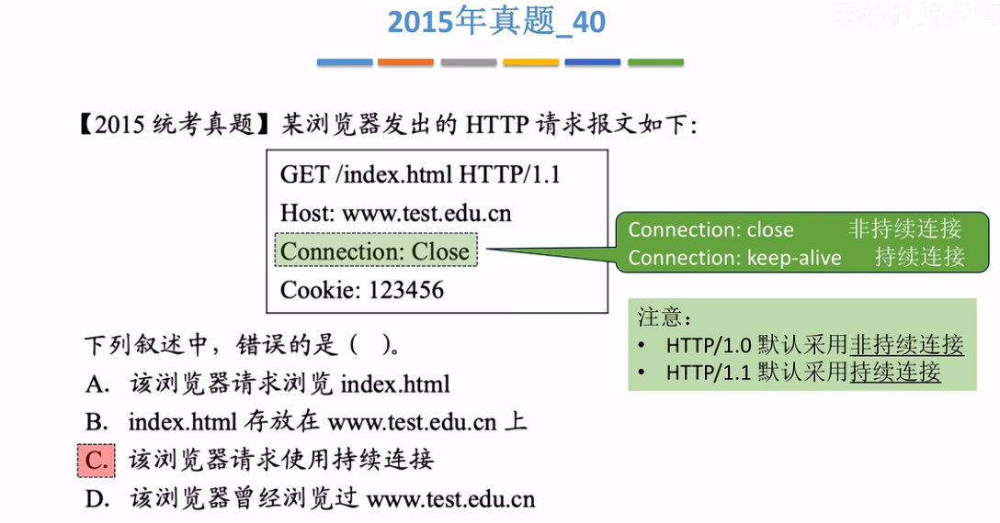
