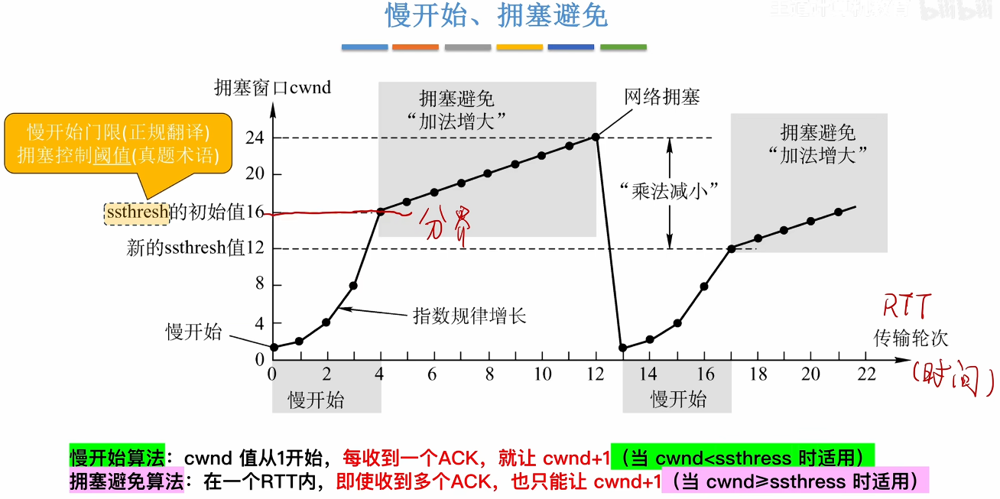

## 一、 综合分析题 I（共 1 题，16.0 分）

计算机网络主要是由一些通用的、可编程的硬件互连而成的，这些可编程的硬件能够用来传送多种不同类型的数据，并能支持广泛的和日益增长的应用。计算机网络有多种类别，适用于不同的场景，根据使用目的不同，需要对网络性能指标进行评价。网络通信的基础是数据通信，任何实际的信道都不是理想的，都不可能以任意高的速率进行传送，码元传输的速率越高，或信号传输的距离越远，或噪声干扰越大，或传输媒体质量越差，在接收端的波形的失真就越严重。因此，奈氏准则激励工程人员不断探索更加先进的编码技术，香农公式告诫工程人员，在实际有噪声的信道上，不论采用多么复杂的编码技术，都不可能突破信息传输速率的绝对极限。
现就网络的基础理论知识进行讨论，对网络设计中的各因素作出合理判断，共计16分。

**(1) (单选题 2分)** 按照网络的作用范围进行分类，（ ）会局限在较小的范围（如 1 公里左右），通常采用高速通信线路。
A. 广域网 WAN
B. 城域网 MAN
C. 个人区域网 PAN
D. 局域网 LAN
> **答案：D**  
> **解析：** 局域网（LAN）地理范围较小（1公里左右），常采用高速通信线路。

**(2) (单选题 2分)** 作为网络性能评价之一，（ ）指的是数据的传送速率，也称为数据率 (data rate) 或比特率 (bit rate)。
A. 速率
B. 时延
C. 吞吐量
D. 带宽
> **答案：A**  
> **解析：** 速率即比特率，是网络性能中最基本的指标之一。

**(3) (判断题 2分)** 码元传输的速率越高，或信号传输的距离越远，或传输媒体质量越差，在信道的输出端的波形的失真就越严重。
A. 对
B. 错
> **答案：A**  
> **解析：** 根据奈氏准则和实际信道特性，上述因素都会加剧波形失真。

**(4) (填空题 2分)** 当 S/N = 1000 时，信噪比为（1）______ dB。
> **答案：30**  
> **解析：** 信噪比(dB) = 10 × log₁₀(S/N) = 10 × log₁₀(1000) = 10 × 3 = 30 dB。

**(5) (计算题 8分)** 分析计算题：共有四个站进行 CDMA 通信，四个站的码片序列为 A站（-1 -1 -1 +1 +1 -1 +1 +1）、B站（-1 -1 +1 -1 +1 +1 +1 -1）、C站（-1 +1 -1 +1 +1 +1 -1 -1）、D站（-1 +1 -1 -1 -1 -1 +1 -1），现收到这样的码片序列：（-1 +1 -3 +1 -1 -3 +1 +1）。试问哪个站发送了数据？发送了数据的站发送的是 1 还是 0？
> **答案：**  
> 收到序列 S = (-1, +1, -3, +1, -1, -3, +1, +1)。  
> **计算内积（对应位相乘求和，再除以8）：**  
> - A·S = [(-1)×(-1)+(-1)×(+1)+(-1)×(-3)+(+1)×(+1)+(+1)×(-1)+(-1)×(-3)+(+1)×(+1)+(+1)×(+1)] = 1 -1 +3 +1 -1 +3 +1 +1 = 8 → 8/8 = 1 → 发送了 **1**。  
> - B·S = [(-1)×(-1)+(-1)×(+1)+(+1)×(-3)+(-1)×(+1)+(+1)×(-1)+(+1)×(-3)+(+1)×(+1)+(-1)×(+1)] = 1 -1 -3 -1 -1 -3 +1 -1 = -8 → -8/8 = -1 → 发送了 **0**。  
> - C·S = [(-1)×(-1)+(+1)×(+1)+(-1)×(-3)+(+1)×(+1)+(+1)×(-1)+(+1)×(-3)+(-1)×(+1)+(-1)×(+1)] = 1 +1 +3 +1 -1 -3 -1 -1 = 0 → 0/8 = 0 → **未发送**。  
> - D·S = [(-1)×(-1)+(+1)×(+1)+(-1)×(-3)+(-1)×(+1)+(-1)×(-1)+(-1)×(-3)+(+1)×(+1)+(-1)×(+1)] = 1 +1 +3 -1 +1 +3 +1 -1 = 8 → 8/8 = 1 → 发送了 **1**。  
> **结论：** A站发送1，B站发送0，C站未发送，D站发送1。

---

## 二、 综合分析题 III（共 1 题，26.0 分）

网络层提供的两种服务：虚电路服务和数据报服务，而互联网采用的设计思路：网络层要设计得尽量简单，向其上层只提供简单灵活的、无连接的、尽最大努力交付的数据报服务。为了实现网络互连、互通时需要解决许多问题，实现异构网络的互连互通方法，覆盖全球的 IP 网的上层使用 TCP 协议，那么就是现在的互联网 (Internet)。当互联网上的主机进行通信时，就好像在一个网络上通信一样，看不见互连的各具体的网络异构细节。试对网络层的概念进行理解选择及应用分析，共计26分。

**(1) (判断题 2分)** 链路一般用来表示向某一个方向传送信息的媒体。
A. 对
B. 错
> **答案：B**  
> **解析：** 链路是一条无源的点到点的物理线路段，中间没有任何交换结点，并不特指“某一个方向”。

**(2) (判断题 2分)** 数据报服务的每个分组按顺序进行转发。
A. 对
B. 错
> **答案：B**  
> **解析：** 数据报服务中，各分组独立选择路由，不保证按序到达。

**(3) (单选题 2分)** 为了在不同层次进行网络的连接，可以使用中间设备，物理层使用（ ）进行互连。
A. 路由器
B. 交换机
C. 网关
D. 转发器
> **答案：D**  
> **解析：** 物理层互连使用转发器（中继器）。

**(4) (单选题 2分)** （ ）不是数据报服务。
A. 每个分组都有终点的完整地址
B. 连接的建立必须有
C. 到达终点时不一定按发送顺序
D. 可靠通信应当由用户主机来保证
> **答案：B**  
> **解析：** “连接的建立必须有”是虚电路服务的特点，数据报服务是无连接的。

**(5) (填空题 6分)** 子网掩码共（1）______ 位，若 /20，则网络有（2）______ 个连续的1，IP地址 10.1.123.123 是一个（3）______ 类地址。
> **答案：** （1）**32** （2）**20** （3）**A**  
> **解析：** 子网掩码长度为32位；/20表示前20位为1；10.0.0.0～10.255.255.255为A类地址范围。

**(6) (判断题 2分)** IPV6能有效增加IP地址。（ ）
A. 对
B. 错
> **答案：A**  
> **解析：** IPv6地址长度为128位，地址空间远大于IPv4。

**(7) (计算题 10分)** 计算分析题：已知地址块中的一个地址是 136.23.12.64/26。试求：
（1）地址掩码是什么？【2分】
（2）这个地址块中的最大地址和最小地址是什么？【4分】
（3）相当于多少个C类地址？【4分】
> **答案：**  
> （1）**地址掩码：255.255.255.192**（/26表示前26位为1，后6位为0）  
> （2）最小地址：**136.23.12.65**；最大地址：**136.23.12.126**  
>    - 网络号：136.23.12.64（最后8位64=01000000，前2位是网络位）  
>    - 广播地址：主机位全1 → 01000000 → 01111111 = 127 → 136.23.12.127  
>    - 可用主机范围：网络号+1 到 广播地址-1  
> （3）**0.25个**（或1/4个）C类地址  
>    - /26地址块包含2^(32-26)=64个地址，C类地址（/24）有256个地址，64/256=1/4。

---

## 三、 综合分析题 IV（共 1 题，22.0 分）

互联网采用自适应的（即动态的）、分布式路由选择协议，把整个互联网划分为许多较小的自治系统 AS，采用分层次的路由选择协议，主要分成 2 大类路由选择协议：IGP 和 EGP，综合分析试选择合适的协议对路由表进行更新。某网络结构如下图所示，如果 Router3 与网络4之间的线路突然中断，按照 RIP 路由协议的实现方法，路由表的更新时间间隔为 30 秒，中断 30 秒后 Router2 的路由信息表 1 和中断 500 秒后 Router2 的路由信息表 2 如下。

注：①若到达目的网络不需转发或目的网络不可达，用“－”来表示“下一站地址”；②当目的网络不可达时，“跳数”为 16。现对实际情况中，路由器中的协议选择及路由表更新进行判断分析及计算处理，共计22分。

**(1) (简答题 2分)** 简答题：RIP和OSPF的特点。
> **答案：**  
> - **RIP**：基于距离向量算法，以跳数作为度量（最大15，16表示不可达），每30秒广播整个路由表，收敛慢，适合小型网络。  
> - **OSPF**：基于链路状态算法，以带宽作为度量，只在链路状态变化时泛洪更新（LSA），收敛快，支持层次化分区，适合大型网络。

**(2) (填空题 8分)** 填充中断30秒后 Router2 的路由信息表 1。

**表1 Router2 路由信息表 1**

| 目的网络 | 下一站地址 | 跳数 |
| --- | --- | --- |
| 10.0.0.0 | （1）______ | （2）______ |
| 20.0.0.0 | － | 0 |
| 30.0.0.0 | － | 0 |
| 40.0.0.0 | （3）______ | （4）______ |

> **答案：** （1）20.0.0.1 （2）1 （3）20.0.0.1 （4）16  
> **解析：** 中断30秒后，Router3发现网络4不可达，将其跳数设为16并通告给Router2。Router2到10.0.0.0仍经过Router1，跳数1。到40.0.0.0下一跳为Router3，但跳数16表示不可达。

**(3) (填空题 12分)** 填充中断500秒后 Router2 的路由信息表 2。

**表2 Router2 路由信息表 2**

| 目的网络 | 下一站地址 | 跳数 |
| --- | --- | --- |
| 10.0.0.0 | 20.0.0.1 | 1 |
| 20.0.0.0 | （1）______ | （2）______ |
| 30.0.0.0 | （3）______ | （4）______ |
| 40.0.0.0 | （5）______ | （6）______ |

> **答案：** （1）**－** （2）**0** （3）**－** （4）**0** （5）**－** （6）**16**  
> **解析：** 500秒远超RIP的180秒无效计时器和120秒垃圾收集计时器。Router2会删除到网络40.0.0.0的路由（此处按题意仍表示为不可达，跳数16）。到直连网络20.0.0.0和30.0.0.0下一站为“－”，跳数为0。到10.0.0.0保持不变。

---

## 四、 综合分析题 V（共 1 题，16.0 分）

运输层作为面向通信部分的最高层，向高层用户屏蔽了下面网络核心的细节（如网络拓扑、所采用的路由选择协议等），使应用进程看见的就是好像在两个运输层实体之间有一条端到端的逻辑通信信道。运输层的两个主要协议：UDP 和 TCP，对应于不同的应用层协议，为相互通信的应用进程提供逻辑通信。IP 网络提供的是不可靠的传输，传输层必须使用一些可靠传输协议，在不可靠的传输信道实现可靠传输。试对运输层的协议特点进行理解判断，选择及应用分析，共计16分。

**(1) (单选题 2分)** （ ）是 UDP 的特点。
A. 提供可靠服务
B. 支持点对点单播，不支持多播、广播
C. 面向连接的协议，提供面向连接服务
D. 简单，适用于很多应用，如：多媒体应用等
> **答案：D**  
> **解析：** UDP无连接、不可靠，但简单高效，适合实时多媒体应用。

**(2) (判断题 2分)** WWW 使用 TCP 通信。
A. 对
B. 错
> **答案：A**  
> **解析：** HTTP协议基于TCP，提供可靠传输。

**(3) (分析计算题 12分)** 综合分析题：
（1）指明 TCP 工作在慢开始阶段的时间间隔。
（2）指明 TCP 工作在拥塞避免阶段的时间间隔。
（3）试计算每一次的新的加权平均往返时间值 RTT。

$$
新的RTT_S = (1-\alpha) × 旧RTT_S + \alpha × 新RTT样本
$$
$$
新的RTT_{D}=(1-\beta) × 旧RTT_D + \beta × |RTT_{s}-新的RTT样本|
$$
$$
RTO=RTT_{S}+4×RTT_{D}
$$
$RTO$超时重传时间
$RTT_{s}$加权平均往返时间
$RTT_{D}$为$RTT$的偏差的加权平均值

---

## 五、 综合分析题 II（共 1 题，20.0 分）

数据链路层属于计算机网络的低层，主要使用的信道有点对点信道和广播信道，该层协议有许多种，但有三个基本问题是共同的，这三个问题是：封装成帧、透明传输、差错控制，现对这三个问题的理论知识及技术问题进行识记、分析及计算，共计20分。

**(1) (单选题 2分)** （ ）是在一段数据的前后分别添加首部和尾部，构成一个帧。
A. 差错控制
B. 透明传输
C. 可靠传输
D. 封装成帧
> **答案：D**  
> **解析：** 封装成帧就是添加首尾定界符，构成帧。

**(2) (判断题 2分)** 帧的定界符用于确定帧的定界。
A. 对
B. 错
> **答案：A**  
> **解析：** 定界符如HDLC的01111110，用于标识帧的开始和结束。

**(3) (填空题 4分)** PPP协议使用同步传输技术传送比特串 011111100，经过零比特填充后变成比特串为（ ）。01111110 0111110100 01111110
> **答案：0111110100**  
> **解析：** 零比特填充规则：每遇到连续5个1，就在其后插入一个0。原串：011111100 → 扫描：011111 后跟1个0？原串是“011111100”，其中第2-6位是11111，其后是1？实际原串为：0 11111 100？重新计算：原始比特：0,1,1,1,1,1,1,0,0。从第一个1开始，到第5个1（位置2~6）后跟一个1（位置7），所以应在第6个1后插入0 → 得到 0,1,1,1,1,1,0,1,0,0 → 0111110100。

**(4) (单选题 2分)** n 位冗余码是由（ ）位 0 添加在 M（k位）后通过二进制除法运算求得。
A. n+k
B. n+1
C. k
D. n
> **答案：D**  
> **解析：** 冗余码（FCS）的位数等于生成多项式最高次幂n，需在原数据后添加n个0进行计算。

**(5) (计算题 10分)** 分析计算题：要发送的数据 M 为 101001，收发双方商定除数为 1101，应用 CRC 计算冗余码及发送的帧数据。

$$
\begin{align}
	110101 \\
	\sqrt[1101]{101001000} \\
	\underline{1101\phantom{00000}} \\
	1110\phantom{0000} \\
	\underline{1101\phantom{0000}} \\
	1110\phantom{00} \\
	\underline{1101\phantom{00}} \\
	1100 \\
	\underline{1101} \\
	001
\end{align}
$$
对应的CRC码即发送的数据为101001001，冗余码为001
