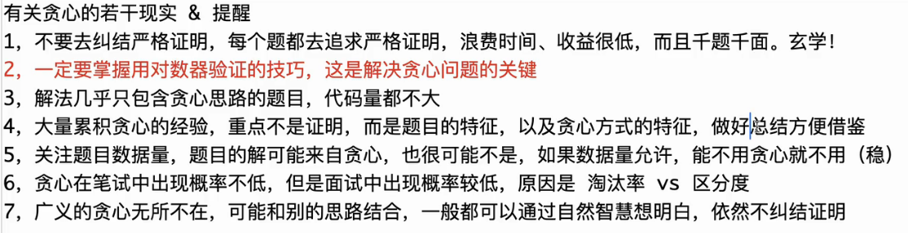

寻找贪心策略使得局部最优等于全局最优，使用对数器来与暴力方法做对比

## 题目

### 最大数

&nbsp;&nbsp;&nbsp;&nbsp;给定一组非负整数/字符串数组`nums`,重新排列每个数的顺序（每个数不可拆分），使之组成最小的整数/字符串

判断排列：若$ab<ba$,则$a$在前,$b$在后

> 当为字符串"b","ba"时，"b"小于"ba",但实际拼接时是"bab"小于"bba"

#### 暴力策略

```java
public static String way1(String[] strs){
    ArrayList<String> ans = new ArrayList<>();
    f(strs, 0, ans);
    ans.sort((a.b) -> a.compareTo(b));
    return ans.get(0);
}

public static void f(String[] strs, int i, ArrayList<String> ans){
    if (i == strs.length){
        StringBuilder path = new StringBuilder();
        for (String str : ans){
            path.append(str);
        }
    }
    else {
        for (int j = i; j < strs.length; j++){
            swap(strs, i, j);
            f(strs, i + 1, ans);
            swap(strs, i, j);
        }
    }
}
```

#### 贪心策略

```java
public static void way2(String[] args) {
    Arrays.sort(strs, (a, b) -> (a+b).compareTo(b+a));
    StringBuilder path = new StringBuilder();
    for (String str : strs) {
        path.append(str);
    }
    return path.toString();
}
```

#### 对数器

```java
public static generateRandomStringArray(int n, int m, int v) {
    String[] arr = new String[(int) (Math.random() * n) + 1];
    for (int i = 0; i < arr.length; i++) {
        arr[i] = generateRandomString(m, v);
    }
    return arr;
}

public static String generateRandomString(int m, int v) {
    char[] str = new char[(int) (Math.random() * m) + 1];
    for (int i = 0; i < str.length; i++) {
        str[i] = (char) ((int) (Math.random() * v) + 'a');
    }
    return String.valueOf(str);
}

public static void main(String[] args) {
    int n=8, m=4,v=4;//字符串个数，字符串长度，字符种类
    int testTime = 5000;
    System.out.println("test begin");
    for (int i = 0; i < testTime; i++) {
        String[] arr = generateRandomStringArray(n, m, v);
        String ans1 = way1(arr);
        String ans2 = way2(arr);
        if (!ans1.equals(ans2)) {
            System.out.println("error");
            System.out.println(Arrays.toString(arr));
        }
        if (i % 100 == 0) {
            System.out.println("test process: " + i + " / " + testTime);
        }
    }
    System.out.println("test finish");
}

```

