## 课本

### ==软件危机==

什么是软件危机

&nbsp;&nbsp;&nbsp;&nbsp;软件危机是指人们在开发软件和维护软件过程中遇到的一系列问题

软件危机产生的原因
1. 忽视软件开发前期的需求分析
2. 开发过程缺乏统一的、规范化的方法论的指导
3. 文档资料不齐全或不准确 
4. 忽视与用户之间、开发组成员之间的交流 
5. 忽视测试的重要性 
6. 不重视维护或由于上述原因造成维护工作的困难
7. 从事软件开发的专业人员对这个产业认识不充分，缺乏经验 
8. 没有完善的质量保证体系 

软件危机的表现
1. 开发成本和进度估计不准
2. 用户对已交付软件不满意
3. 软件产品质量靠不住
4. 软件可维护性差
5. 软件没有适当的文档资料
6. 软件成本与总成本的比例逐年上升
7. 软件开发生成律提高的速度落后于计算机应用迅速普及的速度

对于软件危机有哪些应对措施
&nbsp;&nbsp;&nbsp;&nbsp;组织管理：工程项目管理
&nbsp;&nbsp;&nbsp;&nbsp;技术措施：软件开发技术与方法  软件工具

### 软件生命周期的主要步骤，不同阶段的任务

主要步骤：
1. 问题定义 Problem definition 
2. 可行性研究 Feasibility study
3. 需求分析 Requirements analysis  
4. 整体设计 Overall design
5. 详细设计 Detailed design 
6. 编码和单元测试 Coding and unit testing
7. 综合测试 Comprehensive test  
8. 软件维护Software maintenance

不同阶段的任务：
1. 问题定义和可行性研究：与用户沟通，研究系统的可行性和可能的解决方案，并确定要开发的系统的总体目标和范围。
2. 需求分析：可行性研究后，对收集到的用户需求进行分析、整理和提炼，建立完整的需求分析模型，编写软件需求规范。
3. 软件设计：根据需求规范，确定软件架构，进一步设计各个系统组件的实现算法、数据结构和接口。
4. 软件构建：它是将软件设计转换为程序代码的过程。这是一个复杂的迭代过程，需要根据设计模型进行程序设计，并提供源码和测试代码。
5. 软件测试：检查和验证开发的系统是否满足客户期望，包括单元测试、子系统测试、集成测试、验收测试和其他活动。
6. 软件维护：系统投入使用后，将进行改进以适应不断变化的需求。完全从零开始开发的系统很少，将软件系统的开发和维护视为一个持续的过程更有意义。
7. 软件项目管理：控制和管理成本、人员、进度、质量和风险的活动，目的是使软件项目能够按照预定的成本、进度和质量顺利完成。
8. 软件配置管理：通过实施版本控制、变更控制程序，并使用适当的配置管理软件，确保所有产品配置项的完整性和可追溯性。

### ==可行性研究、需求分析的概念、目的及步骤==

#### 可行性研究

&nbsp;&nbsp;&nbsp;&nbsp;经济可行性，技术可行性，操作可行性（系统的操作方式对用户是否可行）
&nbsp;&nbsp;&nbsp;&nbsp;目的：用最小代价、尽短的时间内解决是否值得做的问题
步骤：
1. 审核系统的规模和目标
2. 分析研究现行系统
3. 设计新系统的高层逻辑模型
4. 获得并比较可行的方案
5. 撰写可行性研究报告

#### 需求分析

&nbsp;&nbsp;&nbsp;&nbsp;概念：需求，是人们要解决的某个问题或达到某种目的的需要。是系统或其组成部分为满足某种书面规定（合同，标准，规范等）所要具备的能力。需求将作为系统开发、测试、验收、提交的正式文档依据。 
&nbsp;&nbsp;&nbsp;&nbsp;目的：搞清楚用户真正想要的系统是什么（做什么）以及存在哪些约束条件
分为需求开发和需求管理两阶段，前四个为需求开发阶段：

1. 需求获取
2. 需求分析
3. 需求描述
4. 需求验证
5. 需求管理

### 常见软件开放模型的优缺点及使用场合（了解）

- 瀑布模型The Waterfall Model：线性开发模型，具有不可回溯性，文档驱动 
- 快速原型Rapid prototyping model：不带反馈环的，软件产品的开发基本上是按线性顺序进行的 
- 增量模型The Incremental Model：把待开发的软件系统模块化，将每个模块作为一个增量组件，从而分批次地分析、设计、编码和测试这些增量组件 
> 优点：
> 1. 将待开发的软件系统模块化，可以分批次地提交软件产品，使用户可以及时了解软件项目的进展
> 2. 以组件为单位进行开发降低了软件开发的风险
> 3. 开发顺序灵活

- 螺旋模型volutionary Models: The Spiral=瀑布+快速

### ==掌握E-R图及其绘制（关系）==

&nbsp;&nbsp;&nbsp;&nbsp;结构化建模工具：数据流图，E-R图，状态流图
实体关系图
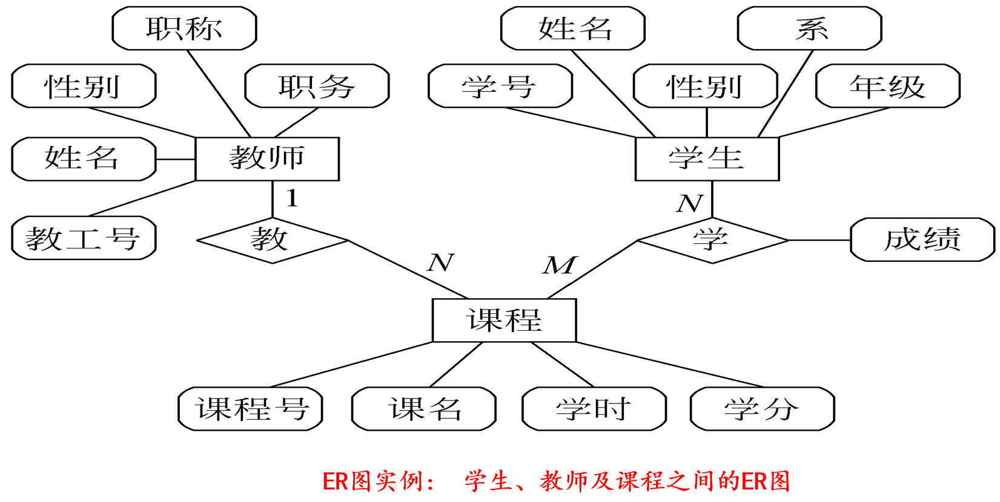

### 掌握面向数据流的软件设计方法，熟悉面向数据结构的软件设计方法

#### 面向数据流的软件设计方法

&nbsp;&nbsp;&nbsp;&nbsp;依据一定的映射规则，将需求分析阶段得到的数据流图按照信息流的类型转换为目标系统的软件结构描述 。主要在概要设计阶段使用

#### 面向数据结构的设计方法

&nbsp;&nbsp;&nbsp;&nbsp;根据数据结构，按输入、输出以及计算机内部存储信息的数据结构进行软件结构设计，从而把对数据结构的描述转换为对软件结构的描述。分析目标系统的数据结构。

### 什么是模块的==独立性==？==耦合和内聚==的种类

&nbsp;&nbsp;&nbsp;&nbsp;模块独立的概念是模块化、抽象、信息隐藏的直接结果。
&nbsp;&nbsp;&nbsp;&nbsp;就是把程序划分成独立命名且可独立访问的模块，每个模块完成一个子功能，把这些模块集成起来构成一个整体，可以完成指定的功能满足用户需求。
&nbsp;&nbsp;&nbsp;&nbsp;耦合：指模块之间联系的紧密程度。模块之间联系越紧密，其耦合性越强，独立性就越差
分为：

1. 非直接耦合(no direct coupling)
2. 数据耦合(data coupling)
3. 标记耦合 / 特征耦合 (stamp coupling)
4. 控制耦合 (control coupling)
5. 公共耦合(common/public coupling)：二个模块通过公共数据环境相互作用
6. 内容耦合(content coupling)

&nbsp;&nbsp;&nbsp;&nbsp;内聚：指模块内部各个元素之间彼此结合的紧密程度，高内聚往往意味着模块间的低耦合
1. 低内聚：偶然内聚 逻辑内聚 时间内聚
2. 中内聚：过程内聚 通信内聚
3. 高内聚：顺序内聚 功能内聚

软件设计的五个设计原则：模块化、抽象、逐步求精、信息隐藏、模块独立：低耦合高内聚

### 什么是结构程序设计

&nbsp;&nbsp;&nbsp;&nbsp;结构程序设计是尽可能少用GO TO语句的程序设计方法。最好仅在检测出错误时才使用GO TO语句，而且应该总是使用前向GO TO语句

### 掌握过程设计对的工具

#### ==程序流程图==

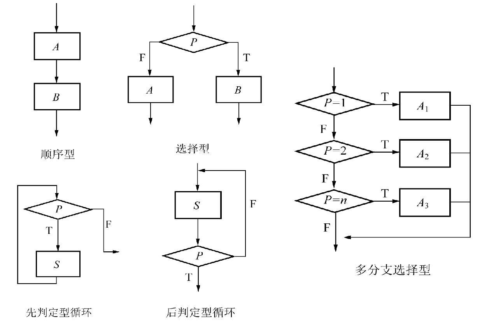

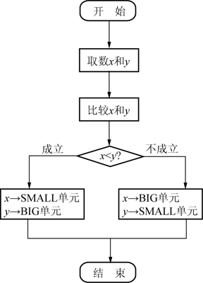

优点：
1. 采用简单规范的符号，画法简单
2. 结构清晰，逻辑性强
3. 便于描述，容易理解

缺点：
1. 不利于逐步求精的设计
2. 图中可用箭头随意地对控制进行转移，与结构化程序设计精神相悖
3. 不易于表示系统中所含的数据结构
4. 当目标系统比较复杂时，流程图会变得很繁杂、不清晰

#### ==盒图==

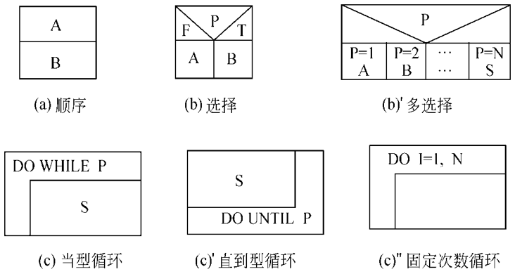

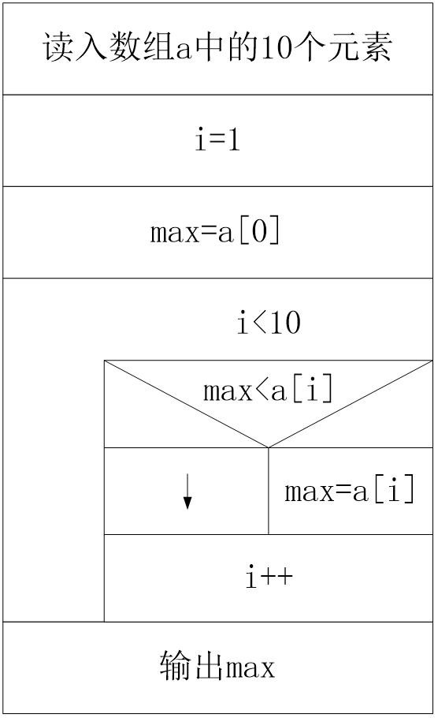

特点：
1. 不允许随意的控制转移，有利于严格的结构化程序设计
2. 可以很方便地确定一个特定控制结构的作用域，以及局部数据和全局数据的作用域
3. 可以很方便地表示嵌套关系以及模块之间的层次关系

#### PDA图

特点：
1. PAD图表示的程序结构的执行顺序是自最左边的竖线的上端开始，自上而下，自左向右
2. 用PAD图表示的程序片断结构清晰、层次分明
3. 支持自顶向下、逐步求精的设计方法
4. 只能用于结构化的程序设计
5. PAD图不仅可以表示程序逻辑，还能表示数据结构

#### 判定表

&nbsp;&nbsp;&nbsp;&nbsp;判定表是表示条件组合情况下的结果，不能表达顺序和循环结构，因而判定表只能是作为辅助使用。

#### 判定树

并了解他们的优缺点

### 数据库设计时要满足第三范式要求每个非键属性不依赖于其他非键属性（消除对主键的传递依赖）

### 理解什么是软件编码及软件编码的风格

&nbsp;&nbsp;&nbsp;&nbsp;软件编码是一个复杂而迭代的过程，它不仅仅是编写代码，还应该包括代码审查、单元测试、代码优化、集成调试等一系列工作。
风格：

1. 源程序文档化：易于可读、可理解
> 源程序的内部文档包括：恰当的标识符，有效的注释，良好的布局

2. 数据说明
3. 语句构造简单、直接
4. 输入输出
5. 效率

### 理解什么是==软件测试==及测试准则、软件测试的目的 find

定义：
1. 测试是为了发现程序中的错误而执行程序的过程
2. 好的测试方案极可能发现迄今为止尚未发现的错误的测试方案
3. 成功的测试是发现了迄今为止尚未发现的错误的测试

软件测试的准则：
1.  完全测试是不可能的（穷举测试）
2. 测试中存在风险
3. 软件测试只能表明缺陷的存在，而不能证明软件产品已经没有缺陷。
4. 软件产品中潜在的错误数与已发现的错误数成正比。
5. 要让不同的测试人员参与到测试工作中。
6. 让开发小组和测试小组分开。
7. 尽早并不断地进行测试，使测试工作贯穿于整个软件开发的过程中。
8. 在设计测试用例时，应包括输入数据和预期的输出结果两个部分，并且，输入数据不仅应该包括合法的情况，还应该包括非法的输入情况。
9. 要集中测试容易出错或错误较多的模块。
10. 应该长期保留所有的测试用例。

软件测试的目的：
1.  测试是为了发现程序中的错误而执行程序的过程； 
2.  好的测试方案是极有可能发现迄今尚未发现的尽可能多的错误的测试； 
3. 成功的测试是发现了迄今尚未发现的错误的测试。

### 掌握==白盒测试==的常见方法

&nbsp;&nbsp;&nbsp;&nbsp;是将测试对象看做一个透明的盒子，允许测试人员利用程序内部的逻辑结构及有关信息，设计或选择测试用例，需对程序所有逻辑路径进行测试。

#### 逻辑覆盖（==语句覆盖、条件覆盖、判定覆盖、条件判定覆盖、路径覆盖==）

#### ==基本路径法（控制流图的绘制及环路复杂度的计算）==

基本路径测试是在程序控制流图的基础上，通过分析控制构造的环路复杂性，导出基本可执行路径集合，从而设计测试用例的方法，是一种基于控制流图的测试

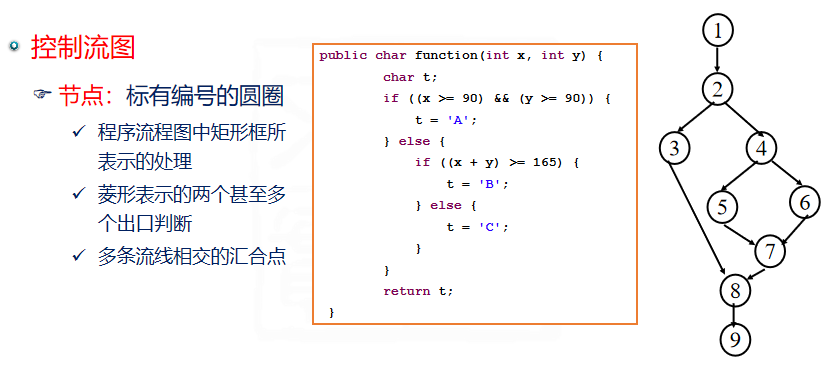

计算环路复杂度：：
1. 流图中区域的数量对应于环路的复杂度
2. 给定流图G的环路复杂度V(G)，定义为V(G)=E-N+2，其中E是流图中边的数量，N是流图中结点的数量
3. 给定流图G的环路复杂度V(G)，定义为V(G)=P+1，其中P是流图G中判定结点的数量

##### 实例

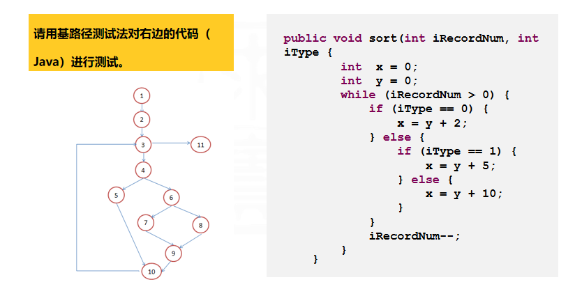

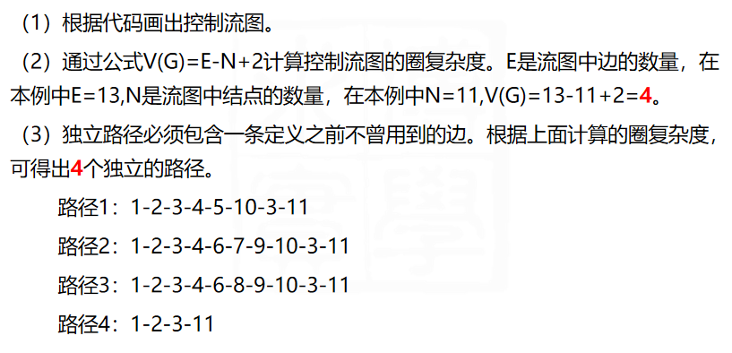

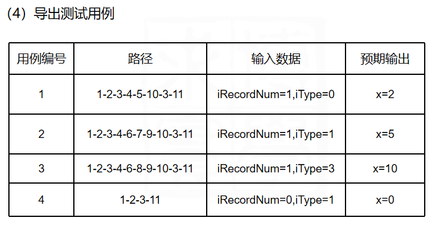

### 掌握黑盒测试的方法（看书）

&nbsp;&nbsp;&nbsp;&nbsp;又称功能测试，将测试对象看做一个黑盒子，完全不考虑程序内部的逻辑结构和内部特性，只依据程序的需求规格说明书，检查程序的功能是否符合它的功能说明。

#### ==等价类划分==

&nbsp;&nbsp;&nbsp;&nbsp;将输入域划分成尽可能少的若干子域，在划分中要求每个子域两两互不相交，每个子域称为一个等价类，测试某个等价类的代表值等价于对这一类其他值的测试。

确定原则：
1. 如果输入条件规定了取值范围或个数，则可确定一个有效等价类和两个无效等价类。
	>输入值是选课人数，在0到100之间，那么有效等价类是“0≤学生人数≤100”，无效等价类是“学生人数<0”和“学生人数>100”

2. 如果输入条件规定了“必须如何”的条件，则可确定一个有效等价类和一个无效等价类。
	> 输入值是日期类型的数据，那么有效等价类是：日期类型的数据；无效等价类：非日期类型的数据。

3. 如果输入条件是布尔表达式，则可以分为一个有效等价类和一个无效等价类。
	> 要求密码非空，则有效等价类为非空密码，无效等价类为空密码。

4. 如果输入条件是一组值，且程序对不同的值有不同的处理方式，则每个允许的输入值对应一个有效等价类，所有不允许的输入值的集合为一个无效等价类。
	> 输入条件“职称”的值是初级、中级或高级，那么有效等价类应该有3个，即初级，中级，高级，无效等价类有一个，即其他任何职称。

5. 如果规定了输入数据必须遵循的规则，则可以划分出一个有效的等价类（符合规则）和若干个无效的等价类（从不同的角度违反规则）。
	> java中要求标识符开头的第一个字符必须是字母，那么有效等价类：以字母开头的串，无效等价类有多个：数字开头的串，空格字符开头的串。。。

例子：网站注册用户名的时候，输入框要求“用户名由字母开头，后跟字母或数字的任意组合，且长度<=8”。

有效的等价类划分：
1.username = {0<全字母的长度<8
2.username = {0<（字母开头+数字）的长度<8}

无效等价类划分：
3.username = {0<全数字的长度<8}
4.username = {0<（数字开头+字母）的长度<8}
5.username = {全字母的长度>8}
6.username = {全数字的长度>8}
7.username = {（数字开头+字母）的长度>8}
8.username = {（字母开头+数字）的长度>8}

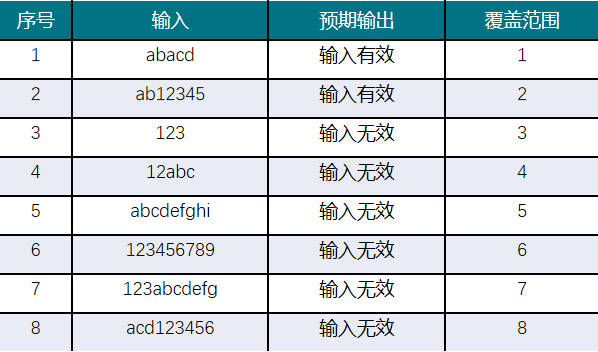

边界值分析、错误推测法、因果法、决策表法

### 掌握测试用例的设计方法

等价类划分、边界值分析、因果图、判定表、正交实验设计、基于风险的测试、错误猜测法

&nbsp;&nbsp;&nbsp;&nbsp;分为测试类与集成测试，
测试类：随机测试，划分测试，基于故障的测试；
集成测试：多类测试，从动态模型中导出测试用例

### ==回归测试==的相关概念

&nbsp;&nbsp;&nbsp;&nbsp;是用于保证由于调试或其他原因引起的变化，不会导致非预期的软件行为或额外错误的测试活动。

- 回归测试不是一个测试阶段，而是一种可以用于单元测试、集成测试、系统测试和验收测试各个测试过程的测试技术 
- 回归测试指软件系统被修改或扩充后重新进行的测试 
- 为了保证对软件修改后，没有引入新的错误而重复进行的测试 

包括以下三类不同的测试用例：
1. 测试软件全部功能的代表性测试用例
2. 专门针对可能受修改影响的软件功能的附加测试
3. 针对被修改过的软件成分的测试

###  什么是软件维护以及软件维护的分类、影响==软件维护==的因数有哪些

&nbsp;&nbsp;&nbsp;&nbsp;软件维护：在软件产品交付给用户之后，为了改正错误或满足新的需要而修改软件的过程

分类：
1. 纠错性维护：为了识别并纠正软件产品中所潜藏的错误，改正软件性能上的缺陷所进行的维护
2. 适应性维护：为了使软件产品适应软硬件环境的变更而进行的维护
3. 完善性维护：软件维护的主要部分，针对用户对软件产品所提出的新需求所进行的维护
4. 预防性维护：采用先进的软件工程方法对已经过时的、很可能需要维护的软件系统的某一部分进行重新设计、编码、测试，以达到结构上的更新，它为以后进一步维护软件打下了良好的基础 

影响软件维护的因素：可理解性、可测试性、可修改性、可移植性、可重用性

### 理解OOAD的概念：==对象、类、实例、消息、方法、属性、封装、继承、多态、重载==

Object对象 = Method方法 + Attribute 属性
面向对象=对象+类+继承+消息
重载：是指在同一作用域内的若干个参数特征不同的函数可以使用相同的函数名字

### UML图

==类图==
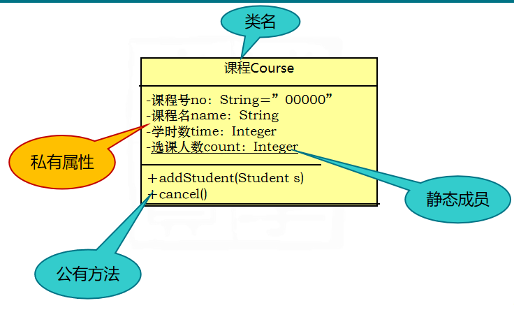

==对象图==
&nbsp;&nbsp;&nbsp;&nbsp;是类图的一个实例，它描述某一时刻类图中类的特定实例以及这些实例之间的特定链接。对象图使用了与类图相同的符号，只是在对象名下附加下划线，对象名后可接以冒号和类名

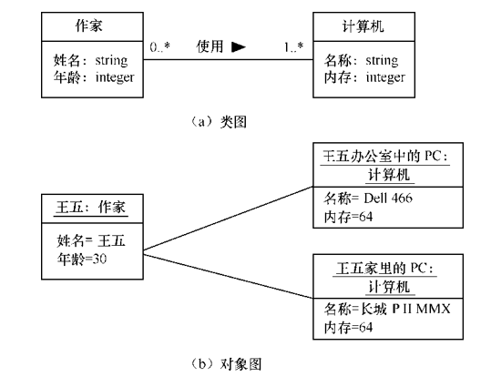

==用例图==
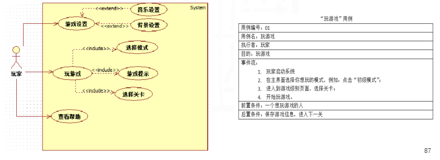
状态图、活动图、顺序图、协作图、构建图、部署图

### 三大模型（==对象模型、动态模型、功能模型==）之间的对应关系

&nbsp;&nbsp;&nbsp;&nbsp;对象模型表示静态的、结构化的系统的“数据”性质
&nbsp;&nbsp;&nbsp;&nbsp;动态模型表示瞬时的、行为化的系统的“控制”性质，考察对象的行为
&nbsp;&nbsp;&nbsp;&nbsp;功能模型表示变化的系统的“功能”性质，它指明了系统应该“做什么”，因此更直接地反映了用户对目标系统的需求 

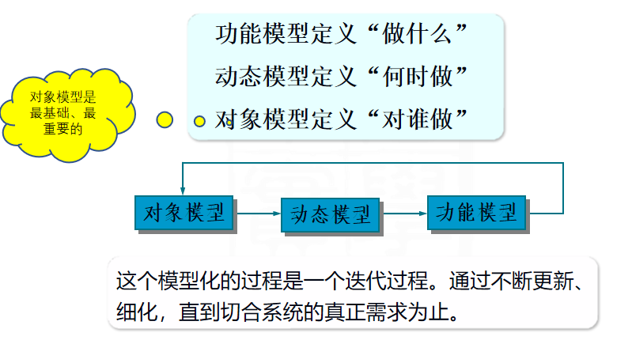

### 用例图有哪些组成元素 ？用例之间的关系有哪些

&nbsp;&nbsp;&nbsp;&nbsp;组成元素：系统（system）、用例（use case）、活动者、参与者、角色……actor
&nbsp;&nbsp;&nbsp;&nbsp;用例间的关系：扩展关系、包含关系

### 类成员有哪些？类之间的==关系==有哪些

类名 属性 操作
关系：
- 关联：表示语义上对象之间的关系
- 聚集：特殊的关联，整体与部分的关系
- 泛化/继承：继承关系
- 依赖：语义上的连接关系
- 细化：对同一事物的不同抽象层次的描述
- 实现：类和接口之间的关系

### 与传统的软件工程方法相比，面向对象软件工程方法有哪些优点，面向对象的编程语言。

优点：
1. 一致的表示方法，有利于维护人员理解软件的各种配置成分。
2. 可重用性强
3. 可维护性强

### 面向对象分析的原则、准则、及启发规则（了解）

准则：
1. 模块化
2. 抽象
3. 信息隐藏
4. 弱耦合
5. 强内聚
6. 可重用

启发原则：
1. 设计结果应该清晰易懂
2. 一般/特殊结构的深度应适当
3. 设计简单的类
4. 使用简单的协议
5. 使用简单的服务
6. 吧设计变动减至最小

### 软件工程管理的内容包括哪些

软件配置管理、估算软件规模、工作量估算、人员组织、进度计划

### 软件开发规模估算内容包括哪些

- 经济成本：预计花多少钱
- 资源成本：需要多少资源（人，设备，材料）
- 时间成本：需要做多长时间

### 理解软件规模的估算方法

#### 代码行技术

把项目划分为若干个功能，分别计算每个功能的代码长度，所有功能代码行之和即项目的代码长度

- 每个功能的代码长度估算值=(乐观值+4*可能值+悲观值)/6
- 估算工作量=代码总估算长度/估算生产率（估算生产率由经验获得）
- 估算总成本=日薪*估算工作量
- 估算行成本=估算总成本/估算代码长度

优点：所有项目都有的产品，容易计算代码行数
缺点:
1. 它的规模代表整个软件的规模似乎不太合理；
2. 实现语言不同，代码行数不同；
3. 这种方法不适用于非过程语言。

#### 功能点技术

&nbsp;&nbsp;&nbsp;&nbsp;依据对软件信息域特性和软件复杂性的评估结果，估算软件规模。这种方法用功能点（FP）为单位度量软件规模。

### 理解进度计划的绘制

Gantt图

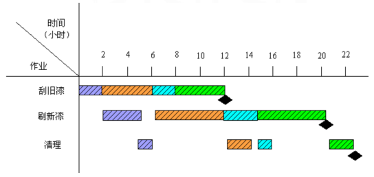

==工程网格（关键路径），EET，LET==
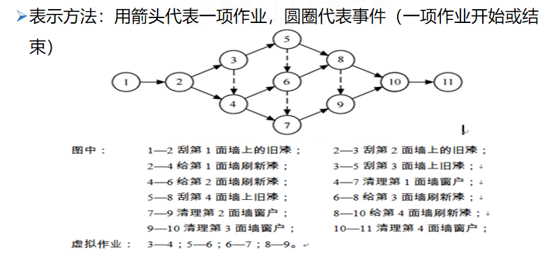

估算进度：
首先，把每个作业估计需要使用的时间写在表示该项作业的箭头上方。
其次，为每个事件计算两个值：最早时刻（EET）和最迟时刻（LET）。这两个数字将分别写在表示事件的圆圈的右上角和右下角。

EET计算：
- 工程网络中第1个事件的最早时刻定义为零，其他事件的最早时刻在工程网络上从左至右按事件发生顺序计算
- 考虑进入该事件的所有作业；
- 对于每个作业都计算它的持续时间与起始事件的EET之和；
- 选取上述和数中的最大值作为该事件的EET

LET:
- 最后一个事件（工程结束）的最迟时刻就是它的最早时刻。其他事件的最迟时刻在工程网络上从右至左按逆作业流的方向计算。
- 考虑离开该事件的所有作业；
- 从每个作业的结束事件的最迟时刻中减去该作业的持续时间；
- 选取上述差数中的最小值作为该事件的LET

关键路径：几个事件的最早时刻和最迟时刻相同，这些事件定义了关键路径，关键路径上的事件（关键事件）必须准时发生，组成关键路径的作业（关键作业）的实际持续时间不能超过估计的持续时间，否则工程就不能准时结束

机动时间：不在关键路径上的作业有一定程度的机动余地。

>  机动时间 = (LET)结束事件 − (EET)开始事件 − 持续时间

### 软件配置有五项任务

标识每个配置项、版本控制、变更控制、配置审计、状态报告

### 软件项目管理与软件工程的关系

&nbsp;&nbsp;&nbsp;&nbsp;软件项目管理先于任何技术活动之前开始，并且贯穿于软件的整个生命周期之中，软件工程包括技术和管理两方面的内容，是技术与管理精密结合的产物，只要在科学而严格的管理之下，先进的技术方法和优秀的软件工具才能真正发挥出威力，有效的管理是大型软件工程项目成功的关键

### ==风险管理（人、硬件、成本......）==

&nbsp;&nbsp;&nbsp;&nbsp;风险管理的主要目标是预防风险

评估风险后果

- 性能风险——产品能满足需求且符合其使用目的的不确定程度。
- 成本风险——能够维持项目预算的不确定程度。
- 支持风险——软件易于改错、适应和增强的不确定程度。
- 进度风险——能够实现项目进度计划且产品能按时交付的不确定程度。

## 题目

### 1&2章

The cause of the subject of software engineering is (A)

- A. the software crisis
- B. no software document
- C. the quality of software is unreliable
- D. software maintainability is poor 软件可维护性差

It is necessary to do (B) before requirements analysis.

- A. program design
- B. feasibility study
- C. data structure design
- D. ER design

In the structured waterfall model（结构化瀑布模型）, which stage （阶段）defines the standard that will become the goal of the system testing stage in software testing? D

- A. feasibility study
- B. detailed design
- C. outline design 概要设计
- D. requirement analysis

The spiral model（螺旋模型） is a ( B ) process model.

- A. designing driven
- B. risk driven 风险驱动
- C. document driven
- D. testing driven

Software requirements specification（规范） should not include ( D ).

- A. the information involved in the system
- B. funcitional requirements
- C. the performance(性能) of the software
- D. detailed description of algorithms（算法）

( B ) is a document driven model.

- A. The incremental model 增量模型
- B. The waterfall model 瀑布模型
- C. Rapid prototyping model 快速原型
- D. The spiral model 螺旋模型

The feasibility study mainly studies from the following aspects: ( B )

- A. system feasibility, economic feasibility, operational feasibility
- B. technical feasibility, economic feasibility, operational f（操作）easibility
- C. technical feasibility, economic feasibility, time feasibility
- D. technical feasibility, time feasibility, operational feasibility

Non-functional requirements reflect the additional requirements of the application for the quality and characteristics of the software system.

> √非功能需求是从各个角度对系统的约束和限制，反映了应用对软件系统质量和特性的额外要求。

Requirements analysis is the work of developers（开发人员）, and has little to do with users.

> ×需求分析不仅仅是开发人员的工作，与用户也密切相关

The main purpose of requirement analysis is to solve the concrete（具体的） scheme（方案） of software development.

> ×，需求分析的目的是搞清楚用户真正想要的系统是什么（做什么）以及存在哪些约束条件

### 3.1

Module M transfers the switch control quantity（开关控制量） as a parameter（参数） to another module N, so the two modules belong to ( D ).

> 模块 M 将开关控制量作为参数传递给另一个模块 N，因此两个模块属于 （ D ）。

- A. public coupling 公共耦合
- B. data coupling 数据耦合
- C. content coupling 内容耦合
- D. control coupling 控制耦合

When one module directly uses the internal(内部的) data of another module, the coupling between such modules is ( B ).

> 当一个模块直接使用另一个模块的内部数据时，这些模块之间的耦合是 （ B ）。

- A. control coupling
- B. content coupling
- C. public coupling
- D. data coupling

The conceptual(概念) structure of the database is usually represented by ( D ).

> 数据库的概念结构通常用 （ D 表示）。

- A. program flow diagrams
- B. data flow diagrams
- C. chats
- D. E-R diagrams

You can refine（完善） the data flow diagram（数据流图） by ( C ).

- A. data refinement 数据优化
- B. structure refinement
- C. functional refinement
- D. system refinement

( B ) does not belong to the principle（原理） of software design.

- A. modularization 模块化
- B. structured 结构化
- C. gradual refinement 逐渐细化
- D. information hiding 信息隐藏

In order to improve the independence of modules, it is better to implement（ B ） between modules.

- A. common coupling 公共耦合
- B. data coupling
- C. stamp coupling 标记耦合/特征耦合
- D. control coupling

In the following options, ( A ) can be regarded（被视为） as software modules.

- A. all of the above
- B. process
- C. macro
- D. function

The independence of modules is measured by cohesion（内聚） and coupling（耦合）, and the cohesion refers to ( A ).

- A. the degree of connection between modules 模块之间的连接程度
- B. complexity of the interface 界面的复杂性
- C. the degree of information hiding 数据的隐藏程度
- D. functional strength of the module 模块的功能强度

Software should be composed of a group of modules that completely relatively independent sub-functions(功能模块), and the interfaces（接口）between these modules should be as simple as possible.

> √

In the overall design（整体设计）, the connection between modules should be strengthened.

> × 应当减弱模块之间的关联度

### 3.2

Which of the following descriptions is correct ? ( A )

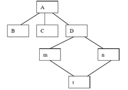

- A. The fan-out of module A is 3.
- B. The fan-in of module t is 3.
- C. The depth of this structure is 3.
- D. The width of this structure is 4.

The circular complexity （循环复杂性）of the program depends on the complexity of the ( D ).

- A. program data structure
- B. program data flow
- C. program interface
- D. program control flow

If the algorithm contains multiple nested conditional selections(包含多个嵌套的条件选择), which of the following process design tools is applicable （适用）? (  D )

- A. N-S box diagram NS箱图
- B. program flow chart 程序流程图
- C. PAD diagram PAD图
- D. decision table  决策表 

Corresponding（对应） to the detailed design is the ( C ) design of the database.

- A. notional 概念设计
- B. funcitonal
- C. physical
- D. logical 逻辑

The result of detailed design basically determines（决定） the final program ( B ).

- A. code scale
- B. total quality 全面的质量
- C. maintainability
- D. running speed

Jackson method takes (  C ) as the central idea.为中心思想

- A. control flow
- B. data flow
- C. data structure
- D. active event 活动事件

When drawing the software structure diagram（图）, it should be noted that the calling relationship （调用关系）can only be ( D  ).

- A. from right to left
- B. from bottom to top
- C. from left to right
- D. from top to bottom

In a software system, what kind of function a module(模块) should have is determined by ( D ).

- A. program design
- B. overall ddesign
- C. detailed design
- D. requirement analysis

Software should be composed of a group of modules that complete relatively independent sub-functions（子功能模块）, and the interface relationship between these modules should be as simple as possible.

> √

Fan-out refers to the number of modules directly called by a module, and the generally recommended fan-out number is 3 or 4.

> √

### 第4章

( D ) can reflect the internal（内部） characteristics of a module.

- A. state
- B. function
- C. interface
- D. logic

The arrow（箭） in the program flow chart represents the ( D  ).

- A. data flow
- B. calling relation 调用关系
- C. composition relation 组合关系
- D. control flow

The vast majority of the cost of a software system is spent during the testing and maintenance phases（阶段） of the life cycle.（生命周期）

> √

When debugging a program, it is more difficult to find out the location and nature（性质） of the error than to correct it.

> √

### 第五章

A program input X is an integer type variable, 1< = X< = 10, if the test case is designed with the boundary（边界） value analysis method, X should take ( D ) as the boundary value.

- A. 1,10
- B. 1,5,10,11
- C. 1,5,10,15
- D. 0,1,10,11

The purpose of software testing is ( D ).

- A. prove the correctness of the software 证明软件的正确性
- B. prove errors in the software
- C. find all errors in the software
- D. find as many software system errors as possible

Software testing should do the ( A ) first, then integration testing（集成测试）, and finally effectiveness testing.（）有效性测试

- A. unit test
- B. comprehensive test 综合测试
- C. confirmation test 确认测试
- D. combination test 组合测试

Jackson method takes ( D ) as the central idea.

- A. active event
- B. control flow
- C. data flow
- D. data structure

( A ) can't be found through black box testing.

- A.program internal（内部的） structure error
- B.program function exception
- C.program initialization（初始化） error
- D.external（外部的） data access（访问） exception

### 期中

The basis for designing test cases（用例） in unit tests is the ( D ).

- A.project plan specification
- B.overall design specification
- C.user requirements specification
- D.detailed design specification 详细设计规格

It is necessary to do ( B ) before requirements analysis.

- A. data structure design
- B. feasibility study
- C. program design
- D. ER design

The Jackson method is a design approach to data structures, a formal approach to the ( D ) stage.

- A. requirement analysis
- B. coding
- C. system design
- D. detailed design

Software testing is an important measure to ensure software quality, and its implementation should be ( D ).

- A. in the software designing stage
- B. in the software designing and coding stage
- C. in the coding stage
- D. in the whole life cycle of software development

( B ) does not belong to the principle of software design.

- A. information hiding
- B. structured
- C. modularization
- D. gradual refinement

( C ) can't be found through black box testing.

- A.external data access exception
- B.program initialization error
- C.program internal structure error
- D.program function exception

( C ) is a document driven model.

- A. The spiral model
- B. The incremental model
- C. The waterfall model
- D. Rapid prototyping model

The basic principle of drawing a layered DFD diagram does not include ( C ).

- A. the principle of data flow closure
- B. data conservation
- C. reliability of decomposition
- D. the principle of balance between child and parent graphs

> 每个处理至少有一个输入数据和一个输出数据流，且父子流图要守恒。
> 处理名字最好是动宾结构的词语，如计算工资。
> 每个数据流要有合适的名字，要代表整个数据流(数据存储、处理)的内容，而不是仅仅某些成分。
> 各成分的命名要利于理解，不要使用空洞的、缺乏具体含义的名字(如“数据”、“信息”、“输入”之类)
> 描述的是数据流而不是控制流
> 不要超过9层，5层适宜

The test of whether the software can meet the requirements expected by the user is called ( A ).

- A. the acceptance testing
- B. the integration testing
- C. the system testing
- D. the validity testing

( C ) are not belong to the way to improve the efficiency of the program.

- A. choosing good design methods
- B. choosing good algorithms
- C. making adjustments to the program statements
- D. choosing good data structures

The purpose of software debugging is to ( A ).

- A. find out where the mistake is and correct it
- B. eliminate possible errors
- C. count the nuber of errors
- D. classify errors

when doing unit tests, the common approach is ( A ).

- A.white box test, supplemented by black box test
- B. white box test
- C.black box test, supplemented by white box test
- D. black box test

During the software life cycle, the biggest cost of error correction is ( B ) stage.

- A. requirement analysis
- B. release
- C. coding
- D. designing

Among the following logical coverage standards, the weakest error checking ability is ( A ).

- A. statement overrides
- B. conditional overrides
- C. condition combination overrides
- D. decision stage

A program input X takes the value of a fixed enumeration type {1,4,9,16,25}, and the program processes these four input values separately, according to the equivalence class division method, in which case the input X is divided correctly ( C ).

- A.divided into 5 valid equivalence classes and 2 invalid equivalence classes
- B.divided into 1 valid equivalence class and 2 invalid equivalence classes
- C.divided into 5 valid equivalence classes and 1 invalid equivalence class
- D.divided into 1 valid equivalence class and 1 invalid equivalence class

If the algorithm contains multiple nested conditional selections, ( D ) in the following procedure design tools is more appropriate.

- A. box diagram
- B. program flow chart
- C. PDA diagram
- D. decision table

In the software design approach for data flow, the information flow is generally divided into ( B ).

- A.transformation flow and control flow
- B.transformation flow and transaction flow
- C.data flow and transaction flow
- D.control flow and data flow

The black box method in software testing is to design test cases according to ( C ) of programs.

- A. the range of application
- B. the internal structure
- C. the function
- D. the input data

When designing the man-machine interface, the main factor to be considered is ( C ).

- A. user help mechanism
- B. system response time
- C. all above
- D. the error handling

In order to improve the independence of modules, it is better to implement（ A ） between modules.

- A. data coupling
- B. common coupling
- C. control coupling
- D. stamp coupling

### 6.1

The main characteristics of object-oriented are encapsulation, inheritance and ( A ) .

- A. polymorphism
- B. completeness
- C. portability
- D. compatibility

The main characteristics of object-oriented are encapsulation, inheritance and ( B ) .

- A. polymorphism
- B. completeness
- C. portability
- D. compatibility

To develop software with an object-oriented method, it is usually necessary to establish the three models described in ( B ).

- A. Object model, data model, function model
- B. Object model, dynamic model, functional model
- C. Object model, dynamic model, data model
- D. Data model, dynamic model, function model

UML is mainly used in (  A ).

- A. Object-oriented design method
- B. Prototype design method
- C. Data flow development method
- D. Structured design method

The common relationship between classes is (A).

- A. All of the above
- B. Aggregation
- C. Dependence and refinement
- D. Association and generalization

Association is a means of establishing the relationship between (C).

- A. attributes
- B. functions
- C. classes
- D. objects

( D ) Describe all possible states of a specific object and the events that cause state transitions.

- A. Activity diagram
- B. Sequence diagram
- C. Use case diagram
- D. State diagram

( D ) Is a graphical expression method to describe system functions from the perspective of users using the system.

- A. Class Diagram
- B. State diagram
- C. Sequence diagram
- D. Use case diagram

Object = ( method ) + ( attribute  )

### 6.2

Which of the following UML views can describe the life cycle of an object?  A

- A.State diagram
- B.Sequence diagram
- C.Class diagram
- D.Collaboration diagram

UML's ( B ) model consists of the class diagram, the object diagram, the package diagram, the component diagram, and the deployment diagram.

- A. use case
- B. static
- C. dynamic
- D. system

The ( D) mechanism in object-oriented methods enables subclasses to automatically own/copy all the properties and operations of the parent class.

- A.Information hiding
- B.Encapsulation 
- C. Overloading
- D.Inheritance

( D ) indicates that functions with different parameter characteristics within the same scope can use the same function name.

- A. Information hiding
- B. Inheritance
- C. Polymorphism 
- D. Overloading

In use case based object-oriented analysis, the key to defining interaction behavior is to assign the responsibilities of the use case to the analytics class by describing the (  C ) between the instances of the analytics class.

- A.Inheritance
- B. relationship
- C. message
- D. context

In use case based object-oriented analysis, the key to defining interaction behavior is to assign the responsibilities of the use case to the analytics class by describing the ( A ) between the instances of the analytics class.

- A.Inheritance
- B. relationship
- C. message
- D. context

The implementation details of the use case are not described in (  B ).

- A.Sequence diagram
- B.Use case diagram
- C.Activity diagram
- D.Use case description

Associative multiplicity (关联重数) in a class diagram refers to ( B ).

- A.Both classes have the same methods and properties
- B.An instance of a class can be associated with multiple instances of another class
- C.The number of times a method of one class was called by another class
- D.A class has multiple methods called by another class

When ( B ), the use case is the best option for capturing system requirements.

- A.The system has very few interfaces
- B.The system has many users
- C.The system has very few participants
- D.The system's algorithms are complex

Object-oriented design results can only be implemented in object-oriented languages, not in non-object-oriented languages.

> ×

### 第7章

In the following illustration, object A calls a method in object B to represent ( A  )

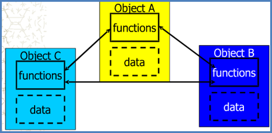

In an Order Entry Subsystem, both creating and updating orders require checking that the user account is correct. Then, there is a ( A ) relationship between the use case "Create New Order", "Update Order" and the use case "Check User Account".

- A. Including
- B. Extend
- C. Aggregation
- D. Categorical

In an Order Entry Subsystem, both creating and updating orders require checking that the user account is correct. Then, there is a ( D ) relationship between the use case "Create New Order", "Update Order" and the use case "Check User Account".

- A. Including
- B. Extend
- C. Aggregation
- D. Categorical

Both classes and objects have properties, the difference being that classes describe the type of properties, while properties of objects must have ( D ).

- A. private members
- B. methods
- C. actions
- D. values

Of the following options, the ( D ) is not an object-oriented analysis model.

- A. use case diagram
- B. class diagram
- C. sequence diagram
- D. E-R diagram

Of the following options, the ( C ) is not an object-oriented analysis model.

- A. use case diagram
- B. class diagram
- C. sequence diagram
- D. E-R diagram

Objects enable the combination of data and operations so that data and operations are ( A ) in a continuum of objects.

- A. encapsulated
- B. combined
- C. hidden
- D. abstracted

Each use case should have at least one ( C ), which usually has no properties and only methods, and only plays a role in coordination and control.

- A. interface class
- B. method class
- C. control class
- D. entity class

Communication between different objects can only be done through messages.

> √

Objects are abstract data types that support inheritance, and classes are instances of objects.

> ×

## 单词表

### 1-2

Software requirements specification 软件要求规范
description of algorithms 算法说明
 The spiral model 螺旋模型
 the software crisis软件危机 
The waterfall model瀑布模型 
document driven model文档驱动模型 
The feasibility study可行性研究 
technical feasibility, economic feasibility, operational feasibility技术可行性，经济可行性，操作可行性 
requirements analysis需求分析 
Non-functional requirements非功能性需求
 the concrete scheme of software development软件开发的具体方案 

### 3.1

 The conceptual structure of database数据库的概念结构 
E-R diagrams E-R图 
the principle of software design 软件设计原理 
the internal data内部数据
content coupling内容耦合
control coupling控制耦合
data coupling数据耦合
parameter复数
functional refinement功能细化
the independence of modules模块的独立性
implement执行，贯彻
macro宏，宏命令
cohesion and coupling 内聚和耦合
subfunctions 子函数
interfaces 联系，交流
overall design总体设计

### 3.2
fan-out 输出
fan-in 输入
The circular complexity 循环复杂度
flow 流
applicable 适用的
N-S box diagram N-S箱形图
program flow chart程序流程图
PAD diagram 问题分析图
Jackson method 杰克森方法；杰克逊法
interface 接口
### 4
arrow 箭头
calling relation 调用关系
debug 调试
maintenance phases 维护阶段
### 5.1
the test case 测试用例
the boundary value analysis method 边界值分析法
unit test 单元测试
### 期中
the man-machine interface 人机界面
user help mechanism 用户帮助机制
system response time 系统响应时间
the error handling 错误处理
eliminate possible errors消除可能的错误
enumeration 枚举
valid/invalid equivalence classes 有效/无效等价类
logical coverage standards 逻辑覆盖标准
override 覆盖，重载 
DFD diagram 数据流图
data flow closure 数据流封闭
transformation flow and transaction flow 转换流和事务流
the acceptance testing 验收测试
implementation 实现
supplemented by 以……为辅
decision table 决策表

### 6.1
Association and generalization 关联和泛化
object-oriented analysis 面向对象的分析
encapsulation, inheritance and polymorphism 封装，继承，多态
Aggregation 聚集，聚合
Use case diagram 用例图
State diagram 状态图
Object model, dynamic model, functional model 对象模型，动态模型，功能模型
Object = ( method ) + ( attribute )
### 6.2
indicate 表明，标示；象征，暗示
Overloading 重载
the class diagram, the object diagram, the package diagram, the component diagram, and the deployment diagram 类图、对象图、包图、组件图和部署图
Associative multiplicity 关联重数
### 7
encapsulated 封装
Categorical 明确的
Including 包含
external Actor 外部参与者