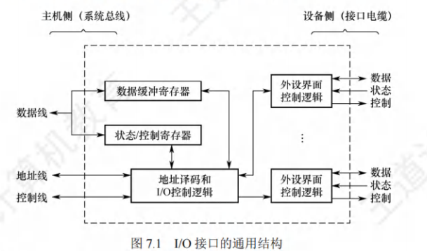
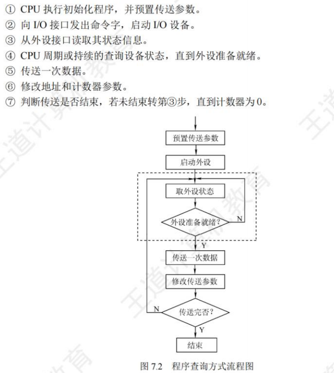
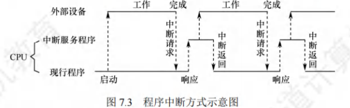
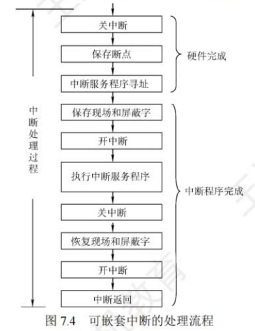
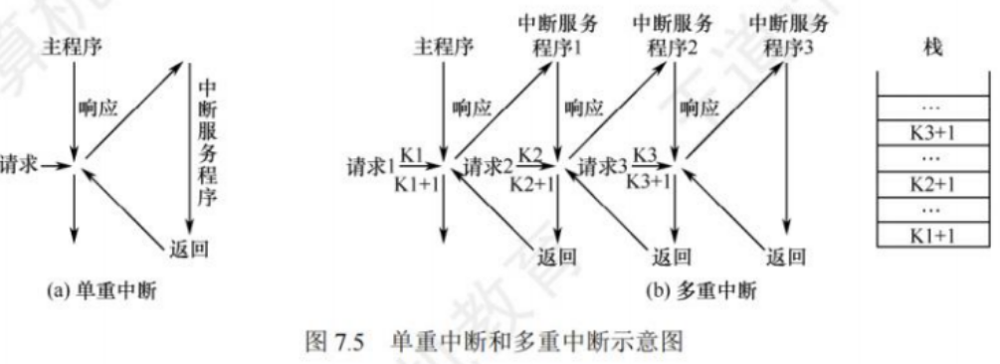
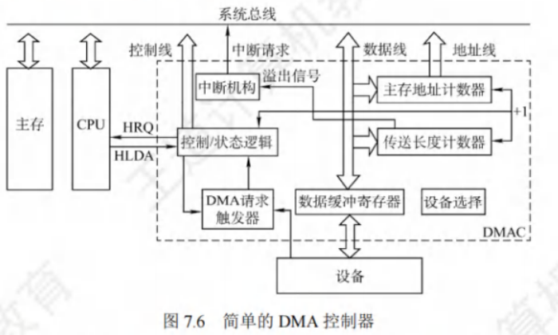
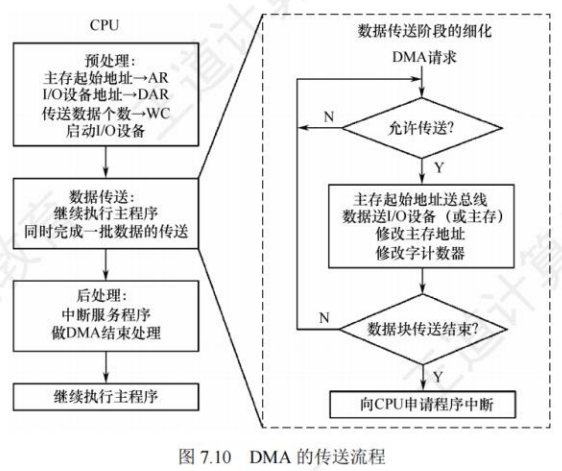

## I/O系统基本概念（统考大纲删除）

### 输入/输出系统

### I/O控制方式

### 外部设备

## I/O接口

### I/O接口的功能

1. **进行地址译码和设备选择**：CPU 送来选择外设的地址码后，接口必须对地址进行译码以产生设备选择信息，使主机能和指定外设交换信息。
2. **实现主机和外设的通信联络控制**：解决主机与外设时序配合问题，协调不同工作速度的外设和主机之间交换信息，以保证整个计算机系统能统一、协调地工作。
3. **实现数据缓冲**：PU 与外设之间的速度往往不匹配，为消除速度差异，接口必须设置数据缓冲寄存器，用于数据的暂存，以避免因速度不一致而丢失数据。
4. **信号格式的转换**：外设与主机两者的电平、数据格式都可能存在差异，接口应提供主机与外设的信号格式的转换功能，如电平转换、并/串或串/并转换、模/数或数/模转换等。
5. **传送控制命令和状态信息**：CPU 要启动某外设时，通过接口中的命令寄存器向外设发出启动命令;外设准备就绪时，则将“准备好”状态信息送回接口中的状态寄存器，并反馈给 CPU。外设向 CPU 提出中断请求时，CPU 也应有相应的响应信号反馈给外设。

### I/O接口的基本结构

- 数据缓冲寄存器用来暂存与CPU或内存之间传送的数据信息；
- 状态寄存器用来记录接口和设备的状态信息；
- 控制寄存器用来保存CPU对外设的控制信息；
- 状态寄存器和控制寄存器在传送方向上是相反的，在访问时间上也是错开的，因此可将它们合二为一。

I/O接口的数据线上传输的内容：
&nbsp;&nbsp;&nbsp;&nbsp;I/O 接口中的**数据线**传送的是读/写数据、状态信息、控制信息和中断类型号。**地址线**传送的是要访问 I/O 接口中的寄存器的地址。**控制线**传送的是读/写控制信号，以确认是读寄存器还是写寄存器，此外控制线还会传送中断请求和响应信号、仲裁信号和握手信号。
> &nbsp;&nbsp;&nbsp;&nbsp;I/O 接口中的I/O控制逻辑还要能对控制寄存器中的命令字进行译码，并将译码得到的控制信号通过外设界面控制逻辑送到外设，同时将数据缓冲寄存器的数据发送到外设或从外设接收数据到数据缓冲寄存器。另外，它还要具有收集外设状态到状态寄存器的功能。

&nbsp;&nbsp;&nbsp;&nbsp;对数据缓冲寄存器、状态/控制寄存器的访问操作是通过相应的指令来完成的，通常称这类指令为 I/O 指令，IO 指令只能在操作系统内核的底层 1/0 软件中使用，它们是一种特权指令。

### I/O接口类型

按数据传输方式分：

1. 并行接口：一字节或一个字的所有位同时传送
2. 串行接口：一位一位地有序传送

> 接⼝要完成数据格式的转换
> 这⾥的数据传送⽅式是指外设和接⼝⼀侧的传送⽅式

按主机访问I/O设备的控制方式分：

1. 程序查询接口
2. 中断接口
3. DMA接口

按功能选择的灵活性分：

1. 可编程接口
2. 不可编程接口

### I/O端口及其编址

&nbsp;&nbsp;&nbsp;&nbsp;I/O端口是指I/O接口电路中可被CPU直接访问的寄存器，主要有**数据端口**、**状态端口**和**控制端口**。I/O 端口要想能够被 CPU 访问,就必须要对各个端口进行编址,每个端口对应一个端口地址。

**独立编址**：
&nbsp;&nbsp;&nbsp;&nbsp;也称 I/O 映射方式,是指对所有的 I/O端口单独进行编址。I/O 端口的地址空间与主存地址空间是两个独立的地址空间，它们的范围可以重叠，相同地址可能属于不同的地址空间。因此需设置专门的 I/O 指令来表明访问的是I/O 地址空间，I/O 指令的地址码给出I/O端口号。
&nbsp;&nbsp;&nbsp;&nbsp;优点: I/O 端口数比主存单元数少得多，只需少量地址线，使得 I/O 端口译码简单，寻址速度更快。使用专用 I/O 指令，可使得程序更加清晰，便于理解和检查。
&nbsp;&nbsp;&nbsp;&nbsp;缺点:I/O 指令少，只提供简单的传输操作，所以程序设计的灵活性较差。此外，CPU 需要提供存储器读/写、I/O 设备读/写两组控制信号，增大了控制的复杂性。

**统一编址**：
&nbsp;&nbsp;&nbsp;&nbsp;也称存储器映射方式，是指把主存地址空间分出一部分给 I/O 端口进行编址，I/O端口和主存单元在同一地址空间的不同分段中，根据地址范围就能区分访问的是 I/0 端口还是主存单元，因此无须设置专门的 I/O 指令，用统一的访存指令就可访问 I/O 端口。
&nbsp;&nbsp;&nbsp;&nbsp;优点:不需要专门的 IO 指令，使得 CPU 访问 I/0 的操作更加灵活和方便，还使端口有较大的编址空间。I/0访问的保护机制可由虚拟存储管理系统来实现，无须专门设置。
&nbsp;&nbsp;&nbsp;&nbsp;缺点:端口地址占用了部分主存地址空间，使主存可用容量变小。此外，由于在识别 10端口时全部地址线都需要参加译码，使得译码电路变得更复杂，降低了译码速度。

|      | 统一编址(存储器映射方式)                                     | 独立编址(I/O映射方式)                                        |
| ---- | ------------------------------------------------------------ | ------------------------------------------------------------ |
| 定义 | 把I/O端口当做存储器的单元进行地址分配，CPU不需要设置专门的I/0指令，用统一的访存指令就可以访问I/O端口 | I/O端口的地址空间与主存地址空间无法从地址码的形式上区分需要设置专门的I/O指令来访存I/O端口 |
| 特点 | 依靠地址码的不同区分存储单元和I/O设备                        | 通过专门的I/O指令来区分存储单元和I/O设备                     |
| 优点 | 不需要专门的I/O指令； 可以使CPU访问I/O的操作更灵活、更方便； 还可以使端口有较大的编址空间 | 输入/输出指令与存储器指令有明显区别； 程序编制清晰，便于理解 |
| 缺点 | 端口占用存储器地址，使内存容量变小； I/O设备进行数据输入/输出操作时，执行速度较慢 | 输入/输出指令少，一般只能对端口进行传送操作； 尤其需要CPU提供存储器读/写、I/O设备读/写两组控制信号增加了控制的复杂性 |

## I/O方式

### 程序查询方式

​	直接由cpu执行程序实现，，在接口中设置一个数据缓冲器（数据端口）和一个设备状态寄存器（状态端口），主机进行I/O操作时，先发出询问信号，读取设备状态决定下一步操作到底是进行数据传送还是等待。

由于④种查询方式的不同可分为两种：

1. 独占查询：一旦设备被启动，CPU 就一直持续查询接口状态，CPU花费100%的时间用于 I/O 操作，此时外设和 CPU 完全串行工作。
2. 定时查询：CPU周期性地查询接口状态，每次总是等到条件满足才进行一个数据的传送，传送完成后返回到用户程序。定时查询的时间间隔与设备的数据传输速率有关。

优点：是设计简单、硬件量少。

缺点：是 CPU 要花费很多时间来查询和等待，且在一段时间内只能和一台外设交换信息，CPU与设备串行工作，效率很低。

### 程序中断方式

​	在计算机执行程序的过程中，出现某些急需处理的异常情况或特殊请求，CPU暂时中止现行程序，而转去对这些异常情况或特殊请求进行处理，处理完毕后再返回到原程序的断点处，继续执行原程序。

功能：

1. 实现 CPU 与 I/O 设备的并行工作。
2. 处理硬件故障和软件错误。
3. 实现人机交互，用户干预机器需要用到中断系统。
4. 实现多道程序、分时操作，多道程序的切换需借助于中断系统。
5. 实时处理需要借助中断系统来实现快速响应。
6. 实现应用程序和操作系统(管态程序)的切换，称为软中断。
7. 多处理器系统中各处理器之间的信息交流和任务切换。

思想：

&nbsp;&nbsp;&nbsp;&nbsp;CPU 在程序中安排好在某个时机启动某台外设，然后 CPU 继续执行当前的程序，不需要像查询方式那样一直等待外设准备就绪。一旦外设完成数据传送的准备工作，就主动向 CPU 发出中断请求。在可以响应中断的条件下，CPU 暂时中止正在执行的程序，转去执行中断服务程序为外设服务，在中断服务程序中完成一次主机与外设之间的数据传送，传送完成后，CPU 返回原来的程序。

工作流程：

①中断请求
②中断响应判优
③CPU相应中断的条件
④中断响应过程
⑤中断向量
⑥中断处理过程

> 关中断->保存断点->中断服务程序寻址->保存现场和屏蔽字->开中断->执行中断服务程序->关中断->回复现场和屏蔽字->开中断、中断返回
> 

单重中断：在 CPU执行中断服务程序的过程中，若又出现了新的优先级更高的中断请求，而 CPU 对新的中断请求不予响应。

多重中断：若 CPU 暂停现行的中断服务程序,转去处理新的中断请求，则称这种中断为多重中断，也称中断嵌套。

多重中断条件：

&nbsp;&nbsp;&nbsp;&nbsp;①在中断服务程序中提前设置开中断指令。
&nbsp;&nbsp;&nbsp;&nbsp;②优先级别高的中断源有权中断优先级别低的中断源。

&nbsp;&nbsp;&nbsp;&nbsp;中断处理优先级是指多重中断的实际优先级处理次序，可以利用中断屏蔽技术动态调整，从而可以灵活地调整中断服务程序的优先级，使中断处理更加灵活。若不使用中断屏蔽技术，则处理优先级和响应优先级相同。现代计算机一般使用中断屏蔽技术，每个中断源都有一个屏蔽触发器(MASK)，1表示屏蔽该中断源的请求，0表示可以正常请求，所有屏蔽触发器组合在一起便构成一个屏蔽字寄存器，屏蔽字寄存器的内容称为屏蔽字。

&nbsp;&nbsp;&nbsp;&nbsp;从宏观上看，虽然程序中断方式克服了程序査询方式中 CPU 的等待现象，提高了 CPU 的利用率。但从微观操作分析，CPU在处理中断时，仍需暂停原程序的运行，尤其是当高速设备频繁成批地与主存交换信息时，需要不断打断 CPU 执行现行程序而去执行中断服务程序。

### DMA方式

&nbsp;&nbsp;&nbsp;&nbsp;DMA 方式是一种完全由硬件进行成组信息传送的控制方式，它具有程序中断方式的优点，即在数据准备阶段，CPU 与外设并行工作。DMA 方式在外设与内存之间开辟了一条“直接数据通路”，信息传送不再经过 CPU，降低了 CPU 在传送数据时的开销，因此称为直接存储器存取方式。由于数据传送不经过 CPU，因此不需要保护、恢复 CPU 现场等烦琐操作。

&nbsp;&nbsp;&nbsp;&nbsp;这种方式适用于磁盘、显卡、声卡、网卡等高速设备大批量数据的传送，它的硬件开销比较大。在 DMA 方式中，中断的作用仅限于故障和正常传送结束时的处理。

特点：

1. 它使主存与 CPU 的固定联系脱钩，主存既可被 CPU 访问，又可被外设访问。
2. 在数据块传送时，主存地址的确定、传送数据的计数等都由硬件电路直接实现。
3. 主存中要开辟专用缓冲区，以及时提供和接收外设的数据。
4. DMA 传送速度快，CPU 和外设并行工作，提高了系统效率。
5. DMA 在传送开始前要通过程序进行预处理，结束后要通过中断方式进行后处理。

&nbsp;&nbsp;&nbsp;&nbsp;DMAC又叫DMA控制器，是对数据传送过程进行控制的硬件，在DMA过程种，DMAC将接管CPU的地址总线、数据总线和控制总线，CPU的主存控制信号被禁用

功能：

1. 接受外设发出的 DMA 请求，并向 CPU 发出总线请求。
2. CPU 响应并发出总线响应信号，DMA 接管总线控制权，进入DMA操作周期。
3. 确定传送数据的主存起始地址及长度，并自动修改主存地址计数和传送长度计数。
4. 规定数据在主存和外设间的传送方向，发出读1写等控制信号，执行数据传送操作。
5. 向 CPU 报告 DMA 操作结束。

DMA传送方式：
&nbsp;&nbsp;&nbsp;&nbsp;①停止CPU访存
&nbsp;&nbsp;&nbsp;&nbsp;②周期挪用：I/O访存优先级高于CPU访存，因为I/0不立即访存就可能会丢失数据，此时由I/O设备挪用几个存取周期
&nbsp;&nbsp;&nbsp;&nbsp;③DMA与CPU交替访问:适用于CPU工作周期比主存存取周期长的情况。

DMA的传送过程：

