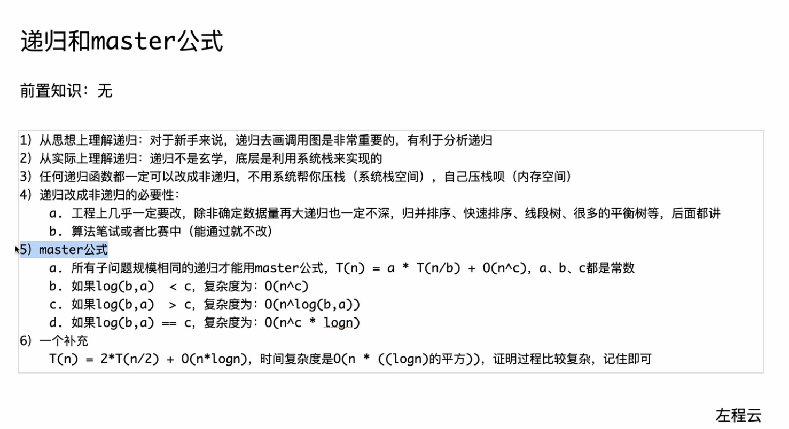

## 总结


## 递归

### 递归与master公式



### 递归寻找最大值


## 归并排序

归并分治思想：将一个问题尝试分为若干个类似问题，解决单个问题后再解决合一起的问题

例：整体有序=左有序+右有序+合起来有序

### 程序实现

递归实现

java代码实现

```java
public static int MAXN=501;
public static int[] arr = new int[MAXN];
public static int[] help = new int[MAXN];
//T(n)=2*T(n/2)+O(n)
//master可得时间复杂度为O(n*log(n))
//空间复杂度为O(n)
public static void mergeSort1(int l, int r){
    if(l == r){
        return;
    }
    int m = (l+r)/2;
    mergeSort1(l,m);
    mergeSort1(m+1,r);
    merge(l,m,r);
}

public static void merge(int l, int m,int r){
    int i = l;
    int a = l;
    int b =m+1;
    while (a <=m && b <= r){
        if(arr[a] <= arr[b]){
            help[i++] = arr[a++];
        }
        else{
            help[i++] = arr[b++];
        }
    }
    while (a <= m){
        help[i++] = arr[a++];
    }
    while (b <=r ){
        help[i++] = arr[b++];
    }
    for (i = l; i <= r; i++){
        arr{i} = help[i];
    }
}
```

cpp代码实现

```cpp
#include <iostream>
#include <vector>

using namespace std;

vector<int> arr;
vector<int> help;

void merge(int l, int m, int r)
{
    int i = l, j = m + 1, k = l;
    while (i <= m && j <= r)
    {
        if (arr[i] <= arr[j])
        {
            help[k++] = arr[i++];
        }
        else
        {
            help[k++] = arr[j++];
        }
    }
    while (i <= m)
    {
        help[k++] = arr[i++];
    }
    while (j <= r)
    {
        help[k++] = arr[j++];
    }
    for (int i = l; i <= r; i++)
    {
        arr[i] = help[i];
    }
}

void mergesort(int l, int r)
{
    if (l == r)
    {
        return;
    }
    int m = (l + r) / 2;
    mergesort(l, m);
    mergesort(m + 1, r);
    merge(l, m, r);
}

int main()
{
    int n;
    cin >> n;
    arr.resize(n);
    help.resize(n);
    for (int i = 0; i < n; i++)
    {
        cin >> arr[i];
    }
    mergesort(0, n - 1);
    for (int i = 0; i < n; i++)
    {
        cout << arr[i] << " ";
    }
    return 0;
}
```

非递归实现

java代码

```java
public static int MAXN=501;
public static int[] arr = new int[MAXN];
public static int[] help = new int[MAXN];
//时间复杂度为O(n*log(n))
//空间复杂度为O(n)
public static void mergeSort2(){
    for (int l, m, r, step = 1; step < n; step <<=1){
        l = 0;
        while(l < n){
            m = l + step -1;
            if (m + 1 >= n){
                break;
            }
            r = Math.min(l + (step << 1) - 1, n - 1);
            merge(l, m, r);
            l = r + 1;
        }
    }
}

public static void merge(int l, int m,int r){
    int i = l;
    int a = l;
    int b =m+1;
    while (a <=m && b <= r){
        if(arr[a] <= arr[b]){
            help[i++] = arr[a++];
        }
        else{
            help[i++] = arr[b++];
        }
    }
    while (a <= m){
        help[i++] = arr[a++];
    }
    while (b <=r ){
        help[i++] = arr[b++];
    }
    for (i = l; i <= r; i++){
        arr{i} = help[i];
    }
}
```

cpp代码

```cpp
#include <iostream>
#include <math.h>
#include <vector>

using namespace std;

vector<int> arr;
vector<int> help;

void merge(int l, int m, int r)
{
    int i = l, a = l, b = m + 1;
    while (a <= m && b <= r)
    {
        if (arr[a] > arr[b])
        {
            help[i++] = arr[b++];
        }
        else
        {
            help[i++] = arr[a++];
        }
    }
    while (a <= m)
    {
        help[i++] = arr[a++];
    }
    while (b <= r)
    {
        help[i++] = arr[b++];
    }
    for (int j = l; j <= r; j++)
    {
        arr[j] = help[j];
    }
}

void mergesort(int l, int r)
{
    for (int a, m, b, step = 1; step <= r - l; step <<= 1)
    {
        for (a = l; a + step <= r; a += step << 1)
        {
            m = a + step - 1;
            b = min(a + (step << 1) - 1, r);
            merge(a, m, b);
        }
    }
}

int main()
{
    int n;
    cin >> n;
    arr.resize(n);
    help.resize(n);
    for (int i = 0; i < n; i++)
    {
        cin >> arr[i];
    }
    mergesort(0, n - 1);
    for (int i = 0; i < n; i++)
    {
        cout << arr[i] << " ";
    }
    return 0;
}
```

### 归并分治

求数组小和问题

```java
public static int MAXN=501;
public static int[] arr = new int[MAXN];
public static int[] help = new int[MAXN];

public static long smallSum(int l, int r){
    if(l == r){
        return 0;
    }
    int m = (l+r) / 2;
    return smallSum(l, m)+smallSum(m+1, r) + merge(l, m, r);
}

public static long merge(int l, int m, int r){
    long ans = 0;
    for(int j = m+1, i = l, sum = 0;j <= r; j++){
        while (i <= m && arr[i] < arr[j]){
            sum += arr[i++];
        }
        ans += sum;
    }//可将这一部分加到左右两端比较大小放入辅助数组那里
    int i = l;
    int a = l;
    int b =m+1;
    while (a <=m && b <= r){
        if(arr[a] <= arr[b]){
            help[i++] = arr[a++];
        }
        else{
            help[i++] = arr[b++];
        }
    }
    while (a <= m){
        help[i++] = arr[a++];
    }
    while (b <= r){
        help[i++] = arr[b++];
    }
    for (i = l; i <= r; i++){
        arr{i} = help[i];
    }
    return ans;
}
```

```cpp
#include <iostream>
using namespace std;

// 归并排序的一部分，同时计算小和
int merge(int arr[], int temp[], int left, int mid, int right) {
    int i = left, j = mid + 1, k = left;
    int smallSum = 0;
    while (i <= mid && j <= right) {
        if (arr[i] < arr[j]) {
            // 当左侧元素小于右侧元素时，计算小和
            smallSum += (arr[i] * (right - j + 1));
            temp[k++] = arr[i++];
        } else {
            temp[k++] = arr[j++];
        }
    }
    while (i <= mid) {
        temp[k++] = arr[i++];
    }
    while (j <= right) {
        temp[k++] = arr[j++];
    }
    for (i = left; i <= right; i++) {
        arr[i] = temp[i];
    }
    return smallSum;
}

// 使用归并排序的方法计算小和
int mergeSortAndCount(int arr[], int temp[], int left, int right) {
    int mid, smallSum = 0;
    if (right > left) {
        mid = (right + left) / 2;
        // 分治法：先处理左半部分，再处理右半部分
        smallSum += mergeSortAndCount(arr, temp, left, mid);
        smallSum += mergeSortAndCount(arr, temp, mid + 1, right);
        // 合并两个有序部分，并计算小和
        smallSum += merge(arr, temp, left, mid, right);
    }
    return smallSum;
}

int main() {
    int n;
    cin >> n;
    int arr[n];
    int temp[n]; // 用于归并排序的临时数组
    for (int i = 0; i < n; i++) {
        cin >> arr[i];
    }
    cout << "数组小和为: " << mergeSortAndCount(arr, temp, 0, n - 1) << endl;
    return 0;
}
```

反转对数列

## 随机快速排序

### 随机快速排序经典过程(不推荐)

```java
public static void quickSort1(int l, int r){
    if(l >= r){
        return;
    }
    int x = arr[l+(int)(Math.random()*(r-l+1))];
    int mid = partition1(l, r, x);
    quickSort1(l,mid-1);
    quickSort1(mid+1, r);
}

public static int partition1(int l, int r, int x){
    int a = l, xi =0;
    for (int i = l; i <= r; i++){
        if(arr[i] <= x){
            swap(a, i);//交换两个索引的值
            if (arr[a] == x){
                xi = a;//记录最后一个等于划分值的索引
            }
            a++;
        }
    }
    //l,....,x,.....a-1,a,...
    //l~a-1 <=x   a~r >x
    swap(xi, a - 1);//将该值换到中间a-1去
    return a - 1;
}
```

### 荷兰国旗划分问题

有两种实现思想:

- 一种的以随机位置作为基准值来比较
- 另一种以固定位置即0索引的位置为基准值，其随机性体现为，生成随机索引然后将其值与零索引的值交换来进行比较

java代码实现

```java
//期望的时间复杂度为O(n*logn),空间复杂度为O(logn)
public static void quickSort2(int l, int r){
    if(l >= r){
        return;
    }
    int x = arr[l+(int)(Math.random()*(r-l+1))];
    partition2(l, r, x);
    int left = a;
    int right = b;
    quickSort2(l, left-1);
    quickSort2(right+1 ,r);
}

public static int a, b;

public static void partition2(int l, int r, int x){
    int a = l, b = r, i = l;
    while(i <= b){
        if(arr[i] <= x){
            swap(a,i);
            a++;
            i++;
        }
        else if (arr[i] == x){
            i++;
        }
        else{
            swap(i, b);
            b--;
        }
    }
}
```

第一种
cpp代码实现

```cpp
#include <iostream>
#include <vector>
#include <cstdlib>
#include <ctime>
using namespace std;

vector<int> arr;
int a, b;

void swap(int &a, int &b) {
    int temp = a;
    a = b;
    b = temp;
}

void partition(int l, int x, int r) {
    a = l, b = r;
    int i = l;
    while (i <= b) {
        if (arr[i] < arr[x]) {
            swap(arr[a], arr[i]);
            a++;
            i++;
        } else if (arr[i] > arr[x]) {
            swap(arr[b], arr[i]);
            b--;
        } else {
            i++;
        }
    }
    return;
}

void quicksort(int l, int r) {
    if (l < r) {
        int x = l + rand() % (r - l + 1);
        partition(l, x, r);
        int left = a, right = b;
        quicksort(l, left - 1);
        quicksort(right + 1, r);
    }
}

int main() {
    srand(time(0)); // 初始化随机数生成器
    int n;
    cin >> n;
    arr.resize(n);
    for (int i = 0; i < n; i++) {
        cin >> arr[i];
    }
    quicksort(0, n - 1);
    for (int i = 0; i < n; i++) {
        cout << arr[i] << " ";
    }
    return 0;
}
```

第二种
cpp代码实现

```cpp
#include <iostream>
#include <vector>
#include <cstdlib>
#include <ctime>
using namespace std;

vector<int> arr;

void swap(int &a, int &b)
{
    int temp = a;
    a = b;
    b = temp;
}

void partition(int l, int r, int &a, int &b)
{
    // 随机选择一个基准值，并将其与第一个元素交换
    int randomIndex = l + rand() % (r - l + 1);
    swap(arr[l], arr[randomIndex]);
    int pivot = arr[l];
    a = l;
    b = r;
    int i = l;
    while (i <= b)
    {
        if (arr[i] < pivot)
        {
            swap(arr[a], arr[i]);
            a++;
            i++;
        }
        else if (arr[i] > pivot)
        {
            swap(arr[b], arr[i]);
            b--;
        }
        else
        {
            i++;
        }
    }
}

void quicksort(int l, int r)
{
    if (l >= r)
        return;
    int a, b;
    partition(l, r, a, b);
    quicksort(l, a - 1);
    quicksort(b + 1, r);
}

int main()
{
    srand(time(0));
    int n;
    cin >> n;
    arr.resize(n);
    for (int i = 0; i < n; i++)
    {
        cin >> arr[i];
    }

    quicksort(0, n - 1);

    for (int i = 0; i < n; i++)
    {
        cout << arr[i] << " ";
    }
    cout << endl;

    return 0;
}
```

### 随机选择算法

常见算法
随机快排做划分，查看左边界，右边界与所求第x大数之间的关系，另两部分直接舍去

```java
pulic static int findKthLargest(int[] nums, int k){
    return randomizedSelect(nums, nums.length - k);
}

public static int randomizedSelect(int[] arr, int i){
    int ans = =0;
    for (int l = 0, r = arr.length-1; l <= r;){
        partition(arr, l, r, arr[l + (int)(Math.random()*(r - l + 1))]);
        if (i < a){
            r= first - 1;
        }
        else if (i > b){
            l = last + 1;
        }
        else{
            ans = arr[i];
            break;
        }
    }
    return ans;
}

public static int a, b;

public static void partition2(int arr[], int l, int r, int x){
    int a = l, b = r, i = l;
    while(i <= b){
        if(arr[i] <= x){
            swap(a,i);
            a++;
            i++;
        }
        else if (arr[i] == x){
            i++;
        }
        else{
            swap(i, b);
            b--;
        }
    }
}
```

BFPRT算法

## 堆排序

```java
public static void heapSort1(int[] arr){
    int n = arr.length;
    // 从上往下构造大根堆
    //log1+log2+...+logn 收敛于O(n*logn)
    for (int i = 0;i < n;i++){
        heapInsert1(arr, i);
    }
    // 从下往上构造大根堆
    // for (int i = n-1; i >= 0; i--){
    //     heapInsert2(arr, i);
    // }
    int size = n;
    //调整过程O(n*logn)
    while (size > 1){
        swap(arr, 0, --size);
        heapify(arr, 0 ,size);
    }
}
```

cpp实现

```cpp
#include <iostream>
using namespace std;

void swap(int &a, int &b)
{
    int temp = a;
    a = b;
    b = temp;
}

// 新加入大根堆堆尾的数据向上调整
void heapInsert1(int arr[], int i)
{
    while (arr[i] > arr[(i - 1) / 2])
    {
        swap(arr[i], arr[(i - 1) / 2]);
        i = (i - 1) / 2;
    }
}

// 从底往上构造大根堆，新入堆的值向下对比
void heapInsert2(int arr[], int i, int n)
{
    while ((arr[i] < arr[i * 2 + 1] || arr[i] < arr[i * 2 + 2]) && (i * 2 + 1 < n && i * 2 + 2 < n))
    {
        int best = i;
        if (arr[i * 2 + 2] < arr[i * 2 + 1])
        {
            best = i * 2 + 1;
        }
        else
        {
            best = i * 2 + 2;
        }
        swap(arr[i], arr[best]);
        i = best;
    }
}

// 向下调整，大根堆中i位置数值变了
void heapify(int arr[], int n, int i)
{
    int largest = i;       // 初始化 largest 为根节点
    int left = 2 * i + 1;  // 左子节点
    int right = 2 * i + 2; // 右子节点

    // 如果左子节点大于根节点
    if (left < n && arr[left] > arr[largest])
        largest = left;

    // 如果右子节点大于 largest
    if (right < n && arr[right] > arr[largest])
        largest = right;

    // 如果 largest 不是根节点
    if (largest != i)
    {
        swap(arr[i], arr[largest]);

        // 递归地对受影响的子树进行 heapify
        heapify(arr, n, largest);
    }
}

void heapsort1(int arr[], int n)
{
    for (int i = 0; i < n; i++)
    {
        heapInsert1(arr, i);
    }
    int size = n;
    while (size > 1)
    {
        swap(arr[0], arr[--size]);
        heapify(arr, size, 0);
    }
}

void heapsort2(int arr[], int n)
{
    for (int i = n - 1; i >= 0; i--)
    {
        heapInsert2(arr, i, n);
    }
    int size = n;
    while (size > 1)
    {
        swap(arr[0], arr[--size]);
        heapify(arr, size, 0);
    }
}

int main()
{
    int n;
    cin >> n;
    int arr1[n], arr2[n];
    for (int i = 0; i < n; i++)
    {
        cin >> arr1[i];
        arr2[i] = arr1[i];
    }
    heapsort1(arr1, n);
    for (int i = 0; i < n; i++)
    {
        cout << arr1[i] << " ";
    }
    cout << endl;
    heapsort2(arr2, n);
    for (int i = 0; i < n; i++)
    {
        cout << arr2[i] << " ";
    }
}
```

## 基数排序

```java
public static int BASE = 10;
public static int MAXN = 50001;
public static int[] help = new int[MAXN];
public static int[] cnts = new int[BASE];


//找到最小值，全部数减去最小值以确保所有数都是正数
public static int[] sortArray(int[] arr){
    if (arr.length > 1){
        int n = arr.length;
        int min = arr[0];
        for (int i = 1; i < n; i++){
            min = Math.min(min, arr[i]);
        }
        int max = 0;
        for (int i = 0; i < n; i++){
            arr[i] -=min;
            max = Math.max(max, arr[i]);
        }
        radixSort(arr, n, bits(max));
        for (int i = 0; i< n; i++){
            arr[i] += min;
        }
    }
    return arr;
}

public static int bits(int number){
    int ans = 0;
    while (number > 0){
        ans++;
        number /=BASE;
    }
    return ans;
}

//bits为arr数组中最大值在BASE进制时的位数
//arr保证没用负数
public static void radixSort(int[] arr, int n, int bits){
    for (int offset = 1; bits > 0; offset *=BASE, bits--){
        Array.fill(cnts, 0);
        for (int i = 0;i < n; i++){
            cnts[(arr[i]/offset)%BASE]++;
        }
        for (int i = 1; i <BASE; i++){
            cnts[i] = cnts[i] + cnts[i-1];
        }
        for (int i = n - 1; i >= 0; i--){
            help[--cnts[(arr[i] / offset)%BASE]] = arr[i];
        }
        for (int i = 0; i < n; i++){
            arr[i] = help[i];
        }
    }
}
```

cpp实现

```cpp
#include <iostream>
#include <math.h>
#include <vector>

using namespace std;

vector<int> arr;
vector<int> help;
vector<int> cnts;

#define BASE 10

int bits(int number){
    int ans = 0;
    while (number > 0)
    {
        number = number / BASE;
        ans++;
    }
    return ans;
}

void radixSort(int n, int bits){
    for (int offset = 1;bits>0; offset*=BASE,bits--)
    {
        fill(cnts.begin(), cnts.end(), 0);
        for (int i = 0; i < n; i++)
        {
            cnts[(arr[i]/offset)%BASE]++;
        }
        for (int i = 1; i < BASE; i++)
        {
            cnts[i]=cnts[i] + cnts[i-1];
        }
        for (int i = n-1; i >=0; i--)
        {
            help[--cnts[(arr[i]/offset)%BASE]] = arr[i];
        }
        for (int i = 0; i < n; i++)
        {
            arr[i]=help[i];
        }
    }
}

void sortArray(int n){
    if (n > 1){
        int min = arr[0];
        for (int i = 1; i < n; i++)
        {
            min = std::min(min, arr[i]);
        }
        for(int i = 0; i < n; i++){
            arr[i] = arr[i] - min;
        }
        int max = arr[0];
        for (int i = 1; i < n; i++)
        {
            max = std::max(max, arr[i]);
        }
        radixSort(n, bits(max));
        for(int i = 0; i < n; i++){
            arr[i] = arr[i] + min;
        }
    }
    return;
}

int main(){
    int n;
    cin >> n;
    arr.resize(n);
    help.resize(n);
    cnts.resize(BASE);
    for (int i = 0; i < n; i++)
    {
        cin >> arr[i];
    }
    sortArray(n);
    for (int i = 0; i < n; i++)
    {
        cout << arr[i] << " ";
    }
    cout << endl;
    return 0;
}
```


