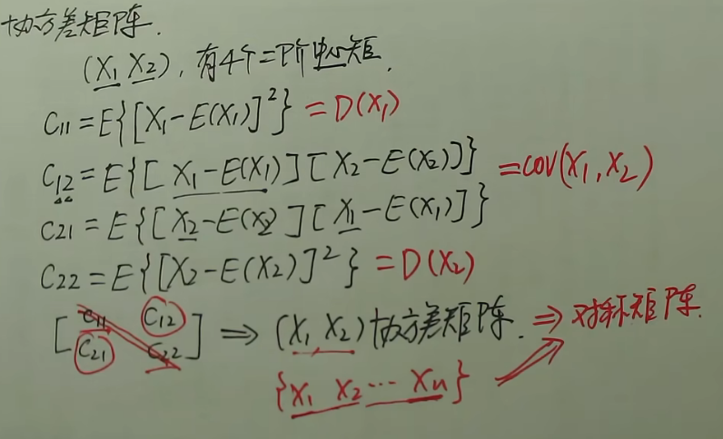

## 知识结构

## 数学期望

### 一维随机变量

数学期望条件：记为$EX$或$E(X)$

- 离散型$\sum_{i=1}^{\infty}x_ip_i$绝对收敛，
- 连续性$\int_{-\infty}^{+\infty}xf(x)dx$绝对收敛

方差：$DX=E((X-EX)^2)=E(X^2)-(EX)^2$

&nbsp;&nbsp;&nbsp;&nbsp;$\sum_{t=0}^{\infty}\frac{\lambda ^t}{t!}=e^{\lambda}$

### 二维随机变量

数学期望条件：记为$E(g(X,Y))$

- 离散型，函数$g(x,y)$,$\sum_{j=1}^{\infty}\sum_{i=1}^{\infty}g(x_i,y_i)\cdot p_{ij}$绝对收敛
- 连续性，函数$g(x,y)$,$\int_{-\infty}^{+\infty}g(x,y)\cdot f(x,y)$绝对收敛

### 性质

- $E(C)=C$
- $E(C\cdot X)=C\cdot E(X)$
- $E(X+C)=E(X)+C$
- $E(X+Y)=E(X)+E(Y)$
- $X,Y$相互独立，$E(X\cdot Y)=E(x)\cdot E(Y)$

## 方差

&nbsp;&nbsp;&nbsp;&nbsp;平方的期望-期望的平方

### 性质

- $D(C)=C$
- $D(CX)=C^2D(X)$
- $D(C+X)=D(X)$
- $D(X+Y)=D(X)+D(Y)+2*E([X-E(X)]\cdot [Y-E(Y)])$
- $X,Y$相互独立，$D(X+Y)=D(X)+D(Y)$
- $D(X)=0<==>X以概率为1取常数E(X)$

### 一维随机变量

&nbsp;&nbsp;&nbsp;&nbsp;衡量SB与自身均值的偏离程度，$E([X-E(X)]^2)$的存在,也是一个关于$[X-E(X)]^2$的期望，记为$DX=E[(X-EX)^2]=E(X^2)-(EX)^2$

> $=E(X^2)-E(2\cdot E(X)\cdot E(X))+E((EX)^2)$
> $=E(X^2)-E(X)\cdot E(2X)+E((EX)^2)$
> $=E(X^2)-2E(X)\cdot E(X)+E((EX)^2)$
> $=E(X^2)-(EX)^2$

&nbsp;&nbsp;&nbsp;&nbsp;称$\sqrt{DX}$为X的标准差或者均方差，记为$\sigma(X)$

&nbsp;&nbsp;&nbsp;&nbsp;称随机变量$X^*=\frac{X-EX}{\sqrt{DX}}$为X的标准化随机变量，此时$EX^*=0,DX^*=1$

设$g(x)=[X-E(X)]^2$

- 离散型$\sum_{k=1}^{\infty}[x_k-E(X)]^2\cdot p_k$
- 连续型$\int_{-\infty}^{+\infty}[x-E(X)]^2\cdot f(x)dx$

#### 切比雪夫不等式

&nbsp;&nbsp;&nbsp;&nbsp;$E(X)=\mu,D(X)=\sigma^2$对于任一一个大于0的常数$\epsilon$,$P(|X-\mu|\geq\epsilon)\leq \frac{\sigma^2}{\epsilon^2}$或$P(|X-\mu|< \epsilon)\geq 1-\frac{\sigma^2}{\epsilon^2}$

&nbsp;&nbsp;&nbsp;&nbsp;当DX越小，$P(|X-\mu|<\epsilon)$越大，表明方差是刻画随机变量与期望值分离程度的量

### 二维随机变量

#### 协方差

&nbsp;&nbsp;&nbsp;&nbsp;$E([X-E(X)]\cdot [Y-E(Y)])$叫做$X与Y$的协方差，记为$Cov(X,Y)$

性质：

- $Cov(X,Y)$=$Cov(Y,X)$
- $Cov(X,X)=E([X-EX]^2)=D(X)$
- $Cov(X,Y)=E(XY)-E(X)E(Y)$
- $Cov(aX,bY)=abCov(X,Y)$
- $Cov(X_1+X_2,Y)=Cov(X_1,Y)+Cov(X_2,Y)$

&nbsp;&nbsp;&nbsp;&nbsp;$Cov(X,Y)$是描述随机变量$X,Y$之间偏差的关联程度的，相关系数是$\rho_{XY}$描述随机变量$X,Y$之间的线性相依性。

#### 相关系数

&nbsp;&nbsp;&nbsp;&nbsp;相关系数：$\rho_{XY}=\frac{Cov(X,Y)}{\sqrt{DX}\cdot \sqrt{DY}}$,用来衡量X与Y的线性相关程度

性质：

- $\rho_{XY}\leq 1$
- 若$X,Y$存在线性关系，即Y可由X表示$Y=aX+b(a.b常数且a\neq 0)$,当$a>0$，$\rho_{XY}=1$，当$a<0$，$\rho_{XY}=-1$
- $|\rho_{XY}|$越靠近1，相关性越大，反之相关性越小
- $|\rho_{XY}|=0$，表示$X,Y$不线性相关==不相关 ==线性无关，不代表独立

#### 独立性与不相关性

当方差存在且不为0时：

- 独立一定线性不相关，线性无关不一定独立。

- 若$X,Y$服从二维正态分布，两者不相关则两者独立
- $X,Y$相关，则两者不独立

## 矩，协方差矩阵

### 矩

原点矩：

&nbsp;&nbsp;&nbsp;&nbsp;设$X,Y$,若$E(X^k),k=1,2,3,\dots$存在，称$E(X^k)$为$X$的$k$阶原点矩。
> 实际为$E[(X-0)^k]$,离源点的距离，期望为X的1阶原点矩。

&nbsp;&nbsp;&nbsp;&nbsp;若$E(X^kY^l),k=1,2,3,\dots,l=1,2,3,\dots$存在，称$E(X^kY^l)$为$X$和$Y$的$k+l$阶混合源点矩。

中心矩：

&nbsp;&nbsp;&nbsp;&nbsp;$E([X-EX]^k),k=2,3,4,\dots$存在，称$E([X-EX]^k)$为$X$的$k$阶中心矩。
> 方差为$X$的2阶中心矩。

&nbsp;&nbsp;&nbsp;&nbsp;$E([X-EX]^k\cdot[Y-EY]^l),k=2,3,4,\dots,l=2,3,4,\dots$存在，称$E([X-EX]^k\cdot[Y-EY]^l)$为$X$和$Y$的$k+l$阶混合中心矩。

> 协方差即为为$X$和$Y$的2阶混合中心矩。

### 协方差矩阵

### n维正态随机变量性质

- 则其中任意一个分量服从正态分布
- n个分量都服从正态分布且相互独立=>（$X_1,X_2,\dots,X_n$）服从n维正态分布
- （$X_1,X_2,\dots,X_n$）服从n维正态分布==其中分量的任意线性组合服从一维正态分布
- （$X_1,X_2,\dots,X_n$）服从n维正态分布，（$Y_1,Y_2,\dots,Y_k$）X对应的线性函数，称（$Y_1,Y_2,\dots,Y_k$）服从多维正态分布。**正态变量线性变换不变性**。