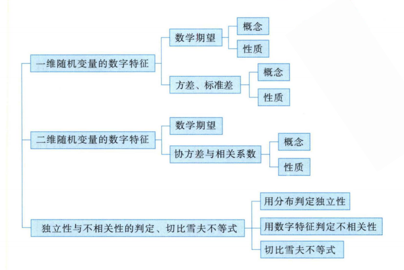
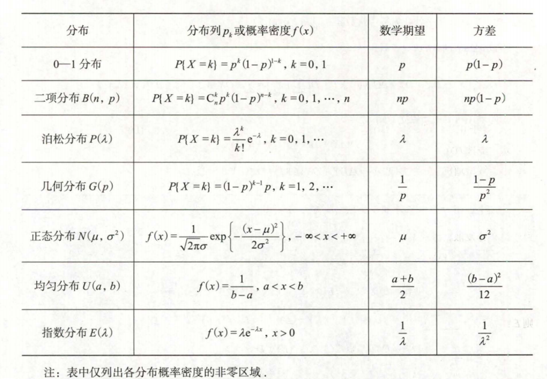
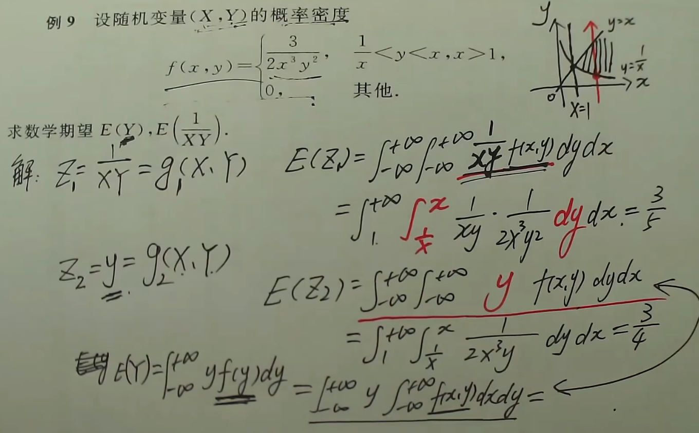

## 知识结构

## 数学期望

### 一维随机变量

数学期望条件：记为$EX$或$E(X)$

- 离散型$\sum_{i=1}^{\infty}x_ip_i$绝对收敛，
- 连续性$\int_{-\infty}^{+\infty}xf(x)dx$绝对收敛

方差：$DX=E((X-EX)^2)=E(X^2)-(EX)^2$

&nbsp;&nbsp;&nbsp;&nbsp;$\sum_{t=0}^{\infty}\frac{\lambda ^t}{t}=e^{\lambda}$

### 二维随机变量

数学期望条件：记为$E(g(X,Y))$

- 离散型，函数$g(x,y)$,$\sum_{j=1}^{\infty}\sum_{i=1}^{\infty}g(x_i,y_i)\cdot p_{ij}$绝对收敛
- 连续性，函数$g(x,y)$,$\int_{-\infty}^{+\infty}g(x,y)\cdot f(x,y)$绝对收敛

### 性质

- $E(C)=C$
- $E(C\cdot X)=C\cdot E(X)$
- $E(X+Y)=E(X)+E(Y)$
- $X,Y$相互独立，$E(X\cdot Y)=E(x)\cdot E(Y)$

## 方差

### 一维随机变量

### 二维随机变量

