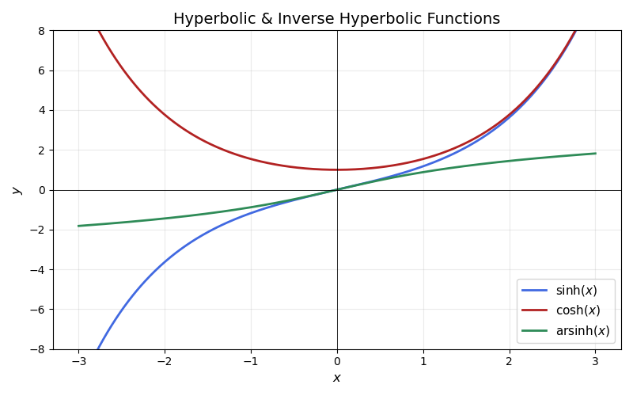
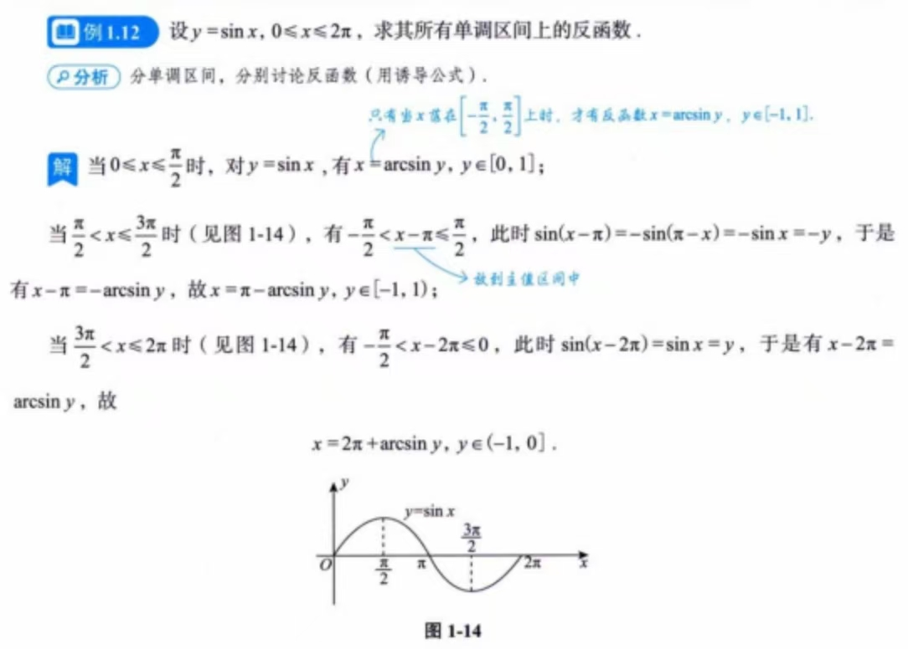
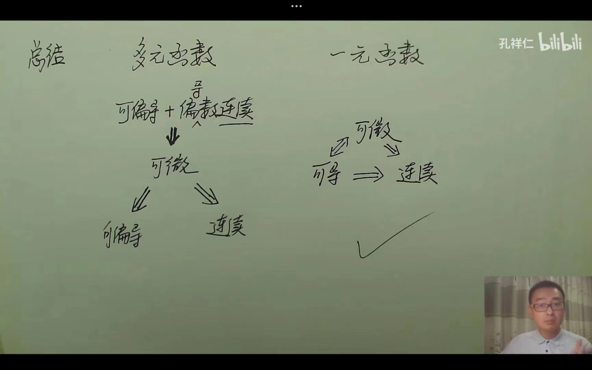

## 函数基础
#### 三角函数

双曲正弦函数：
$$
sinh(x)=\frac{e^x-e^{-x}}{2}
$$
反双曲正弦函数：
$$
arsinh(x)=ln(x+\sqrt{x^2+1})
$$

- 是奇函数，$\int _{-a}^a[ln(x+\sqrt{x^2+1}+f(x))]dx=\int_{-a}^a f(x)dx$

- 当x->0时，$ln(x+\sqrt{x^2+1})\sim x$

- $[ln(x+\sqrt{x^2+1})]'=\frac{1}{\sqrt{x^2+1}}$,所以$\int\frac{1}{\sqrt{x^2+1}}dx=ln(x+\sqrt{x^2+1})+C$

双曲余弦函数:
$$
cosh(x)=\frac{e^x+e^{-x}}{2}
$$

双曲正切函数：
$$
tanh(x)=\frac {sinh(x)}{cosh(x)}
$$
$sin(arcsinx)=x,x\in [-1,1],sin(arccosx)=\sqrt{1-x^2},x\in [-1,1]$

$cos(arccosx)=x,x\in [-1,1],cos(arcsinx)=\sqrt{1-x^2},x\in [-1,1]$

三角函数求反函数先移到$[-\frac{\pi}{2},\frac{\pi}{2}]$，再求反函数

#### 等价无穷小

实质是将分式上下同乘1，进行相消操作，因此无法在加减的情况下运用

#### 函数奇偶性判定

- $f(x)+f(-x)$必定为偶函数，例：$\frac{e^2+e^{-x}}{2}$

- $f(x)-f(-x)$必定为奇函数，例：$\frac{e^2-e^{-x}}{2}$
- $f[\phi](x)$，若$\phi(x)$为偶函数，整个为偶函数，$\phi(x)$为奇函数则复合函数奇偶性与外层函数奇偶性一致
- 函数求导一次奇偶性互换
- 对任意的$x,y$,都有$f(x+y)=f(x)+f(y)$，则$f(x)$是奇函数

$$
[|f(x)|]' = [\sqrt{f^2(x)}] \\
= \frac{2f(x)f'(x)}{2\sqrt{f^2(x)}} \\
= \frac{f(x)f'(x)}{|f(x)|}\\
$$

$$
ln(e+\frac{1}{x})-1 = ln(e+\frac{1}{x}) - lne\\
=ln(1+\frac{1}{ex})\\
$$

## 积分
####  变限积分求导

**一、基本形式**
若 `f(x)` 连续，$F(x) = ∫_a^x f(t) dt$，则：
$$
\frac{d}{dx}F(x) = f(x)
$$
**几何意义**：积分变限函数F*(*x*) 的导数等于被积函数 f(x)*在上限处的值。

**二、一般形式的变限积分求导**

若积分上下限均为函数 $u(x)$ 和 $v(x)$，且被积函数含参变量 $t$，即：

$$
F(x)=∫ _{v(x)}^{u(x)}​f(t,x)dt
$$

其导数为：

$$
\frac{d}{dx}F(x) = f(u(x),x)u'(x) - f(v(x),x)v'(x) + ∫_{v(x)}^{u(x)}\frac{\partial}{\partial x}f(t,x) dt
$$

**三、分类公式与示例**

**1.下限为函数，上限为常数**
$$
\frac{d}{dx} ∫^{u(x)}_a f(t) dt = f(u(x))·u'(x)
$$
**2.下限为函数，上限为常数**
$$
\frac{d}{dx} ∫_{v(x)}^b f(t) dt = -f(v(x))·v'(x)
$$
**3.上下限均为函数**
$$
\frac{d}{dx} ∫_{v(x)}^{u(x)} f(t) dt = f(u(x))u'(x) - f(v(x))v'(x)
$$

## 定积分应用

### 定积分求面积

极坐标下
$$
S=\int_\alpha ^\beta \frac{1}{2}\rho^2(\theta)d\theta
$$
### 定积分求弧长
直角坐标系下
$$
l=\int_a^b\sqrt{1+(y')^2}dx
$$

参数坐标系下
$$
l=\int_a^b \sqrt{(\phi'(t))^2+(\psi'(t))^2} dt
$$
极坐标系下
$$
l=\int_a^b \sqrt{\rho^2(\theta)+(p'(\theta))^2} d\theta
$$
### 定积分求旋转体体积

积分变量与旋转轴一致

> 与哪个轴围成的面积就绕着哪个轴转

$y=f(x),a\leq x \leq b$，绕x轴旋转，则
$$
V=\int_a^b\pi f^2(x)dx
$$
同理$x=\phi(y),c\leq y \leq d$，绕y轴旋转，则
$$
V=\int_c^d\pi \phi^2(y)dy
$$

积分变量与旋转轴不一致

> 与一个轴围成面积但绕另一个轴转。用一致的情况切割也能算，但较为麻烦
>
> 不是看成一圈一圈圆，而是将圆环展开成长方体

$y=f(x),a\leq x \leq b$，绕x轴旋转，则
$$
V_y=\int_a^b2\pi x |f(x)|dx
$$
### 求绕定直线旋转的旋转体体积

平面曲线$L:y=f(x),a\leq x \leq b$，且$f(x)$可导

定直线$L_0:Ax+By+C=0$，且过$L_0$的任一条垂线与$L$至多有一个交点

则$L$绕$L_0$旋转一周所得的旋转体的体积为
$$
V=\frac{\pi}{(A^2+B^2)^\frac{3}{2}}\int_a^b[Ax+Bf(x)+C]^2|Af'(x)-B|dx
$$

### 求旋转体侧面积

直角坐标系下

$y=f(x)(a\leq x \leq b)$，求绕$x$轴旋转一周得到曲面的面积

可知，圆环面积$S_{圆环}=2\pi y dl$，其中$l$表示弧长，因此
$$
S_{侧}=2\pi\int_a^b|y|\sqrt{1+(y')^2}dx
$$
参数方程下
$$
S_{侧}=2\pi\int_a^b|y(t)|\sqrt{[x(t)]^2+[y(t)]^2}dt
$$
极坐标下

$p=\rho(\theta)(\alpha \leq \theta \leq \beta)$，则
$$
S_{侧}=2\pi\int_{\alpha}^{\beta}|\rho(\theta)\sin\theta|\sqrt{[\rho(\theta)]^2+[\rho' (\theta)]^2}d\theta
$$
## 微分方程
### 齐次微分方程

形式：$y'=\frac{dy}{dx}=f(\frac{y}{x})$

解法：化为可分离变量微分方程

令$\frac{y}{x}=\mu$

$$y=\mu x$$

对$y$求导得到

$$\frac{dy}{dx}=\mu+x\frac{d\mu}{dx}$$

$$\mu+x\frac{d\mu}{dx}=f(\mu)$$
### 一阶微分方程

$$
\frac{dy}{dx}+p(x)y=Q(x)
$$

非齐通=齐通+非其特

齐次方程：$Q(x)=0$,解得
$$
y=ce^{\int -p(x)\,dx}
$$
非齐次方程：$Q(x)!=0$，解得
$$
y=e^{-\int p(x)\,dx}(c+{\int Q(x)e^{\int p(x)\,dx}\,dx})
$$
### 伯努利方程

转换为线性微分方程

形式：$\frac{dy}{dx}+p(x)y=Q(x)y^n$

解法：

1. 全部同除$y^n$即$\frac{dy}{dx*y^n}+p(x)y^{1-n}=Q(x)$
2. 引入$\xi=y^{1-n}$,得到$\frac{d\xi}{dx}=\frac{dy^{1-n}}{dx}=(1-n)y^{-n}\,\frac{dy}{dx}$
3. $(1-n)\frac{1}{y^n}\frac{dy}{dx}+(1-n)p(x)y^{1-n}=(1-n)Q(x)$
4. $\frac{d\xi}{dx}+(1-n)p(x)\xi=(1-n)Q(x)$

### 可降阶微分方程
#### $y^{(n)}=f(x)$型

一直对$f(x)$求积分，直到求解到$y$
#### $y''=f(x,y')$型
令$P=y',P'=y''$，所以可以得到关于$P$的一阶微分方程
$$
P'=f(x,P)
$$
#### $y''=f(y,y')$型
设$y'=P,y''=\frac{dP}{dy} \cdot \frac{dy}{dx}=\frac{dP}{dy}\cdot P$，所以可以得到$P$与$y$的一阶微分方程
$$
P\frac{dP}{dy}=f(y,p)
$$
#### 高阶线性微分方程

##### 齐次线性微分方程

形式:

$$
y''+py'+qy=0
$$
设$$y=e^{rx}$$
系数方程：$$r^2+pr+q=0$$

1. $\Delta>0$,$r_1 \neq r_2$
则$$y=c_1e^{r_1x}+c_2e^{r_2x}$$
2. $\Delta=0$,$r_1 = r_2$
则$$y=(c_1x+c_2)e^{rx}$$
3. $\Delta<0$,$r_1=\alpha+\beta i$,$r_2=\alpha-\beta i$
则$$y=e^{\alpha x}(c_1 \cos \beta x+c_2\sin \beta x)$$
##### 常数非齐次线性微分方程

形式：
$$
y''+py'+qy=f(x)
$$

1. $$f(x)=e^{\lambda x}p_m(x)$$

其中：$\lambda$为常数，$p_m(x)$为x的多项式

特解$y$的形式：$$y_{特}=e^{\lambda x}f_m(x)x^k$$

其中$f_{m}(x)$为x的多项式，$\lambda$与齐通中k个解相同，再将特解带入原方程，解出$f_m(x)$的系数

∴$y=y_通+y*$

2. $\Delta<0$，$$f(x)=e^{\lambda x}[P_l(x)\cos{\omega x}+Q_n(x)\sin{\omega x}]$$

其中：$\lambda$，$\omega$为常数，$P_l(x)$,$Q_n(x)$为x的多项式

特解y*的形式：$$x^{k}e^{\lambda x}[R_m(x)\cos{\omega x}+O_m(x)\sin{\omega x}]$$

其中$R_m(x)$,$O_m(x)$为x的多项式,$m=l+n$,$\lambda+\omega i$与k个r相等,再将特解带入原方程，解出x多项式的系数

∴$y=y_通+y*$

## 空间解析几何
### 向量积

$$
|\vec{a}\times\vec{b}|
=
|\vec{a}||\vec{b}|\sin\theta
$$
表示这两个向量构成的平行四边型的面积
### 混合积
设：

$$
\vec{a}=(a_1,a_2,a_3)\\

\vec{b}=(b_1,b_2,b_3)\\

\vec{c}=(c_1,c_2,c_3)\\
$$

则：

$$
\vec{a}\cdot(\vec{b}\times\vec{c})
=
\begin{vmatrix}
a_1 & a_2 & a_3 \\
b_1 & b_2 & b_3 \\
c_1 & c_2 & c_3
\end{vmatrix}
$$
按照三阶行列式计算即可，表示以 $\vec{a}$、$\vec{b}$、$\vec{c}$ 为棱的平行六面体的体积。
### 平面方程

点法式
$$
A(x-x_0)+B(y-y_0)+C(z-z_0)=0
$$
一般式
$$
Ax+By+Cz+D=0
$$
截距式
$$
\frac{x}{a}+\frac{y}{b}+\frac{z}{c}=1
$$
平面与三轴的交点为$(a,0,0),(0,b,0),(0,0,c)$
### 直线方程
一般式
$$
\begin{cases}
A_1x + B_1y + C_1z + D_1 = 0 \\
A_2x + B_2y + C_2z + D_2 = 0
\end{cases}
$$
点向式
$$
\frac{x-x_0}{m}=\frac{y-y_0}{n}=\frac{z-z_0}{p}
$$
参数式
$$
t=\frac{x-x_0}{m}=\frac{y-y_0}{n}=\frac{z-z_0}{p}
$$
两点式
$$
\frac{x-x_1}{x_2-x_1}=\frac{y-y_1}{y_2-y_1}=\frac{z-z_1}{z_2-z_1}
$$

### 平面束

$$
\begin{cases}
A_1x+B_1y+C_1z+D_1=0\\
A_2x+B_2y+C_2z+D_2=0
\end{cases}
$$
由此可以得到方程
$$
A_1x+B_1y+C_1z+D_1+\lambda(A_2x+B_2y+C_2z+D_2=0)
$$
即
$$
(A_1+\lambda A_2)x+(B_1+\lambda B_2)y+(C_1+\lambda C_2)z+(D_1+\lambda D_2)=0
$$
也可以将其看作平面的一种方程表示，表示过定直线的平面集合

### 曲线曲面
#### 曲线
一般式$\tau$：
$$
\begin{cases}
F(x,y,z)=0\\
G(x,y,z)=0
\end{cases}
$$
参数方程式$\tau$：
$$
\begin{cases}
x=\phi(t),\\
y=\psi(t),t\in[\alpha,\beta]\\
z=\omega(t),
\end{cases}
$$
#### 曲面
曲面方程式子
形式为$F(x,y,z)=0$或显式函数$z=f(x,y)$
#### 旋转曲面
曲线绕某直线旋转一周得到的曲面，曲线$f(x,y)=0$,绕x轴旋转一周得到$f(x,±\sqrt{y^2+z^2})$,即为旋转曲面方程

> 绕哪个轴旋转，哪个轴就不变

计算旋转曲面方程

当得知直线的点向式后，则$x,y,z$三者之间可以相互替换，设目前绕$x$轴转，则
$$
\begin{cases}
y=f(x)\\
z=g(x)
\end{cases}
$$
则可以得到曲面方程
$$
y^2+z^2=f^2(x)+g^2(x)
$$

### 求空间曲线切线和法平面
#### 空间曲线参数方程式

$$
\begin{cases}
x=\phi(t)\\
y=\psi(t)\\
z=\omega(t)
\end{cases}
$$

$\vec{r}=\vec{f}(t)=(\phi(t),\psi(t),\omega(t))$,在$t_0$处可导，切向量为$\vec{n}=(\phi^{'}(t_0),\psi^{'}(t_0),\omega^{'}(t_0))$

则点向式切线
$$
\frac{x-x_0}{\phi^{'}(t_0)}=\frac{y-y_0}{\psi^{'}(t_0)}=\frac{z-z_0}{\omega^{'}(t_0)}
$$

由于得到切向量$\vec{n}=(\phi^{'}(t_0),\psi^{'}(t_0),\omega^{'}(t_0))$,可得到法平面的点法式方程
$$
\phi^{'}(t_0)\cdot(x-x_0)+\psi^{'}(t_0)\cdot(y-y_0)+\omega^{'}(t_0)\cdot(z-z_0)=0
$$

#### 空间曲线一般式

曲线$L$：
$$
\begin{cases}
F(x,y,z) = 0 \\
G(x,y,z) = 0
\end{cases}
$$
把$x$看作自变量，把$(y,z)$看作$x$的函数,即
$$
\begin{cases}
x=x \\
y=\phi(x) \\
z=\psi(x)
\end{cases}
$$
所以切向量$\vec{n}=(1,\phi^{'}(x),\psi^{'}(x))$,

曲线$L$全部对x求偏导，然后可以得到两个$\frac{dy}{dx},\frac{dz}{dx}$关于与$x,y,z$的式子，求解出$\frac{dy}{dx},\frac{dz}{dx}$,即可得到切向量，从而得到切线和法平面。
### 求曲线的法线和切平面

曲面$w=F(x,y,z)=0在M(x_0,y_0,z_0)$处有连续偏导数，求过$M$点的切平面及法线

通过对曲面$w$的$x,y,z$三个方向求偏导并带入$M$点的数据，得到法向量$\vec{n}=(F_x(x_0,y_0,z_0),F_y(x_0,y_0,z_0),F_z(x_0,y_0,z_0))$,通过点法式求出切平面
$$
F_x(x_0,y_0,z_0)(x-x_0)+F_y(x_0,y_0，z_0)(y-y_0)+F_z(x_0,y_0,z_0)(z-z_0)=0
$$
点向式得到法线方程
$$
\frac{x-x_0}{F_x(x_0,y_0,z_0)}=\frac{y-y_0}{F_y(x_0,y_0,z_0)}=\frac{z-z_0}{F_z(x_0,y_0,z_0)}
$$
对于非平面方程来说$z=f(x,y)$,则化为$f(x,y)-z=0$,同理于上文。
### 方向导数
$z=f(x,y)$在$(x_0,y_0)$领域有定义且可微，方向导数
$$
\frac{\partial f}{\partial L}|_{(x_0,y_0)}=f_x(x_0,y_0)cos\alpha +f_y(x_0,y_0)cos\beta
$$
即$\sum偏导函数值\cdot方向余弦值$
### 梯度
记作$grad f$或$\nabla f$，是由偏导数构成的向量，$z=f(x,y)$在$(x_0,y_0)$领域有定义且可微时，即
$$
\nabla f=(\frac{\partial f}{\partial x}|_{(x_0,y_0)},\frac{\partial f}{\partial y}|_{(x_0,y_0)})
$$
实际上就是函数在某个点上的方向向量，在这个方向上方向导数值取到最大，也就是函数值增长最快的地方，反方向也就是函数值下降最快的地方，函数在这个点上方向导数的最大值也就是梯度的模长，即
$$
|\nabla f|=\sqrt{(\frac{\partial f}{\partial x})^2+(\frac{\partial f}{\partial y})^2}
$$

> 不妨设定一个方向向量的概念，方向向量的大小也就是函数在某点沿这个方向的方向导数的值
>
> 梯度也就是一种方向向量了，那么其他方向的方向向量也就是为梯度×夹角的cos值

## 多元函数微分

### 偏导

抽象函数求偏导：函数$F(x^2,3xy)$对x求偏导可得,可参考复合求导
$$
F_x'=2x\cdot F_{x^2}'(x^2,3xy)+3y\cdot F_{3xy}'(x^2,3xy)
$$
$先对x求偏导再对y求偏导=先对y求偏导再对x求偏导$，即
$$
\frac{\partial ^2z}{\partial x \partial y}=\frac{\partial ^2z }{\partial y \partial x}
$$
#### 拉普拉斯定理

$\mu=\frac{1}{\sqrt{x^2+y^2+z^2}}$，则$\frac{\partial^2 \mu}{\partial x^2}+\frac{\partial^2 \mu}{\partial y^2}+\frac{\partial^2 \mu}{\partial z^2}=0$
#### 复合求导

已知$z=f(u,v),u,v$是关于$t$的函数，则
$$
\frac{dz}{dt}=\frac{\partial z}{\partial u}\cdot \frac{du}{dt}+\frac{\partial z}{\partial v}\cdot \frac{dv}{dt}
$$
若$u,v$是关于$(x,y)$的函数，则

$$
\begin{cases}
\frac{\partial z}{\partial x}=\frac{\partial z}{\partial u} \cdot \frac{\partial u}{\partial x}+\frac{\partial z}{\partial v}\cdot \frac{\partial v}{\partial x} \\
\frac{\partial z}{\partial y}=\frac{\partial z}{\partial u} \cdot \frac{\partial u}{\partial y}+\frac{\partial z}{\partial v}\cdot \frac{\partial v}{\partial y}
\end{cases}
$$
### 多元函数全微分
$对于z=f(x,y),则有dz=\frac{\partial z}{\partial x}dx+\frac{\partial z}{\partial y}dy$
### 隐函数求导

$w=F(x,y)在P(x_0,y_0)$处某邻域内有连续偏导数，且$F(x_0,y_0)=0,F_y(x_0,y_0)≠0$，则
$$
\frac{dy}{dx}=-\frac{F_x}{F_y}=\frac{\frac{\partial F}{\partial x}}{\frac{\partial F}{\partial y}}
$$
$w=F(x,y，z)在P(x_0,y_0,z_0)$处某领域内有连续偏导数，且$F(x_0,y_0,z_0)=0,F_z(x_0,y_0,z_0)≠0$，则
$$
\frac{\partial z}{\partial x}=-\frac{F_x(x_0,y_0,z_0)}{F_z(x_0,y_0,z_0)}\\
\frac{\partial z}{\partial y}=-\frac{F_y(x_0,y_0,z_0)}{F_z(x_0,y_0,z_0)}
$$

> $z=f(x,y),F(x,y,z)=F(x,y,f(x,y))=0,$分别对x和y求偏导可得
> $$
 \begin{cases}
 F'_x(x,y,z)+F_z'(x,y,z)\frac{\partial z}{\partial x}=0\\
 F'_y(x,y,z)+F_z'(x,y,z)\frac{\partial z}{\partial y}=0
 \end{cases}
$$
> 因此需要分子对F的偏导数存在，即$F_z'(x,y,z)$存在且不为零

### 多元函数极值

极值点定义：周围的函数值都比这个点的函数的值要小或者要大

驻点：函数在$(x_0,y_0)$处$f_x'(x_0,y_0)=f_y(x_0,y_0)=0$

极值充分不必要条件：函数在$(x_0,y_0)$处取极值且可偏导（间断点），则$f_x'(x_0,y_0)=f_y(x_0,y_0)=0$，反之不成立

极值的充分条件：

设$z=f(x,y)$在$(x_0,y_0)$邻域内连续，且有一阶连续偏导数和二阶连续偏导数，且$f_x(x_0,y_0)=f_y(x_0,y_0)=0$,有如下情况
- 当$f_{xx}(x_0,y_0)\cdot f_{yy}(x_0,y_0)>f_{xy}^{2}(x_0,y_0)$时有极值，且当
	-  $f_{xx}(x_0,y_0)>0$时有极小值
	- $f_{xx}(x_0,y_0)<0$时有极大值
- 当$f_{xx}(x_0,y_0)\cdot f_{yy}(x_0,y_0)=f_{xy}^{2}(x_0,y_0)$无法判断是否有极值
- 当$f_{xx}(x_0,y_0)\cdot f_{yy}(x_0,y_0)<f_{xy}^{2}(x_0,y_0)$时无极值

### 多元函数最值

1. 根据上一方法求出极值
2. 求处偏导数不存在的点的函数值
3. 求出边界点上的函数值
4. 比较数值
### 条件极值

即求一个函数在某种条件/限制下的极值

求$z=f(x,y)$,在$p(x,y)=0$条件下的极值,可设立$L(x,y)=f(x,y)+\lambda p(x,y)$,求偏导得到
$$
\begin{cases}
L_x=f_x(x,y)+\lambda p_x(x,y)=0 \\
L_y=f_y(x,y)+\lambda p_y(x,y)=0 \\
p(x,y)=0
\end{cases}
$$
从而求解出$(x_0,y_0)$进而求出二阶偏导数值，从而判断极值

## 级数

线面积分

级数一年求和，一年收敛

